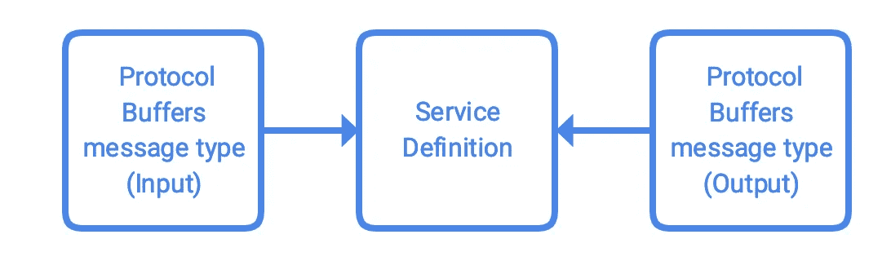

# 用 gRPC 构建 API

> 原文：<https://medium.com/google-cloud/building-apis-with-grpc-50842234aec8?source=collection_archive---------2----------------------->

本文讨论了如何使用协议缓冲区构建一个简单的单端点 gRPC API 服务，并使用 gRPC 工具准备其客户端和服务器端代码。它是[构建 API 服务:初学者指南](/@ratrosy/building-api-services-a-beginners-guide-7274ae4c547f)教程系列的一部分。

> 注意:本教程使用 Python 3。当然，gRPC 支持多种编程语言。

# 关于 API 服务

在本教程中，您将使用 gRPC 构建一个 API 服务，用户可以从中获取他们的配置文件。它只有一个资源`User`和一个方法(端点):

# 开始之前

*   [设置您的 Python 开发环境](https://cloud.google.com/python/setup)。对于本教程，您不需要安装谷歌云 SDK 和谷歌云 Python 客户端库。
*   安装 gRPC 和协议缓冲区:

```
pip install grpcio grpcio-tools
```

`grpcio`是 Python 的 gRPC 包。gRPC 工具包`grpcio-tools`，包括带 gRPC 插件的协议缓冲编译器。

*   [下载源代码](https://github.com/michaelawyu/api_tutorial)。打开`/grpc/getting_started`。

# 理解代码

本质上，对方法(端点)的 API 调用只不过是一个输入(请求)、一个输出(响应)和一些将请求与响应关联起来的魔法。输入提供方法需要的所有参数，输出是方法返回的内容。

在 gRPC API 服务中，输入(请求)和输出(响应)是特定类型的协议缓冲区消息，使用协议缓冲区语言在一个或多个`.proto`文件中定义。`.proto`文件中的服务定义将输入消息类型与输出消息类型相关联，协议缓冲编译器将`.proto`文件编译成代码工件。然后，您可以使用这些构件来构建您的 API 服务及其客户端库。



## 资源及其领域

这个 gRPC API 服务以一个资源为特色:`User`。

`User`的资源名格式为`//myapiservice.com/users/USER-ID`。用户特征 3 个字段:

注意，为了简单起见，协议缓冲区没有对保留字段和必填字段的内置支持。**所有字段都是可选的**。开发人员必须在服务器端(和客户端，如果需要的话)验证数据

## 写入协议缓冲区

`example.proto` ( `grpc/getting_started/example.proto`)是该 API 服务的协议缓冲区规范。它包括 3 个部分:语法版本、消息类型和服务定义:

**语法版本**

`syntax = “proto3”;`，声明您想要使用的协议缓冲语言版本(`.proto`文件语法)。在大多数情况下，建议开发者使用版本 `proto3`；默认值为`proto2`。

**消息类型**

`.proto`文件有两种消息类型:`User`和`GetUserRequest`。`User`有三个字符串类型字段:`name`、`display_name`和`email`。`GetUserRequest`有一个字符串类型字段`name`。

每个字段后的数字是字段编号。协议缓冲区消息使用字段编号而不是字段名称来唯一标识该字段。

**服务定义**

`.proto`文件有一个服务定义`ExampleUserService`，它由一个方法(端点)`GetUser`组成。它接受一条`GetUserRequest`类型的消息，并返回另一条`User`类型的消息。

# 准备代码

协议缓冲编译器现在可以准备服务器端和客户端工件:

```
python -m grpc_tools.protoc -I. --python_out=codegen/ --grpc_python_out=codegen/ example.proto
```

编译器生成两个文件:`codegen/example_pb2.py`和`codegen/example_pb2_grpc.py`。`example_pb2.py`指定了`example.proto`中的消息类型在 Python 中应该是什么样子。`example_pb2_grpc.py`包含两个类，`ExampleServiceServicer`和`ExampleServiceStub`，您将分别使用它们来构建自己的服务器端和客户端代码。

覆盖`ExampleServiceServicer`来创建您自己的 gRPC API 服务，如`server.py`所示:

当客户端访问`GetUser`端点时，gRPC 将自动调用`ExampleServiceServicer`类中被覆盖的`GetUser`方法。该框架自动将`GetUserRequest`协议缓冲区消息解析成一个`GetUserRequest` Python 类，您可以习惯性地操作它；然后，它接受一个`User` Python 类，将其序列化为一个`User`协议缓冲消息，并将其返回给客户端。注意`GetUserRequest`和`User` Python 类都是在`example_pb2.py`中定义的。

接下来，使用`ExampleServiceStub`为 gRPC API 服务创建一个客户端，如`client.py`所示:

客户端将在运行时自动连接到 gRPC API 服务。当客户用一个`name`参数调用`get_user`方法时，您将把它准备成一个`GetUserRequest` Python 类，并通过存根把它传递给 gRPC。然后 gRPC 将`GetUserRequest` Python 类解析成`GetUserRequest`协议缓冲区消息，并发送给服务器；来自服务器的响应，一个`User`协议缓冲消息，然后被解析成一个`User` Python 类，并打印出来。

如果有帮助的话，可以把`.proto`文件想象成服务器和客户机之间的契约，gRPC 是信使，协议缓冲区是仲裁员/翻译员。协议缓冲区执行契约，将客户机和服务器所说的内容翻译成通用语言，gRPC 在 HTTP/2 中进行通信。gRPC +协议缓冲区在后台执行所有管理任务(传输、序列化等。)这样你的服务器和客户端就可以专注于真正重要的东西:你的应用程序的业务逻辑。

# 试一试

在后台运行`server.py`:

```
python server.py
```

服务器监听本地主机:8080。使用客户端连接到服务器；运行以下 Python 脚本:

```
import client
client = client.ExampleServiceClient()
client.get_user(‘//myapiservice.com/users/1’)
```

您应该会看到以下输出:

```
User fetched.
name: “//myapiservice.com/users/1”
display_name: “Example User”
email: “user@example.com”
```

# 下一步是什么

关于 gRPC API 服务的推荐实践和模式，请参见[用 gRPC 构建 API:续](/@ratrosy/building-apis-with-grpc-continued-f53b5a5ab850)。