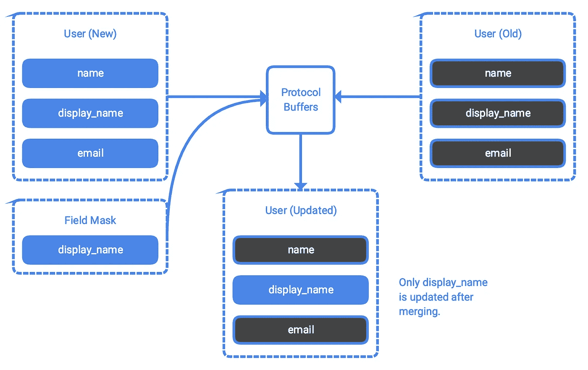

# 用 gRPC 构建 API:续

> 原文：<https://medium.com/google-cloud/building-apis-with-grpc-continued-f53b5a5ab850?source=collection_archive---------1----------------------->

本文档讨论了如何进一步开发在[使用 gRPC](/@ratrosy/building-api-services-a-beginners-guide-7274ae4c547f) 构建 API 中创建的 gRPC API 服务。它介绍了:

*   gRPC API 服务中实现`CREATE`、`LIST`、`UPDATE`和`DELETE`方法的常见模式
*   gRPC API 服务中的流
*   gRPC API 服务中错误处理和分页的常见模式

该文档是[构建 API 服务:初学者指南](/@ratrosy/building-api-services-a-beginners-guide-7274ae4c547f)教程系列的一部分。

> 注意:本教程使用 Python 3。当然，OpenAPI generator 支持多种编程语言。

# 关于 API 服务

在本教程中，您将把之前创建的简单的单端点 gRPC API 服务开发成一个成熟的相册服务，用户可以在其中创建(上传)、列出、获取和删除他们的照片。该服务提供以下方法(端点):

# 开始之前

1.  开始使用 gRPC 构建 API[。](http://Building APIs with gRPC)
2.  [下载源代码](https://github.com/michaelawyu/api_tutorial)。打开`grpc/photo_album`。

# 理解代码

正如在[用 gRPC 构建 API](http://Building APIs with gRPC)中介绍的，本教程中的相册 gRPC API 服务是从协议缓冲区规范文件`example.proto`构建的。该规范包含 API 服务的输入(请求)和输出(响应)协议缓冲区消息类型，以及将输入和输出关联在一起的服务定义。然后，您可以使用 Protocol Buffers 编译器将规范编译成 Python 数据类、服务器端工件和客户端工件；这些工件可以帮助您构建 gRPC API 服务及其客户端库。

## 资源及其领域

这个 gRPC API 服务有两个资源:`User`和`Photo`。`User`是`Photo`的父资源。

`User`的资源名格式为`//myapiservice.com/users/USER-ID`。用户特征 3 个字段:

`Photo`的资源名格式为`//myapiservice.com/users/USER-ID/photos/PHOTO-ID`。照片有 3 个区域:

注意，为了简单起见，协议缓冲区没有对保留字段和必填字段的内置支持。**所有字段都是可选的**。开发人员必须在服务器端(和客户端，如果必要的话)验证数据。

## 重用协议缓冲区消息类型

`example.proto`从`protobuf`包中导入三种消息类型:

```
import “google/protobuf/empty.proto”;
import “google/protobuf/timestamp.proto”;
import “google/protobuf/field_mask.proto”;
```

这些消息类型帮助您在 gRPC API 服务中实现通用模式(更具体地说，是空消息、时间点和字段掩码)。Google 为日常用例提供了多种协议缓冲区消息类型；它们在 Google API 服务中被广泛使用。有关更多信息，请参见`[protobuf](https://github.com/protocolbuffers/protobuf)`和`[api-common-protos](https://github.com/googleapis/api-common-protos)` GitHub 项目。

当然，您也可以将您自己项目中的消息类型导入到一个`.proto`文件中。例如，要从`my_project/my_dependencies/messages.proto`导入消息类型，只需在`.proto`文件的开头写下`import “my_project/my_dependencies/messages.proto”`。

## `CREATE`方法

`example.proto`指定了两种`CREATE`方法，`CreateUser`和`CreatePhoto`:

`CreateUser`和`CreatePhoto`分别以`User`和`CreatePhotoRequest`作为输入和输出`User`和`Photo`。`CreatePhotoRequest`指定了两个字段，`parent`和`photo`:

*   `parent`是`Photo`的父资源`User`的资源名称。该方法引用该值为特定的`User`创建一个`Photo`。
*   `photo`是要创建的`Photo`资源。

这两个方法将在服务器端和客户端工件中编译成`CreateUser`和`CreatePhoto`。覆盖服务器端工件，在 API 服务中创建方法，如`server.py` ( `/grpc/photo_album/server/server.py`)所示:

调用客户端工件，通过客户端库连接方法，如`client.py` ( `/grpc/photo_album/client/client.py`)所示:

**推荐做法为** `**CREATE**` **方法**

`CREATE`方法通常把要创建的资源作为输入。如果该资源是另一个资源的子资源，则输入消息类型还应该有一个父参数，用于其父资源的资源名称。此外，如果您的 API 服务支持自定义资源标识符，请在您的消息类型中添加资源 ID。

正如在设计 API 和前面的章节中所讨论的，资源的`name`字段总是被保留；客户端不应该能够通过资源中的名称字段声明自定义标识符。相反，将资源 ID 作为一个单独的字段添加到输入中，并在服务器端生成完整的资源名称。

正如在[设计 API](/@ratrosy/designing-apis-4eed43409f93)中所讨论的，`CREATE`方法本质上是非幂等的；您应该尽可能检查重复的资源。

此外，`CREATE`方法应该输出新创建的资源，而不是状态消息(`“Resource created.”`)，以便帮助 API 消费者更容易地对新资源执行后续操作。当您的资源有保留或可选字段时，这一点尤其重要。

## `DELETE`方法

`example.proto`指定一种`DELETE`方法，`DeletePhoto`:

输入为`DeletePhotoRequest`，输出为`Empty`(空消息)。它只指定了一个字段，`name`:

*   `name`是要删除的`Photo`的资源名称。

该方法将被编译成`DeletePhoto`中的服务器端和客户端工件。覆盖服务器端工件，在 API 服务中创建方法，如`server.py` ( `/grpc/photo_album/server/server.py`)所示:

调用客户端工件，通过客户端库连接到方法，如`client.py` ( `/grpc/photo_album/client/client.py`)所示:

**推荐做法为** `**DELETE**` **方法**

`DELETE`方法也是非幂等的。然而，与`CREATE`方法不同，错误地重复调用`DELETE`方法几乎没有副作用:除了第一次，所有的调用都将失败，因为资源在第一次尝试时已经被移除。

如果您想为`DELETE`方法指定额外的参数，请将它们添加到输入消息类型中。`DELETE`方法应该总是返回空消息；但是，如果您的 API 服务对已删除的资源有保留策略，请考虑返回已删除的资源。

## 更新方法

`example.proto`指定一个`UPDATE`方法，`UpdateUser`。

`UpdateUser`取`UpdateUserRequest`并返回`User`。`UpdateUserRequest`指定了三个字段，`name`、`user`和`mask`:

*   `name`是要更新的`User`的资源名称。
*   `user`是更新后的`User`资源。
*   `mask`是一个字段`mask`。

字段掩码是更新资源的标准模式，在 Google APIs 中被广泛采用。它本质上指定了在`UPDATE`方法中要更新的路径(字段)的集合，允许 API 服务只修改指定的字段，而不修改其他字段。工作流程如下:



该方法将被编译成`UpdateUser`中的服务器端和客户端工件。覆盖服务器端工件，在 API 服务中创建方法，如`server.py` ( `/grpc/photo_album/server/server.py`)所示:

并调用客户端工件通过客户端库连接到方法，如`client.py` ( `/grpc/photo_album/client/client.py`)所示:

**最佳实践为** `**UPDATE**` **方法**

与`CREATE`和`DELETE`方法一样，`UPDATE`方法也是非幂等的。幸运的是，一般来说，接受对`UPDATE`方法的重复调用是可以的；如果没有并发问题，所有这些都将成功，但资源保持不变。

如果您想为 `UPDATE`方法指定附加参数，请将它们添加到输入消息类型中。您应该在`UPDATE`方法中返回更新的资源。

## 列表方法和分页

`example.proto`指定一种`LIST`方法，`ListPhotos`:

`ListPhotos`以`ListPhotosRequest`为输入，返回`ListPhotosResponse`。`ListPhotosRequest`指定三个字段:`parent`、`order_by`和`page_token`。`ListPhotosResponse`指定 2 个字段:集合`Photos`和`next_page_token`。

*   `parent`是父资源的资源名称(`User`)。`ListPhotos` 使用该值检索特定用户的照片。
*   `order_by`顾名思义就是`Photos`在结果中的顺序。
*   `page_token`启用`LIST`方法中的分页。更多信息，请看[设计 API:设计模式:分页](/@ratrosy/designing-apis-4eed43409f93)。

该方法将被编译成`ListPhotos`中的服务器端和客户端工件。覆盖服务器端工件，在 API 服务中创建方法，如`server.py` ( `/grpc/photo_album/server/server.py`)所示:

注意`server.py`在服务器端独占地保存所有的分页状态。

调用客户端工件，通过客户端库连接到方法，如`client.py` ( `/grpc/photo_album/client/client.py`)所示。用户可以使用`next_page_token`手动请求下一个页面，尽管强烈建议您提供一个包装器方法来自动化这个过程，最好是以迭代器的形式。

**最佳做法为** `**LIST**` **方法**

在大多数情况下，您应该在 API 服务的所有`LIST`方法中实现分页。另外，考虑通过额外的参数，比如`order_by`和`max_results`，授予客户对`LIST`方法的更好的控制。

`LIST`方法是幂等的。

## 流动

对流的支持是 gRPC API 服务相对于 HTTP RESTful 服务的主要优势之一；与 HTTP RESTful API 服务中的`BATCH`端点相比，它为开发人员和客户提供了更加自然和习惯的体验。`example.proto`有两种启用流式传输的方法:`UploadPhoto`，单向(客户端到服务器)流式传输方法，和`StreamPhotos`，双向流式传输方法。gRPC 还支持单向的服务器到客户端流。

带有`stream`关键字的方法启用了流。例如，要创建一个单向的客户端到服务器的流方法，用`stream`关键字标记输出(响应)消息类型；和单向服务器到客户端流式传输方法输入(请求)消息类型。当输入和输出消息类型都具有关键字时，该方法就成为双向流端点。

**上传照片**

`UploadPhoto`接受一个`PhotoDataBlock`流作为输入，返回一个`Empty`消息。它是`CreatePhoto`的补充端点，使客户端能够将二进制图像数据逐块上传到服务器。客户端首先调用`CreatePhoto`来创建`Photo`资源，然后调用`UploadPhoto`来传输数据(您可能想要在客户端库中添加一些助手方法来帮助自动化这个过程)。强烈建议 gRPC API 服务开发人员采用这种模式来处理二进制数据，因为 gRPC 对消息的大小有限制(默认为 4MB)。PhotoDataBlock 有四个字段:`name`、`data_block`、`data_block_hash`和`data_hash`。

`name`是要上传的照片的资源名称。`data_block`是一块二进制数据。`data_block_hash`和`data_hash`顾名思义，分别是数据块和完整二进制数据的哈希；它们有助于验证数据的完整性。服务器端首先使用`data_block_hash`验证每个数据块，将所有数据块合并成完整的文件，然后使用`data_hash`再次验证。

该方法将被编译成`UploadPhoto`中的服务器端和客户端工件。覆盖服务器端工件，在 API 服务中创建方法，如`server.py` ( `/grpc/photo_album/server/server.py`)所示。由于`UploadPhoto`的特点是客户端到服务器的单向流，`server.py`中的函数`UploadPhoto`将[迭代器](https://www.w3schools.com/python/python_iterators.asp)作为输入(`request_iterator`)。如果有帮助的话，可以把它想象成一个常规的`UploadPhotoRequest`对象的 Python 列表；gRPC 简单地遍历它来获取所有的请求。此外，系统会自动为您处理所有复杂的流问题。

调用客户端工件，通过客户端库连接到方法，如`client.py` ( `/grpc/photo_album/client/client.py`)所示。要从客户端进行流式传输，构建一个 iterable ( `PhotoDataBlockRequestIterable`)并将其传递给客户端工件:

> 对 Python 中的迭代器、可迭代、迭代感到困惑？[这个 StackOverflow 的回答可能会有帮助](https://stackoverflow.com/questions/9884132/what-exactly-are-iterator-iterable-and-iteration)。

**关于单向流方法的更多信息**

gRPC 保持流中的顺序。因此，要将这些块组合成图像，只需按照到达的顺序将它们连接起来。

流的两端都可以选择提前终止流。在本教程中，当迭代器抛出 [StopIteration](https://docs.python.org/3.7/library/exceptions.html#StopIteration) 异常时，客户端自动结束流，如果传入的`PhotoDataBlock`被破坏，服务器将取消流。相应地为例外做好准备。

考虑在客户端库中添加 helpers 方法来帮助进行流式处理。

例如，`create_and_upload_photo`是一个帮助器方法，它一次创建并上传一张照片。它将图像的路径作为输入，并对客户端完全隐藏迭代细节。

**流媒体照片**

`StreamPhotos`取一个`GetPhotoRequest`的流，返回一个`Photo`的流。该方法本质上是以自动批处理模式运行的`GetPhoto`，使客户端能够检索大量的`Photos`，而不必重复调用`GetPhoto`方法。基本上，对于流中的每个`GetPhotoRequest`发送，API 服务都返回一个`Photo`。

该方法将被编译成`StreamPhotos`中的服务器端和客户端工件。覆盖服务器端工件，在 API 服务中创建方法，如`server.py` ( `/grpc/photo_album/server/server.py`)所示。与`UploadPhoto`类似，`StreamPhotos` 以一个迭代器(`request_iterator`)作为输入，表示一个`GetPhotoRequest`消息流；服务器遍历迭代器，并将请求逐个传递给`GetPhoto`方法。

注意，该函数使用关键字`yield`返回一个生成器；gRPC 调用生成器来准备服务器到客户端流中的响应。

> 对 Python 中的生成器感到困惑？来自 Python 基金会的这个 Wiki 页面可能会有所帮助。

调用客户端工件，通过客户端库连接到方法，如`client.py` ( `/grpc/photo_album/client/client.py`)所示。要从客户端流式传输，构建一个 iterable ( `PhotoDataBlockRequestIterable`)并将其传递给客户端存根。由于这是一个双向流方法，它返回一个迭代器；循环通过它来获取照片。

**关于双向流方法的更多信息**

双向流方法的客户端到服务器和服务器到客户端流独立工作。在本教程中，这两个流看起来是同步的:服务器按照到达的顺序，为客户端到服务器流中的每个`GetPhotoRequest`返回一个`Photo`;然而，他们并不一定要这样做。例如，您可以编写一个方法，让客户端上传一个文件，同时下载另一个文件。

## 错误处理

要从服务器端或客户端抛出一个错误，用错误代码和细节设置 gRPC 上下文，然后返回一个`Empty`响应:

要用 Python gRPC 包捕获客户端和服务器端的错误，请注意`grpc.RpcError`异常，它是所有 gRPC 异常的基础异常。您可以从错误对象中提取错误代码和详细信息:

gRPC 提供了预设错误代码的集合。建议您尽可能使用它们:

> `CUSTOM`错误代码是为定制用例保留的；gRPC 本身永远不会生成这些错误代码。

# 在本地运行代码

转到`/grpc/photo_album/server/`并在后台运行`server.py`:

```
python server.py
```

服务器监听本地主机:8080。使用客户端连接到服务器；转到`/grpc/photo_album/client`并运行以下 Python 脚本:

```
import client
client = client.ExamplePhotoServiceClient()
client.create_user(display_name='John Smith', email='user@example.com')
```

您应该会看到以下输出:

```
User created.
name: "//myapiservice.com/users/0947a5a52fa3464da0cee1d9a3a22c8e"
display_name: "John Smith"
email: "user@example.com"
```