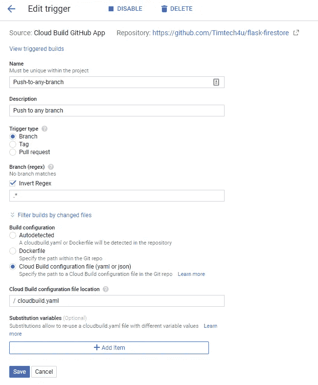

# 在云上构建工件

> 原文：<https://medium.com/google-cloud/building-artifacts-on-the-cloud-adb577662b3?source=collection_archive---------0----------------------->


软件开发人员经常构建工件(Docker 容器、WAR 文件、APK 包等)。)来自代码。

这通常需要可靠的互联网连接、高处理能力、足够的存储空间、不断升级的构建工具等等。

可以发布构建的工件，例如将容器部署到云或者在 Play store 上托管 APK 文件。然而，这也包括手动或在本地机器上完成时可能很困难的步骤。

在本教程中，您将使用下面的例子，利用[云构建](https://cloud.google.com/cloud-build/)在云上极其快速地构建工件:

*   构建容器工件并存储在容器注册表中。
*   构建非容器工件并存储在云存储上。
*   使用云构建触发器从存储库中自动化构建。

# 云构建

[云构建](https://cloud.google.com/cloud-build)是一项在谷歌云平台基础设施上执行构建的服务。

您可以编写构建配置来为云构建提供关于要执行哪些任务的说明，并且可以使用[云构建](https://github.com/GoogleCloudPlatform/cloud-builders)、[云构建社区](https://github.com/GoogleCloudPlatform/cloud-builders-community)提供的构建步骤/构建器，或者编写您自己的[自定义构建步骤/构建器](https://cloud.google.com/cloud-build/docs/create-custom-build-steps)。

云构建每天免费提供前 120 分钟的构建时间。
您可以通过[为您的](https://console.cloud.google.com/cloud-build/builds) [GCP 项目](https://console.cloud.google.com/project)启用云构建来简单地开始。

开始之前，请确保您已经安装了 Cloud [SDK](https://cloud.google.com/sdk/docs/) 或 [Cloud Shell](https://cloud.google.com/shell) 。

# 将 Docker 容器构建到容器注册表

Cloud Build 允许您构建 Docker 映像并将构建的映像推送到容器注册表。

你可以在这里和下面的 *Dockerfile* 获得我的*集装箱式烧瓶应用*的示例源代码:

```
FROM python:3.7-stretch
RUN apt-get update -y
RUN apt-get install -y python-pip python-dev build-essential
COPY . /app
WORKDIR /app
RUN pip install -r requirements.txt
ENTRYPOINT ["python"]
CMD ["app.py"] 
```

在您的项目根目录下应该有一个 *Dockerfile* ，然后您可以运行下面的命令在云上构建，这也将您的 Docker 容器发布到容器注册表。

```
gcloud builds submit --tag gcr.io/[PROJECT_ID]/my-image .
```

您刚刚使用 Docker 文件构建了一个名为 **my-image** 的 Docker 映像，并将该映像推送到容器注册表中。

您还可以使用构建配置文件`cloudbuild.yaml`在云上构建，该文件创建在项目根目录下，内容如下:

```
steps:
- name: 'gcr.io/cloud-builders/docker'
  args: [ 'build', '-t', 'gcr.io/[PROJECT_ID]/my-image', '.' ]
images:
- 'gcr.io/[PROJECT_ID]/my-image'
```

然后使用以下命令触发构建:

```
gcloud builds submit --config cloudbuild.yaml .
```

请注意:

*   `[PROJECT_ID]`应替换为您的实际项目 ID。
*   `.`用于对当前工作目录进行编译时。
*   您可以使用`:`为您的图像指定其他标签，例如`my-image:dev`，也可以为更大的图像指定更长的超时时间，例如`--timeout=600s`

# 将非容器工件构建到云存储

云构建支持[构建器](https://cloud.google.com/cloud-build/docs/cloud-builders)，您可以参考这些构建器来执行特定任务，如 *npm、go、gradle、gradle 等*。

然而，我会使用一个[定制的 gradle builder](https://gcr.io/fullstackgcp/gradle) 来构建一个 Android 项目 APK，然后启用 Cloud Build 将工件存储到一个云存储桶中。

你可以从这里获得我的 Android 应用程序[的示例源代码，以及下面的修改后的构建配置文件`cloudbuild.yaml`:](https://github.com/Timtech4u/gcb-android-tutorial)

```
steps:
# Set a persistent volume according to https://cloud.google.com/cloud-build/docs/build-config (search for volumes)
- name: 'ubuntu'
  volumes:
  - name: 'vol1'
    path: '/persistent_volume'
  args: ['cp', '-a', '.', '/persistent_volume']

# Build APK with Gradle Image from mounted /persistent_volume using name: vol1
- name: 'gcr.io/cloud-builders/docker'
  volumes:
  - name: 'vol1'
    path: '/persistent_volume'
  args: ['run', '-v', 'vol1:/home/app', '--rm', 'gcr.io/fullstackgcp/gradle', '/bin/sh', '-c', 'cd /home/app && ./gradlew clean assembleDebug']# Push the APK file from vol1 to your GCS Bucket.
artifacts:
  objects:
    location: 'gs://[STORAGE_LOCATION]/'
    paths: ['*.apk'] timeout: 1200s
```

然后使用以下命令触发构建:

```
gcloud builds submit --config cloudbuild.yaml .
```

请注意:

*   [存储位置]表示您的云存储桶的路径。
*   `gcr.io/fullstackgcp/gradle`是 gradle builder
*   [云构建服务账号](https://cloud.google.com/cloud-build/docs/securing-builds/configure-access-control)应该有权限写云存储或者那个桶是公开开放的。

# 自动化构建

Cloud Build 可以从 Google Cloud Storage、Cloud Source Repositories、GitHub 或 Bitbucket 导入源代码，按照您的规范执行构建，并生成工件。

我们将继续创建一个触发器，它监听我们的源代码中特定分支上的更改，并在我们的 cloudbuild.yaml 配置文件中执行操作。

*   打开[云构建触发器页面](https://console.cloud.google.com/cloud-build/triggers)
*   点击**连接储存库**
*   选择你的**源代码选项**和**继续**。
*   **验证**并创建**具有所需输入的按压触发器**。



上面是一个示例云构建触发页面。

您可以在[历史页面](https://console.cloud.google.com/cloud-build/builds)上监控构建触发器

如果你想了解在哪里部署你的工件，请查看[谷歌云计算选项指南](https://github.com/Timtech4u/gcp_compute_options_guide)。

**关于云构建的其他资源**

*   [云构建文档](https://cloud.google.com/cloud-build/docs/)
*   [官方云构建器](https://github.com/GoogleCloudPlatform/cloud-builders)
*   [社区云建设者](https://github.com/GoogleCloudPlatform/cloud-builders-community)
*   [牛逼的云建造](https://github.com/Timtech4u/awesome-cloudbuild)
*   [谷歌云平台牛逼榜](https://github.com/GoogleCloudPlatform/awesome-google-cloud)