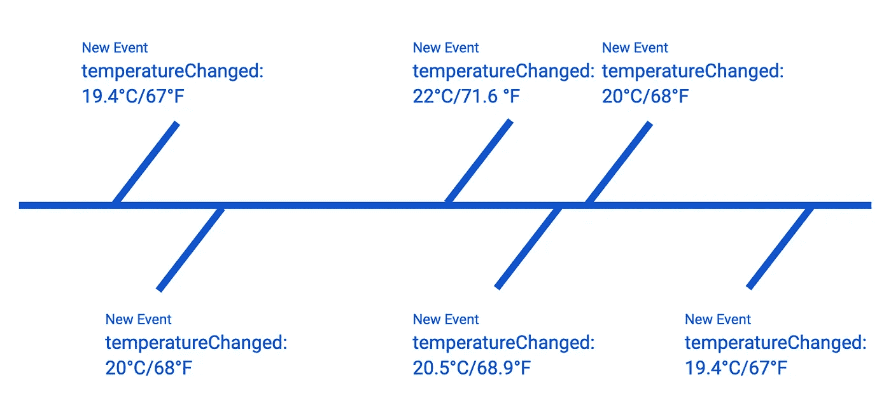
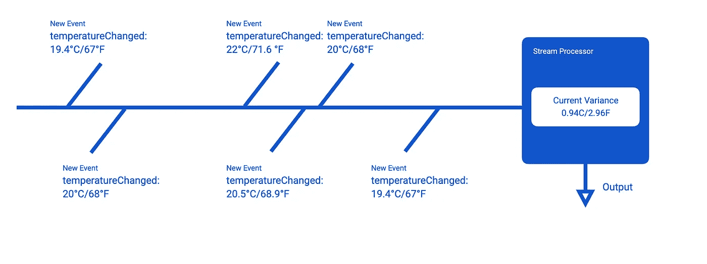
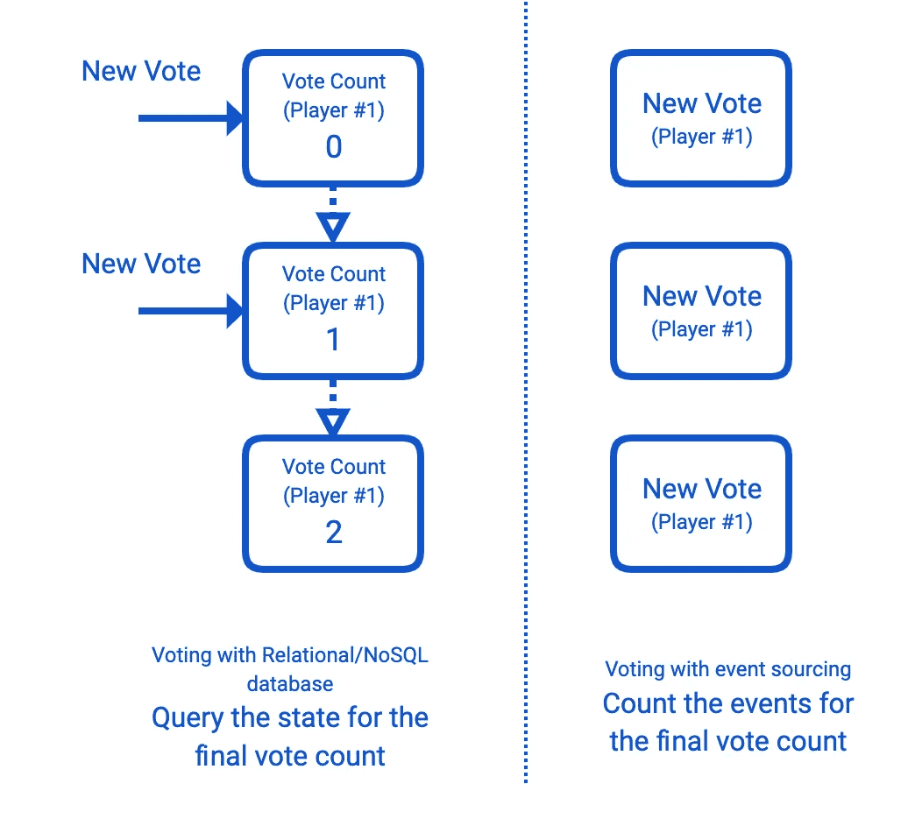

# 构建事件驱动的云应用和服务

> 原文：<https://medium.com/google-cloud/building-event-driven-cloud-applications-and-services-ad0b5b970036?source=collection_archive---------1----------------------->

本文讨论了构建事件驱动的应用程序和服务的一般实践和技术。这是[构建事件驱动的云应用和服务](/@ratrosy/building-event-driven-cloud-applications-and-services-ad0b5b970036)教程系列的开篇。

# 寻求构建可重用和可增长的系统

每个开发人员在编写代码时都会考虑到许多显式和隐式的假设。我们最常见的假设之一是计算设备总是顺序执行我们的代码。每一行代码都命令执行它的逻辑 next，它可以是自身(递归)、同一个包中的另一个函数，或者是互联网上的一个远程过程(RPC/RESTful API 调用)。执行路径本身本质上是一个结晶契约；在编译和部署之后，不能对其进行修改。

相对而言，在小范围内，顺序执行假设有助于编写简单、直接且易于理解的代码。然而，随着代码库变得越来越大，添加了成百上千的功能，执行路径本身将不可避免地以迷宫告终。伟大的设计模式、软件工程原则和最佳实践可能会暂时解决挑战，但危险仍然潜伏着；随着技术债务的积累，它将进行反击。

基于 HTTP RESTful/RPC 的微服务架构通过迫使开发人员对远程服务的接口而不是本地实现进行编程来解决这一问题，而本地实现的核心是可重用面向对象设计的第一个原则的自然延伸:

> **程序给一个接口，而不是一个实现。**
> 
> 设计模式:可重用面向对象软件的元素(1994)

然而，缺点是引入了服务之间的依赖性，这是开发人员可以并且必须忍受的一个可管理的副作用。执行路径还在；相反，这种模式有助于大大减少个人或团队需要管理的代码量，并以严格监管的方式将许多责任转移给其他服务。这为基于 HTTP RESTful/gRPC 的微服务架构的实践者带来了一系列新的挑战；尽管我们不会在这里讨论它们，因为它们显然超出了本系列教程的范围。

另一方面，事件驱动架构试图通过一劳永逸地摆脱执行路径来解决这个问题。在事件驱动的应用程序中，一个逻辑代码块在完成时发出一个事件，一条带有上下文数据的消息，而不是编排另一个代码块的执行。事实上，事件的发布者很少关心接下来会发生什么；以下操作由消息传递者决定，通常是消息队列/流解决方案。messenger(几乎)同时将事件从发布者传递给 0 个或多个订阅者，在订阅者处事件被单独处理。

> 制造伟大的、可增长的系统的关键更多的是设计它的模块如何通信，而不是它们的内部属性和行为应该是什么。
> 
> [艾伦·凯](https://en.wikipedia.org/wiki/Alan_Kay)

与基于 HTTP RESTful/RPC 的微服务架构不同，事件驱动的系统没有部件之间的依赖，也没有可供编程的接口。的确，发布者和订阅者仍然必须在一定程度上尊重预设的事件模式；然而，该契约相当灵活:如前所述，发布者对订阅者是否以及如何使用发布的事件知之甚少。随着执行路径的消失，您的应用程序和服务的可扩展性呈指数级增长:您可以随时以订阅者的形式添加或删除代码块；默认情况下，同一事件流的订阅者同时工作，不会以任何方式相互中断。

这并不是事件驱动架构的唯一好处。有了消息队列作为中间人，您的应用程序和服务获得了前所未有的可伸缩性:像 [Google Cloud Pub/Sub](https://cloud.google.com/pubsub/docs/) 和 [Apache Kafka](https://kafka.apache.org/) 这样的解决方案可以在短时间内保留并分发大量数据，如果配置得当，延迟可以忽略不计。许多消息队列也能够自适应；他们与用户同步工作，并尽最大努力不压倒他们。在当今世界，越来越多的企业依靠实时数据运行，这一点非常重要:随着数十亿台设备相互通信，应用和服务必须变得超级灵活。

> ***注***
> 
> *的确，基于单片和 HTTP RESTful/RPC 微服务的系统也可以在合适的平台上扩展(例如*[*Kubernetes*](https://kubernetes.io/)*/*[*Google Kubernetes 引擎*](https://cloud.google.com/kubernetes-engine/) *)。然而，使用执行路径时，每个函数调用、RPC 调用和/或 HTTP 请求都意味着(立即)执行另一个(可能是远程的)代码块；调用、调用和请求本身也会占用资源，并且不能进行批处理。一般来说，基于 HTTP RESTful/RPC 的微服务应该只在必要的时候互相通信；* ***健谈服务是这个架构中臭名昭著的反模式。***

本系列教程将详细讨论事件驱动架构的优点，当然还有缺点，以及开发人员用来构建自己的事件驱动系统的常见模式和实践。

# 什么是事件驱动？

## 事件

事件只不过是一段数据。更具体地说，它是一个**不可变的**小块数据，记录了**一个系统**在特定时间的特定行为；常见的例子包括您的恒温器检测到室内温度的变化，或者客户向购物车添加新商品。通过阅读一个系统的事件流程(序列),可以很容易地重建其操作历史。

事件

一般来说，事件的格式由开发者自己决定。[云本地计算基金会](https://www.cncf.io/)现在正在监管一个描述事件的标准化规范，即 [CloudEvents](https://cloudevents.io/) ，许多云服务提供商现在都计划支持这种格式。本教程系列通篇使用 0.3 版本的 CloudEvents 规范；强烈建议您在事件驱动的应用程序和服务中也使用这个规范。

此外，为了简单起见，本系列教程使用了一个实验项目， [CloudEvents Generator](https://github.com/michaelawyu/cloudevents-generator) ，尽可能地生成和消费事件。请注意，您也可以使用自己喜欢的编程语言的内存结构来构建标准的 CloudEvents。

## 事件驱动的

事件驱动是一个定义松散的术语；它的用法因开发者而异。有人可能会说，任何使用发布者/订阅者范式(有时称为通知范式)事件的系统都可以被认为是事件驱动的系统。根据系统中集成了多少事件，事件驱动系统可以大致分为两类:反应式系统和流处理系统。

## 反应式事件驱动系统

在反应式事件驱动系统中，事件本质上是没有同步性的函数调用(或 HTTP RESTful/RPC 调用)。发布者发出一个事件，该事件实际上在发布者未确认的情况下触发了订阅者中的一个操作。例如，航班预订服务可以设置其 API 后端，在客户预订航班时发出一个`orderCreated`事件；消息队列将事件传递给订户服务，订户服务处理事件，联系航空公司预订机票，并从客户的信用卡中收费。

有些人可能认为这是一种采用事件的肤浅方式(*一种被动-主动的函数调用*)；然而，反应式事件驱动系统仍然可以享受该架构的诸多好处:

*   由于订户服务负责机票预订和支付处理，API 后端可以更快地做出响应，在发出`orderCreated`事件后告诉客户系统正在处理他们的订单，并在稍后通知他们结果。
*   团队现在可以分别处理 API 后端、机票预订功能和支付处理功能，而不用担心耦合问题
*   该系统现在对假日季节的交通高峰有了更充分的准备。当订户服务不堪重负时，消息队列自动保留`orderCreated`事件；一些解决方案甚至可以通过适当的配置自动重试暂时失败的预订和支付。

## 流处理事件驱动的应用

具有流处理的事件驱动系统以一种更加密集、面向数据的方式使用事件。在这种模式中，事件的订阅者通常是流处理器，它从事件流中提取**状态**，并将状态传递给相关方。这类系统通常由数据流解决方案支持，如[阿帕奇 Flink](https://flink.apache.org/) 、[阿帕奇 Spark](https://spark.apache.org/) 和[云数据流](https://cloud.google.com/dataflow/)。如果有帮助的话，想象一个使用物联网设备监控某个区域温度变化的系统:该区域周围的恒温器每秒钟通过消息队列以事件的形式向服务报告它们的读数，其中每个事件包括特定时间的温度数据点；该服务在设定的时间窗口内(例如每 15 秒)收集所有事件，并使用流处理器计算数据的统计方差(**状态**)；然后，该服务将状态传递给另一个系统(例如控制面板)以供进一步检查。

流处理

具有流处理的事件驱动系统近年来在行业中被普遍采用。社交网络使用它来计算喜欢、页面浏览、收听等，而云服务提供商使用它来检测欺诈/滥用。这种模式也是许多实时数据分析应用程序和数据转换管道的基础。

## 活动采购和 CQRS

事件源是事件驱动系统中常见的另一个术语。术语可能有点混乱；**它实际上是一种数据持久化模式**而不是事件驱动系统的设计模式。您可能会认为它是关系数据库(SQL)和 NoSQL 数据库的替代品。这个模式的设计哲学可以用一个例子来更好地解释:

想象一下，你正在为世界著名的电视节目*构建一个电子投票系统，所以你认为你可以编码*。投票系统本质上是写密集型的:计票只在最后才重要，但人们一直在提交他们的投票。因此，如果您使用关系(SQL)数据库作为数据库后端，它很容易被淹没，因为每次投票都需要更新一个表，并锁定一行然后释放。然而，使用事件源，接受投票只需要插入事件日志:因为每个投票(事件)都是不可变的，所以不需要锁定。当您需要最终的计票结果时，只需通读事件的记录顺序，然后将投票数加起来:

活动采购

事件源的本质使其成为事件驱动系统中数据持久化的自然候选。**然而，事件采购并不是唯一的选择**；例如，许多反应式事件驱动系统仍然使用关系(SQL)/非 SQL 数据库作为存储。

当人们谈论事件源时，你可能也会听到术语 [CQRS](https://en.wikipedia.org/wiki/Command%E2%80%93query_separation) (命令查询责任分离)。不严格地说，在事件源系统中，CQRS 帮助创建事件序列的物化视图，这样您就可以像使用常规 DBMS 一样查询数据，省去了每次需要状态时自己扫描事件和计算数字的麻烦。这种设计不是事件源专有的；它的核心只是简单地陈述了一个人可以使用不同的模型来更新信息，而不是你用来读取信息的模型。

本系列教程不会过多讨论事件源或 CQRS，因为它们不是事件驱动系统的组成部分。如果你感兴趣，可以参考马丁·福勒的博客文章([事件来源](https://martinfowler.com/eaaDev/EventSourcing.html)、 [CQRS](https://martinfowler.com/bliki/CQRS.html) )。

## 事件驱动系统和无服务器计算

事件驱动架构是无服务器计算平台的天然盟友，尤其是 FaaS(功能即服务)平台。架构和解决方案有许多共同的特征:两者都是在解耦系统和可伸缩性的基础上设计的。许多无服务器计算平台也采用现收现付的定价模式，这与发布者/订阅者范式完全吻合。其中一些，比如[云函数](https://cloud.google.com/functions/)，甚至内置了与消息队列解决方案的集成(这里是 [Cloud Pub/Sub](https://cloud.google.com/pubsub/) )。

本教程在演示中使用了一些无服务器计算解决方案。然而，在您的生产应用和服务中，在选择无服务器作为运行订阅者的平台之前要小心:技术限制(冷启动时间、运行时间限制、延迟等。)此外，构建、测试、部署和管理无服务器代码本身就是一个挑战。

顺便提一下，许多无服务器计算解决方案是无状态的，这使得在其上运行组操作(或一般的流处理)相当困难。您可以添加一个数据持久层来解决这个问题，但是它会变得相当昂贵，并且很难构建/维护。根据经验，在反应式事件驱动系统中使用它们比在流处理系统中使用它们更好也更容易。

# 我应该采用事件驱动吗？

到目前为止，我们已经说了很多关于事件驱动系统的好话。遗憾的是，与计算机科学领域的许多想法和概念一样，事件驱动架构提供的每一个好处都有价格标记。众所周知，事件流很难跟踪；如果没有执行路径作为映射，开发人员可能需要付出巨大的努力才能在无止境的事件流中找到一个 bug 或一个性能瓶颈。有许多工具和实践可以帮助缓解这个问题(我们将在本系列教程的后面讨论)，尽管它们都不是最终的解决方案；这是我们分离出版商和订户必须付出的代价。

事件驱动系统中的另一个潜在难点是消息队列/流解决方案。开发者通常假设中间人会按照他们的承诺履行，这在 99.99% — 99.99999%的情况下是正确的；然而，打嗝还是会发生。消息队列可能会意外停止工作，突然发送大量重复的消息，或者在没有警告的情况下引入无法解释和无法再现的延迟。做好准备。

即使有一些完全包含事件驱动架构的原型，许多团队使用事件驱动系统作为服务的一部分，专门用于处理事件的特定工作流。例如，您可以在服务网格中引入一个事件驱动的微服务，专门用于数据分析，同时保持其他一切基于 HTTP RESTful/RPC。

总之:三思而后行。事件驱动架构听起来很奇特，但是如果它工作得一样好，没有人会责怪你使用单片系统。架构本身可以成为一些问题的神奇解决方案，但是在特定的场景中，它的局限性同样令人难以承受。根据具体情况采用事件驱动的系统。

# 下一步是什么

本教程系列包括以下部分:

*   [使用云事件和云事件生成器](/@ratrosy/using-cloud-events-and-cloud-events-generator-4b71b8a90277)
*   [反应式事件驱动系统和推荐做法](/@ratrosy/reactive-event-driven-systems-and-recommended-practices-785a1ab7e509)
*   [采用流处理的事件驱动系统简介](/@ratrosy/introduction-to-event-driven-systems-with-stream-processing-8b169a9fae12)

在本教程系列中，您可能会看到**在云壳中打开按钮**

在运行演示项目之前。这个按钮可以帮助你测试代码，而不需要在本地设置任何东西；它也适用于移动设备。[云壳](https://cloud.google.com/shell/)是谷歌云平台产品和服务的一部分；要使用云壳，您必须拥有一个可访问 Google 云平台的 Google 帐户。[你可以在这里注册谷歌云平台](https://console.cloud.google.com)。