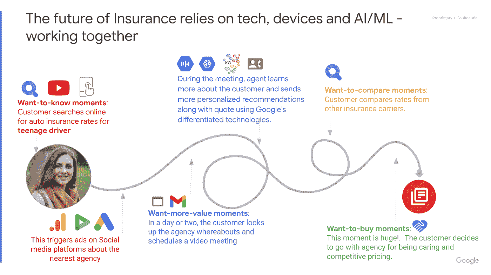
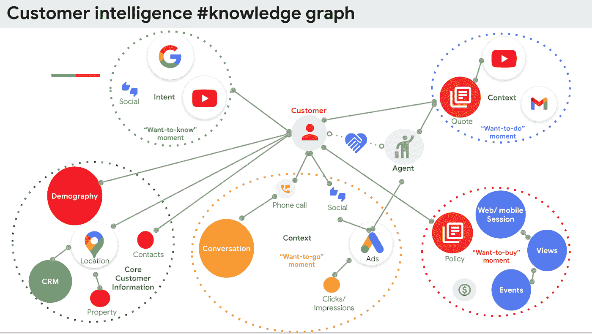
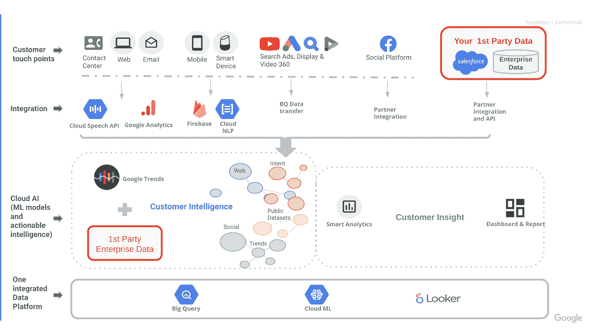

# 建立亲密关系:通过各种渠道吸引、留住和取悦保险客户

> 原文：<https://medium.com/google-cloud/building-intimacy-engaging-retaining-and-delighting-customers-across-channels-7cc8232d7a8b?source=collection_archive---------1----------------------->

# 关于这篇文章

数字经济正在全面爆发，疫情只是提升了数字转型和大规模创新的重要性。现代保险企业发现，他们的传统业务模式无法平衡实时风险，以应对不断变化的市场趋势和消费者预期。建立适应不可预测的市场变化的能力，同时保持相关性并与客户保持联系，是当今保险企业面临的一个关键挑战。

这篇文章概述了保险公司如何为现代化的客户体验铺平道路。它探讨了数据驱动的创新和产品个性化在加强保险公司与其客户之间的关系方面的价值；并展示了企业如何利用谷歌独特的基于云的技术来扩大盈利业务。

# 介绍

客户只忠于一件事，那就是他们的需求。交易体验(即以金钱换取产品或服务)解决了客户的即时需求，但是，为了实践弹性并建立愉悦和参与的长期关系，客户体验必须反映出对其行为的动态“为什么”的深刻理解。它应该是可靠的、有用的、高效的，并且物有所值。

网飞从邮购 DVD 模式转向流媒体模式，是适应消费者期望和市场趋势的一个众所周知的例子。保险公司可能不需要做出如此戏剧性的转变，但为了征服客户之旅，需要重新思考客户参与度肯定是有相似之处的。

# 第一章:阻碍保险业的挑战

使用数据来制定个性化的客户战略是一项持续的任务，为了向前发展，必须考虑几个行业挑战。

## 不断变化的客户需求

随着期望的增加和需求的变化，客户的行为也会发生变化。在即时性的数字时代，对无缝、个性化和现代化保险服务的需求正在上升。此外，在对需求和未来风险进行全面评估时，必须考虑环境、经济、文化和世界事件的影响。

## 消费者隐私权

消费者已经决定:隐私很重要，世界上的科技巨头都同意这一点。第三方 cookie 的死亡，以及最近关于透明数据的 iOS 更新，意味着企业不得不重新想象他们创造消费者体验的方式。跟踪浏览器 cookies 以改善客户体验不再是一个可行的选择。

随着谷歌计划在 2023 年前逐步淘汰 Chrome 浏览器中的第三方 cookies，企业现在必须采取行动，寻找新的解决方案。

## 数据孤岛

如今，信息来自多个来源，这通常意味着信息是分散和孤立的。保险公司有几个客户接触点，并且经常通过文档、文本和语音对话以及应用程序交换信息。这些信息以各种形式存在，如手写笔记、数字文件以及结构化和非结构化数据；所有这些通常都是不连贯、不准确和不完整的。

这使得组织，特别是数据科学家，越来越难以建立全面的人工智能/机器学习(ML)模型，以推动相关的业务成果和互联的客户体验。

然而，挑战伴随着机遇。是时候转向一种集成的数据策略来全面了解客户行为了。企业需要投资于自我学习机制，实时提供可行的建议，为消费者和企业带来更好的结果。从 API 管理到数据仓库和虚拟客户服务代理，谷歌云开启了对技术的访问，这些技术有助于加深对当今客户的理解，同时领先于他们不断增长的需求。

让我们来看看保险公司如何利用谷歌云的创新技术更快、更大、更有效地做事，这项技术为行业和消费者-企业关系铺平了道路。

# 第 2 章:了解顾客需求，掌握个性化

[通过在智能手机上搜索，每两个千禧一代中就有一个发现并购买了他们以前几乎不知道的品牌。这表明了消费者行为的转变。品牌信任不再仅仅依赖于一个品牌的声誉或实体的存在。今天，透明度、评论、社会承诺、环境价值和简单性是购买决策的重要因素。](https://www.martechadvisor.com/articles/ecommerce/how-millennials-are-shaping-the-future-of-retail/)

看似在线浏览的东西，往往是一种想要满足眼前需求的想法。对于保险公司来说，了解消费者的决策时刻变得非常重要。这一想法背后的现实是，在过去的 10 年里，数字设备从根本上改变了消费者和提供商的互动方式。人们，尤其是 Y 代和 Z 代，转向数字设备来满足需求:学习、行动、发现或购买的需求。

根据手机使用数据，美国人每天查看手机的次数超过 150 次。他们可能会在许多平台上查看电子邮件、短信、社交媒体或消息。他们可以在他们想去的时间和地点行动，或者在他们有动力去的时间和地点行动，不再受他们能去的时间的限制，因为一切都在他们的掌握之中。这些是赢得客户的时刻。

# 第 3 章:近距离观察客户旅程

汽车保险的典型客户旅程是什么样的？一般来说，他们会经历四个人生阶段。

*   研究保险范围(我- **想知道的**时刻)
*   购买报价(I- **想要更多价值**时刻)
*   考虑因素(I- **想要比较的**时刻)
*   绑定(我- **想要购买**的时刻)

现在，让我们把这个应用到现实生活中:克拉拉，一个在**想知道**时刻正在搜索汽车保险的顾客，在网上浏览寻找青少年的汽车保险费率。这向当地保险代理人 Angie 发送了一个触发器，然后 Angie 向 Clara 的社交媒体渠道(包括 YouTube 和 Instagram)发送自动化的情境化广告。

Clara 关注个性化内容，浏览评论和社区信息。在一两天内，她搜索安吉的详细资料，并立即在搜索结果的第一页上发现它们。克拉拉安排了与安吉的虚拟约会。

在约会中，克拉拉分享了她为汽车投保的需要，并学习了更多关于青少年汽车保险的知识。通过将谷歌的差异化数据和人工智能/人工智能能力增强到现实世界的对话中，Angie 现在对 Clara 的风险状况有了更深入的了解。Angie 然后利用[谷歌的知识图表](https://blog.google/products/search/introducing-knowledge-graph-things-not/)来提供根据 Clara 的需求定制的动态定价。这个**想要更多价值**的时刻触发 Angie 发送一封包含相关内容的个性化电子邮件，并建议捆绑汽车保单。

Clara 浏览 Angie 发送给她的相关内容，并/在**想要比较**的时刻考虑她的选项。在深思熟虑地比较了其他运营商的费率以及她与 Angie 的合作经历后，Clara 决定选择 Angie 的公司，因为她获得了积极主动、富有竞争力、充满关怀和吸引力的服务。这个**要买**的时刻至关重要。

为了抓住这些机会，企业需要了解客户的意图，并在他们需要的时间和地点提供即时有用的产品和服务信息。这些小瞬间是赢得新客户的最大机会。

通过了解个人情况并以一对一的体验解决意图和需求，保险公司可以成功地与客户建立联系。

# 通过规划顾客旅程创造整体体验

拥有高水平的客户智能意味着跨每个渠道跟踪客户的旅程，并深入了解每个客户、他们的位置以及他们所处的环境。最简单的方法是使用知识图表。

知识图是关于现实世界中实体的结构化数据的详细集合。要构建知识图表，我们需要从客户的旅程开始。考虑到客户可能在任何渠道上，包括网络、智能手机，或者与 CSR 或实时代理交谈，将非结构化数据转换为结构化格式并解释其含义，是知识图的一个必备条件。

在谷歌云平台的帮助下，企业可以轻松地将领先的数据和人工智能服务与他们当前的客户旅程状态相集成，而不管渠道如何。企业可以利用创新的、隐私安全的数据功能，如企业第一方数据、搜索、广告、地图和 YouTube，创建无缝的全渠道体验，以获取、保留和取悦客户— [就像丰田加拿大](https://marketingplatform.google.com/about/resources/toyota-canada-sees-6x-boost-in-conversions-using-google-marketing-platform-and-google-cloud/)一样。

# 第 4 章:掌控消费者洞察

在保险公司能够实现集成和个性化的客户体验之前，必须考虑数字媒体、综合数据和 AI / ML 策略。为了让这种体验变得生动，并在重要的时刻显得相关和有用，企业需要了解客户的潜在需求；一种是通过实时数据发现的，另一种是导致创建基于使用的保险产品的。

在旅途中实时了解客户，让企业能够创建数据导向的战略，并为消费者的下一步行动提供明智的建议。该解决方案汇集了来自各种接触点的客户数据，包括呼叫中心、网络前端、移动设备以及内部和外部数据源，如 CRM、谷歌搜索、广告和谷歌的[公共数据集](https://cloud.google.com/solutions/datasets)。连接这些不同的数据源对于理解消费者行为的“为什么”很重要。

Google Trends 帮助企业通过有意义的机会建立真正的客户关系。利用企业数据挖掘 Google Trends 的力量有助于利用对客户、品牌、竞争和行业的商业洞察力。随着越来越多的企业采用以客户为中心的产品设计，近乎实时地获得可行的见解成为保险市场的一个差异化因素。

## BigQuery

然而，对于不断随客户需求变化的产品，在典型的数据湖平台中理解、转换和管理所有这些数据集尤其具有挑战性。企业需要迁移到一个开放、灵活、智能的数据平台，并被证明可以轻松地与合作伙伴生态系统集成。

谷歌的 [BigQuery](https://cloud.google.com/bigquery) 是一个无服务器、高度可扩展、经济高效的多云数据仓库，旨在实现业务灵活性，降低数据操作的复杂性。它无缝连接和传输来自主要 CRM 和 SaaS 数据提供商(如 Salesforce 和脸书)的数据。

## 人工智能联络中心(CCAI)

谷歌的[对话式人工智能(CCAI)](https://cloud.google.com/solutions/contact-center) 与主要的电话和联络中心解决方案(Avaya、Genesys、Cisco、Twilio 和 Salesforce)无缝集成，以实现对客户情绪、可能的建议和客户体验差距的近乎实时的可见性。

在现有客户接触点的基础上增加人工智能，并使用合作伙伴开发的商业智能工具(如 Looker 和 Tableau)在组织间普及见解，使保险公司几乎可以立即看到人工智能的好处。它通过启用一个集成的数据和 AI / ML 平台来管理无缝和整体的端到端客户旅程，以满足 1:1 的需求。

# 借助谷歌云了解您的客户

为了在保险行业充分发挥你的商业潜力，你需要了解你的客户。您需要内部和外部数据，并与支持实验的机器学习模型相结合，以释放实时客户洞察力，从而提供更好的结果，并让您领先于客户预期。

利用数据驱动的创新来满足不断变化的客户需求，将帮助您征服个性化和互联的客户体验。谷歌云生态系统——包括谷歌搜索、广告、谷歌营销平台和谷歌云平台——可以帮助您在数字时代与客户建立关联，并最终加速数字化转型。

总而言之，谷歌云对企业的好处是:

*   利用应用现代化工具构建基于使用的保险产品
*   有效和高效的营销活动和受众激活
*   您的客户和代理商之间自动化、互联的全渠道体验
*   了解客户需求，并在他们需要的时间和地点提供有意义的可行服务
*   更高的品牌参与度、客户终身价值和创收
*   客户智能知识图支持:
*   近乎实时地了解客户在旅途中的活动
*   开发一套全面的 ML 模型，增强第一方数据以推动业务成果
*   通过分析第一方数据和真实数据，提前了解市场中的挑战和机遇