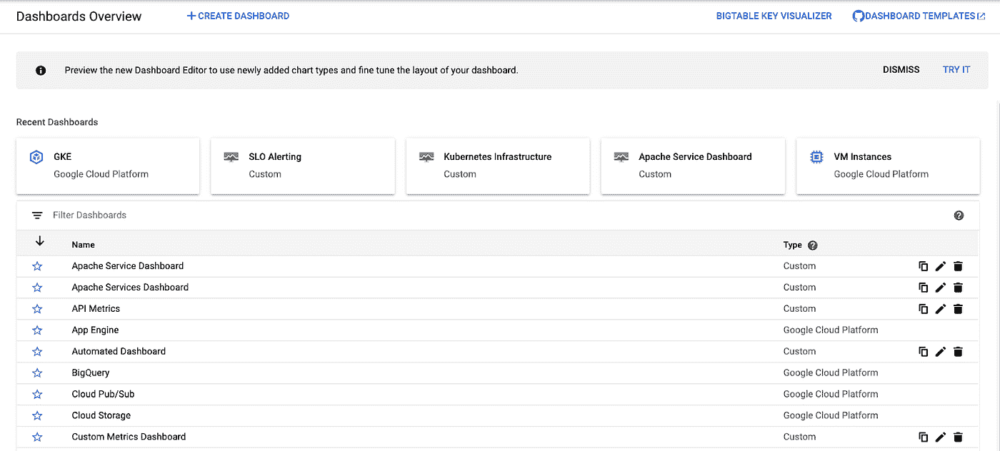
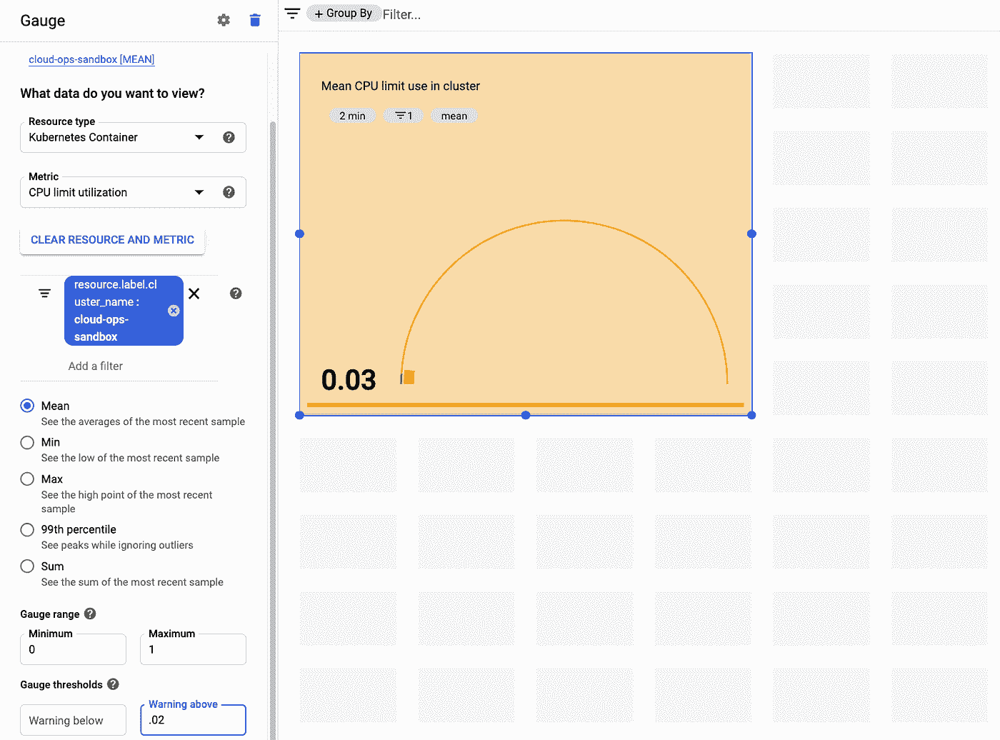
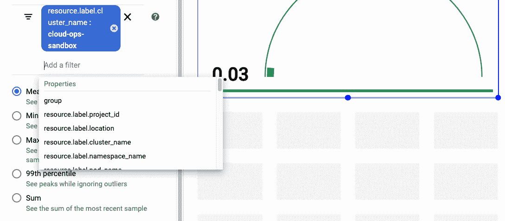
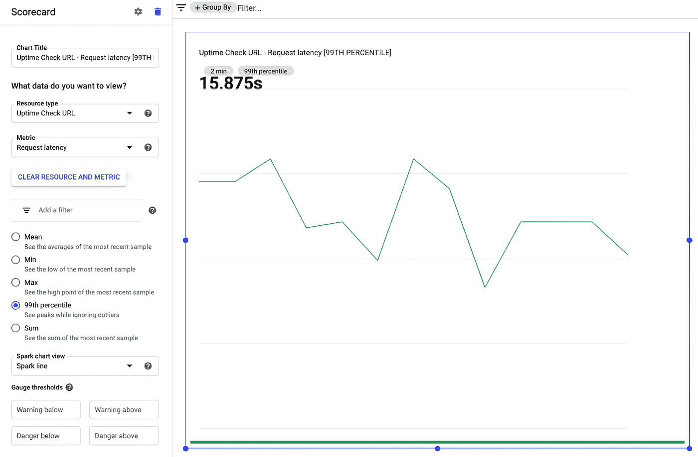
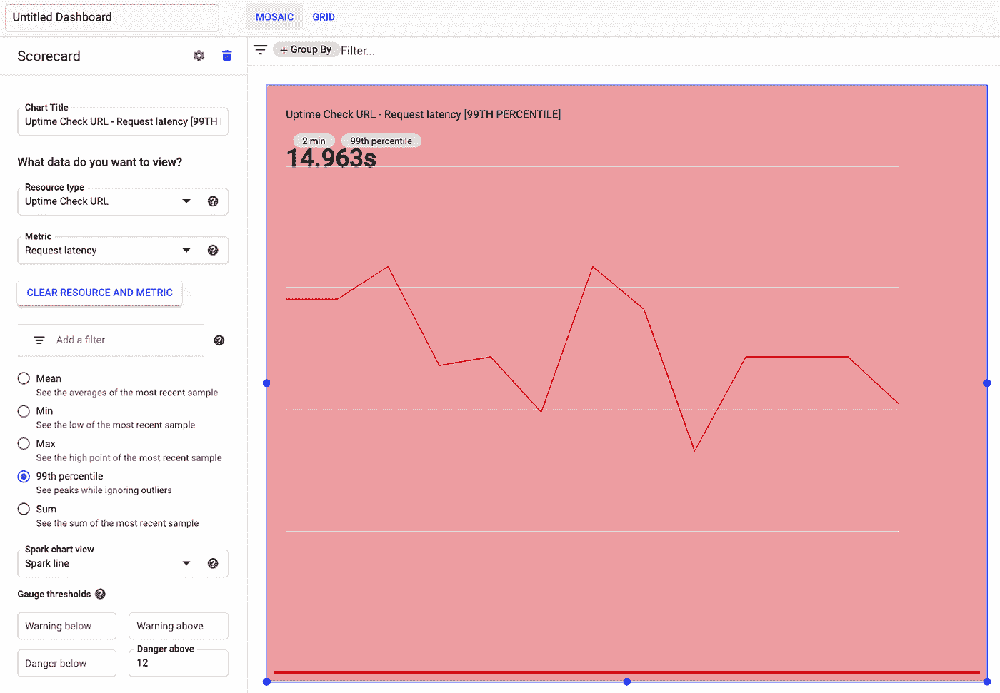
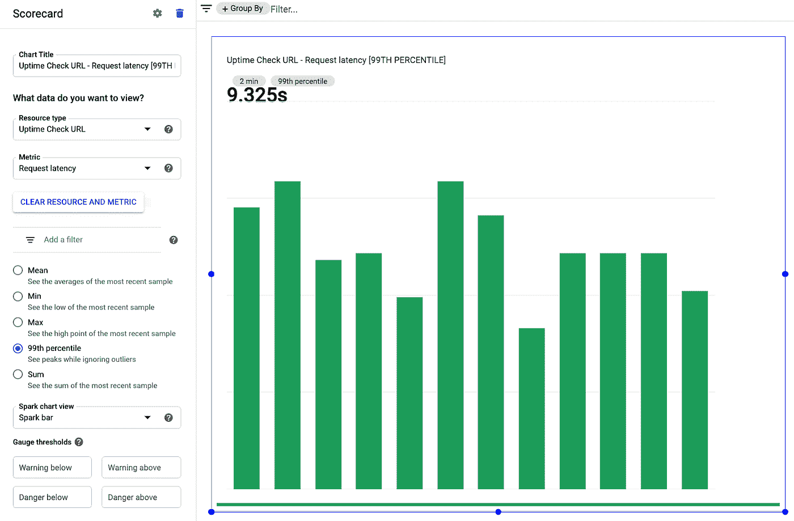
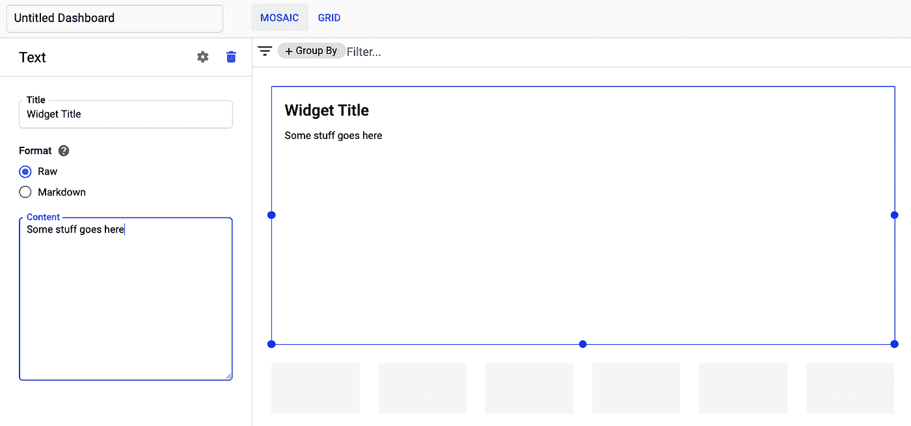
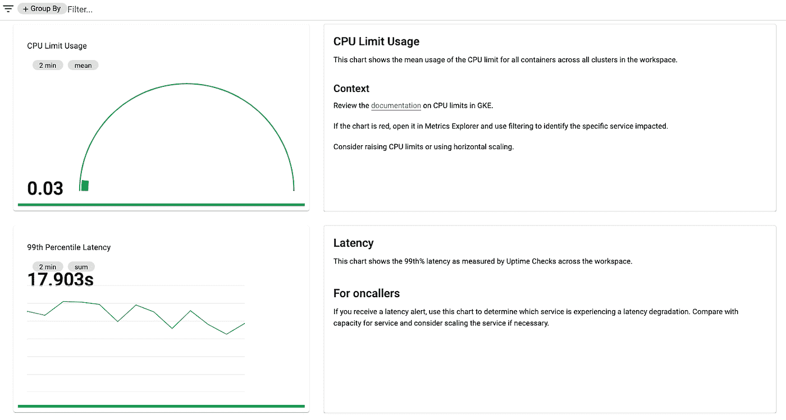
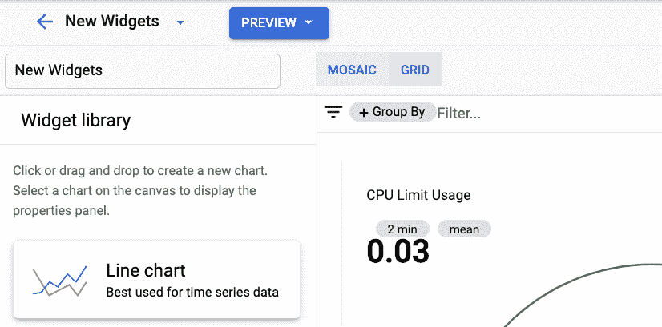
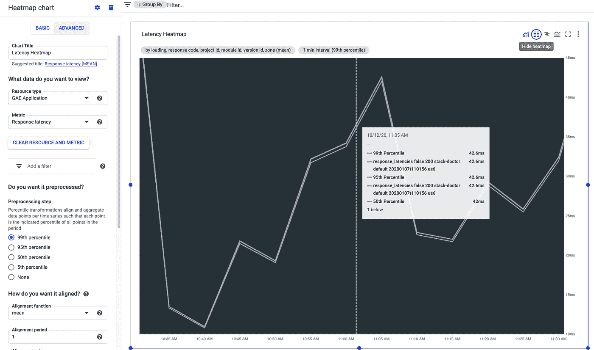

# 为乐趣和利润构建监控仪表板

> 原文：<https://medium.com/google-cloud/building-monitoring-dashboards-for-fun-and-profit-2e04347e205e?source=collection_archive---------0----------------------->

在我最近的[两篇](/google-cloud/setting-up-cloud-operations-for-gke-a21b49979693) [帖子](/google-cloud/troubleshooting-services-on-gke-872470e60d51)中，我探索了新的“开箱即用”的 GKE 监控仪表板，并使用它来设置针对重要资源的警报，以及从警报向下钻取以找出问题。如果您关心您的整个 GKE 车队，这个仪表板当然很好，但是如果您的主要任务是维护特定服务的可靠性，该怎么办呢？为此，您需要创建一个特定于服务的仪表板。我之前已经[报道过](/google-cloud/automating-application-dashboard-creation-for-services-on-gke-istio-a55a5a79aa15?source=your_stories_page-------------------------------------)创建仪表板，你可以在 Stack Doctor 的[集](https://www.youtube.com/watch?v=Rqu-2k9m814&list=PLIivdWyY5sqLuKKx4pcdEAkJY1HevjVVm&index=23&t=1s)中看到我谈论使用 Terraform 自动创建仪表板。但是现在，有了一个[新的](https://cloud.google.com/monitoring/charts/dashboards#select-editor)仪表板编辑器——我认为这将是一个很好的机会来重温这个主题，并使用新的编辑器来创建一个示例仪表板，捕捉一些关键信号。

# 仪表板里有什么？

和以往一样，第一个问题是——仪表盘上应该显示什么？我在关于自动化仪表板创建的[帖子](/google-cloud/automating-application-dashboard-creation-for-services-on-gke-istio-a55a5a79aa15?source=your_stories_page-------------------------------------)和[视频](https://www.youtube.com/watch?v=Rqu-2k9m814&list=PLIivdWyY5sqLuKKx4pcdEAkJY1HevjVVm&index=23&t=1s)中对此做了很好的介绍，但是让我们快速回顾一下。我这里的推荐通常是基于 SRE [一书](https://landing.google.com/sre/sre-book/toc/)中[章节](https://landing.google.com/sre/sre-book/chapters/monitoring-distributed-systems/)的监控分布式系统。如果你没有其他东西，就从“黄金信号”开始——流量、错误、延迟和饱和度。

从那里，它只是一个问题，找出什么是最好的指标。例如，如果您有一种方法来计算对您的服务的请求数，那么请求数就是一种测量流量的好方法。如果没有，您可以查看工作负载的网络使用情况。如果您有一种基于状态代码统计响应的方法，这是一种统计错误的好方法。如果不是，也许对严重程度为错误或更高的日志条目进行计数就足够了。您甚至可以通过测量容器重启来跟踪应用程序崩溃。如果您使用类似于 [OpenTelemetry](/google-cloud/custom-metrics-in-node-js-with-opentelemetry-and-prometheus-c10c8c0204d3--------------------) 的东西来跟踪响应延迟，那真是太棒了！如果没有——不要担心——也许您正在日志中记录事务时间，并且您可以创建一个基于日志的指标来跟踪它。最后，您可以从基本的基础设施指标开始，如 CPU 或内存使用情况，来跟踪饱和度。

重要的是，您对服务的健康状况有一个清晰的了解。

# 我如何控制面板？

正如我之前在[讨论过的](https://www.youtube.com/watch?v=Rqu-2k9m814&list=PLIivdWyY5sqLuKKx4pcdEAkJY1HevjVVm&index=23&t=1s)，当你创建一个新的仪表板时，你有三个选择——使用 UI、API 或 Terraform。这一次，我想特别关注 UI 的使用，因为有了一个新的仪表板编辑器！

在我关于故障排除的帖子之后，我想我应该创建一个相当简单的仪表板，显示我的 GKE 工作负载的基本健康状况。让我们开始吧。

# 新东西！

很明显，新的编辑器看起来很不一样。左侧有一个小部件列表，在实际的仪表板窗格中有一个网格视图。为了便于比较，下面是您创建新仪表板时编辑器的样子:

# 小工具

不是使用右上角的添加图表链接，而是从选择一个小部件开始。有三种新的小部件类型—仪表、记分卡和文本。其他四个(折线图、堆积面积图、堆积条形图和热图)是熟悉的，仍然存在。来看看新出的吧！

# 测量

Gauge 小部件最终为您提供了一种在仪表板上将单个数字表示为健康指标的方法，以及一种对其进行颜色编码的方法，以便您可以一眼看出事情是否健康。这里有一个基本的例子:

该图表显示了特定集群中所有容器平均使用了多少 CPU 限制(当然，您可以使用其他聚合类型，如最小值/最大值/总和/第 99 个百分点)。我非常喜欢它的一点是，它能够指定图表改变颜色的范围。例如，下面是如何设置将使图表变成黄色的警告阈值:

您还可以设置一个危险阈值，使其变为红色:

就我的目的而言，这实际上是表示“饱和”信号的一种很好的方式——如果容器平均来说没有接近极限，那么应该还有足够的容量。如果我关心一个特定的服务，我可能想进一步过滤:

# 记分卡

接下来—记分卡小部件！它还允许您在仪表板上显示单个数值。但是，与仪表不同，它会随着时间的推移跟踪值:

与仪表类似，您可以使用警告和危险阈值让小部件改变颜色:

您还可以更改值随时间变化的显示方式。线条是默认选项，但您也可以使用条形图:

图标选项将简单地显示该值是否在所需范围内(带有绿色勾号):

或超出所需范围，用红色表示:

就我们的目的而言，我真的很喜欢这个可视化延迟的小部件。这是一种快速查看您的服务是否满足特定性能目标的简单方法。

# 文本

最后一个新的小部件类型是文本。乍一看，这没什么好激动的:

但是一旦你选择了 Markdown 选项，这个小部件就会大放异彩——这实际上把它变成了一个富文本编辑器(前提是你对编写 [Markdown](https://en.wikipedia.org/wiki/Markdown) )感到舒服)。这是一个很好的方式，例如，直接向仪表板添加文档，可以准确地描述用户正在查看的内容。

例如，您可以使用这个小部件来记录您到目前为止创建的仪表板，以帮助定向新用户，如下所示:

# 布局选项

到目前为止，您可能已经注意到，您现在可以选择移动小部件和调整它们的大小。这都是编辑器中新的“马赛克”选项的一部分:

通过能够按照您认为合适的方式调整图表的大小，您可以选择您想要的仪表板的外观，您不再局限于基本的列视图。例如，您可以向仪表板添加一个请求计数图表，该图表跨越我们到目前为止创建的两个列:

现在，您有了一个指示板来表示四个“黄金信号”中的三个——流量(作为请求计数)、饱和度(通过 CPU 限制使用来衡量)和延迟。

# 基本配置与高级配置

您应该知道的最后一件新事情是使用基本和高级配置选项配置图表之间的新区别。例如，如果您将一个热图小部件添加到您的控制面板，您可能会看到这样一条消息，让您知道您需要使用高级模式来配置它:

该选项位于图表配置选项的顶部:

虽然在大多数情况下，基本模式应该适用于大多数用户，但有时您可能需要明确指定图表对齐方式。切换到高级模式可以让您做到这一点:

对于我们的热图，您可以选择预处理步骤和对齐等选项来获得您想要的精确图表。

# 概括起来

我对这一新功能感到非常兴奋，我真的很期待看到你们将使用新的小部件、布局和配置选项创建的新仪表板。感谢您的阅读，和往常一样，让我知道您希望我接下来处理什么。现在比以往任何时候都更需要——在外面保持健康！