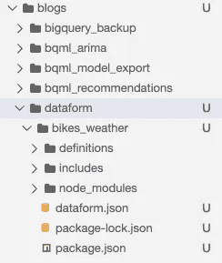
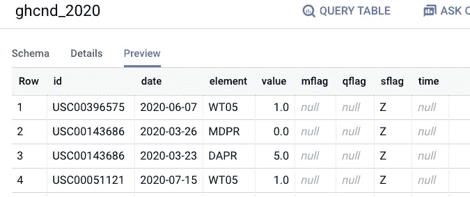
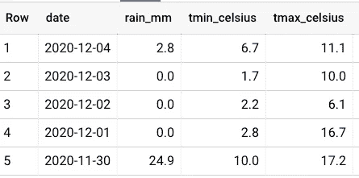
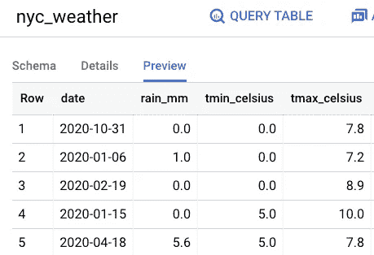
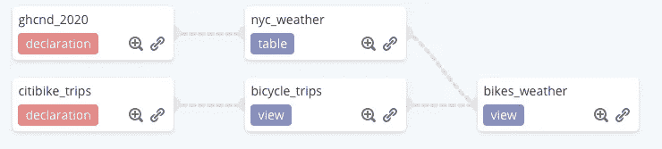
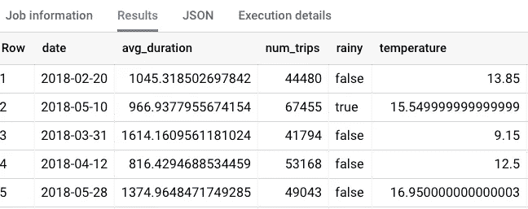

# 用数据表单在 BigQuery 中构建 SQL 管道

> 原文：<https://medium.com/google-cloud/building-sql-pipelines-in-bigquery-with-dataform-part-1-9e96f14ec664?source=collection_archive---------0----------------------->

## 使用 SQL 协作转换、记录和安排数据集

我们越来越多地看到从构建 ETL 管道(在数据加载到 BigQuery 之前，大部分转换在 Spark 或 Dataflow 等工具中进行)到 ELT 管道(在 BigQuery 内部进行)的转变。原因是:( 1)业务用户更容易编写 SQL ;( 2)与其他数据处理技术相比，BigQuery 的伸缩性更好，成本更低。

然而，用 SQL 编写所有转换代码的问题是，它可能变得难以维护。你有多少次在几个月后回到一个项目，面对一堆视图、表格、用户定义的函数和脚本，困惑地挠头？

这就是为什么拥有一个支持转换代码方面的最佳实践的环境是非常有用的——您想要应用于任何代码的相同类型的最佳实践:文档、可重用性、可读性、断言、单元测试、源代码控制等等。Dataform，最近被 Google Cloud 收购，即将成为 Google Cloud 数据分析产品组合的一部分，提供了这样一个环境。对所有用户都是免费的。

## 1.安装数据表单

在 GCP 控制台中，打开 CloudShell(它是顶部蓝色丝带中的>图标)。然后，使用 NPM 安装数据表单:

```
npm i -g [@dataform/cli](http://twitter.com/dataform/cli)
```

## 2.初始化数据表单项目

然后创建一个新的数据表单项目(我称之为 bikes_weather):

```
dataform init bigquery bikes_weather \
    --default-database $(gcloud config get-value project) \
    --include-schedules
```

此时，项目已经创建，具有 Dataform 推荐的文件结构:



## 3.为 BigQuery 设置身份验证

前往[https://console.cloud.google.com/iam-admin/serviceaccounts](https://console.cloud.google.com/iam-admin/serviceaccounts)并创建一个服务帐户。赋予该帐户 BigQuery Admin 的角色(以便 Dataform 可以创建新表等。).然后，将 JSON 密钥下载到项目中，并将文件上传到 CloudShell。

最后，在 CloudShell 中，键入:

```
cd bikes_weather
dataform init-creds bigquery
```

当询问时，提供 JSON 密钥文件的路径。然后确保将密钥文件添加到。gitignore，这样你就不会错误地签入它。

```
echo filename.json > .gitignore
git add -f .gitignore
```

## 4.设置原始来源

让我们首先为名为 definitions/sources/weather . sqlx 的源添加一个定义。

```
config {
  type: "declaration",
  database: "bigquery-public-data",
  schema: "ghcn_d",
  name: "ghcnd_2020",
  description: "Weather data from Global Historical Climate Network (GHCN) in 2020"
}
```

基本上，这是存在于 BigQuery 表“big query-public-data . ghcn _ d . GH CND _ 2020”中的原始数据

这些数据看起来像这样:



它需要准备好才能有用。让我们接下来做那件事。

## 5.准备数据

创建一个名为 definitions/staging/NYC _ weather . sqlx 的文件。该文件将获取原始数据并将其格式化为纽约市可用的天气数据，格式如下:



```
config {
  type: "table",
  schema: "staging",
  description: "Cleaned up data corresponding to New York City",
  // column level documentation, defined in includes/docs.js
  // columns: docs.nyc_weather
}SELECT
  date,
  MAX(prcp) AS rain_mm,
  MIN(tmin) AS tmin_celsius,
  MAX(tmax) AS tmax_celsius
FROM (
  SELECT
    wx.date AS date,
    IF (wx.element = 'PRCP', wx.value/10, NULL) AS prcp,
    IF (wx.element = 'TMIN', wx.value/10, NULL) AS tmin,
    IF (wx.element = 'TMAX', wx.value/10, NULL) AS tmax
  FROM
    **${ref("ghcnd_2020")}** AS wx
  WHERE
    wx.id = 'USW00094728'
)
GROUP BY
  date
```

我们要求 Dataform 为我们创建一个表(我们也可以要求它创建一个视图)。事实上，我们甚至可以让 Dataform 对它为我们创建的表进行分区和集群:

```
config {
  type: "table",
  bigquery: {
    partitionBy: "date",
    clusterBy: ["tmin_celsius", "tmax_celsius"]
  }
}
```

将使用我们指定的查询来创建视图。有两点需要注意。首先，表的 FROM 子句是对 weather.sqlx 中的表名的引用。文档在 includes/docs.js 中指定如下:

```
const DATE = {
  date: `The date (UTC)`
};const RAIN_MM = {
  rain_mm: `Daily rainfall, in mm`
};const TMIN_CELSIUS = {
  tmin_celsius: `Daily minimum temperature, in Celsius`
};const TMAX_CELSIUS = {
  tmax_celsius: `Daily maximum temperature, in Celsius`
};// group documentation by table
const nyc_weather = {
  ...DATE,
  ...RAIN_MM,
  ...TMIN_CELSIUS,
  ...TMAX_CELSIUS,
};module.exports = {
  nyc_weather
}
```

基本上，我们定义列，然后定义视图(nyc_weather)。这个想法是，列名在项目中是唯一的，并出现在多个视图和表中。

## 6.编译和试运行

让我们试一试。首先，通过在命令行上键入以下命令来编译项目:

```
dataform compile
```

您应该看到 Dataform 告诉您将创建一个数据集 staging.nyc_weather 作为表。

您还可以检查依赖关系:

```
dataform run --dry-run
```

## 6.奔跑

运行它来创建我们想要的视图和表。

```
dataform run
```

事实上，这张桌子是为我们创造的:



## 7.使用数据表单 web 用户界面

然而，数据表单的真正用户体验来自于 web 用户界面。为此，您需要一个 Git 存储库(这是与您的团队成员协作的方式)。

去我的 Git 库(https://github.com/lakshmanok/bikes_weather)并把它放入你的 GitHub 账户。

然后，在[https://dataform.co，](https://dataform.co,)登录，进入用户设置，链接你的 GitHub 账户。

从项目列表中，从 Git 存储库导入并导入 my repo 的 fork。

指定您的 GCP 项目 id 来设置 BigQuery。您必须上传服务帐户 JSON 文件。

## 8.构建 SQL 管道以创建报表

让我们建立一个管道来创建一个关于纽约人在工作日和周末骑自行车的行为，以及天气对他们行为的影响的报告。



## 9.准备纽约自行车数据

单击 Sources 旁边的三个点，创建一个新文件。将此文件命名为 nyc_citibike.sqlx。创建一个空文件并将其放入内容:

```
config {
  type: "declaration",
  database: "bigquery-public-data",
  schema: "new_york_citibike",
  name: "citibike_trips",
  description: "New York bicycle rentals"
}
```

然后，创建 staging/bicycle_trips.sqlx 作为视图，并输入以下内容:

```
config {
  type: "view",
  schema: "staging",
  description: "Bicycle rental data corresponding to New York City",
}select 
  EXTRACT(DATE from TIMESTAMP(starttime, 'UTC')) as date,
  DATETIME_DIFF(stoptime, starttime, SECOND) AS duration
from 
${ref("citibike_trips")}
LIMIT 10
```

注意，右边的菜单编译查询，让您预览结果，等等。一旦查询成功，就删除 LIMIT 子句。

这个查询给出了在纽约骑自行车旅行的日期和持续时间。请注意，我将时间转换为 UTC，以匹配天气数据。

最后，创建包含以下内容的 reports/bikes_weather.sqlx:

```
config {
  type: "view",
  schema: "staging",
  description: "Bicycle trip count and duration by weather",
}select 
  date,
  AVG(duration) AS avg_duration,
  COUNT(duration) AS num_trips,
  ANY_VALUE(rain_mm > 5) AS rainy,
  ANY_VALUE(tmin_celsius + tmax_celsius)/2 AS temperature
from 
  ${ref("bicycle_trips")}
JOIN
  ${ref("nyc_weather")}
USING(date)
GROUP BY date
```

这是一个连接。Dataform 将要求您创建依赖项，以确保天气数据存在(回想一下，我们希望它是一个表)。

## 10.运行它

单击依赖关系树，以可视化图表的形式显示数据是如何创建的。

视图本身看起来是这样的:



现在，您可以将这个视图作为 BI 工具的输入。

您也可以点击“创建时间表”来安排整个过程。

尽情享受吧！目前的代码在[https://github . com/Google cloud platform/big query-oreilly-book/tree/master/blogs/data form/bikes _ weather](https://github.com/GoogleCloudPlatform/bigquery-oreilly-book/tree/master/blogs/dataform/bikes_weather)

## p.s .数据表单与 UDF:

我在 Twitter 上遇到的一个问题是，你什么时候会使用数据表单，什么时候会使用用户自定义函数。两者都允许你重用代码。但是，Dataform 允许您定义项目，并在项目的团队成员之间重用 SQL 代码/表定义/列文档/标记。UDF 只允许您重用 SQL 代码，但是允许您全局共享 SQL 函数(不仅仅是在一个项目中)。