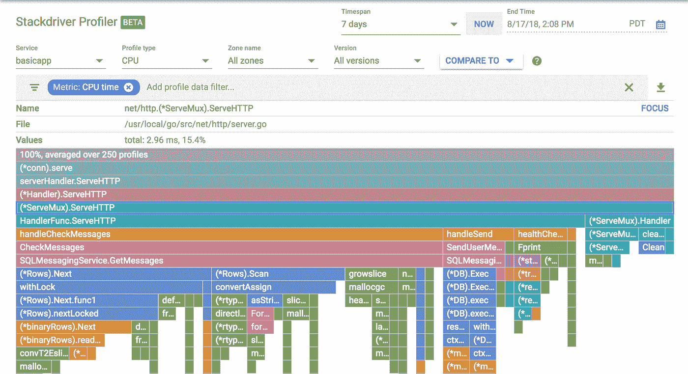
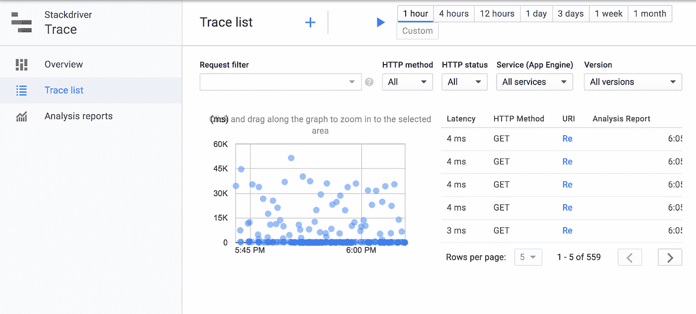

# 在 Google Cloud 上构建、测试和优化代码

> 原文：<https://medium.com/google-cloud/building-testing-and-optimizing-code-on-google-cloud-e0d7ea74f1f5?source=collection_archive---------0----------------------->

# 摘要

这篇文章解释了如何使用 Google 云平台工具，通过一个可以在本地运行的应用程序，在单元测试中，一个普通的 Docker 容器中，以及在带有自定义容器的 App Engine Flex 中，构建和测试 Go 代码。代码的构建、测试和部署由云构建驱动。示例代码是一个基本但重要的应用程序，名为 [devflowapp](https://github.com/GoogleCloudPlatform/golang-samples/tree/master/getting-started/devflowapp) ，在结构上类似于现实世界的 web 应用程序，可以作为您项目的模板。该应用展示了代码优化工具 Cloud Trace、OpenCensus 和 Cloud Profiler。

# 背景

谷歌[云构建](https://cloud.google.com/cloud-build/docs/)是一个多语言集成工具，用于在[谷歌云平台](https://cloud.google.com/)上运行构建和测试。我经常发现自己收集命令来测试、构建、打包和部署日常开发工作的代码。云构建的好处在于，你可以将这些命令格式化成[构建配置文件](https://cloud.google.com/cloud-build/docs/build-config)，这些文件比一长串命令更容易重新运行，更好地与他人共享。这个简单但不平凡的应用程序提供了一个方便的跟踪和分析平台，这对于任何优化成本和提供良好用户体验的应用程序来说都是必不可少的。

关于 [App Engine Flex](https://cloud.google.com/appengine/docs/flexible/) 的一个好处是，它允许您运行常规代码，而没有任何将您与 App Engine 联系在一起的导入。App Engine Standard 一直在减少依赖性，但在撰写本文时还没有完全摆脱依赖性。Flex 中的最小依赖性使您能够利用 App Engine 在统一环境中方便地运行，然后在需要时将代码移动到其他地方。

# 云项目设置

GitHub 示例 [README](https://github.com/GoogleCloudPlatform/golang-samples/tree/master/getting-started/devflowapp) 文件中描述了运行该应用程序的先决条件。要执行分析和跟踪，您还需要启用 Stackdriver 分析 API 和 Stackdriver 跟踪 API。

# 项目目录布局

项目目录布局是开始一个新项目时首先要考虑的因素之一。一个可能的选择是围棋项目[的布局建议](https://github.com/golang-standards/project-layout)的建议。请注意，这不是一个标准，也不一定有围绕它的社区。本例中的项目布局如下

```
/build
```

云构建配置文件

```
/data
```

数据库配置文件

```
/deployment
```

部署工件

```
/services
```

Go 软件包目录

如果您在自己的工作空间中尝试这样做，您可以使用 git clone 命令获得代码，并将目录更改为`devflowapp`。

```
git clone [https://github.com/GoogleCloudPlatform/golang-samples.git](https://github.com/GoogleCloudPlatform/golang-samples.git) cd go/src/github.com/GoogleCloudPlatform/golang-samples/getting-started/devflowapp
```

# 当地发展环境

按照[自述文件](https://github.com/GoogleCloudPlatform/golang-samples/tree/master/getting-started/devflowapp)中的步骤，在本地开发环境中运行和单元测试应用程序。其中的说明包括使用云 SQL 为应用程序建立一个 MySQL 数据库。如果您使用的不是 SQL 数据库，您可以编写自己的 [MessageService](https://github.com/GoogleCloudPlatform/golang-samples/blob/master/getting-started/devflowapp/services/services.go#L17) 接口实现。一个真正的消息应用程序需要一个存储系统和一个通知服务。通知服务可能是用于 web 和移动应用程序通知的 [Firebase Cloud Messaging](https://firebase.google.com/docs/cloud-messaging/) 。

# 包装在码头集装箱中

自述文件还描述了将应用程序打包到 Docker 容器中。此活动可以在开发环境之外部署您的应用程序。一种选择是部署到 App Engine Flex，这在 GitHub 示例中有所描述。对于许多应用程序来说，App Engine 是在互联网上提供 web 应用程序的最简单、最具成本效益的方式。但是，使用示例中的自定义包含方法，您可以将相同的代码打包到 Kubernetes。

# 测试和性能优化

一旦您的应用程序在至少一个环境中启动并运行，接下来的步骤就是自动化端到端测试、应用一些负载并优化性能。优化性能可以分为侧重于资源使用的分析和侧重于延迟的跟踪。

# 集成和负载测试

GitHub 示例提供了一个使用 curl 和 [cb-e2etest.yaml](https://github.com/GoogleCloudPlatform/golang-samples/blob/master/getting-started/devflowapp/build/cb-e2etest.yaml) 进行集成测试的例子。有了在 App Engine Flex 上运行的应用程序版本，我们就可以很好地使用命令来运行它。

```
gcloud builds submit — config build/cb-e2etest.yaml .
```

Curl 是一个很好的工具，它可以处理复杂的 HTTP 请求，适合自动化用户对网站的访问。示例构建文件使用 [curl globbing](https://ec.haxx.se/cmdline-globbing.html) 多次调用请求，以便生成足够的数据来分析应用程序。一种更复杂的集成测试方法是使用 Selenium [WebDriver](https://www.seleniumhq.org/docs/03_webdriver.jsp) 这样的工具。

# 压型

现在，我们已经在应用程序上生成了一些负载，我们可以看看性能配置文件。您可以使用 [Stackdriver Profiler](https://cloud.google.com/profiler/docs/) 来分析代码，以确定可以优化的区域。这里的步骤改编自页面[仿形 Go 代码](https://cloud.google.com/profiler/docs/profiling-go)。

如果尚未启用 Stackdriver Profiler API，可以使用以下命令:

```
gcloud services enable cloudprofiler.googleapis.com
```

要启用 Stackdriver Profiler，您需要向 [devflowapp.go](https://github.com/GoogleCloudPlatform/golang-samples/blob/master/getting-started/devflowapp/devflowapp.go) 示例中添加一些代码。该代码在[本要点](https://gist.github.com/alexamies/b6fd7e236d0fb45c8854ac444b0f4fed)中提供。您可能需要在 docker 文件中使用 Go 1.10 来构建它，因为依赖关系发生了一些变化。然后使用以下命令重新部署到 App Engine Flex

```
DB_PASSWORD=[user db password]
gcloud builds submit \
  --substitutions=_DB_PASSWORD=$DB_PASSWORD \
  --config build/cb-deploy.yaml .
```

如上所述，运行集成测试，我们可以在云控制台中查看 profline。截图如下。



**basic app 的 CPU 配置文件截图**

在从`main()`向下钻取到`ServeHTTP`之后，可以看到`handleCheckMessages`方法消耗了相当多的时间。这是因为对检索的消息数量没有限制。如果您运行端到端测试，manny 消息将被插入数据库足够多的次数，导致用于检索消息的资源大幅增长。

# 描摹

[Stackdriver Cloud Trace](https://cloud.google.com/trace/docs/) 是一个分布式的跟踪系统，包括跟踪数据的管理和展现。您的应用程序可以使用 [OpenCensus](https://opencensus.io/) 进行跟踪数据收集，这是一个用于监控和跟踪指标收集的开源框架。除了 Stackdriver 之外，OpenCensus 收集的跟踪数据可以通过其他后端进行管理和查看。[要点](https://gist.github.com/alexamies/b6fd7e236d0fb45c8854ac444b0f4fed)中的代码，包括追踪所需的代码变更，改编自[open census stack driver Codelab](https://opencensus.io/codelabs/stackdriver/)。

确保 Stackdriver Trace API 已启用，并且[启用应用程序默认凭证](https://cloud.google.com/docs/authentication/production#auth-cloud-implicit-go)进行身份验证。如果你在 App Engine 或 GKE 上运行，那么这个已经被启用了，但是你需要它用于本地开发和 GCE。

Stackdriver 跟踪的屏幕截图如下所示。



# 更大的

关于 Google 云构建的更多信息，请参见[云构建](https://cloud.google.com/cloud-build/)文档页面的记录。另请参见 [Go Bookshelf](https://github.com/GoogleCloudPlatform/golang-samples/tree/master/getting-started/bookshelf) 示例应用程序，了解使用 Go 的许多存储选项；以及[使用 Go 构建应用程序](https://cloud.google.com/appengine/docs/standard/go/building-app/)，了解使用 Go on App Engine Standard 进行 web 开发的示例。

您可能想探索的其他开发工具包括:

1.  [栈驱动云调试器](https://cloud.google.com/debugger/docs/) —用于检查正在运行的应用程序的状态
2.  [执行测试基准测试](https://golang.org/pkg/testing/#hdr-Benchmarks) —了解性能基准测试的详细信息
3.  Gometalinter——一种静态代码分析的方法
4.  [OpenMetrics](https://opensource.googleblog.com/2018/08/openmetrics-project-accepted-into-cncf.html) —度量收集标准的标准提案
5.  [谷歌云构建社区图像](https://github.com/GoogleCloudPlatform/cloud-builders-community) —社区贡献的构建者