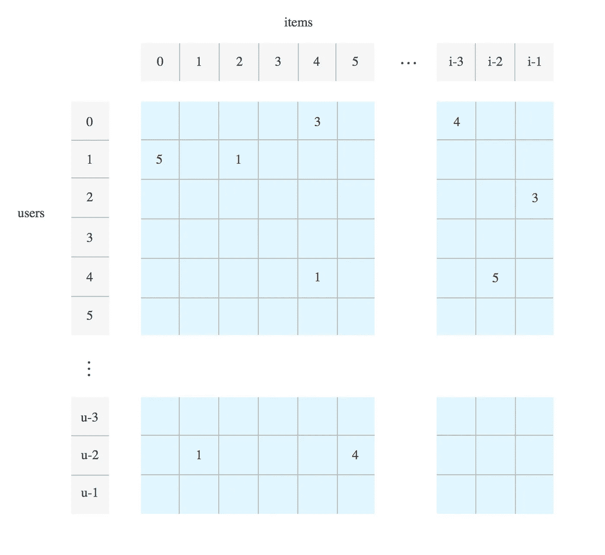
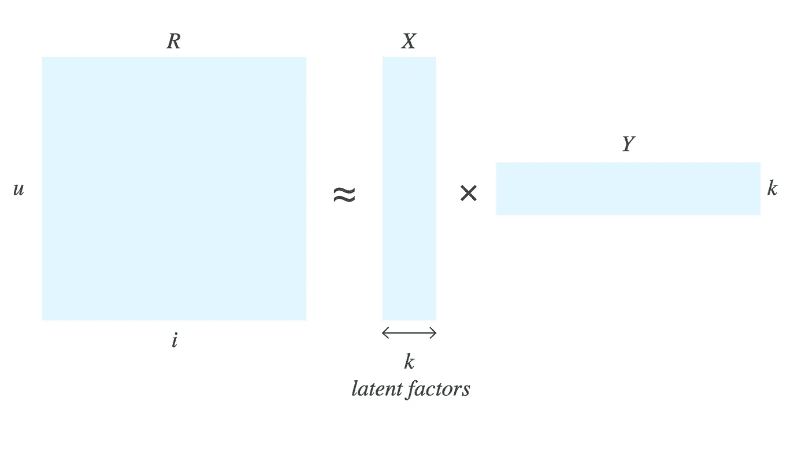

# 在 Google 云平台中构建令牌推荐器

> 原文：<https://medium.com/google-cloud/building-token-recommender-in-google-cloud-platform-1be5a54698eb?source=collection_archive---------0----------------------->

在本文中，我将指导您创建一个使用 [TensorFlow](http://tensorflow.org/) 、[云机器学习引擎](https://cloud.google.com/ml-engine/)、[云端点](https://cloud.google.com/endpoints)和[应用引擎](https://cloud.google.com/appengine)构建的 [ERC20](https://en.wikipedia.org/wiki/ERC-20) 令牌推荐系统。该解决方案基于 Google 的[教程文章。用于训练推荐系统的数据取自我们在 BigQuery](https://cloud.google.com/solutions/machine-learning/recommendation-system-tensorflow-overview) 中的[公共以太坊数据集。](https://cloud.google.com/blog/products/data-analytics/ethereum-bigquery-how-we-built-dataset)

这篇文章分为以下几个部分:

1.  推荐系统的协同过滤介绍。
2.  令牌推荐系统模型的建立和训练。
3.  优化云 ML 引擎中的超参数。
4.  将推荐系统部署到云端点和应用引擎。

## 推荐系统的协同过滤介绍

[协同过滤](https://en.wikipedia.org/wiki/Collaborative_filtering)技术是一种生成用户推荐的强大方法。协作过滤仅依靠观察到的用户行为来做出推荐，不需要配置文件数据或内容访问。

该技术基于以下观察:

*   以类似方式与项目交互的用户(例如，购买相同的令牌或查看相同的文章)共享一个或多个隐藏的偏好。
*   具有共享偏好的用户很可能以相同的方式对相同的项目做出响应。

协同过滤问题可以使用[矩阵分解](https://en.wikipedia.org/wiki/Matrix_factorization_(recommender_systems))来解决。假设您有一个由用户 id 及其与产品的交互组成的矩阵。每行对应一个唯一的用户，每列对应一个项目。项目可以是目录中的产品、物品或令牌。矩阵中的每个条目捕获用户对单个项目的评级或偏好。评级可以是明确的，直接由用户反馈生成，或者可以是隐含的，基于用户购买或与商品或代币的交互次数。



评级矩阵

矩阵分解方法假设所有项目都有一组共同的属性，不同的项目在表达这些属性的程度上有所不同。此外，矩阵分解方法假设每个用户对这些属性中的每一个都有自己的表达式，与项目无关。以这种方式，可以通过对用户对于每个属性的强度求和来近似用户的项目评级，其中每个属性由项目表达该属性的程度来加权。这些属性有时被称为隐藏的**或 T4 潜在的**因素。

要将潜在因素的存在转化为评级矩阵，您需要这样做:对于一组大小为 *u* 的用户 ***U*** 和大小为 *i* 的项目 ***I*** ，您挑选任意数量的 **k** 潜在因素，并将大矩阵 ***R*** 分解为两个小得多的矩阵 ***X 矩阵 ***X*** 有尺寸 **u** × **k** ， ***Y*** 有尺寸 **k** × **i** 。***



用行和列因子近似评定矩阵

要计算用户 *u* 对项目 *i* 的评价，您需要取两个向量的点积。损失函数可以定义为实际评级和根据潜在因素计算的评级之间的均方根误差(RMSE)。

对于我们的令牌推荐器，我们将使用用户持有特定令牌的供应百分比，作为用户评级矩阵中的隐式评级。

## 令牌推荐系统模型的建立和训练

**检查代码并安装依赖项:**

```
wget [https://repo.continuum.io/miniconda/Miniconda2-latest-MacOSX-x86_64.sh](https://repo.continuum.io/miniconda/Miniconda2-latest-MacOSX-x86_64.sh)bash Miniconda2-latest-MacOSX-x86_64.shgit clone --branch medium_article[https://github.com/blockchain-etl/token-recommender](https://github.com/blockchain-etl/token-recommender)
cd token-recommender
conda create -n token_recommender
conda install -n token_recommender --file conda.txt
source activate token_recommender
pip install -r requirements.txt
pip install tensorflow==1.4.1
```

**从 BigQuery 查询令牌评级:**

在 BigQuery 中运行以下查询，并将结果导出到 GCS 存储桶，例如`gs://your_bucket/data/token_balances.csv`

```
#standardSQL
**with** top_tokens **as** (
  **select** token_address, **count**(1) **as** transfer_count
  **from** `bigquery-public-data.crypto_ethereum.token_transfers` **as** token_transfers
  **group by** token_address
  **order by** transfer_count **desc** limit 1000
),
token_balances **as** (
    **with** double_entry_book **as** (
        **select** token_address, to_address **as** address, **cast**(**value as** float64) **as value**, block_timestamp
        **from** `bigquery-public-data.crypto_ethereum.token_transfers`
        **union all
        select** token_address, from_address **as** address, -**cast**(**value as** float64) **as value**, block_timestamp
        **from** `bigquery-public-data.crypto_ethereum.token_transfers`
    )
    **select** double_entry_book.token_address, address, **sum**(**value**) **as** balance
    **from** double_entry_book
    **join** top_tokens **on** top_tokens.token_address = double_entry_book.token_address
    **where** address != **'0x0000000000000000000000000000000000000000'
    group by** token_address, address
    **having** balance > 0
),
token_supplies **as** (
    **select** token_address, **sum**(balance) **as** supply
    **from** token_balances
    **group by** token_address
)
**select** token_balances.token_address, 
    token_balances.address **as** user_address, 
    balance/supply * 100 **as** rating
**from** token_balances
**join** token_supplies **on** token_supplies.token_address = token_balances.token_address
**where** balance/supply * 100 > 0.001
```

上面的 SQL 通过传输计数查询前 1000 个令牌，计算每个令牌的余额，并输出`(token_address, user_address, rating)`三元组。那里的等级计算为用户持有的供应的百分比。这个过滤器——`**where** balance/supply * 100 > 0.001`——防止空投出现在结果中。

**了解代码结构**

型号代码包含在`wals_ml_engine`目录中。代码的高级功能由以下文件实现:

1.  `mltrain.sh` —启动各种类型的云机器学习引擎作业。
2.  `task.py` —解析云机器学习引擎作业的参数并执行训练。
3.  `model.py` —加载数据集；从数据中创建两个稀疏矩阵，一个用于训练，一个用于测试；对评定的培训稀疏矩阵执行 WALS。
4.  `wals.py`——创造了 WALS 模式；执行 WALS 算法；计算一组行/列因子和评级矩阵的均方根误差( [RMSE](https://wikipedia.org/wiki/Root-mean-square_deviation) )。

csv 文件加载到`model.py`文件中:

```
headers = [**'token_address'**, **'user_address'**, **'rating'**]
balances_df = pd.read_csv(input_file,
                         sep=**','**,
                         names=headers,
                         header=0,
                         dtype={
                             **'token_address'**: np.str,
                             **'user_address'**: np.str,
                             **'rating'**: np.float32,
                         })
```

然后创建以下数组:

*   用户地址的数组，
*   令牌地址的数组，
*   一个三元组数组，包含从 0 开始的用户和令牌索引以及相应的评级。

然后，这些三元组被随机分为测试和训练数据集，并转换为稀疏矩阵:

```
test_set_size = len(ratings) / TEST_SET_RATIO
test_set_idx = np.random.choice(xrange(len(ratings)),
                                size=test_set_size, replace=False)
test_set_idx = sorted(test_set_idx)

*# sift ratings into train and test sets* ts_ratings = ratings[test_set_idx]
tr_ratings = np.delete(ratings, test_set_idx, axis=0)*# create training and test matrices as coo_matrix's* u_tr, i_tr, r_tr = zip(*tr_ratings)
tr_sparse = **coo_matrix**((r_tr, (u_tr, i_tr)), shape=(n_users, n_items))

u_ts, i_ts, r_ts = zip(*ts_ratings)
test_sparse = **coo_matrix**((r_ts, (u_ts, i_ts)), shape=(n_users, n_items))
```

WALS 模型是在 [wals.py](https://github.com/blockchain-etl/token-recommender/blob/medium_article/wals_ml_engine/trainer/wals.py) 的`wals_model`方法中创建的，因式分解是在同一个文件的`simple_train`方法中完成的。结果是 [numpy](http://www.numpy.org/) 格式的行和列因子。

**在本地和谷歌 ML 引擎中训练模型**

若要在本地训练模型，请运行以下命令，指定上一步中导出的 CSV 文件的路径:

```
./mltrain.sh local gs://your_bucket/data/token_balances.csv
```

输出应该如下所示:

```
INFO:tensorflow:Train Start: 2019-01-10 23:22:06
INFO:tensorflow:Train Finish: 2019-01-10 23:22:12
INFO:tensorflow:train RMSE = 0.76
INFO:tensorflow:test RMSE = 0.95
```

RMSE 对应于预测评级与测试集相比的平均误差。平均而言，该算法产生的每个评级与测试集中的实际用户评级相差不超过 0.95 个百分点。如下一节所示，WALS 算法在使用优化的超参数时表现得更好。

要在云 ML 引擎中运行它:

```
./mltrain.sh train gs://your_bucket/data/token_balances.csv
```

您可以在 GCP 控制台 **ML 引擎**部分的**作业**页面上监控作业的状态和输出。点击**日志**查看作业输出。

因子分解后，因子矩阵以 [numpy](http://www.numpy.org/) 格式保存在四个单独的文件中，因此它们可用于执行建议:

*   `user.npy` —用于将用户索引映射到用户地址的用户地址数组
*   `item.npy` —用于将令牌索引映射到令牌地址的令牌地址数组
*   `row.npy` —用户潜在因素
*   `col.npy` —代币潜在因素

本地培训时，可以在`wals_ml_engine/jobs` 目录下找到那些文件。

使用以下代码来测试这些建议:

```
**import** numpy **as** np
**from** model **import** generate_recommendations

user_address = **'0x8c373ed467f3eabefd8633b52f4e1b2df00c9fe8'** already_rated = [**'0x006bea43baa3f7a6f765f14f10a1a1b08334ef45'**,**'0x5102791ca02fc3595398400bfe0e33d7b6c82267'**,**'0x68d57c9a1c35f63e2c83ee8e49a64e9d70528d25'**,**'0xc528c28fec0a90c083328bc45f587ee215760a0f'**]
k = 5

model_dir = **'../jobs/wals_ml_local_20190107_235006'** user_map = np.load(model_dir + **"/model/user.npy"**)
item_map = np.load(model_dir + **"/model/item.npy"**)
row_factor = np.load(model_dir + **"/model/row.npy"**)
col_factor = np.load(model_dir + **"/model/col.npy"**)
user_idx = np.searchsorted(user_map, user_address)
user_rated = [np.searchsorted(item_map, i) **for** i **in** already_rated]

recommendations = generate_recommendations(user_idx, user_rated, row_factor, col_factor, k)

tokens = [item_map[i] **for** i **in** recommendations]

**print**(tokens)
```

## 在云 ML 引擎中调整超参数

您可以在这里找到超参数调整[的配置文件。](https://github.com/blockchain-etl/token-recommender/blob/master/wals_ml_engine/trainer/config/config_tune.json)

*   `latent_factors` —潜在因素的数量(最少 5 个，最多 50 个)。
*   `regularization` — L2 正则化常数(最小值:0.001，最大值:10.0)。
*   `unobs_weight` —未观察到的重量(最小值:0.001，最大值:5.0)。
*   `feature_wt_exp` —特征权重指数(最小值:0.0001，最大值:10)。
*   `num_iters` —交替最小二乘迭代的次数(最小值:10，最大值:20)

要调整超参数，首先将 mltrain.sh 中的`BUCKET`变量更改为您的 bucket。然后运行以下命令:

```
./mltrain.sh tune gs://your_bucket/data/token_balances.csv
```

可以在 Cloud ML 引擎控制台中看到调优的进度。超参数调整的结果存储在云 ML 引擎作业数据中，您可以在**作业**页面中访问该数据。工作结果包括所有汇总指标测试的最佳 RMSE 分数。

以下是我调优的最佳参数，你也可以在[库](https://github.com/blockchain-etl/token-recommender/blob/medium_article/wals_ml_engine/trainer/model.py)中找到:

*   `latent_factors` — 22
*   `regularization` — 0.12
*   `unobs_weight` — 0.001
*   `feature_wt_exp` —9.43
*   `num_iters` — 20

不过，与默认参数相比，误差稍微小一些:

```
INFO:tensorflow:train RMSE = 0.97
INFO:tensorflow:test RMSE = 0.87
```

## 将推荐系统部署到 Google App Engine

您可以在存储库中找到 Swagger 格式的 REST API 定义，用于提供令牌建议: [openapi.yaml](https://github.com/blockchain-etl/token-recommender/blob/medium_article/app/openapi.yaml) 。App Engine 的 API 实现在 [main.py](https://github.com/blockchain-etl/token-recommender/blob/medium_article/app/main.py) 文件中。

首先，准备部署 API 端点服务:

```
cd scripts
./prepare_deploy_api.sh
```

该命令的输出应该如下所示:

```
To deploy:  gcloud endpoints services deploy /var/folders/t0/y38g0z2s6jqcnwp8452j026h0000gp/T/tmp.fIelYqSh8B.yaml
```

运行提供的命令:

```
gcloud endpoints services deploy /var/folders/t0/y38g0z2s6jqcnwp8452j026h0000gp/T/tmp.fIelYqSh8B.yaml
```

创建应用程序将从中读取模型的存储桶:

```
export BUCKET=gs://recserve_$(gcloud config get-value project 2> /dev/null)
gsutil mb ${BUCKET}
```

将`token_balances.csv`文件上传到 bucket:

```
gsutil cp ../data/token_balances.csv ${BUCKET}/data/
```

训练模型并将模型文件上传到存储桶:

```
./mltrain.sh local ${BUCKET}/data/token_balances.csv \
    --use-optimized --output-dir ${BUCKET}
```

创建应用程序引擎应用程序:

```
gcloud app create --region=us-central1
gcloud app update --no-split-health-checks
```

准备部署 App Engine 应用程序:

```
./prepare_deploy_app.sh
```

将出现以下输出:

```
To deploy:  gcloud -q app deploy ../app/app_template.yaml_deploy.yaml
```

运行提供的命令:

```
gcloud -q app deploy ../app/app_template.yaml_deploy.yaml
```

应用程序部署后，您将能够查询 API:[https://$ { project _ id } . appspot . com/recommendation？user _ address = 0x8c 373 ed 467 F3 ea befd 8633 b 52 F4 E1 B2 df 00 c 9 Fe 8&num _ RECs = 5](/${project_id}.appspot.com/recommendation?user_address=0x8c373ed467f3eabefd8633b52f4e1b2df00c9fe8&num_recs=5)(用您的值替换${project_id})

```
{
    token_addresses: [
        "0x8ae4bf2c33a8e667de34b54938b0ccd03eb8cc06",
        "0x226bb599a12c826476e3a771454697ea52e9e220",
        "0xcbcc0f036ed4788f63fc0fee32873d6a7487b908",
        "0xf7b098298f7c69fc14610bf71d5e02c60792894c",
        "0xc86d054809623432210c107af2e3f619dcfbf652"
    ]
}
```

你可以在 similarcoins.com[试试这些推荐。阅读我们的文章，其中描述了我们如何评估和改进推荐系统:](https://www.similarcoins.com/)

[](https://towardsdatascience.com/machine-learning-on-ethereum-data-recommending-tokens-5a2a1c779849) [## 以太坊数据上的机器学习:推荐令牌

### Evgeny Medvedev 和 Alex Svanevik 在 D5 报道

towardsdatascience.com](https://towardsdatascience.com/machine-learning-on-ethereum-data-recommending-tokens-5a2a1c779849)