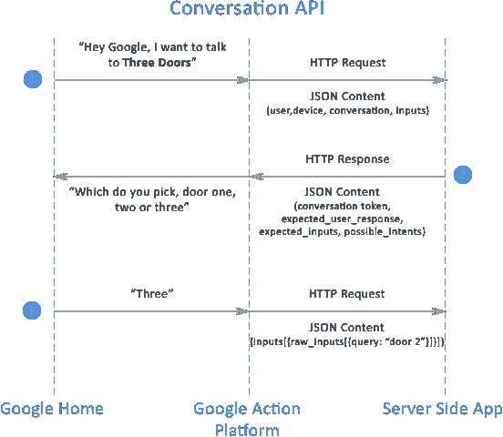

# 为 Google Home 构建您的第一个行动(30 分钟内)

> 原文：<https://medium.com/google-cloud/building-your-first-action-for-google-home-in-30-minutes-ec6c65b7bd32?source=collection_archive---------0----------------------->

# 谷歌系列开发行动概述

这是我将撰写的一系列文章中的第一篇，我们将学习如何在 Google 上开发和部署动作。动作支持 Google Home 和 Google Assistant，并允许用户通过语音或文本与您的应用程序进行交互。我们的目标是让这个过程对任何水平的开发者来说都变得有趣和简单。动作目前可以在谷歌 Home 设备上使用，也可以在谷歌 Pixel 手机上的谷歌助手应用中使用。本教程将重点介绍语音界面。

我们将开发一个简单的随机房间生成器，称为三门。如果你想现在就与它互动，并且你的谷歌之家就在附近，只需说，“**嘿，谷歌，我想与疯狂之家**通话”。

在这第一篇文章中，目标是让您在尽可能短的时间内启动并运行，以便您可以在测试模式下运行您的操作。在未来的文章中，我们将更深入地研究代码，学习如何测试和部署您的操作，并使用 API.ai 等其他工具。如果您对未来的文章有任何问题或建议，请在 twitter 上联系我 [@eisenzopf](https://twitter.com/eisenzopf) 。现在，时间紧迫，让我们开始吧。

> *注意:在本文中，我们将使用* `*gaction*` *命令行界面(CLI ),因为它更快且可脚本化。本文中使用 CLI 的每个操作在 Google 控制台中都有相应的对等物。*

# 先决条件

首先，我假设你有一些基本的技术技能，可以在 Linux 或 OS X 上工作。

要做到这一点，你只需要:

*   谷歌家庭设备
*   带有 Bash、curl、Node.js、git 和 npm(与 Node.js 捆绑在一起)的 Linux/Unix/OS X
*   Python 2.7 或更高版本
*   Java 1.7 或更高版本
*   Google Gmail 帐户(推荐但非必需)

> *如果你没有 Google Home 设备和/或 Node.js，请看下面的参考部分。如果您运行的是 Windows 10，请参见下面的参考资料部分，了解如何在您的系统上安装 Bash 和 curl。Windows 10 用户注意:在本教程中看到* `*sudo*` *时，请随时删除，因为不需要。*
> 
> *注:一旦你看完这篇文章，你的第一站应该是我的好朋友 Nandini Stocker 的* [*设计清单*](https://developers.google.com/actions/design/checklist) *，他是业界最好的语音用户界面(VUI)设计师之一。您必须遵循设计指南，以便您的谷歌行动获得批准。我们将在以后的文章中详细讨论如何部署您的应用程序。*

# 谷歌行动如何工作

不用说得太详细，Google Home 设备的工作方式是，它在 Google Action 平台上捕捉你的语音意图，并将其转换为文本。



1.  Google Action Platform 试图将意图与目录中的动作进行匹配，然后与动作端点进行匹配。作为一名开发人员，当你准备部署一个动作时，有一个谷歌注册过程，你可以在那里注册你的动作意图名称，比如**三门**。然后，Google Action Platform 知道将请求发送给什么动作。注册后，Google Action Platform 通过 HTTP POST 请求向您的服务器端应用程序发出请求，并通过 JSON 文档发送用户的输入。
2.  您的应用程序对 Node.js 或其他服务器端应用程序中的用户输入进行解码，并发回一个 JSON 响应，该响应将向用户播放内容或请求输入。在上面的例子中，我们提示用户选择一扇门。
3.  用户说**三个**，它们被发送到 Google，被翻译成文本，然后被发送到服务器端应用程序，服务器端应用程序接收输入并用另一个 JSON 文档进行响应，这可能是下一个选择或结束对话。

# 为代码创建一个目录

放在哪里并不重要，我知道这是显而易见的，但首先要为我们的代码创建一个新目录:

```
mkdir three-doors
cd three-doors
```

# 从 GitHub 克隆三门

现在您可以从 GitHub 克隆本教程的代码:

```
git clone https://github.com/eisenzopf/google-action-three-doors.git
cd google-action-three-doors
```

关键的源代码文件是:

action.json.bak、index.js、package.json 以及 json/目录中的文件

# 安装 Node.js 包

下次运行:

```
npm install
```

这将安装项目所需的所有 Node.js 包依赖项。

# 设置你的谷歌行动技能

现在我们有了一个应用程序环境设置，我们可以设置我们的环境来创建一个 Google 技能。

# Google 云设置

如果您已经有一个带付费设置的 Google cloud 帐户，您可以跳过这一步。否则，您需要访问 https://cloud.google.com/[并创建一个新账户。你可以免费建立一个试用账户，在撰写本文时，谷歌提供 300 美元的信用额度，可以使用 12 个月以上。简单。](https://cloud.google.com/)

一旦你完成设置，系统会将你带入[谷歌云控制台](https://console.cloud.google.com/)。

# 安装 gcloud CLI 并创建一个新的 Google 行动计划

现在您已经有了一个 Google Cloud 帐户，我们将在本地机器上安装名为`gcloud`的 Google Cloud CLI，并使用它来创建一个新的 Google Action 项目。

**1。**要安装 gcloud CLI，首先要安装 Google Cloud SDK。有几种不同的安装选项，都记录在[https://cloud.google.com/sdk/downloads](https://cloud.google.com/sdk/downloads)中。最简单的方法是运行以下命令:

```
curl https://sdk.cloud.google.com | bash
exec -l $SHELL
gcloud init
```

你会被问一些简单明了的问题，一旦完成，`gcloud`就可以开始了。

**2。**现在，我们将在项目目录的终端窗口中使用`gcloud` CLI 创建一个新的 Google 行动项目。运行:

```
gcloud alpha projects create three-doors-xxxx
```

> *注:用你选择的四个随机数替换* `*xxxx*` *。*

这将在您的 Google Cloud 帐户中创建一个新项目。这是一个字母命令，可能会改变。您也可以在[谷歌云控制台 GUI](https://console.cloud.google.com) 中创建一个新项目。

**3。**要确认项目已创建，运行:

```
gcloud projects list
```

除了运行`cloud init`命令时创建的默认项目之外，您还应该在列表中看到新创建的项目。

**4。**运行以下命令，将当前项目更改为已创建的项目:

```
gcloud config set project three-doors-xxxx
```

> *注:用你上面选择的四个数字替换* `*xxxx*` *。*

**5。**为项目设置计费。请访问，确保计费帐户与项目相关联

`https://console.developers.google.com/project/three-doors-xxxx/settings`其中 xxxx 是您在创建项目时选择的 4 个数字。

6。接下来，我们需要将 Google Action API 添加到项目中。这可以在 https://console.cloud.google.com[的谷歌云平台控制台上完成。](https://console.cloud.google.com)

*   在控制台上，在页面的左上角，Google Cloud Platform 徽标的右侧，您会看到两个下拉菜单。点击第二个，可能会说*我的第一个项目*
*   选择标签为**的选项查看更多项目**。
*   从`gcloud` CLI (three-doors-xxxx)中选择您刚刚创建的项目，并点击**打开**按钮。
*   在页面中间，单击标记为**的链接，转到 API 概述**。
*   该页面向您展示了哪些 Google APIs 已经启用，但是我们需要添加一个，因此单击页面顶部中间附近的 **+ENABLE API** 链接。
*   在搜索框中，键入 *Action* ，您应该会看到 **Google Actions API** 。点击它。
*   在新页面的顶部中间，点击**启用**。
*   回到搜索框，输入 *Function* ，你应该会看到**Google Cloud Functions API**。点击它。
*   在新页面的顶部中间，点击**启用**。

Google Actions API 和 Functions API 现在可以在 Google Cloud 环境中为您的新项目启用了。

**7。**最后，创建一个 Google 云存储桶来存储您的 Google 功能:

```
gsutil mb gs://three-doors-xxxx
```

> *注:将* `*xxxx*` *替换为您上面选择的四个数字。*

这将提供一个新的存储桶来在 Google Cloud 上托管您的代码。您应该能够通过运行命令`gsutil ls`看到新创建的 bucket

# 安装并初始化操作 CLI

现在是建立`gaction`环境的时候了。这是一个命令行工具，您将从部署您的`action.json`文件的终端运行。这是一个文件，一旦被谷歌发布和批准，就可以让 Android 或 iOS 上的 **Google Home** 或 **Allo** 等支持**谷歌助手**的设备访问你的**谷歌动作**应用。

**1。**首先将你的浏览器指向[https://developers.google.com/actions/tools/gactions-cli](https://developers.google.com/actions/tools/gactions-cli)并下载 gactions 命令行工具。

> *快捷方式从终端窗口，在你的项目目录下，你可以使用* `*curl*` *直接下载。*
> 
> *在 Linux 上:*
> 
> `*curl -O* [*https://dl.google.com/gactions/updates/bin/linux/amd64/gactions/gactions*](https://dl.google.com/gactions/updates/bin/linux/amd64/gactions/gactions)`
> 
> *在 Mac OS X 上:*
> 
> `*curl -O* [*https://dl.google.com/gactions/updates/bin/darwin/amd64/gactions/gactions*](https://dl.google.com/gactions/updates/bin/darwin/amd64/gactions/gactions)`

**2。**接下来将操作权限更改为可执行:

```
chmod +x gactions
```

**3。**在您的项目目录中，初始化终端窗口中的工具:

```
./gactions init
```

这将在您的项目目录中创建一个默认的`action.json`文件。现在我们需要编辑它。

# 编辑 action.json

在你最喜欢的编辑器中打开`action.json`。

将**版本表**更改为 1.0，并将**项目 Id** 更改为 three-doors-xxxx(替换为您在使用`gcloud` CLI 创建项目时使用的项目 Id)

```
{
  "versionLabel": "1.0",
  "agentInfo": {
    "languageCode": "en-US",
    "projectId": "three-doors-xxxx",
    "voiceName": "male_1"
  },
```

编辑后，它应该看起来像上面这样。

接下来我们将编辑`action.json`文件的**动作**部分，它包含了应用程序将识别的可能想法列表。每个谷歌助手`action.json`都会有一个`initialTrigger`部分。这是最先调用的动作，所以也是最重要的一个动作。

在这个用`actions init`命令创建的初始`action.json`文件中，有两个`initialTrigger`部分。这是因为可以通过多种方式调用应用程序。在我们的第一个应用程序中，我们不会担心这个问题，所以删除第二个`initialTrigger`部分。

我们的`action.json`文件的`actions`部分现在看起来应该如下所示:

```
"actions": [
    {
      "description": "Launch intent",
      "initialTrigger": {
        "intent": "assistant.intent.action.MAIN"
      },
      "httpExecution": {
        "url": "https://us-central1-three-doors-xxxx.cloudfunctions.net/three_doors"
      }
    }
  ]
```

> *注:将* `*xxxx*` *替换为您上面选择的四个数字。*

# 将您的应用部署到 Google 云功能

```
gcloud beta functions deploy three_doors --trigger-http --stage-bucket gs://three-doors-xxxx
```

> *注:将* `*xxxx*` *替换为您上面选择的四个数字。*

这将把您的 Google 函数部署到 Google Cloud 中，该函数包含在`index.js`源文件中(我们将在下一次讨论)。如果这是您第一次部署应用程序，这将需要一些时间；多达 5 分钟。不要担心，更新不需要那么长时间，所以不需要管理自己的服务器是值得等待的。

# 部署您的 action.json 测试文件

接下来，是时候部署您的操作文件(action.json)了。使用下面的命令。如果这是第一次运行该命令，您可能会看到输入安全令牌的说明。

```
./gactions preview --action_package action.json --invocation_name "three doors" --preview_mins 1234
```

运行上面的`gactions`命令会暂时打开你的新动作。只有你能测试它。这允许您在命令行或 web 模拟器中或者在您的 Google Home 设备上测试应用程序。您用来设置云项目的 google 电子邮件必须是管理您的 Google Home 设备的同一个帐户。

# 测试您的行动

```
./gactions simulate
```

在模拟器中，键入:

```
talk to three doors
```

这应该会启动对话。

当您运行该命令时，还有一个选项可以启动一个基于 web 的模拟器来播放音频。可能会提示您在 google gmail 帐户上启用音频。

# 恭喜你！

您刚刚在 Google 上设置并部署了您的第一个操作。我在下面列出了一些参考资料。在本系列的下一篇文章中，我们将查看代码并更多地理解它是如何工作的。

如果你觉得这篇文章有用，请分享，或者在 twitter @eisenzopf 上给我发消息

# 参考

*   [安装 Node.js](https://nodejs.org/en/download/package-manager/)
*   [使用谷歌动作模拟器](https://developers.google.com/actions/tools/testing)
*   [Nandini Stocker 的设计清单](https://developers.google.com/actions/design/checklist)
*   [在 Windows 10 上安装 bash](http://www.windowscentral.com/how-install-bash-shell-command-line-windows-10)或者[安装 Cygwin](https://cygwin.com/install.html) 哪个我个人更喜欢
*   [在 Windows 10 上安装 curl](https://curl.haxx.se/download.html)
*   [创建谷歌行动包](https://developers.google.com/actions/develop/sdk/actions#creating_an_action_package)
*   [谷歌应用编程接口管理器](https://console.developers.google.com/projectselector/apis/api/actions.googleapis.com/overview)
*   [谷歌 API 仪表盘](https://console.developers.google.com/apis/dashboard)
*   [部署谷歌行动](https://developers.google.com/actions/distribute/deploy)
*   [开始使用 Google Action SDK](https://developers.google.com/actions/develop/sdk/getting-started)
*   [谷歌行动对话 JSON API](https://developers.google.com/actions/reference/conversation)
*   [将谷歌动作部署到应用引擎](https://developers.google.com/actions/samples/)
*   [编写谷歌云 HTTP 函数](https://cloud.google.com/functions/docs/writing/http)
*   【RegExr.com Regex