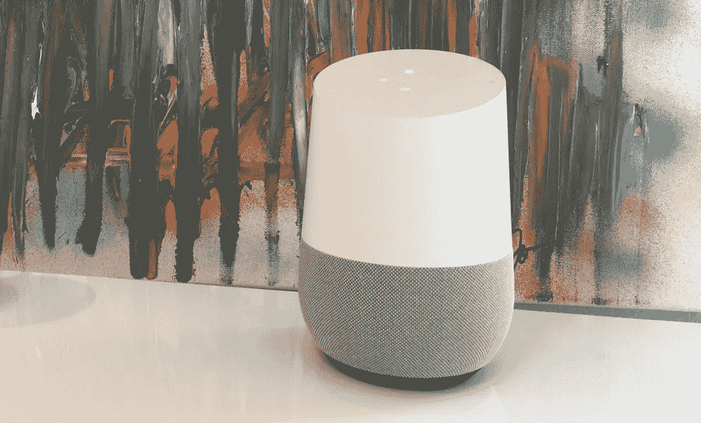
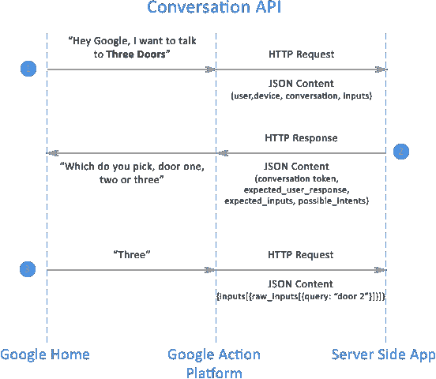

# 为 Google Home 构建您的第一个动作(第 2 部分)

> 原文：<https://medium.com/google-cloud/building-your-first-action-for-google-home-part-2-594888a8c09b?source=collection_archive---------0----------------------->

在第一篇文章中，我们在 Google Cloud 上设置了一个环境，使用 Google Cloud 函数在 Google 上部署了我们的第一个动作，并使用文本或 web 模拟器或 Google Home 设备对其进行了测试。你能让示例应用程序与模拟器一起工作吗？如果是这样，恭喜你，这是最困难的部分；暂时如此。如果没有，请在 Twitter 上给我发消息，我很乐意帮助你让它运行起来。

> 你看过[南迪尼斯托克](https://medium.com/u/a8c4b9a13374?source=post_page-----594888a8c09b--------------------------------)的[设计清单](https://developers.google.com/actions/design/checklist)吗？如果没有，请在继续之前完成。在这一系列文章中，我们将继续讨论设计最佳实践。

在本文中，我们将快速浏览一下代码，更好地理解它是如何工作的。然后，我将更详细地向您介绍 JSON 响应。

要了解生产中的应用，比如说，

> **“嘿谷歌，我想和疯人院谈谈”**。

好吧，很可爱对吧？这是一个随机的房间生成器，有三扇门可供选择。这是一个非常基本的应用程序，有点娱乐性。我们将把它用于学习目的，但是要知道它缺乏在 Google 上创建一个伟大的行动所需的对话式交互和用户参与。

为 Google 编写一个动作有几种不同的方法:

1.  使用 HTTP POST/JSON RESTful API 滚动您自己的代码
2.  使用用 Javascript 编写的 Google Actions SDK for node . js
3.  用 API 写一个 app。人工智能工具
4.  使用支持谷歌操作的第三方工具

我们在为 Google Home 构建第一个动作的[第 1 部分中部署的代码基于第一种方法。](/google-cloud/building-your-first-action-for-google-home-in-30-minutes-ec6c65b7bd32)

> 如果你还没有下载代码，你可以从[https://github.com/eisenzopf/google-action-three-doors](https://github.com/eisenzopf/google-action-three-doors)下载或者直接运行:
> 
> `git [https://github.com/eisenzopf/google-action-three-doors.git](https://github.com/eisenzopf/google-action-three-doors.git)`

作为回顾，我们在第 1 部分看到了一个序列图，展示了 Google Home 设备和我们的 Google Cloud Function (Node.js)应用程序之间的 HTTP/JSON 交互。让我们再看一遍。

对话 API 序列图

你是否看到上面的 Google Home 设备在步骤 1 中获取用户话语，“嘿，Google…”然后看到 Google Action Platform 如何将其传递给我们的 Google Cloud 功能，然后在步骤 2 中我们如何传回一个问题，用户如何选择一扇门？我们现在来看看代码，看看它是如何工作的。

如果你曾经与这个应用程序交互过，你可能会惊讶地发现这个应用程序只有不到 50 行代码(准确地说是 39 行)。出于学习目的，我保持了代码的简洁，所以请注意，Google 上真正的产品级操作需要有更强大的对话能力。

# index.js 源代码的快速摘要

现在来看代码(包含在 index.js 中)。花点时间通读一下。在整篇文章中，我们将通过行号引用它。

下面是对每个代码块的简要描述:

*   **第 4–11 行**加载默认的对话 API JSON 响应以及我们将用来为用户创建提示的内容。我已经将内容分为房间(不同的房间描述)、对象(存在于房间中)、问候(我们在应用程序开始时播放的其中一个)、nomatch(我们用于对话修复)、pickDoor(要求用户选择门的不同措辞)和 doors(描述用户开门时发生的事情的不同短语)。
*   **第 12 行**加载 [lodash](https://github.com/lodash/lodash) 库，该库包含一组很棒的文本实用函数。
*   **第 14–16 行**导出我们的`three_doors`函数，这就是我们如何为 Google Cloud Functions 平台封装东西。注意，应用程序类型必须设置为`application/json`，我们需要在 HTTP 响应头中将`Google-Assistant-API-Version`设置为`v1`。你可以在[https://cloud.google.com/functions/docs/writing/](https://cloud.google.com/functions/docs/writing/)找到更多关于如何创建谷歌云功能的文档
*   **第 18 行**创建对来自 Google Home 设备的包含用户输入字符串的 HTTP JSON 请求部分的引用。这样做只是为了方便。您可以在以下位置查看 JSON 请求的完整示例:[https://developers . Google . com/actions/reference/conversation # request](https://developers.google.com/actions/reference/conversation#request)
*   **第 20–23 行**检查`req.body.conversation.type`的值，它是 HTTP JSON 请求的元素，告诉我们这是否是该用户会话对应用程序的第一次调用。如果是 **1** (这意味着这是该会话的第一次调用)，我们将创建一个提示，该提示将通过文本到语音的方式向用户播放，它由一个串联的字符串组成，该字符串使用`lodash` `sample()`函数从`greetings`、`doors`、`rooms`、`objects`和`pickDoor` JSON 对象中选取一个随机值。如果是 **2** ，这意味着这是该用户会话的后续调用。
*   **如果用户说出任何包含单词 **stop** 的内容，则第 25–26 行**匹配。因此，它将发送回`action_final_response` JSON，从而结束会话。
*   **第 28–31 行**这是一个棘手的问题，因为 NLP 部分会很快变得困难。这是当应用程序要求用户选择门时处理用户输入的代码。为了简洁起见，我使用了一个正则表达式来匹配用户可能选择门的各种方式(1–3)。这个正则表达式并不完美，在某些情况下可能不是正确的 NLP 方法，但是，您可以在我保存我的会话的[http://regexr.com/3fjd6](http://regexr.com/3fjd6)使用它，看看它匹配什么，您可以进一步优化它以更好地匹配输入并消除误报。请把你的改进发给我。如果有匹配，这意味着用户(可能)选择了三扇门中的一扇门，我们在第 **30** 行随机生成另一个房间。
*   **第 33–37 行**处理这种情况:不是第一次调用应用程序，用户的输入与门不匹配，他们没有说**停止**。这意味着他们说了些别的。鉴于这是一个示例应用程序，我们不会像往常一样尝试高级会话修复；相反，我们将从`nomatch` JSON 文件中选择一个随机提示，并再次要求他们选择一扇门。只是在这里再次强调，这是糟糕的设计实践；如果你在野外这么做，你的用户会惩罚你。
*   **第 38 行**将 HTTP 响应码设置为 200，告知客户端请求成功。这也终结了谷歌云功能代码块。

就这样，这就是代码。这给了你一个基本的开始来玩和扩展。我们将在下一篇文章中深入探讨调试和测试。本文的其余部分提供了对 JSON 响应文件的进一步解释，以帮助您更好地理解 Google Conversation API 上的操作是如何工作的。

# 常量声明(第 4–12 行)

## 常量操作 _ 最终 _ 响应

第一个常量`action_final_response` 加载一个 JSON 文件，如果用户说了一些带有单词 **stop** 的话，作为他们对输入提示的响应的一部分，该文件由应用程序返回。例如，当游戏要求我选择一扇门时，我可能会说*“我想我要* ***停止*** *玩这个游戏”*作为我的回应。

> 有关 JSON 请求(Google Home 发送给我们的应用程序的内容)和响应格式(我们的应用程序发送回 Google Home 的内容)的完整描述，请参见[https://developers . Google . com/actions/reference/conversation # request](https://developers.google.com/actions/reference/conversation#request)

`action-final-response.json`文件的内容如下:

以上是当用户说 **stop** 并符合 Google Conversation API 上的动作时，我们发送回 Google Home 设备的 JSON 响应。在 index.js 的第 25–26 行中，您会找到在`userInput`上执行正则表达式`match()`函数并将`action_final_response`写入 Google Cloud functions `res`对象的代码，该函数编写我们的 HTTP JSON 响应。我们使用`res.json`函数显式地将`action_final_response`对象转换成 JSON 格式(即使它已经是 JSON)。

## 常量操作 _ 响应

`**action_response**` 常量加载一个带有通用对话 API JSON 响应的 JSON 文件，我们将为向用户回放的每个提示重载和定制该响应。

> 有关 JSON 响应格式的更多详细信息，请参考[https://developers . Google . com/actions/reference/conversation # http-response](https://developers.google.com/actions/reference/conversation#http-response)。

`action-response.json`文件的内容如下:

以下是该文件重要部分的摘要:

*   **第 2 行** `conversation_token`是你控制的一个状态变量。客户端将在下一个请求中传回您分配的任何内容。您可以使用它来跟踪用户在对话流中的位置。然而，我们并没有在这个例子中使用它。
*   **第 3 行** `expected_user_response`可以设置为**真**或**假**。将它设置为 **true** 意味着应用程序将期待(并且 Google Home 将收集)用户输入。
*   **第 8–11 行**包含收集输入前将向用户播放的提示。
*   **第 13–23 行**包含(最多)3 个无提示。当 5 秒钟后没有收到用户的输入时，播放这些内容。
*   **第 25–29 行**告诉客户我们将等待客户的文本。我们将在以后的文章中讨论其他选项。

这就结束了我们创建 Google 的第一个动作系列的第 2 部分。在第 3 部分中，我们将看看可以用来快速调试应用程序的工具。

请随时提出问题、编辑或对未来主题的要求。只要在推特上给乔纳森·艾森佐夫发个消息就行了。如果你喜欢这篇文章，请把它变成你的最爱，并与你的朋友分享。