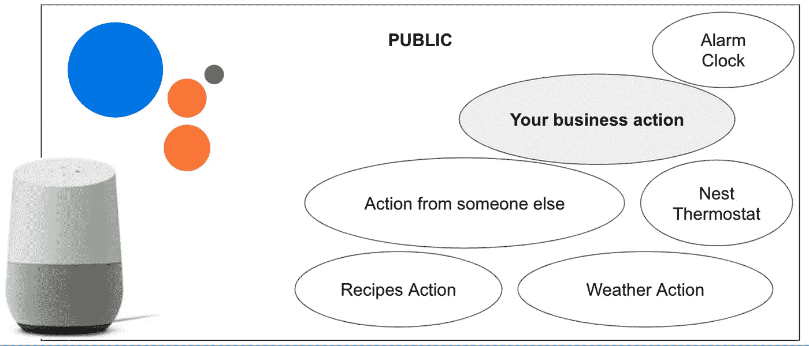
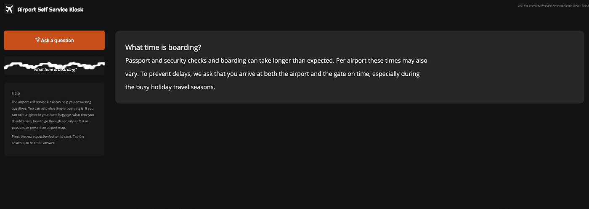
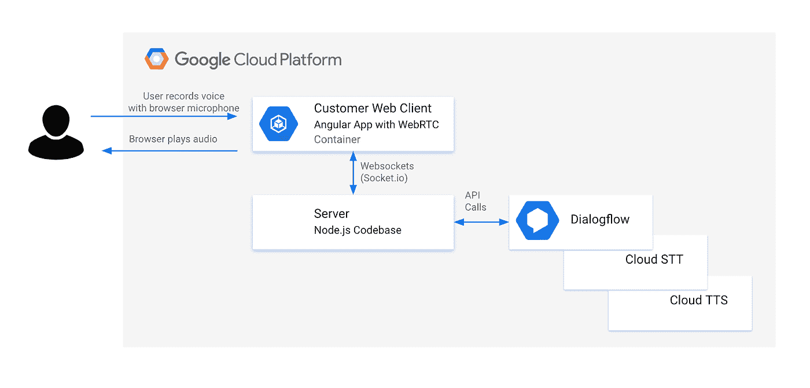

# 在 web 应用程序中使用 Dialogflow &语音转文本构建您自己的对话式语音人工智能。(第一部分)

> 原文：<https://medium.com/google-cloud/building-your-own-conversational-voice-ai-with-dialogflow-speech-to-text-in-web-apps-part-i-b92770bd8b47?source=collection_archive---------0----------------------->

# **将音频从浏览器麦克风流式传输到 Dialogflow 的最佳实践&谷歌云语音转文本。**

这是该系列的第一篇博客:

**将音频从浏览器麦克风流式传输到 Dialogflow 的最佳实践&谷歌云语音转文本。**

在第一篇博客中，我将阐述为什么客户会集成他们自己的对话式人工智能，而不是为谷歌助手构建。我将介绍 Google Cloud 中所有的对话式人工智能组件，以及每个组件的用途。

在这个博客系列的后面，我将向您展示如何在您的 web 应用程序中集成 HTML5 麦克风。如何将音频流传送到(Node.js)后端。如何使用 Dialogflow API 进行音频流？如何使用语音 API？最后，如何将音频(文本到语音)返回给客户端，以便在浏览器中播放。

这些博客包含[简单的代码片段](https://github.com/dialogflow/selfservicekiosk-audio-streaming/tree/master/examples)，以及一个演示应用程序；[机场自助服务亭](https://github.com/dialogflow/selfservicekiosk-audio-streaming/)，将用作参考架构。

# 谷歌助手与定制对话式人工智能

**我经常与客户交流，他们希望将谷歌助手纳入他们的商务网络应用。除非你是做电视机顶盒或者耳机的厂商，我总是回答；**

**“这真的是你想要的吗？或者你的意思是你想用对话式人工智能来扩展你自己的应用程序？”**

***——“呃？”***

**如果你有以下一个或多个需求，你可能想直接使用 Google Cloud Speech 和 Dialogflow APIs，而不是** [**将你的语音 AI 打包成谷歌助手**](https://developers.google.com/assistant) **或** [**中的一个动作，在你的应用**](https://developers.google.com/assistant/sdk/overview) **中包装谷歌助手。**

*   **该应用程序不应公开。**
*   **这个应用不需要在谷歌助手/ Nest Home 上可用。**
*   你不会想用唤醒词来启动你的应用程序:“嘿，谷歌，跟我的应用程序说话”。
*   **应用不需要回答原生的谷歌助手问题，比如:“阿姆斯特丹的天气如何”。**
*   **应用只能利用谷歌云条款&条件，而不能与谷歌助手的消费者条款&条件结合使用。**

**确信你想通过集成语音人工智能功能来扩展你自己的(移动)网络应用？这是最终的开发者指南，关于实现从 web 应用到 Google Cloud Speech 和 Dialogflow 的语音流。**

# 对话流与文本到语音的 API 与语音到文本的 API

**Dialogflow** 是一款人工智能工具，用于构建基于文本和语音的对话界面，如聊天机器人和语音应用。它使用自然语言理解等机器学习模型来检测对话的意图。

对话流意图检测的工作方式是，它首先尝试理解用户话语。然后，它将根据训练短语检查包含意图(或聊天流)的 Dialogflow 代理。具有最佳匹配(最高置信度得分)的意图将返回答案，该答案可以是文本响应，也可以是通过履行从系统得到的响应。

尽管我们中的许多人会使用 Dialogflow 进行文本输入，但对于网络或社交媒体聊天机器人来说，它也可以将你的声音作为音频输入进行意图匹配，甚至可以将口语文本(TTS)作为音频结果返回。

Dialogflow 语音检测和输出将与云语音到文本 API (STT)和云文本到语音(TTS)有一些重叠。就连 API 调用看起来都差不多！然而，这些服务是不同的，它们被用在不同的用例中。

**语音转文本(STT)** 将口语文字转录为书面文本。当你想在视频中生成字幕，从会议中生成文字记录等时，这是非常有用的。你也可以将它与 Dialogflow 聊天机器人(从文本转录中检测意图)结合起来，合成聊天机器人的答案，但是 STT 不像 Dialogflow 那样进行意图检测。STT 是非常强大的，因为 API 调用响应将返回具有最高置信度得分的书面抄本，并且它将返回具有可选抄本选项的数组。

使用**文本到语音(TTS)** ，您可以发送文本或 SSML(带语音标记的文本)输入，它将返回音频字节，您可以使用这些字节创建 mp3 文件或直接传输到音频播放器(在您的浏览器中)。

与**谷歌助手**相比，通过使用上述工具手动扩展带有对话式人工智能的应用，你不再是谷歌助手生态系统的一部分。如果你正在构建消费者或活动应用(语音操作)，这个生态系统很好，每个人都可以通过调用它来找到它。但是当你是一个企业时，整个生态系统可能会被过度破坏。

对谷歌生态系统的行动

对于一个希望在自己的应用程序中集成语音人工智能的企业来说，完整的谷歌助手生态系统可能有点矫枉过正。

# 谷歌云联络中心人工智能

还有另一个谷歌解决方案，叫做**谷歌云联络中心 AI** (CCAI)。

该解决方案适用于希望在现有电话联络中心(IVR)中部署语音 AI 的企业。Dialogflow 和 Cloud Speech APIs 是由电话合作伙伴(如 Genesys、Avaya、Cisco 等)开发的架构中的关键部分。)由于联络中心 AI 是一个开箱即用的解决方案，你不需要自己实现这些 API。

# 关于演示应用程序；机场自助服务亭

现在，您已经知道了所有对话式 GCP 组件之间的差异，让我们看看如何在端到端 web 应用程序中实现这些组件。对于本指南，我将使用一个演示应用程序，这是一个机场的自助服务亭。(自助服务亭在零售或金融行业也很常见。)

你可以问自助服务亭；如果可以在你的手提包里带一个打火机，或者什么时候登机。结果会显示在屏幕上，还会大声说出来:

这是我的演示应用的截图:机场自助服务亭

让我向您展示将音频从麦克风通过浏览器流式传输到 Dialogflow，然后通过扬声器输出的最佳实践。

所有代码都可以在 Github 上找到:[https://Github . com/dialog flow/self service kiosk-audio-streaming](https://github.com/dialogflow/selfservicekiosk-audio-streaming)

最终的解决方案已经部署了 App Engine Flex:【http://selfservicedesk.appspot.com 

构建演示应用程序需要以下工具:

*   NodeJS
*   Dialogflow 客户端 SDK
*   STT Node.js 客户端 SDK
*   TTS Node.js 客户端 SDK
*   [socket . io](https://www.npmjs.com/package/socket.io)T12[socket . io-Stream](https://www.npmjs.com/package/socket.io-stream)
*   [RecordRTC](https://github.com/muaz-khan/RecordRTC)
*   AppEngine 灵活环境(支持 websockets 和 HTTPS)

# 体系结构

这是我一直使用的架构:

我用过的建筑。

*   客户端网站/应用程序。出于演示的目的，我将向您展示两个版本。一个简单的 HTML 页面，和一个完整的 Angular web 应用程序的例子，[比如自助服务 kiosk 演示](https://github.com/dialogflow/selfservicekiosk-audio-streaming)。它包含由 **RecordRTC** 库包装的 **getUserMedia() WebRTC** 调用，以记录来自浏览器麦克风的音频流。
*   NodeJS 服务器将提供静态内容(如 HTML 页面)并连接到 GCP 图书馆，如 Dialogflow、STT 和 TTS。
*   您也可以使用任何其他编程语言。所有 GCP 服务都有各种客户端 SDK(比如 Node.js、Java、Python、Go 等)，还有 Rest 和 GRPC 库。
*   Dialogflow 代理，包含意图、实体和 FAQ 知识库。

客户端应用程序通过 websockets 与后端服务器对话。这是构建聊天机器人或聊天应用程序时的常用方法，因为它们可以实时响应，无需刷新页面。

我使用 socket.io 框架和 socket.io 流插件，因为它很容易使用，而且我需要利用双向流。

***注:***

*我在网上看到过一些解决方案，其中麦克风直接连接到 Dialogflow，中间没有服务器。其余的调用直接在 web 客户端用 JavaScript 完成。我认为这是一种反模式。您可能会在客户端代码中公开您的服务帐户/私钥。任何熟悉 Chrome 开发工具的人都可以窃取你的密钥，并通过你的账户进行(付费)API 调用。总是让服务器处理 Google Cloud 认证是一个更好的方法。这样，服务帐户就不会暴露给公众。*

# 短话语与流

关于如何将语音集成到您的应用中，通常有两种方法。

1.  简短话语/探测意图。这意味着您的最终用户按下录音按钮，说话，当他们按下停止，我们收集音频流返回结果。在您的代码中，这意味着一旦客户端 web 应用程序收集了完整的音频记录，它就将其发送到服务器，这样服务器就可以调用 Dialogflow 或语音到文本 API。
2.  长话语流/检测流中的意图。这意味着您的最终用户按下录制按钮，说话，将看到结果的飞行。当检测意图时，这可能意味着一旦你说得更多，它将检测到更好的匹配，或者它可以收集多个结果。在您的代码中，这意味着客户端开始创建一个双向流，并将数据块传输到服务器，这样服务器就可以通过事件侦听器对传入的数据进行调用，因此它是实时的。
3.  当存在意图匹配时，我们可以通过显示文本在屏幕上显示结果，或者我们可以通过将音频缓冲流回客户端来合成(读出)结果，这将通过 WebRTC AudioBufferSourceNode(或音频播放器)播放。

请继续关注我的下一篇博客。在这篇博客中，我将首先构建一个客户端 web 应用程序，该应用程序使用 HTML5 麦克风和 WebRTC，将音频字节流传输到 Node.js 后端。