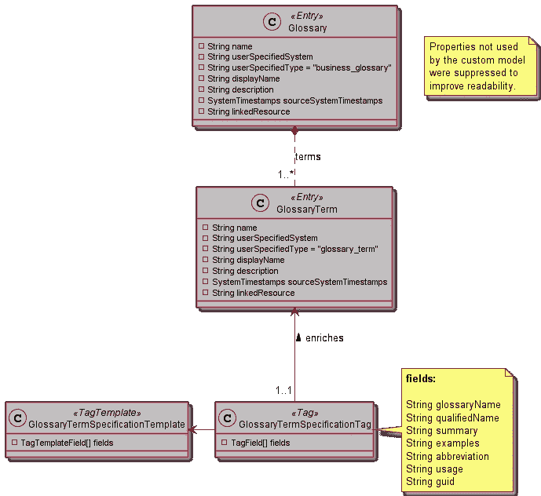
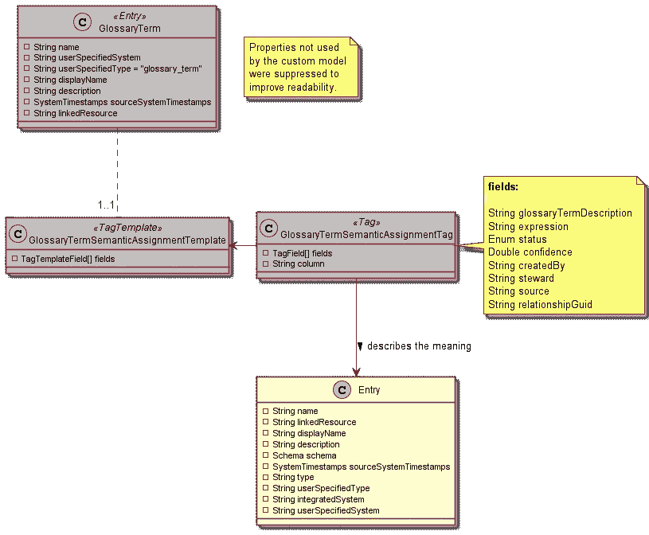
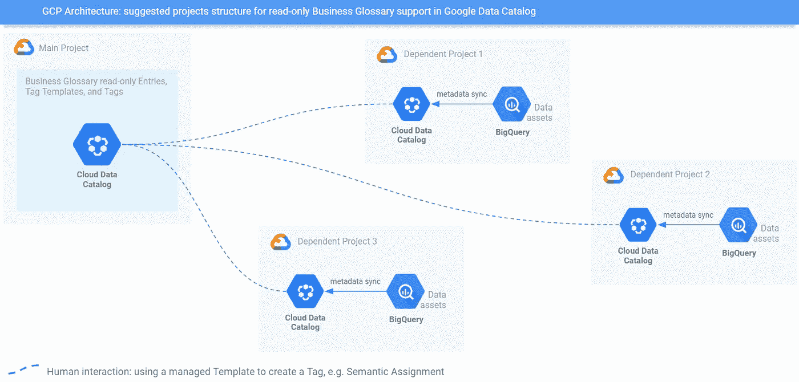
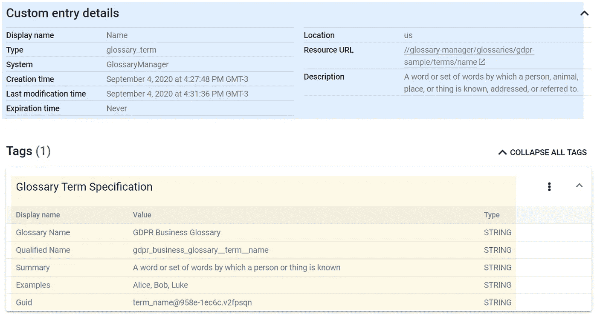
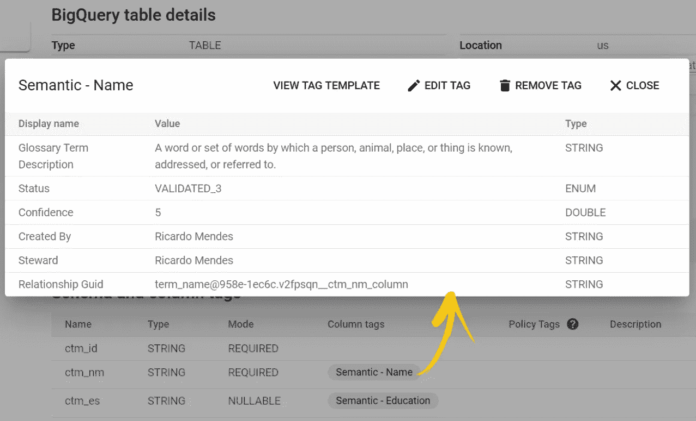

# Google 数据目录中的业务术语表支持

> 原文：<https://medium.com/google-cloud/business-glossary-support-in-google-data-catalog-eb243414aa6f?source=collection_archive---------0----------------------->

## 定制模型

每天都有越来越多的公司将其数据工作负载迁移到云中。与此同时，新的数据保护监管计划在全球范围内开始生效。这种同时发生的事件导致公司**实施**他们的**数据治理标准**，以避免因不适当的数据管理而导致的法律指控。

因此，数据治理框架变得越来越普遍，但提供商不一定说同一种语言——这是我们任何人都可以预料到的，因为每个参与者都有自己解决问题的策略……另一方面，客户有不同的需求，单个平台无法满足这些需求。这给市场带来了新的东西:需要集成补充工具，以构建更强大的数据治理生态系统。

**元数据管理**是数据治理框架的常见构建块，所谓的**业务术语表**组件帮助我提出了上一段中描述的场景的清晰示例。

> 业务术语表不同于数据字典，因为它的焦点——数据治理——超越了数据仓库或数据库。业务术语表是在组织内部共享内部词汇的一种方式。大多数业务术语表都有一些共同的特征，比如标准数据定义和文档；清晰的定义以及对例外、同义词或变体的解释。
> 
> [—数据多样性](https://www.dataversity.net/what-is-a-business-glossary/)

除其他原因外，公司使用它来:

*   理解核心业务概念和术语。
*   [强调词汇](http://www.dataversity.net/business-glossary-basics/)在不同业务职能中的不同。
*   增加对公司数据的信任。
*   降低由于对业务概念的不一致理解而导致数据被误用的风险。

虽然是诸如[亚历克斯](https://alexsolutions.com.au/)、[阿塔克卡马](https://www.ataccama.com/product/metadata-management-and-data-catalog)、 [IGC](https://www.ibm.com/products/information-governance-catalog) 和 [Informatica](https://docs.informatica.com/data-quality-and-governance/data-quality/10-4-0/business-glossary-getting-started-guide/getting-started-overview/business-glossary-overview.html) 等产品的一等公民，但它不是谷歌云的数据目录的一部分，谷歌云更专注于简化任何规模的**数据发现**。

有人可能想知道数据目录标签是否解决了描述和分类数据资产的问题。我同意，他们有。那么，我们为什么需要术语表呢？因为词汇表不仅仅是这个。让我用两个额外的特性来阐明:(1)为了更好的用户体验，它的资源通常以基于类别的层次结构来组织；以及(2)术语表术语之间存在特定的关系，这可以产生协作构建的知识，例如同义词列表。数据目录本身不支持这些功能。

那么，如果一家对 Google 数据目录感兴趣的公司将业务术语表支持作为一项强制要求会怎么样呢？是堵的问题吗？一点也不！Data Catalog 灵活的实体模型加上细粒度的 IAM 角色为那些想要在 Google Data Catalog 上构建基本业务术语表支持的人提供了帮助。这是我将在接下来的章节中讨论的内容。

**免责声明:所有表达的观点都是我自己的，不代表除我之外的任何人……它们来自于我是 Google Data Catalog 和 Egeria 的早期用户的经历。**

# 基于 Egeria 的定制模型

有多个业务术语表提供者，每个都有自己专有的实体模型。这里 [**Egeria**](https://egeria.odpi.org/) 登场:它是一个**开放元数据和治理**项目，促进工具和平台之间的元数据交换。

Egeria 的元数据类型是开放的，这就是为什么我要用它们作为参考来解释 Google 数据目录中的自定义模型。但是，无论如何，即使术语表元数据来自其他来源，该模型也应该是可适应的/可扩展的，以适应现实生活的需求— *希望我的推理足够好，能让您明白这一点:)*。

[开放元数据类型被组织在 7 个区域](https://egeria.odpi.org/open-metadata-publication/website/open-metadata-types/)，即[区域 3](https://egeria.odpi.org/open-metadata-publication/website/open-metadata-types/Area-3-models.html) 中覆盖的**词汇和语义**。

除了提供开放的元数据类型，Egeria 实际上还是一个企业元数据“代理”。虽然可以通过 [*【开放连接器框架(OCF)*](https://egeria.odpi.org/open-metadata-implementation/frameworks/open-connector-framework/) *连接 Egeria 和数据目录，但这超出了本文的范围。这里的重点是为数据目录中的业务术语表支持设计一个定制模型，简单地利用 Egeria 类型作为参考。*

## 将实体和关系映射到条目、模板和标签

Egeria 有一组广泛的类来完整地表示业务术语表，不管它来自什么工具。为了清楚起见，我将保持示例模型简洁而实用，以描述介绍性的开放元数据实体和关系如何映射到数据目录[定制条目](https://cloud.google.com/data-catalog/docs/how-to/custom-entries)，模板和[标签](https://cloud.google.com/data-catalog/docs/concepts/overview#tags)。将实体从一端映射到另一端通常是工作中最困难的部分，扩展模型就是在下面的集合中添加新的类。

让我将 Egeria 中的 [**词汇表**](https://egeria.odpi.org/open-metadata-publication/website/open-metadata-types/0310-Glossary-Model.html)**[**词汇表术语**](https://egeria.odpi.org/open-metadata-publication/website/open-metadata-types/0330-Terms.html)**[**语义赋值**](https://egeria.odpi.org/open-metadata-publication/website/open-metadata-types/0370-Semantic-Assignment.html) 映射到数据目录中，首先为不熟悉 Egeria 的读者简单解释一下:****

*   ****术语表是相关语义定义的集合，在开放元数据类型系统中表示为`Glossary`实体；****
*   ****术语表中的词汇是用术语记录的。每个术语代表词汇表中短语的一个概念。一个术语，表示为`GlossaryTerm`实体，属于一个术语表；****
*   ****语义分配表示为`SemanticAssignment`关系，用于将术语分配给给定的资产(例如，BigQuery 表或列)，这意味着术语描述了该资产的含义。****

****请看看下面的图表，它们提供了建议映射的可视化演示。记住灰色类的原型是实际的数据目录类型，而类名是它们的实例引用的开放元数据类型的线索。****

## ****词汇表和词汇表术语****

****术语表本身被映射为带有`userSpecifiedType = business_glossary`的自定义条目。这里没什么特别的…****

********

******类图 1** : Egeria 词汇表和 GlossaryTem 映射为 Google 数据目录实体****

****用`userSpecifiedType = glossary_term`将术语表术语映射为自定义条目。定制条目的标准字段不足以保存所有术语表术语信息，需要在某些时候进行扩展。为了满足这一要求，我们可以利用 Data Catalog 的灵活性，并使用从名为**词汇表术语规范**的特定标记模板创建的标记，它们的字段*增加了*自定义条目元数据存储能力。每个术语表条目都应该有一个根据该模板创建的标签，用于存储从 Egeria 中底层术语表术语收集的元数据。****

****这种设计也使我们能够解决额外的功能。将术语链接到它们的父术语表，例如:**术语表术语规范标签**的`glossaryName`字段可以用来查找属于给定术语表的所有术语。另一个例子是:`guid`字段，它唯一地标识一个术语表术语，不管它存储在哪里，可以用来保持术语在 Egeria 和 Data Catalog 之间同步。****

## ****语义分配****

****其他预定义的标记模板来自每个术语表术语，以实现它们的语义分配— 1:1，这意味着如果有两个术语表术语，**客户名称**和**街道名称**，将有两个**术语表术语语义分配标记模板**，由类似`semantic_customer_name`和`semantic_street_name`的东西标识。它们用于创建表示语义分配的标签，将术语表术语链接到它们的相关资产。****

********

******类图 2**:Egeria semantic assignment 映射为 Google 数据目录实体****

****请注意从那些特定模板创建的**术语表术语语义分配标签**，用于描述普通数据目录条目或模式列的含义。****

****这种设计背后的基本原理是，在 2020 年 11 月撰写本文档时，这是一种为资产设置多个语义分配的可行方法。数据目录目前仅支持在给定资产上为每个模板附加一个标签。****

## ****支持更多功能****

****现在，您已经有了根据需要向数据目录术语表添加更多功能来增加模型的基础。您想尝试将 [**术语表类别**](https://egeria.odpi.org/open-metadata-publication/website/open-metadata-types/0320-Category-Hierarchy.html) 实体及其相关的 [**术语分类**](https://egeria.odpi.org/open-metadata-publication/website/open-metadata-types/0330-Terms.html) 关系引入数据目录作为练习吗？或者可能是与 [**同义词**](https://egeria.odpi.org/open-metadata-publication/website/open-metadata-types/0350-Related-Terms.html) 有关的东西……****

# ****需要自动化吗？****

****是的，它是！因为没有办法通过 UI 手动创建数据目录自定义条目。好消息是简单的 Python 脚本或`curl`请求就足以开始了。****

****要追求的自动化水平取决于业务需求和技术问题，尤其是在 API 可用性和事件通知机制方面。我至少见过三个层次:****

*   ****第 1 级，按需摄取:适合偶尔的元数据摄取，可用于提供单向同步，即从外部源读取业务术语表，并不时地将其复制到数据目录中。****
*   ****第二层，计划的或实时的接收:如果外部来源是用于保持公司业务术语表活跃的信息系统，则需要第二层。调度作业或从该系统获取元数据并保持数据目录副本同步的实时事件总线通常是满足这种需求的方式。****
*   ****级别 3，双向同步:需要更复杂的自动化来提供双向同步，这意味着业务术语表可以在源系统和数据目录中修改，并且它们必须同步。除了拥有计划的作业或实时事件通知，它还需要双方适当的访问控制。****

# ****设置只读术语表****

****根据“数据目录术语表”如何与外部管理的术语表集成，用户可能希望在 GCP 中对其进行完全或部分只读。这个要求可以通过适当的项目和 IAM 设置来满足，如下所示。****

********

******GCP 架构**:谷歌数据目录中只读业务术语表支持的建议项目结构****

******主项目**托管所有术语表条目、规范和关系模板，以及规范标签，它们在理想情况下由自动化流程通过服务帐户管理，无需人工干预。服务帐户应该具有提升的特权:`DataCatalog entryGroup Owner`、`DataCatalog entry Owner`、`Data Catalog TagTemplate Owner`和`Data Catalog Tag Editor`。****

****来自**依赖项目**的术语表用户，如数据工程师或分析师，在**主项目**中不应拥有超过`Data Catalog Viewer`和`Data Catalog TagTemplate User` IAM 角色。这意味着他们可以查看术语表条目、规范和关系模板以及规范标签，但不能编辑它们。****

****不过，人们也许可以使用托管模板来创建数据目录标签。代表语义分配的标签就是一个很好的例子。这样的标签被附加到属于**依赖项目**的条目上，用户必须拥有`Data Catalog Viewer`和`Data Catalog Tag Editor` IAM 角色才能完成工作。****

# ****概念证明****

****我创建了一个 GitHub 存储库来托管一个 Python 包，任何人都可以使用它来查看运行中的拟议模型:[github.com/ricardolsmendes/datacatalog-custom-model-manager](https://github.com/ricardolsmendes/datacatalog-custom-model-manager)。****

****顺便说一下，这段代码解决了前面解释的第一级自动化策略，并且在向定制模型添加新特性时，可以用来快速验证假设。****

****在`sample-input/egeria-business-glossary`文件夹中有样本输入文件。我在 GCP 建立了一个项目，运行了代码，得到了如下所示的结果:****

********

******谷歌数据目录截图 1** :定制条目和标签映射一个 Egeria 词汇表术语****

****蓝框显示了从 Egeria 术语表术语映射而来的自定义条目的元数据。黄色框显示了用于丰富其元数据的规范标记，添加了条目中不可用的字段。****

********

******谷歌数据目录截图 2** :标签映射一个 Egeria 语义赋值****

****上面的弹出窗口和黄色箭头显示了一个语义分配。它允许用户从一个 BigQuery 表中知道列`ctm_nm`，存储名称，并且它被某人验证过。同样的特性允许用户知道`ctm_es`列存储教育阶段信息(请注意`Semantic — Education`标签)。****

****这基本上证明了所提出的模型在数据目录中是可行的:)。****

# ****评论****

****虽然很有帮助，但使用这样的定制模型也有其局限性…****

*   ****根据要纳入数据目录的术语表术语和语义分配的数量，需要大量的 API 调用来执行初始加载:1 创建条目+ 2 创建标签模板+ 1 为每个术语表术语创建标签请求；1 根据语义分配创建标签请求。****
*   ****当谈到产品还不支持的原生业务术语表功能时，比如父子条目浏览，Data Catalog UI 可能有所欠缺。****

# ****包扎****

****Business Glossary 在 Google Data Catalog 中没有本地支持，但这并不意味着对于采用 Google Cloud 并需要术语表来满足其数据治理需求的公司来说，这是一个阻塞问题。数据目录非常灵活，因此用户可以在其上构建定制的元数据模型，并减少缺失功能的影响。****

****我希望我在本文中提出的想法能够帮助您的公司在数据目录中部署业务术语表，并利用它来加强他们的数据治理实践。****

****干杯，****

## ****参考****

*   ****什么是业务术语表？:[dataversity.net/what-is-a-business-glossary](https://www.dataversity.net/what-is-a-business-glossary/)****
*   ******商业术语基础**:[dataversity.net/business-glossary-basics](https://www.dataversity.net/business-glossary-basics/)****
*   ******Egeria —开放元数据和治理**:[egeria.odpi.org](https://egeria.odpi.org/)****
*   ******Egeria —开放元数据类型系统**:[Egeria . odpi . org/Open-Metadata-publication/website/Open-Metadata-types](https://egeria.odpi.org/open-metadata-publication/website/open-metadata-types/)****
*   ******Egeria —术语和语义的开放元数据模型**:[Egeria . odpi . org/Open-Metadata-publication/website/Open-Metadata-types/Area-3-Models . html](https://egeria.odpi.org/open-metadata-publication/website/open-metadata-types/Area-3-models.html)****
*   ******创建自定义数据目录条目**:[https://cloud . Google . com/Data-Catalog/docs/how-to/custom-entries](https://cloud.google.com/data-catalog/docs/how-to/custom-entries)****