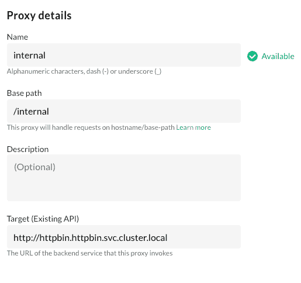
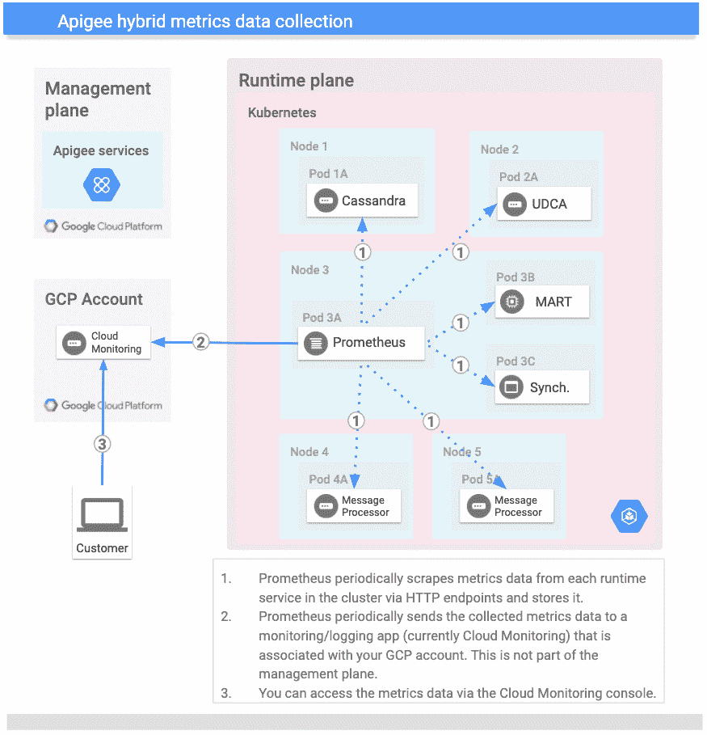
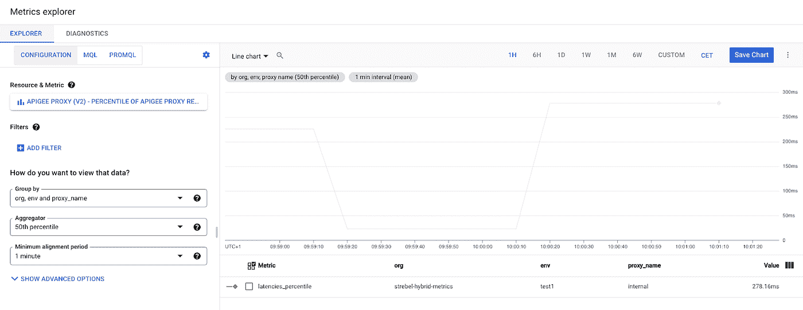
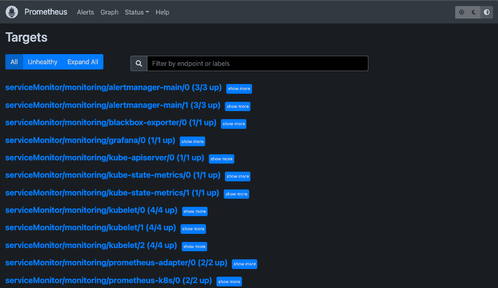
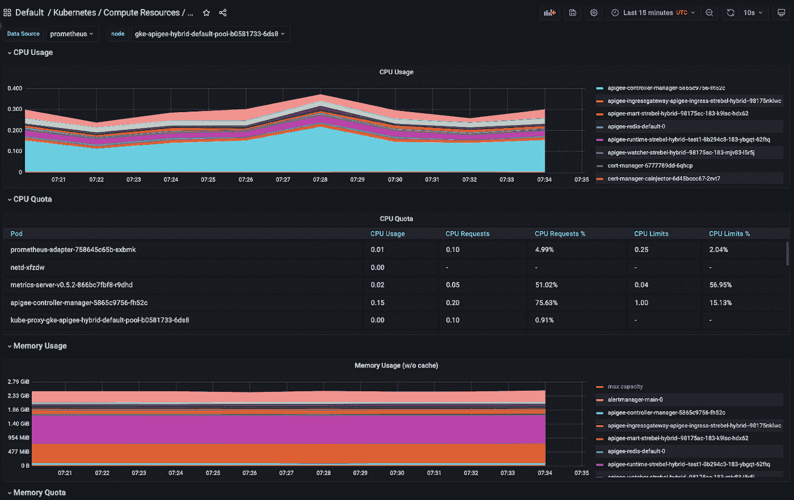
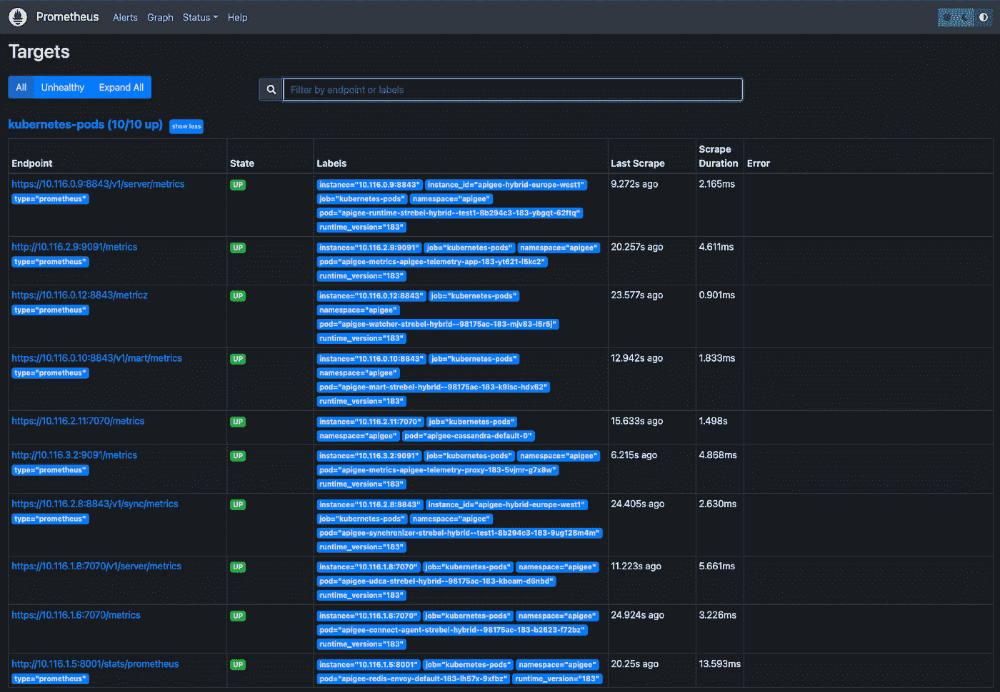
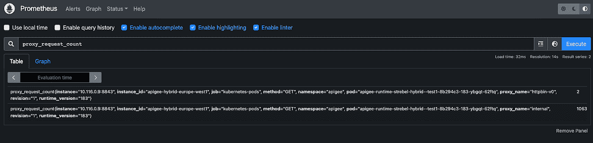
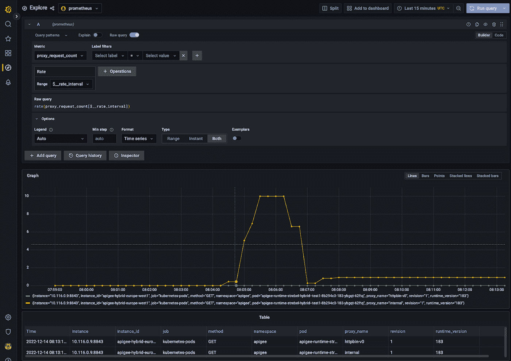

# BYOP——带上你自己的普罗米修斯(和格拉法纳)去监测 Apigee hybrid

> 原文：<https://medium.com/google-cloud/byop-bring-your-own-prometheus-and-grafana-to-monitor-apigee-hybrid-434b008ab926?source=collection_archive---------3----------------------->

对于像 Apigee 这样的分布式系统，混合监控是确保平台稳定性和可用性的核心要求。由于这个原因，Apigee hybrid 原生集成到谷歌云[日志](https://cloud.google.com/logging)和[监控](https://cloud.google.com/monitoring)堆栈中，允许平台运营商在一个中心位置收集重要的遥测数据，而无需操作自己的监控基础设施。

如果组织已经在统一监控堆栈上实现标准化，或者需要云监控不支持的操作或归档功能，他们可能希望并行运行自己的指标收集，或者不运行 Apigee 指标收集。

在本文中，我们通过展示基于流行的开源工具 [Prometheus](https://prometheus.io/) 和 [Grafana](https://grafana.com/) 的自定义端到端度量路径的部署来满足这一需求。这个监控设置允许您捕获和可视化 Apigee 混合部署的重要基础设施和运行时指标。

# (可选)用于演示的集群内部服务

为了生成指标，然后我们可以使用我们的指标堆栈来抓取和可视化，我们部署了一个集群内服务，我们可以使用 API 代理来提供该服务。

为了创建集群内 [httpbin](http://httpbin.org) 部署和服务，我们可以应用以下 Kubernetes 资源:

```
cat <<EOF | kubectl apply -f -
apiVersion: v1
kind: Namespace
metadata:
  name: httpbin
---
apiVersion: apps/v1
kind: Deployment
metadata:
  name: httpbin
  namespace: httpbin
spec:
  replicas: 1
  selector:
    matchLabels:
      app: httpbin
  template:
    metadata:
      labels:
        app: httpbin
    spec:
      containers:
      - name: httpbin
        image: kennethreitz/httpbin
        resources:
          limits:
            memory: "64Mi"
            cpu: "50m"
        ports:
        - containerPort: 80
---
apiVersion: v1
kind: Service
metadata:
  name: httpbin
  namespace: httpbin
spec:
  selector:
    app: httpbin
  ports:
  - port: 80
    targetPort: 80
EOF
```

我们可以使用服务的集群内部主机名(http://http bin . http bin . SVC . cluster . local)在 Apigee 中创建一个代理:



在 Apigee UI 中创建一个 API 代理

最后，验证我们可以使用以下 curl 命令调用服务:

```
curl https://$HOSTNAME/internal/uuid

# Response:
{
  "uuid": "d338600c-59d2-4c76-884d-44d7f12ebb72"
}
```

# Apigee 开箱即用的监控路径

许多客户都享受到了减轻负担、托管和运营高可用性监控堆栈的好处，并使用了 Apigee 的交钥匙 GCP 云日志记录和监控集成。该集成基于 prometheus 部署，Apigee 使用 ApigeeTelemetry 自定义资源中的配置进行编排。

要查看 Apigee 混合集群中指标导出的当前配置，可以运行以下命令:

```
kubectl get ApigeeTelemetry -n apigee -o yaml | grep metricsExport: -A5
```

在下面的输出中，您可以看到指标被配置为导出到指定项目 ID 的云日志和监控:

```
metricsExport:
  appMetricsProjectID: my-project-name
  defaultMetricsProjectID: my-project-name
  enabled: true
  proxyMetricsProjectID: my-project-name
  stackdriverAPIEndpoint: https://monitoring.googleapis.com:443/
```

基于 ApigeeTelemetry CR 中的信息，Apigee 控制器为收集不同运行时资源的 pod 创建指标部署，并将聚合的指标发送到云监控端点，在上面的配置中称为“stackdriverAPIEndpoint”。



Apigee 的默认抓取设置如 Apigee [文档](https://cloud.google.com/apigee/docs/hybrid/v1.8/metrics-collection)中所述。

要开始探索可用的 Apigee 运行时指标，我们可以进入 GCP 指标浏览器，查看响应延迟的百分比分布。



GCP 度量浏览器中的 Apigee 度量

正如您在上面的屏幕截图中看到的，Apigee 已经提供了许多代理指标，这些指标也预先填充了方便的标签，可用于按 Apigee 环境、Apigee 组织或 API 代理名称等维度对数据进行分组。

# 在 Apigee 混合集群中部署您自己的 Prometheus 和 Grafana

为了本文的目的，我们将在 kube-prometheus 工具组中的 prometheus 操作员的帮助下安装 Prometheus 和 Grafana。让您自己的 Prometheus 监控 Apigee 的概念不依赖于操作员安装，也可以应用于使用 helm 或自定义安装路径部署的 Prometheus。

为了在我们的混合集群上安装 prometheus 操作符，我们运行以下命令(关于 Prometheus 操作符的详细解释，请参见官方的[文档](https://github.com/prometheus-operator/kube-prometheus)):

```
git clone https://github.com/prometheus-operator/kube-prometheus.git
kubectl apply --server-side -f manifests/setup
kubectl wait \
 --for condition=Established \
 --all CustomResourceDefinition \
 --namespace=monitoring
kubectl apply -f manifests/
```

让我们通过端口转发 prometheus 服务来检查 Prometheus 刮擦工作是否正常。

```
kubectl --namespace monitoring port-forward svc/prometheus-k8s 9090
```

启用端口转发后，我们现在可以在本地 web 浏览器的[http://localhost:9090/targets](http://localhost:9090/targets)下打开 Prometheus UI。在这里，您应该会看到自动配置的服务监视器，如下图所示:



用默认库贝-普罗米修斯配置刮削的库贝内斯目标

如果你环顾四周，你会发现有许多有趣的基础设施指标。Kube-prometheus 还部署了一个 Grafana 实例和预先填充好的仪表板，您可以通过端口转发 Grafana UI 来访问这些仪表板:

```
kubectl --namespace monitoring port-forward svc/grafana 3000
```

当您在浏览器中打开 Grafana UI 并使用默认凭据(admin:admin)登录时，您会发现 prom-kube 发行版已经附带了许多预安装的仪表板，这些仪表板描述了资源利用率和基础架构指标，如下图所示:



用于监控 Kubernetes 集群的现成 Grafana 仪表盘

# 将顶点数据输入普罗米修斯

当我们仔细查看上面提供的数据和仪表板时，我们看到我们获得了关于 Apigee 运行时资源的非常丰富的通用信息，如 pod 的 CPU 和内存使用情况、API 服务器性能和 pod 重启。然而，我们缺少 Apigee 特定的信息，如最初显示的在云监控度量浏览器中可用的 API 代理性能。

幸运的是，Apigee 吊舱都带有普罗米修斯注释，允许您自动发现它们的刮擦配置。例如，您可以在 Apigee 运行时窗格中看到这一点:

```
kubectl get pods -l app=apigee-runtime -o yaml -n apigee                                                                                                                                                                                                            

apiVersion: v1
items:
- apiVersion: v1
  kind: Pod
  metadata:
    annotations:
 ...
      prometheus.io/path: /v1/server/metrics
      prometheus.io/port: "8843"
      prometheus.io/scheme: https
      prometheus.io/scrape: "true"
      prometheus.io/type: prometheus
    labels:
      ...
      app: apigee-runtime
      ...
      revision: "183"
      runtime_type: hybrid
    name: apigee-runtime-...
    namespace: apigee
...
```

为了将 Apigee 指标放入您的 prometheus 中，我们必须创建一个额外的 scrape 配置，作为我们的监控名称空间的 Kubernetes 秘密。(此处的刮擦信息不是特别敏感，但是 prometheus CR 希望以秘密的形式获得额外的刮擦配置。)

```
cat <<'EOF' >prom-additional-scrape.yaml
- job_name: kubernetes-pods
  honor_timestamps: true
  scrape_interval: 30s
  scrape_timeout: 10s
  metrics_path: /metrics
  scheme: http
  tls_config:
    insecure_skip_verify: true
  follow_redirects: true
  enable_http2: true
  kubernetes_sd_configs:
  - role: pod
    kubeconfig_file: ""
    follow_redirects: true
    enable_http2: true
  relabel_configs:
  - source_labels: [__meta_kubernetes_pod_annotation_prometheus_io_scrape]
    separator: ;
    regex: "true"
    replacement: $1
    action: keep
  - source_labels: [__meta_kubernetes_pod_container_init]
    separator: ;
    regex: "true"
    replacement: $1
    action: drop
  - source_labels: [__meta_kubernetes_pod_label_apigee_cloud_google_com_platform]
    separator: ;
    regex: apigee
    replacement: $1
    action: keep
  - source_labels: [__meta_kubernetes_pod_annotation_prometheus_io_scheme]
    separator: ;
    regex: (.+)
    target_label: __scheme__
    replacement: $1
    action: replace
  - source_labels: [__meta_kubernetes_pod_annotation_prometheus_io_path]
    separator: ;
    regex: (.+)
    target_label: __metrics_path__
    replacement: $1
    action: replace
  - source_labels: [__meta_kubernetes_pod_annotation_prometheus_io_type]
    separator: ;
    regex: (.+)
    target_label: __param_type
    replacement: $1
    action: replace
  - source_labels: [__address__, __meta_kubernetes_pod_annotation_prometheus_io_port]
    separator: ;
    regex: ([^:]+)(?::\d+)?;(\d+)
    target_label: __address__
    replacement: $1:$2
    action: replace
  - source_labels: [__meta_kubernetes_namespace]
    separator: ;
    regex: (.*)
    target_label: namespace
    replacement: $1
    action: replace
  - source_labels: [__meta_kubernetes_pod_name]
    separator: ;
    regex: (.*)
    target_label: pod
    replacement: $1
    action: replace
  - source_labels: [__meta_kubernetes_pod_label_instance_id]
    separator: ;
    regex: (.*)
    target_label: instance_id
    replacement: $1
    action: replace
  - source_labels: [__meta_kubernetes_pod_label_com_apigee_version]
    separator: ;
    regex: (.*)
    target_label: runtime_version
    replacement: $1
    action: replace
EOF

kubectl create secret generic additional-scrape-configs --from-file=prom-additional-scrape.yaml --dry-run=client -oyaml | kubectl apply -n monitoring -f -
```

最后，我们修补 Prometheus CR，使其包含额外的刮擦配置，这样它就可以被拾取并集成到 Prometheus 的整体配置中。

```
cat <<EOF | >> manifests/prometheus-prometheus.yaml
  additionalScrapeConfigs:
    name: additional-scrape-configs
    key: prom-additional-scrape.yaml
EOF
kubectl apply -f manifests/prometheus-prometheus.yaml

cat <<EOF | kubectl apply -f -
apiVersion: rbac.authorization.k8s.io/v1
kind: ClusterRole
metadata:
  name: prometheus-apigee
rules:
- apiGroups: [""]
  resources:
  - nodes
  - nodes/proxy
  - services
  - endpoints
  - pods
  verbs: ["get", "list", "watch"]
- apiGroups: [""]
  resources:
  - configmaps
  verbs: ["get"]
- apiGroups:
  - networking.k8s.io
  resources:
  - ingresses
  verbs: ["get", "list", "watch"]
- nonResourceURLs: ["/metrics"]
  verbs: ["get"]
---
apiVersion: rbac.authorization.k8s.io/v1
kind: ClusterRoleBinding
metadata:
  name: prometheus-apigee
roleRef:
  apiGroup: rbac.authorization.k8s.io
  kind: ClusterRole
  name: prometheus-apigee
subjects:
- kind: ServiceAccount
  name: prometheus-k8s
  namespace: monitoring
EOF
```

一旦应用，普罗米修斯将重新加载配置，并开始显示新发现的阿皮吉库本内特吊舱的目标:



在普罗米修斯中作为目标出现的尖顶舱

使用 [prometheus UI](http://localhost:9090/graph?g0.expr=proxy_request_count&g0.tab=1&g0.stacked=0&g0.show_exemplars=0&g0.range_input=1h) 中的查询工具，我们现在能够显示我们过去在云监控中获得的 Apigee 特定代理指标。



普罗米修斯度量查询

最后，我们可以返回到 Metrics Explorer 中的 Grafana UI，验证我们是否有可用的相关数据，例如为代理创建 QPS 图表:



在 Grafana 中可视化的顶点 QPS 度量

# 结论

如本文所示，现有的 prometheus 指标端点可以很容易地通过自定义 prometheus 部署获得，并提供与您的基础设施监控堆栈的其余部分集成的目标指标管道。