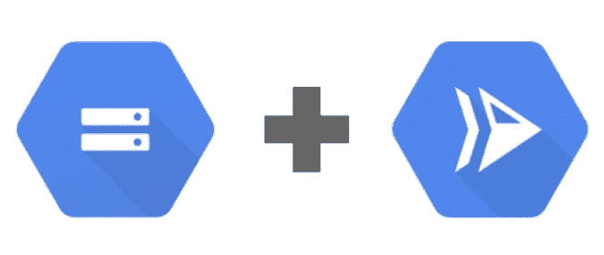

# 使用云存储绕过云运行 32mb 的限制

> 原文：<https://medium.com/google-cloud/bypass-the-cloud-run-32mb-limit-with-cloud-storage-65c24156189?source=collection_archive---------1----------------------->

云存储+云运行

云运行对 HTTP/1 请求和响应施加了 32mb 的[限制](https://cloud.google.com/run/quotas#cloud_run_limits)。然而，谷歌云存储允许高达 [5 TiB](https://cloud.google.com/storage/quotas) 的对象。您可能想知道，在使用 Cloud Run 时，我如何处理大于 32mb 的对象？使用云存储和云运行需要一些技术来绕过这个限制。这篇博客文章详细介绍了我们对于执行大于 32mb 限制的上传和下载的建议。

以下所有建议都利用了已签名的请求。签名请求是经过身份验证的端点(URL ),您可以直接向云存储发出请求。它们消除了云运行应用程序代理对云存储对象的请求的需要。如果您的应用程序是媒体密集型的(例如，如果它包含大型视频)，这可能会减少应用程序的负载。您需要为每个想要上传或下载的文件生成一个新的 URL。这些端点将在一段时间后过期，这段时间可以在创建 URL 时指定。有关更多信息，请参见[关于已签名请求的云存储文档](https://cloud.google.com/storage/docs/authentication/signatures)。

# 上传

绕过上传的云运行限制的推荐选项是签名的策略 URL。

## 使用签名的策略 URL 进行上传

使用签名的策略 URL 允许您的网站提供一个表单，该表单可用于上传大于 32mb 限制的文件(通过`POST`请求)。

通过上传请求生成用于上传的已签名策略 URL

参见[用 HTTP 表单上传一个对象](https://cloud.google.com/storage/docs/xml-api/post-object-forms#node.js)以找到更多信息和其他语言的例子。

# 下载

有两个绕过云运行限制的推荐下载选项:签名 URL 和流。

## 使用签名的 URL 进行下载

如果您的 Cloud Run 应用程序为最终用户提供了一个网站，您可以使用签名的 URL 直接从云存储中下载大文件。要执行带有签名 URL 的`GET`请求，其动作必须设置为`read`。(注意这不同于上传，上传需要`write`。)对于[示例](https://cloud.google.com/storage/docs/access-control/signing-urls-with-helpers):

生成一个 Google 云存储签名的 URL，通过 GET 请求下载数据

现在您有了一个`read`签名的 URL，您可以使用它直接向云存储发出请求，完全绕过 Cloud Run。下面是一个在 E [xpress.js web 应用程序](https://expressjs.com/)中使用这个 URL 的例子。

使用云存储签名的 URL 进行下载

注意，通过修改文件上的 [Content-Disposition](https://developer.mozilla.org/en-US/docs/Web/HTTP/Headers/Content-Disposition) ，您将能够改变`GET`请求的行为。在没有设置`Content-Disposition`的情况下访问生成的 URL 将会导致带有回放控件的网页上的视频渲染。如果您想要下载视频，您可以将云存储对象元数据字段`Content-Disposition`设置为`attachment; filename=”video.mp4"`。这将导致文件被下载为“video.mp4”。

有关`Content-Disposition`字段以及如何在 Google 云存储上的文件中修改该字段的更多信息，请参考[云存储文档](https://cloud.google.com/storage/docs/metadata#content-disposition)。

## 使用流进行下载

如果您的云运行应用程序正在处理存储在云存储中的数据，我们建议通过流下载该数据。流是主要编程语言用来发送和接收分块数据的编程结构。流允许你把一个文件分成小于 32mb 的部分。下面的例子创建了一个流，它从 Google 云存储中读取文件的内容，并通过管道将其传输到`res`以显示在您的网页上。

使用云存储创建读取流进行下载

在[本要点](https://gist.github.com/shaffeeullah/088aa29c3ee9876a6fec7b3fbbf1862f)中查看这些下载示例的完整代码。

# 了解更多信息

既然您已经阅读了这篇博文，那么您可以通过 Cloud Run 充分利用云存储的强大功能来绕过上传和下载大小的限制。🎉

有关使用 Google 云存储上传和下载数据的更多信息，请参见关于[上传和下载](https://cloud.google.com/storage/docs/uploads-downloads)的云存储文档。有关后续步骤(如将您的应用部署到云运行)，请参见[云运行文档](https://cloud.google.com/build/docs/deploying-builds/deploy-cloud-run)。

[1]对 HTTP/2 请求没有强加的大小限制