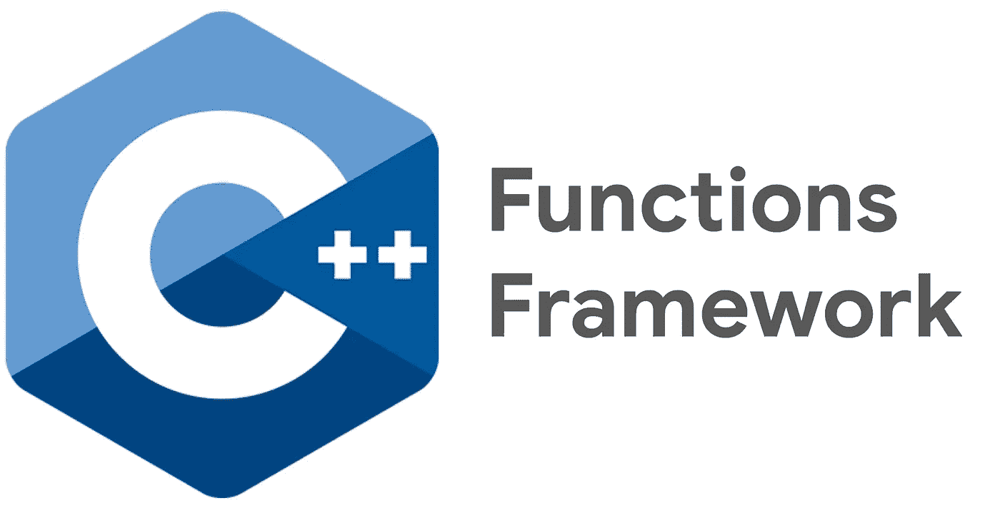

# C++函数框架

> 原文：<https://medium.com/google-cloud/c-functions-framework-21f327fdee16?source=collection_archive---------0----------------------->



带有文本“函数框架”的未更改的 C++徽标。在[*isocpp.org*](http://isocpp.org)了解更多关于标准 C++的信息

[C++函数框架](https://github.com/GoogleCloudPlatform/functions-framework-cpp)是一个开源库，允许你用 C++编写无服务器函数，并轻松部署到云运行。

在这篇博客中，我们将逐步安装框架并部署您的第一个无服务器 C++函数。

## 设置云壳

对于预装工具的稳定环境，让我们使用 Cloud Shell—Google Cloud 的在线 Shell 环境。

这里开个全屏壳:[shell.cloud.google.com/?show=terminal](http://shell.cloud.google.com/?show=terminal)

这个环境带有像`docker`和`pack`这样的工具，我们很快就会用到它们。您可以使用以下命令验证它们是否已安装:

```
docker --version
# Example output: Docker version 20.10.3, build 48d30b5

pack --version
# Example output: 0.17.0+git-d9cb4e7.build-2045
```

## 获取示例代码

C++函数框架包括入门示例。在您的主目录中下载框架:

```
cd $HOME
git clone [https://github.com/GoogleCloudPlatform/functions-framework-cpp](https://github.com/GoogleCloudPlatform/functions-framework-cpp)
```

本指南的其余部分将假设您在此 repo 的目录中发出命令:

```
cd $HOME/functions-framework-cpp
```

我们将使用 HTTP hello world 示例，如下所示:

C++中的 Hello World 函数

> 注意上面示例中函数框架的 gcf HTTP 请求和响应类以及 [nlohmann JSON 解析](https://github.com/nlohmann/json)。

## 设置构建包

我们将使用 [Cloud Native Buildpacks](https://buildpacks.io/) 来创建将被部署到 Cloud Run 的容器映像。第一次运行这些命令可能需要几分钟，甚至一个小时，这取决于工作站的性能。

运行以下命令:

```
docker build -t gcf-cpp-develop -f build_scripts/Dockerfile .
docker build -t gcf-cpp-runtime --target gcf-cpp-runtime -f build_scripts/Dockerfile build_scripts
pack builder create gcf-cpp-builder:bionic --config pack/builder.toml
pack config trusted-builders add gcf-cpp-builder:bionic
pack config default-builder gcf-cpp-builder:bionic
```

## 在本地构建 Docker 映像

设置完成后，使用`pack`命令用你的函数构建一个 Docker 镜像:

```
pack build \
  --builder gcf-cpp-builder:bionic \
  --env FUNCTION_SIGNATURE_TYPE=http \
  --env TARGET_FUNCTION=hello_world_http \
  --path examples/site/hello_world_http \
  gcf-cpp-hello-world-http
```

如果一切顺利，您将看到以下响应:

```
Successfully built image gcf-cpp-hello-world-http
```

# (可选)在本地测试容器

可选地，您可以在`localhost`测试您刚刚创建的 Docker 容器。运行我们刚刚构建的容器映像:

```
ID=$(docker run --detach --rm -p 8080:8080 gcf-cpp-hello-world-http)
```

然后向您的容器发送一个 HTTP 请求:

```
curl [http://localhost:8080](http://localhost:8080)
# Output: Hello, World!
```

不错！完成后，您可以使用以下方法清理容器:

```
docker kill "${ID}"
```

# 部署到云运行

要部署到 Cloud Run，我们首先需要构建容器并将其推送到 Google Container Registry。

使用以下命令构建映像并推送到容器注册表:

```
GOOGLE_CLOUD_PROJECT=$(gcloud config get-value project)
pack build \
  --builder gcf-cpp-builder:bionic \
  --env FUNCTION_SIGNATURE_TYPE=http \
  --env TARGET_FUNCTION=hello_world_http \
  --path examples/site/hello_world_http \
"gcr.io/$GOOGLE_CLOUD_PROJECT/gcf-cpp-hello-world-http"
```

然后，部署到云运行，使用相同的`gcr.io` URL:

```
gcloud run deploy gcf-cpp-hello-world-http \
    --project="${GOOGLE_CLOUD_PROJECT}" \
    --image="gcr.io/${GOOGLE_CLOUD_PROJECT}/gcf-cpp-hello-world-http:latest" \
    --region="us-central1" \
    --platform="managed" \
    --allow-unauthenticated
```

获取公共运行服务的 URL，并通过`cURL`发送请求:

```
HTTP_SERVICE_URL=$(gcloud run services describe \
    --project="${GOOGLE_CLOUD_PROJECT}" \
    --platform="managed" \
    --region="us-central1" \
    --format="value(status.url)" \
    gcf-cpp-hello-world-http)curl -H "Authorization: Bearer $(gcloud auth print-identity-token)" "${HTTP_SERVICE_URL}"
```

您应该会看到输出`Hello World!`。

恭喜你，你给谷歌云部署了一个 C++函数！🎉

# 感谢阅读！

如果你认为这个项目很有趣，在 [GitHub](https://github.com/GoogleCloudPlatform/functions-framework-cpp) 上给它打个星，并查看大量的[示例和文档](https://github.com/GoogleCloudPlatform/functions-framework-cpp/tree/main/examples)。