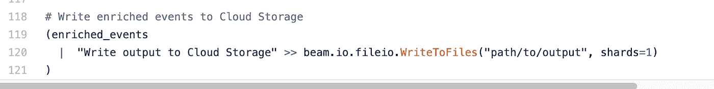
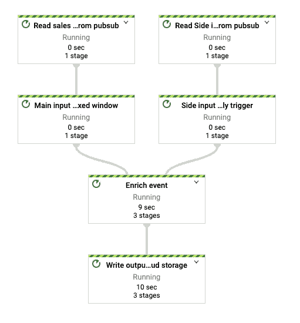

# Beam 中跨 DoFn 的缓存重用

> 原文：<https://medium.com/google-cloud/cache-reuse-across-dofns-in-beam-a34a926db848?source=collection_archive---------1----------------------->

[Apache Beam](https://beam.apache.org/) 是一个开源的统一模型，用于定义批处理和流数据并行处理管道。管道可以用各种特定语言(Java、Python 等)的 SDK 编写，并且可以在任何兼容 beam 的运行程序(Dataflow、Flink、Spark 等)上执行

在这篇博文中，我们将讨论以下主题:

1.  DoFn 的生命周期
2.  缓存数据以便跨 DoFn 实例重用
3.  说明以下概念的示例:
    a)通过从外部源(例如:云存储)加载数据来构建内存缓存
    b)跨 DoFn 实例重用缓存的对象。
    c)通过外部触发器刷新缓存。

## **DoFn 生命周期**

Dofn 是用户定义的函数，与 ParDo transform 一起使用，为每个输入元素调用该函数以发出零个或多个元素。束是作为单个故障单元处理的元素(即记录/消息)的集合。集合成束的划分是任意的，由跑步者选择。例如，在数据流的情况下，流运行者可能更喜欢处理和提交小束以实现低延迟，而批处理运行者更喜欢处理较大束以达到更高的吞吐量。

每个 [DoFn 类](https://beam.apache.org/releases/pydoc/2.27.0/apache_beam.transforms.core.html?highlight=start_bundle#apache_beam.transforms.core.DoFn)都有一个为每个元素调用的 process 方法和下面显示的额外可选方法来处理初始化和终结任务。

*   设置-在创建实例后调用。初始化瞬时内存资源的好地方，比如网络连接、解析配置文件等
*   start_bundle —在处理每个包之前调用。某些 runnerss 为每个 bundle 创建一个 DoFn 实例，而其他 runner 跨 bundle 重用同一个 DoFn。可用于初始化用于整个包的任何状态。
*   finish_bundle —在处理每个包之后调用
*   teardown 在实例被丢弃并用于任何清理之前调用

总的来说，整个流程如下:

*   设置
*   重复处理包:
    * StartBundle
    *重复处理元素
    * FinishBundle
*   拆卸

## **共享缓存**

有些场景需要跨 DoFn 实例重用共享的内存数据，以提高空间和访问效率。其中一些包括:

*   用于局部推理的机器学习模型
*   查找从云存储、BigQuery 等外部来源加载的数据。

如前所述，beam 允许开发人员使用各种[支持的 SDK](https://beam.apache.org/documentation/sdks/java/)来编写管道，最流行的选择是 Java 和 Python。

在 Java SDK 中，每个工作线程启动一个带有多线程的 JVM 实例(由内核数量和作业类型决定，即批处理还是流处理)。每个线程通过为每个包创建一个 DoFn 实例或者跨多个数据包重用相同的实例来执行多个数据包。共享缓存可以通过单例实例来实现。

在 Python 中，由于[全局解释器锁](https://wiki.python.org/moin/GlobalInterpreterLock)的限制，并行性是通过多个进程实现的。每个工作者在每个内核上启动一个进程(具有多个线程),并在每个线程上执行一个或多个调用一个或多个 DoFn 实例的包。

由于运行者可能会回收每个包的 DoFn 实例，并且在不同的线程上并行运行多个这样的实例，我们如何确保缓存数据的单一副本在所有这些线程之间共享呢？您知道吗，Beam 2.24 引入了一个[共享](https://beam.apache.org/releases/pydoc/current/apache_beam.utils.shared.html)类来解决完全相同的挑战，并允许您管理由多个线程共享的对象的单个实例。让我们通过为一家模拟零售公司构建一个流数据丰富管道来演示这个特性。

## **示例:用于流丰富的共享缓存**

对管道的要求是:

*   从实时消息服务中连续读取销售事件
*   从持久性存储中加载查找数据，如客户详细信息、产品详细信息。
*   通过将查找标识符(例如:customerid、productid)与查找详细信息相关联，用附加信息丰富事件。
*   每隔 x 分钟将缓冲的丰富事件写入永久存储器。

到目前为止，除了以下挑战，没有什么新奇的:

*   由于查找数据仅每 x 小时更改一次，是否可以缓存和共享数据以提高管道性能？
*   如何通知管道在新的查找数据到达时立即刷新缓存？

***缓慢变化的查找数据*** 在深入管道设计之前，我们需要了解数据的性质和形状。在我们的示例中，查找数据存储在 Google 云存储中(也可以使用 BigQuery ),路径格式如下:

GS://bucket/prefix/yyyy/mm/DD/customers/{ file 1…N }。JSON
GS://bucket/prefix/yyyy/mm/DD/products/{ file 1…N }。json

每天，一个单独的管道生成最新的查找数据，并向 Pub/Sub 发送包含最新基本路径的消息(例如 gs://bucket/prefix/yyyy/mm/dd)。

***模式*** 让我们检查销售事件的模式和相应的查找数据。客户和产品查找数据模式类似，包含分布在不同文件中的键值对。

```
**Sales Event**: *{"Txid":1,"timestamp": "2020-05-02 19:08:24.796892",  "customerid": 100, "productcode": "P023", "qty": 1, "sales": 97.65 }****customers Lookup data****:  {"key":100, "value": {“name”: “john”, “tier”, “premium” }****products Lookup data****:  {"key":"P023", "value": {“sku”: “chair”, “category”, “furniture” }***Enriched Event (i.e Output)**: *{"Txid":1, "timestamp": "2020-05-02 19:08:24.796892",  "customerid": 100, "productcode": "P023", "qty": 1, "sales": 97.65,  "customertier": "premium”, "productcategory": "furniture" }*
```

***流水线设计*** 我们的流水线有两个输入一个输出:

*   从 Google Cloud 发布/订阅订阅中读取销售事件作为主要输入
*   从不同的 Google Cloud 发布/订阅订阅中读取查找数据的基本路径作为辅助输入。在 Beam 中，侧输入是不可变的 p 集合，可用作 ParDo 变换的附加输入。然后，跑步者将侧面输入广播给所有工人。关于边输入的一个重要注意事项是，它们应该足够小以适合内存。
*   最终丰富的输出被写入 Google 云存储。

让我们一步一步地浏览管道代码:

**步骤 1:读取输入**

1.  销售事件从销售发布/订阅订阅中读取，并被分配到持续时间为 15 分钟的
    固定窗口
2.  从辅助输入发布/订阅订阅中读取辅助输入基本文件路径。
    尽管在长窗口间隔上投射侧面输入，但是由于数据驱动触发，侧面输入立即得到处理。

> 注意侧面输入在窗口结束时过期，并且
> 主输入将被阻塞，直到新的侧面输入到达或整个
> 侧面输入窗口持续时间已经过去，以最早者为准。为了避免这种情况，
> 确保在每个侧面
> 输入窗口到期时通过最新的侧面输入基本路径。

**步骤 2:创建共享缓存并丰富事件**

1.  创建一个共享句柄，它封装了对共享资源的单例实例的弱引用，并在构建 DoFn 实例时传递它。
2.  在执行过程中，随着每个事件的发生，DoFn 也将接收最新的侧面输入基本路径。
3.  在流程方法内部，共享句柄用于获取侧面输入数据，其工作方式如下所示:

*   在初始调用的情况下，由于数据不可用，使用 load_sindeput 方法从外部源加载数据。在这个例子中，对于每一个侧输入类型(即客户、产品),数据从 Google 云存储中读取，并加载到一个多级字典中，该字典具有指示侧输入类型的顶级关键字和值，该值表示将 KV 对与相应的查找数据相匹配的字典。

> 这里要注意的重要一点是，共享句柄需要对缓存对象的弱引用，但是 list 和 dict 等几个内置类型不直接支持[弱引用](https://docs.python.org/3/library/weakref.html)。这可以通过创建一个内置类型的子类来解决。

*   在后续调用中，使用相同的缓存对象，而不是从外部源加载。
*   如果您注意到除了实际的查找数据之外，我们还创建了一个元数据键来保存基本路径。如果基路径发生变化，则通过将新的基路径作为标记传递给 acquire 方法来刷新缓存。

**第三步:将丰富的事件写入谷歌云存储**



管道 DAG 如下所示:



# 结论

感谢阅读，特别感谢 [Pablo Estrada](https://medium.com/u/6800d4802d9a?source=post_page-----a34a926db848--------------------------------) 审阅本文。在这篇博文中，我们总结了 DoFn 生命周期，如何构建跨线程共享的缓存，以及通过外部触发器刷新缓存的方法。关于 beam 和其他有趣图案的更多信息，请参考 beam [文档](https://beam.apache.org/documentation/patterns/overview/)。