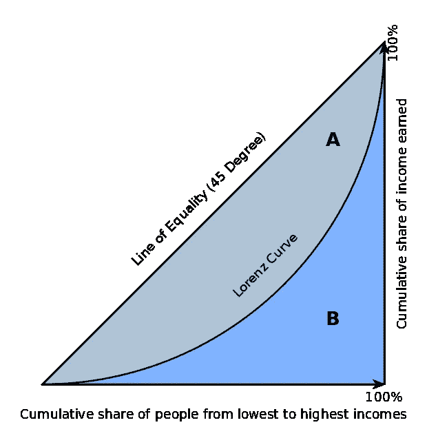

# 用 SQL 计算 BigQuery 中的基尼系数

> 原文：<https://medium.com/google-cloud/calculating-gini-coefficient-in-bigquery-3bc162c82168?source=collection_archive---------0----------------------->

[基尼系数](https://en.wikipedia.org/wiki/Gini_coefficient)，也称基尼指数，是衡量资产分配不平等程度的常用经济计量工具。

以下是给定每日非零(匿名)帐户余额的情况下，每天输出基尼系数的查询:

它使用了来自维基百科页面[https://en.wikipedia.org/wiki/Gini_coefficient](https://en.wikipedia.org/wiki/Gini_coefficient)的`1 — 2B`公式，其中 B 是洛伦兹曲线下的面积:

*   `balance * (rank — 1)`是洛伦兹曲线下矩形水平切片的面积。
*   `balance / 2`是矩形切片左边三角形的面积。
*   然后对所有切片求和:`sum((balance * (rank — 1) + balance / 2))`
*   需要`count(*)`将 x 轴归一化到范围 0 到 1
*   需要`sum(balance)`将 y 轴标准化到范围 0 到 1

这个结果可以在本网[http://shlegeris.com/gini](http://shlegeris.com/gini)得到验证。

在下面的文章[https://cloud . Google . com/blog/products/data-analytics/introducing-six-new-cryptocurrences-in-big query-public-datasets-and-how-to-analyze-them](https://cloud.google.com/blog/products/data-analytics/introducing-six-new-cryptocurrencies-in-bigquery-public-datasets-and-how-to-analyze-them)中，您可以找到使用该 SQL 的主要加密货币的基尼指数对比。