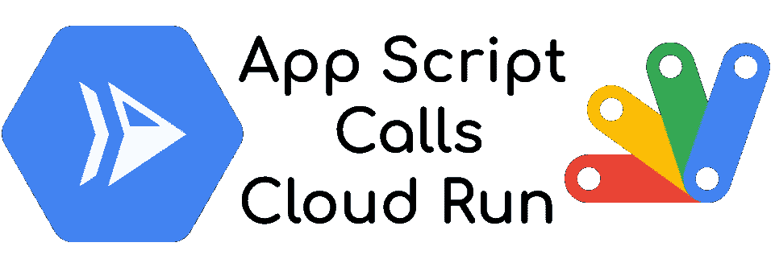
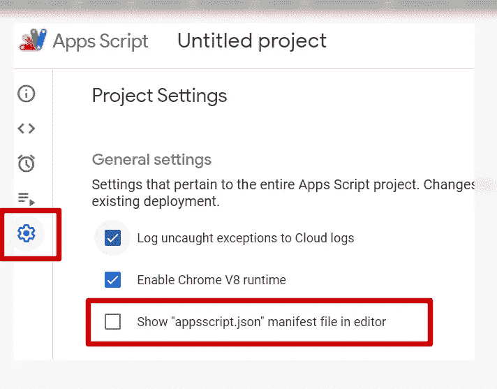
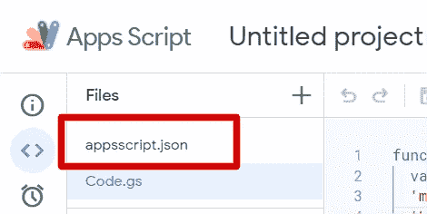
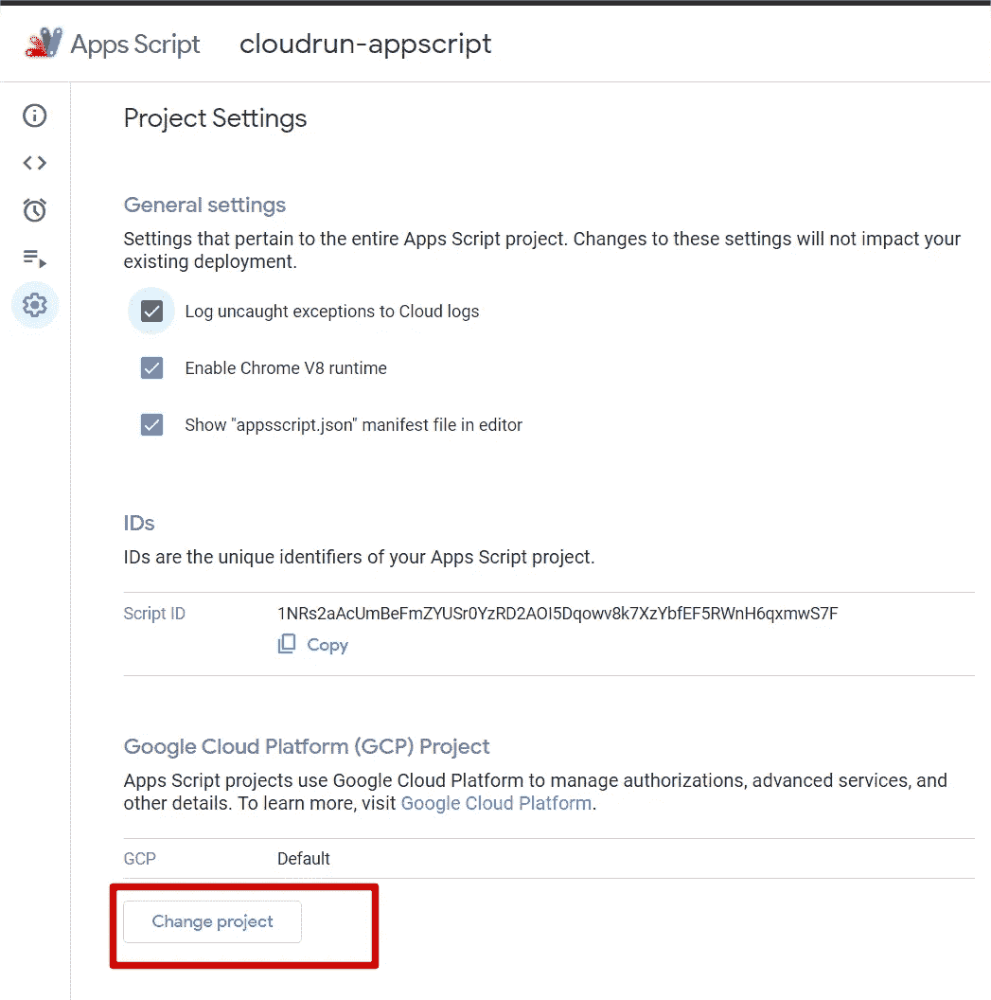

# 从应用程序脚本调用云运行:简单的方法

> 原文：<https://medium.com/google-cloud/call-cloud-run-from-app-script-the-easy-way-70677086efa1?source=collection_archive---------0----------------------->



谷歌是一家拥有大量应用程序的大公司，你可以通过 API 接触到这些应用程序。为了利用和复制这些产品的功能，您可以**将它们组合在一起**和**创造出更大的**！然而，**并不那么简单**:每个产品都有完整的文档记录，但是连接它们的**认证部分**却模糊不清、过期或缺失。

# 生成访问令牌

令人欣慰的是，当你想插入 Google Workspace 产品和 Google Cloud APIs 时，**使用开箱即用的方法非常容易**。

当您使用应用程序脚本时，您可以调用一个方法来生成访问令牌(OAuth 令牌)

```
ScriptApp.getOAuthToken();
```

容易，不是吗？

# 谷歌云 API 调用

不，没那么简单…试着写一段简单的代码。去 https://script.google.com/开始一个新项目

将这段代码复制到您的函数中

```
function myFunction() {var options = {
  'method' : 'get',
  'headers': {"Authorization":"Bearer "+ScriptApp.getOAuthToken()},
}var response =   UrlFetchApp.fetch("https://cloudresourcemanager.googleapis.com/v1/projects/<PROJECT_ID>",options); Logger.log(response.getContentText());
}
```

*用您的谷歌云项目 ID* 替换 `*PROJECT_ID*`

*保存并运行您的代码。接受权限，您应该会得到一个 403 错误，因为范围不足。*

## *范围问题*

*显然是的，你在一个应用程序脚本产品中，而**你在另一个产品**中请求一个 API，具有另一个范围。你需要将[云平台范围](https://developers.google.com/identity/protocols/oauth2/scopes)添加到你的 app 中。*

*为此，转到`Project Settings`，点击`Show "appscript.json" manifest file in editor`框*

**

*回到编辑器，一个新文件出现了*

**

*打开它，并在其中添加云平台范围。**你的文件应该看起来像那个***

```
*{
  "timeZone": "Europe/Paris",
  "dependencies": {},
  "exceptionLogging": "STACKDRIVER",
  "runtimeVersion": "V8",
  **"oauthScopes": [
    "https://www.googleapis.com/auth/cloud-platform"
  ]**
}*
```

*再次运行您的脚本。
***又失败了！！！！****

*这次你**没有权限范围运行 App 脚本中的脚本，**你只有云平台范围，没有 App 脚本的默认范围。
所以，**把它加到像**那样的示波器上*

```
*{
  "timeZone": "Europe/Paris",
  "dependencies": {},
  "exceptionLogging": "STACKDRIVER",
  "runtimeVersion": "V8",
  **"oauthScopes": [
    "https://www.googleapis.com/auth/cloud-platform",
    "https://www.googleapis.com/auth/script.external_request"
  ]**
}*
```

*最后运行你的脚本，接受新的许可和… ***403 再次，API 在一个项目号上不活动！！！****

**你不知道的项目编号，当然不是“那么”简单！**

## *在 API 调用中请求正确的项目*

*在引擎盖下， **App Script 为你创建了一个项目**，没有激活任何 Google Cloud APIs，因为**不是 Google Cloud 项目**。所以，你需要**在 App 脚本配置中设置你的项目。***

*为此，请返回设置页面并点击`Change Project`*

**

*并在字段中填入**项目编号** *(不是项目 ID。你可以在谷歌云控制台的主页上找到它)**

*回到你的脚本并运行它。
**轰，管用！！***

*太好了，现在我们可以用访问令牌调用 Google Cloud APIs 了。
让我们调用云运行服务来创建**我的工作区应用和动态定制后端之间的交互**。*

# *云运行身份验证要求*

*与需要访问令牌的 Google Cloud APIs 不同，**云运行服务需要身份令牌(JWT)** 来认证和授权请求者。
***安全部署的云功能也是一样；对于受 IAP* 保护的 App 引擎***

*所以，不用担心，我们可以使用 App 脚本的**内置函数***

```
*ScriptApp.getIdentityToken()*
```

**真的这么简单吗？*
**当然不是**。我已经在[这篇文章](/google-cloud/the-2-limits-of-iam-service-on-google-cloud-7db213277d9c)和其他一些文章中谈到了这个话题。 **Google Cloud Run 认证并不是那么简单，如果使用用户凭证的话就复杂了。***

# *服务客户解决方案*

*最简单的方法是使用服务帐户。
**当然不是一个服务账号密钥文件！！**
保护应用程序脚本文档中的文件似乎很困难，如果我们可以避免使用服务帐户密钥文件，这是一个糟糕的做法。 ***我们会有不同的做法。****

*我已经在[这篇文章](/google-cloud/service-account-credentials-api-a-solution-to-different-issues-dc7434037115) **中描述了一个不为人知的 API:服务帐户凭证 API** ，我们将重用它！我们需要*

*   *具有**调用云运行服务**权限的服务帐户(roles/run.invoker)*
*   *安全部署云运行**服务** ( `--no-allow-unauthenticated`)*
*   *授予应用程序脚本用户的**服务帐户令牌创建者角色(roles/iam . serviceaccountokencreator)。
    *所需的权限没有在所有者角色中设置，即使您是项目所有者，也需要这个额外的角色****

*第一步是**通过服务帐户凭证 API 请求服务帐户**上的身份令牌。
*我们用当前令牌的访问令牌* *执行这个* ***Google Cloud API 调用，如前所见****

```
*var options = {
  'method' : 'post',
  'headers': {"Authorization":"Bearer "+ScriptApp.getOAuthToken()},
  'contentType': 'application/json',
  'payload': '{"includeEmail":true, 
    "audience": "AUDIENCE"}'
}var response = UrlFetchApp.fetch("https://iamcredentials.googleapis.com/v1/projects/-/serviceAccounts/<SERVICE_ACCOUNT_EMAIL>:generateIdToken",options)Logger.log(JSON.parse(response.getContentText()).token);*
```

**`*AUDIENCE*`*是云运行服务的原始 URL***

**该部分打印身份令牌。现在，您必须**使用授权头中的身份令牌调用您的云运行服务****

```
**var options = {
  'method' : 'get',
  'headers': {"Authorization":"Bearer " + 
    JSON.parse(response.getContentText()).token},
}var response = UrlFetchApp.fetch("<CLOUD_RUN_URL>",options);Logger.log(response.getContentText());**
```

**运行您的脚本，然后**嘣！你拿到了！****

# **一致认证**

**最后，产品之间的**通信不是**那么简单，而是所有产品之间的**认证逻辑和机制是一致的**。你需要使用正确的令牌类型和正确的作用域。没有什么是神奇的，而且“这么简单”。**

**我希望这篇文章能够**简化你的多谷歌产品解决方案**，让你制作出令人敬畏的低代码工作空间应用程序，并与谷歌云集成！**