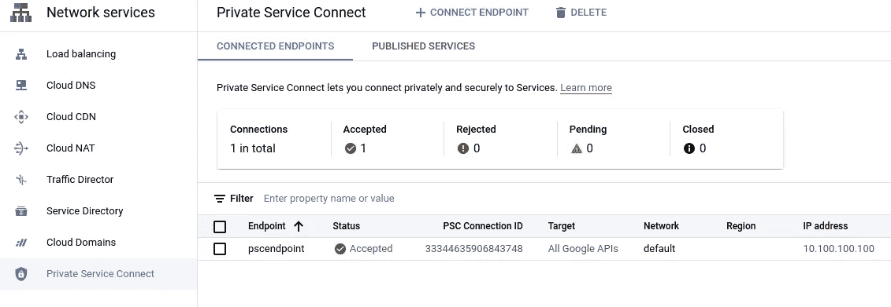

# 从内部调用私有 Google 云功能

> 原文：<https://medium.com/google-cloud/calling-a-private-google-cloud-function-from-on-prem-91eb628c85ac?source=collection_archive---------0----------------------->

通过私有服务连接端点实现私有云功能

许多企业客户来到[Google Cloud Professional Services](https://cloud.google.com/consulting)，询问他们如何以私人方式从本地服务器调用 Google Cloud 功能，而不将其暴露在互联网上。

出于安全原因，他们不想为其云功能提供公共端点(即使可能需要身份验证)，但要求网络流量保持在客户的本地和 GCP 专用网络上。

在创建新的云功能时，您可以将连接入口设置为仅允许内部流量，但如果我们仔细阅读[文档页面](https://cloud.google.com/functions/docs/networking/network-settings#ingress_settings)，它说:“*仅允许来自同一项目中的 VPC 网络或* [*VPC 服务控制周界*](https://cloud.google.com/vpc-service-controls/docs/service-perimeters) *的请求。所有其他请求因出现* `*403*` *错误而被拒绝。*“这意味着我们仍然不能从一个项目中调用我们的函数，这个项目不是我们部署函数的项目。

创建云功能时的入口设置

# 私人服务连接到救援

[Private Service Connect](https://cloud.google.com/vpc/docs/private-service-connect#benefits-apis)(PSC)允许您通过在包含云功能的项目的 VPC 网络中创建的端点来访问 Google 云服务。

用于访问 Google 服务的私有服务连接端点

您可以将请求发送到这个私有服务连接端点的内部 IP 地址，而不是将 API 请求发送到服务端点的公共可用 IP 地址，例如**storage.googleapis.com**。流经此端点的所有调用将表现为好像它们是从同一个项目中发出的。

Google 云控制台中的私有服务连接配置

请注意，这个端点将允许您访问任何 Google 服务，因此您应该设置防火墙规则，禁止那些不应该访问的主机的这种行为。

# 使用一些 DNS 和路由完成设计

既然私有服务连接端点已经准备好接受请求，那么您必须以某种方式将所有云函数调用请求从本地发送到这个 IP 地址。

要做到这一点，您必须配置本地 DNS，使您的特定项目对云功能子域的每个调用最终都解析到您刚刚创建的端点。

您创建的每个 HTTP 云函数(即使是私有的)都会有一个 URL，格式为**https://*YOUR _ REGION*-*YOUR _ PROJECT _ ID*. Cloud functions . net/*Function _ NAME***。
这意味着您必须在本地 DNS 中创建一个条目来翻译**YOUR _ REGION-YOUR _ PROJECT _ id . cloud functions . net**子域以指向私有服务连接端点。

剩下唯一要做的事情就是将流量路由到私有服务连接端点。通常，内部环境将通过 [HA VPN](https://cloud.google.com/network-connectivity/docs/vpn/concepts/overview#ha-vpn) 或[云互联](https://cloud.google.com/network-connectivity/docs/interconnect/concepts/overview)连接到谷歌云。这些连接方法涉及使用云路由器在 Google Cloud 和您的本地环境之间建立 BGP 会话。利用这个 BGP 会话，我们可以向本地公布私有服务连接端点的 IP 地址。

# 给我看看代码！

因为一个例子胜过千言万语，所以我做了一个 Terraform 演示，可以用来模拟我刚才描述的场景。你可以在 GitHub 上找到这个库:[https://GitHub . com/Google cloud platform/cloud-foundation-fabric/tree/master/examples/networking/private-cloud-function-from-on prem](https://github.com/GoogleCloudPlatform/cloud-foundation-fabric/tree/master/examples/networking/private-cloud-function-from-onprem)

# 总结

在这篇文章中，我们看到了如何在你的私有网络中的任何地方调用一个私有的 Google Cloud 函数。

*   私有云功能只能由同一 Google Cloud 项目中的资源调用。
*   Private Service Connect 是一种通过私有端点访问 Google 云服务的便捷方式，我们可以利用它来调用私有云功能。
*   DNS 和路由是任何网络架构的基础，我们利用它们将流量从本地路由到私有服务连接端点。