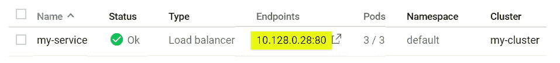

# 从云功能调用内部 GKE 服务

> 原文：<https://medium.com/google-cloud/calling-an-internal-gke-service-from-cloud-functions-2958f9218355?source=collection_archive---------0----------------------->


考虑一个暴露在互联网上的云功能。部署时，我们可以调用该函数，实现逻辑将被执行。现在，假设该函数希望调用一个 REST 公开的服务，该服务被实现为 Kubernetes 中托管的容器。示意性地，我们希望以以下内容结束:


期望的架构/示意图

这表明客户端通过互联网调用云函数。然后，云功能调用托管在一组复制 pod 中的目标服务(`MyService`)。这些豆荚是作为 Kubernetes 服务公开的。Kubernetes 服务只出现在 GCP VPC 公司的内部网络中。显而易见，服务**没有**暴露于互联网，因此服务的受攻击面减小。

这个故事听起来很有道理，但我们还有几个谜题需要解答。第一个是`MyService`服务定义的概念。当我们定义一个 Kubernetes 服务时，我们可以选择如何公开该服务。具体来说，我们有`spec.type`属性，可以是以下之一:

*   `ClusterIP` —默认。该服务在集群网络内可用。
*   `NodePort` —服务存在于每个节点的本地主机的给定端口上。
*   `LoadBalancer` —通过云提供商的负载均衡器公开。
*   `ExternalName` —映射到外部名称。

其中，`LoadBalancer`似乎是显而易见的选择。但是，如果我们使用此选项，默认设置是将服务公开给一个 Internet 稳定的 IP，如下所示:


虽然这在功能上可行，但我们已经将`MyService`暴露在互联网上，并增加了攻击面。解决方案是使用 GKE 提供的 GCP 特定功能，创建一个只对 GCP 内部 VPC 网络开放的负载平衡器。这通过公开具有 VPC 稳定 IP 地址的服务来实现 TCP/UDP 层负载平衡。通过在名为`cloud.google.com/load-balancer-type`的服务描述中添加一个值为`Internal`的`metadata.annotations`条目来启用该特性。

一个示例服务可以是:

```
apiVersion: v1
kind: Service
metadata:
  name: myservice
  annotations:
    cloud.google.com/load-balancer-type: "Internal"
  labels:
    app: myservice
spec:
  type: LoadBalancer
  selector:
    app: myservice
  ports:
  - port: 80
    targetPort: 8080
    protocol: TCP
```

一旦定义完毕，我们现在将拥有一个负载平衡器，当调用它时，它会将流量路由到我们的 pod。负载平衡器的稳定 IP 地址将出现在内部 VPC 网络上。我们的服务不会在互联网上曝光。

在图表中，我们有:


还有一个问题。云功能是一个无服务器组件。这对我们来说意味着，当客户端调用云函数时，云函数在谷歌管理的环境中运行，该环境独立于我们在 GCP 项目中定义的任何其他资源。这包括使用 VPC 网络。默认情况下，云功能根本无法访问该网络。如果它试图到达负载平衡服务的稳定 IP，我们会发现没有到它的路径。谢天谢地，有一个解决方案。VPC 网络中有一个组件叫做 VPC 接入。该组件允许无服务器 GCP 产品(如云功能)与 VPC 网络相关联，以便访问该网络上的 IP 地址的请求能够成功。

我们现在可以从我们的云函数向目标服务发出一个 REST 调用，它将按预期工作。我们要做的最后一个调整是为我们的稳定 IP 注册一个 DNS 条目，这样我们就可以将请求编码到一个逻辑命名的 DNS 实体，而不是一个不透明的 IP 地址。为此，我们将在云 DNS 中使用一个私有区域。最终的结果是我们最初所期望的，并在本系列的原始图表中显示出来。

下面是创建一个示例 Kubernetes 服务并从前面描述的云函数调用它的一步一步的步骤。

1.  创建一个集群

使用云控制台创建一个名为 my-cluster 的集群。


最后，我们单击创建。这将创建我们的集群，需要几分钟时间。

2.创建应用程序

我们想要一个简单的应用程序在我们的豆荚中运行。

```
const http = require('http');
const os = require('os');
const handler = function(request, response) {
    response.writeHead(200);
    response.end("You've hit " + os.hostname() + "\n");
};
var www = http.createServer(handler);
[www.listen(8080);](http://www.listen(8080);)
```

下面是用于构建 docker 映像的 Dockerfile 的相应内容:

```
FROM node:7
ADD app.js /app.js
ENTRYPOINT ["node", "app.js"]
```

3.创建一个 docker 映像并将其放入注册表。

```
gcloud container clusters get-credentials my-cluster --zone us-central1-a
docker build -t gcr.io/[PROJECT]/my-image
docker push gcr.io/[PROJECT]/my-image
```

4.创建一个 Kubernetes 复制集。

用以下内容创建一个名为`replica-set.yaml`的文件:

```
apiVersion: apps/v1
kind: ReplicaSet
metadata:
  name: my-replica-set
  labels:
    app: my-app
spec:
  replicas: 3
  selector:
    matchLabels:
      app: my-app
  template:
    metadata:
      labels:
        app: my-app
    spec:
      containers:
      - name: my-app
        image: gcr.io/[PROJECT]/my-image
```

将此应用于我们的 Kubernetes 集群:

```
kubectl apply -f replica-set.yaml
```

在控制台中，访问 Kubernetes Engine -> Workloads，等待名为`my-replica-set`的工作负载的状态到达`OK`。


此时，吊舱正在运行。

5.创建服务

创建 LoadBalancer 类型的服务，并使用注释声明我们正在使用内部 TCP/UDP 负载平衡器。创建一个名为`service.yaml`的文件，其中包含:

```
apiVersion: v1
kind: Service
metadata:
  name: my-service
  annotations:
    cloud.google.com/load-balancer-type: "Internal"
  labels:
    app: my-service
spec:
  type: LoadBalancer
  selector:
    app: my-app
  ports:
  - port: 80
    targetPort: 8080
    protocol: TCP
```

将此应用于我们的 Kubernetes 集群:

```
kubectl apply -f service.yaml
```

在控制台中，访问 Kubernetes 引擎->服务和入口。等待名为`my-service`的服务到达`OK`状态。



记下 IP 地址。这是可以到达负载平衡器的 VPC 网络上的 IP。

6.创建 DNS 条目

在控制台中，访问网络服务->云 DNS。点击`Create zone`。


将区域类型设置为私有。


点击`Add record set`。


此时，我们已经有了从`myservice.mycompany.internal`到负载平衡器的映射。

7.定义无服务器 VPC 访问。

访问 VPC 网络->无服务器 VPC 访问。单击创建连接器。


8.创建一个调用 REST 服务的云函数。

这是调用云函数时将执行的 JavaScript 代码。我们示例的重点是调用我们的 Kubernetes 服务的 REST 请求:

```
exports.helloWorld = (req, res) => {
  const request = require('request');
  **request('http://myservice.mycompany.internal',** (err, resS, body) => {let message = "Hello from Cloud Function: " + body;
    res.status(200).send(message);
  });
};
```

`package.json`应包含:

```
{
  "name": "sample-http",
  "version": "0.0.1",
  "dependencies": {
    "request": "latest"
  }
}
```

在函数定义中，在“网络”下的“高级选项”中，引用 VPC 连接器:


9.测试功能

我们现在可以调用云函数，并看到内部 Kubernetes 托管的服务正在被调用。

另请参见:

*   [内部 TCP/UDP 负载均衡](https://cloud.google.com/kubernetes-engine/docs/how-to/internal-load-balancing)
*   [中:Google Cloud 上 kubernetes 服务的内部负载平衡](/google-cloud/internal-load-balancing-for-kubernetes-services-on-google-cloud-f8aef11fb1c4)
*   [配置无服务器 VPC 访问](https://cloud.google.com/vpc/docs/configure-serverless-vpc-access)
*   [云功能:连接到 VPC 网络](https://cloud.google.com/functions/docs/connecting-vpc)
*   [使用无服务器 VPC 访问将云功能与计算引擎相连接](https://www.the-swamp.info/blog/connecting-cloud-functions-compute-engine-serverless-vpc-access/)