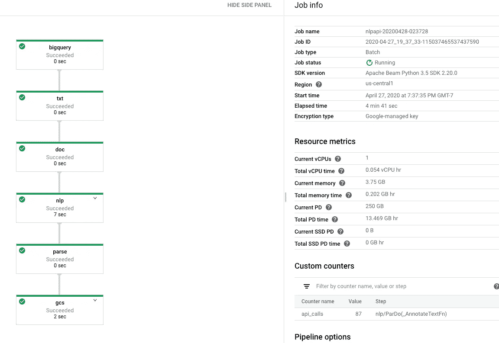
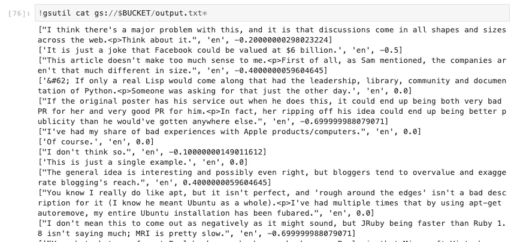

# 从批处理和流 ETL 管道调用 Google Cloud 机器学习 API

> 原文：<https://medium.com/google-cloud/calling-google-cloud-machine-learning-apis-from-batch-and-stream-etl-pipelines-9a789ac6f972?source=collection_archive---------1----------------------->

## Apache Beam 2.20 包括一些方便的 PTransforms

Google Cloud AI 有一些非常方便的“构建块”API，用于自然语言处理、视觉(例如 OCR、图像分类、徽标识别等。)，以及视频智能。

你将经常需要在一堆文档、图像或视频上调用这些 API。有时，这是基于已经收集的数据(“批处理”)，有时，这是基于流数据。从批处理和流管道中一次一个地调用在线 API 需要非常小心，这样才不会触及网络、吞吐量或节流限制。

## 使用 Apache Beam 调用云自然语言 API

幸运的是，Apache Beam 2.20 现在提供了一个方便的 PTransform，可以为您完成所有繁重的工作。要使用它，首先安装 Apache Beam:

```
pip install --upgrade --quiet apache-beam[gcp]
```


明白了吗？图片来自[皮克斯拜](https://pixabay.com/?utm_source=link-attribution&utm_medium=referral&utm_campaign=image&utm_content=3105954)的[彼得·洛马斯](https://pixabay.com/users/Peter-Lomas-5966639/?utm_source=link-attribution&utm_medium=referral&utm_campaign=image&utm_content=3105954)

下面是一个完整的程序，它将在本地对三个句子运行 Apache Beam:

```
import apache_beam as beam
from apache_beam.ml.gcp import naturallanguageml as nlpdef **parse_nlp_result**(response):
    return [
       response.sentences[0].text.content, # first sentence
       [entity.name for entity in response.entities], # all entities
       [entity.metadata['wikipedia_url'] for entity in response.entities], # urls
       response.language,
       response.document_sentiment.score
    ]**features** = nlp.types.AnnotateTextRequest.Features(
    extract_entities=True,
    extract_document_sentiment=True,
    extract_syntax=False
)p = beam.Pipeline()
(p 
 | beam.Create(['Has President Obama been to Paris?', 'Sophie loves walking along the Seine.', "C'est terrible"])
 | beam.Map(lambda x : nlp.**Document**(x, type='PLAIN_TEXT'))
 | nlp.**AnnotateText**(features)
 | beam.Map(**parse_nlp_result**)
 | beam.io.WriteToText('output.txt')
)
result = p.run()
result.wait_until_finish()
```

以上管道中的步骤如下:

1.  创建内存中的集合
2.  将每个句子更改为 NLP 文档对象
3.  [调用 NLP API](https://beam.apache.org/releases/pydoc/2.20.0/apache_beam.ml.gcp.naturallanguageml.html) 来注释文档。在这里(看看传入的特性)，我们正在提取实体和文档情感。
4.  解析 NLP API 的输出(见下文)
5.  将输出写入文本文件

NLP API 的输出如下所示:

```
**sentences** {
  **text** {
    **content**: "I love walking along the Seine."
  }
  sentiment {
    magnitude: 0.699999988079071
    score: 0.699999988079071
  }
}
entities {
  name: "Seine"
  type: LOCATION
  metadata {
    key: "mid"
    value: "/m/0f3vz"
  }
  metadata {
    key: "wikipedia_url"
    value: "[https://en.wikipedia.org/wiki/Seine](https://en.wikipedia.org/wiki/Seine)"
  }
  salience: 1.0
  mentions {
    text {
      content: "Seine"
      begin_offset: 25
    }
    type: PROPER
  }
}
**document_sentiment** {
  magnitude: 0.699999988079071
  **score**: 0.699999988079071
}
language: "en"
```

这就是为什么我能够提取出我想要的片段作为*response . sentences[0]. text . content*和*response . document _ sensation . score*。下面是管道的输出:

```
['Has President Obama been to Paris?', ['Obama', 'Paris'], ['[https://en.wikipedia.org/wiki/Barack_Obama'](https://en.wikipedia.org/wiki/Barack_Obama'), '[https://en.wikipedia.org/wiki/Paris'](https://en.wikipedia.org/wiki/Paris')], 'en', 0.0]
["C'est terrible", [], [], 'fr', -0.8999999761581421]
['Sophie loves walking along the Seine.', ['Sophie', 'Seine'], ['', '[https://en.wikipedia.org/wiki/Seine'](https://en.wikipedia.org/wiki/Seine')], 'en', 0.800000011920929]
```

## 将输入更改为 BigQuery 并在云上运行

在上面的代码片段中，我对内存中的一组句子运行了管道，并使用了 DirectRunner，它在本地运行。让我们将输入更改为 BigQuery，并在云数据流中运行它:

[https://gist . github . com/lakshmanok/a07d 488 a0b 8006 c 26 bdee 0 a 7 effd 6245](https://gist.github.com/lakshmanok/a07d488a0b8006c26bdee0a7effd6245)

管道现在运行在 BigQuery 中 hackernews 注释表的数据流上:



结果看起来像这样:



获得一船评论的情绪有多容易？

尽情享受吧！

## 后续步骤:

*   启动一个 Jupyter 笔记本，在 [AI 平台上笔记本](https://console.cloud.google.com/ai-platform/notebooks)
*   在 GitHub 上运行我的[完整笔记本](https://github.com/GoogleCloudPlatform/ml-design-patterns/blob/master/05_resilience/nlp_api.ipynb)