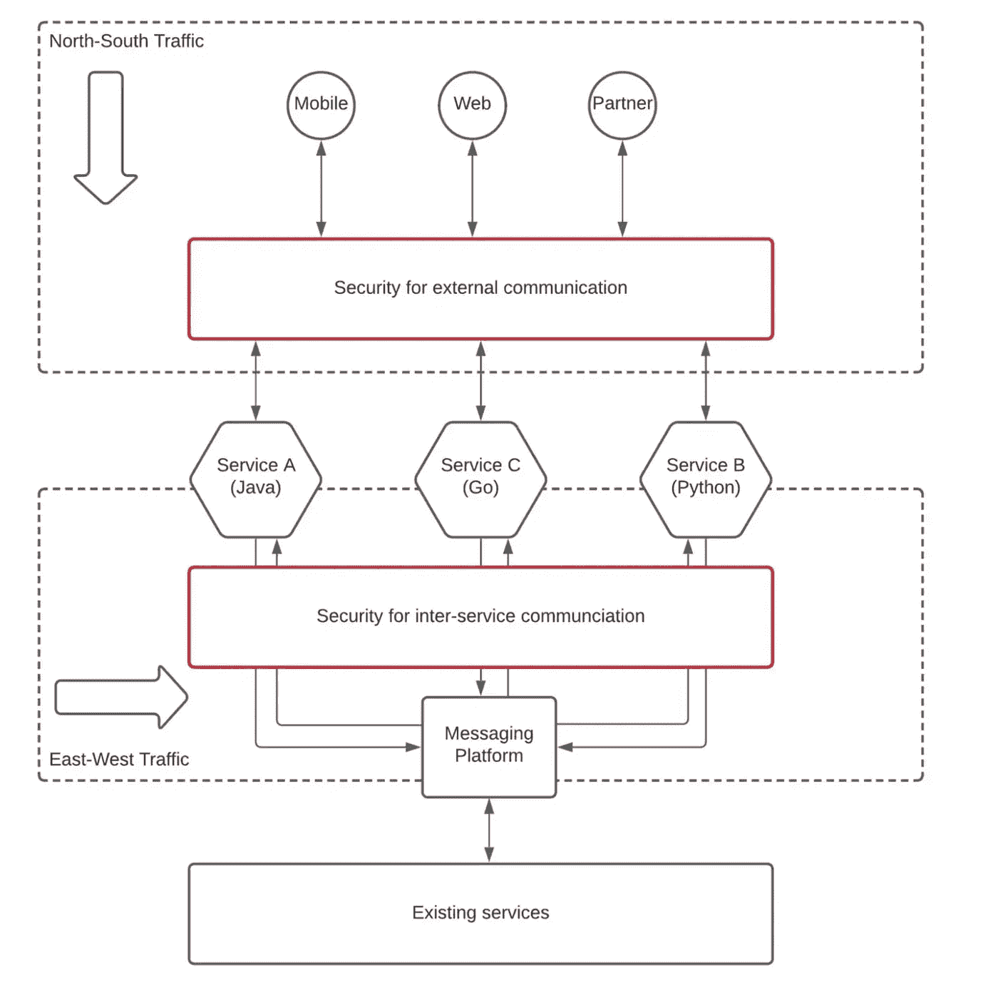
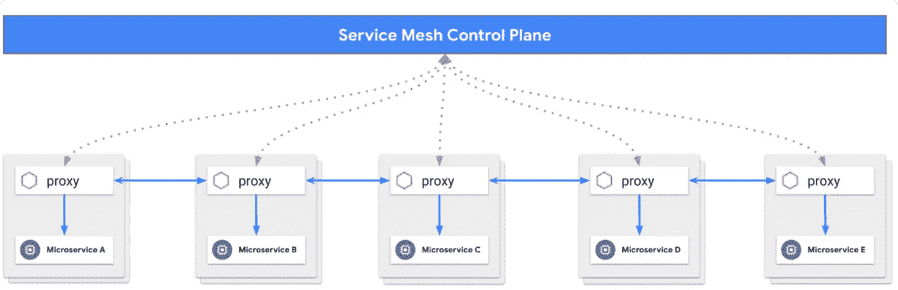
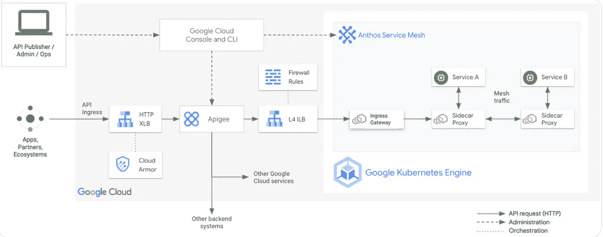

# APIGEE 和 Anthos 服务 Mesh 可以共存吗？

> 原文：<https://medium.com/google-cloud/can-apigee-and-anthos-service-mesh-co-exist-d6022000a6f9?source=collection_archive---------4----------------------->

公司越来越多地采用微服务、容器和 Kubernetes。现代化、提高开发人员生产力、应用程序敏捷性和可伸缩性的需求推动了许多组织的采用。许多公司也开始涉足云计算，并为新的和现有的应用程序和服务采用分布式微服务架构。虽然微服务的架构有助于简化单个服务的创建，但它会导致额外或增加的复杂性，如下所述。

# 安全性

就 monolith 应用程序而言，函数间的调用在 monolith 内部是安全的。在典型的基于微服务的应用架构中，我们可以确定需要实施的两个安全级别，如下图所示。

根据上图，我们需要实现安全性以

*   控制外部消费者的访问(南北交通)
*   控制其他服务的访问(东西向流量)

# 网络弹性

在设计分布式体系结构时，当多个服务进行通信以产生响应时，这可能会导致延迟增加和总响应时间增加。此外，就容错而言，分布式体系结构需要确保一个下游服务中的服务不会导致其他服务中的级联故障。

# 沟通政策

在分布式架构中，一些服务可能成为其他服务的瓶颈或依赖。因此，这需要利用管理所有服务的配额和速率限制的网络策略，以确保恶意服务发出太多调用不会使其调用的服务过载。

# 可观察性

与整体架构相比，微服务架构的可观测性更为重要。在单一应用程序中，日志文件足以识别问题的来源。在微服务架构中，多个服务可以跨越一个请求。延迟、错误和失败可能发生在架构内的任何服务中。开发人员需要日志记录、网络度量、分布式跟踪和拓扑来调查问题并确定问题的位置。

# 解决方案->服务网格

将服务网格添加到基于微服务的应用中，网络和服务运营商可以提高可靠性、增强安全性和合规性，并减少管理环境的时间。正如 Kubernetes 有助于容器编排一样，服务网格有助于标准化服务中复杂的网络功能。服务网格提供对服务到服务事务的深入了解，并简化和管理安全控制，如身份验证、授权和加密。

# APIGEE(X/Hybrid)

组织可以将其微服务作为 API 扩展到外部消费者，如合作伙伴、开发人员、web 应用程序、移动设备和组织内的其他业务部门。API 使得将微服务扩展到具有安全性、可见性和控制的外部合作伙伴和客户变得容易。这就是 API 管理解决方案发挥作用的地方:保护 API 流量不受外部消费者的影响。全生命周期 API 管理工具让开发人员能够安全地访问您的微服务，同时提供工具来通过分析测量 API 消耗。

# 一起更好:API 管理+服务网格

API 网关和服务网格之间的主要区别在于，API 网关是公开 API/Edge 服务的关键部分，而服务网格只是一个服务间通信基础设施，对您的解决方案没有任何业务概念。

谷歌云通过 [Anthos 服务网格](https://cloud.google.com/anthos/service-mesh)提供服务管理功能，通过 [Apigee](https://cloud.google.com/apigee) 提供 API 管理功能，两者紧密结合。这是两种解决方案协同工作的架构图。

API 和微服务对于应用程序现代化都至关重要。通过同时采用 API 管理和服务网格解决方案，IT 团队可以标准化其微服务，并通过针对其 API 的完整生命周期管理和性能分析来了解其运营情况。

Google Cloud 的 Apigee 和 Anthos 服务网格协同工作，使组织能够降低微服务的复杂性并增加其消费，安全地将这些服务扩展到内部和外部开发人员。