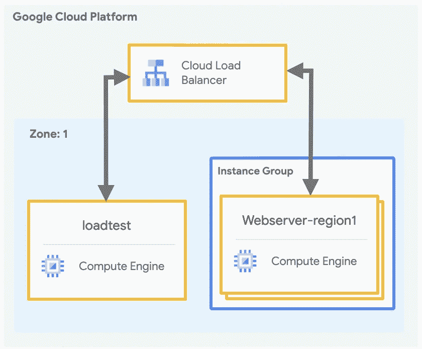
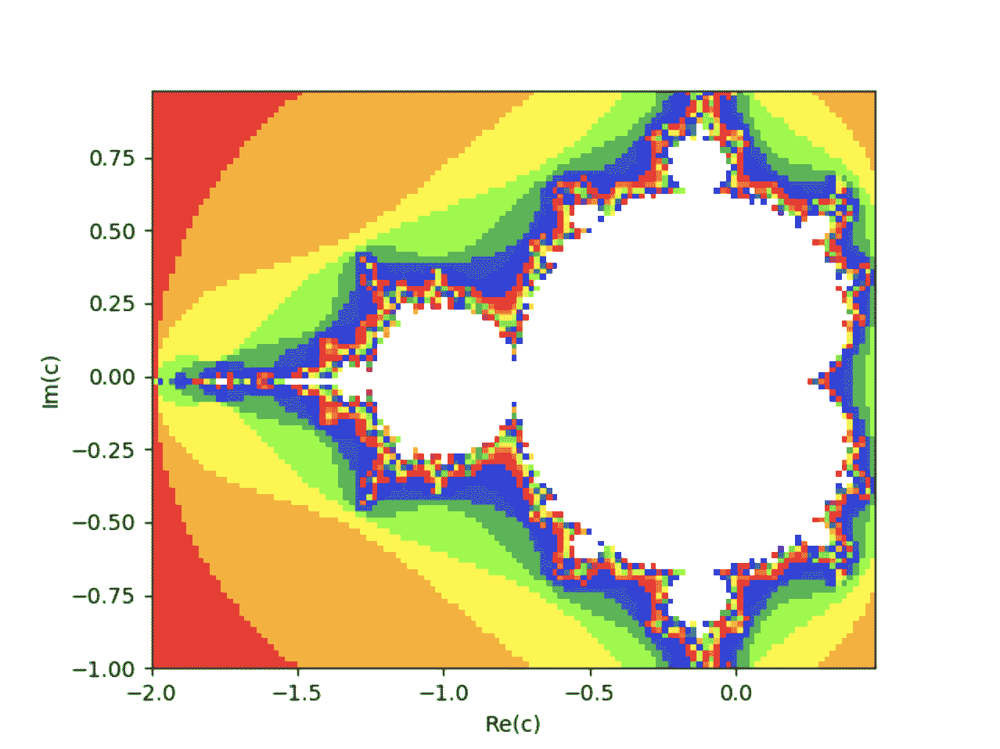
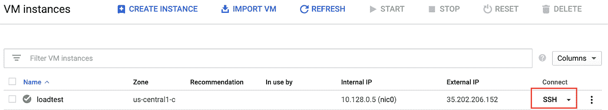
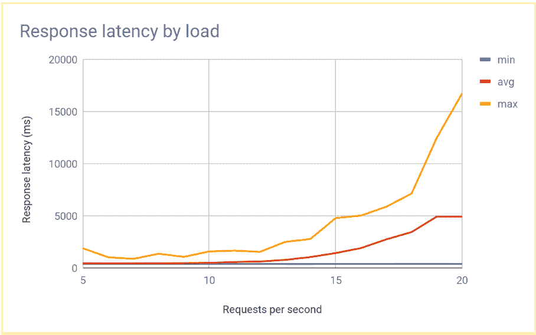
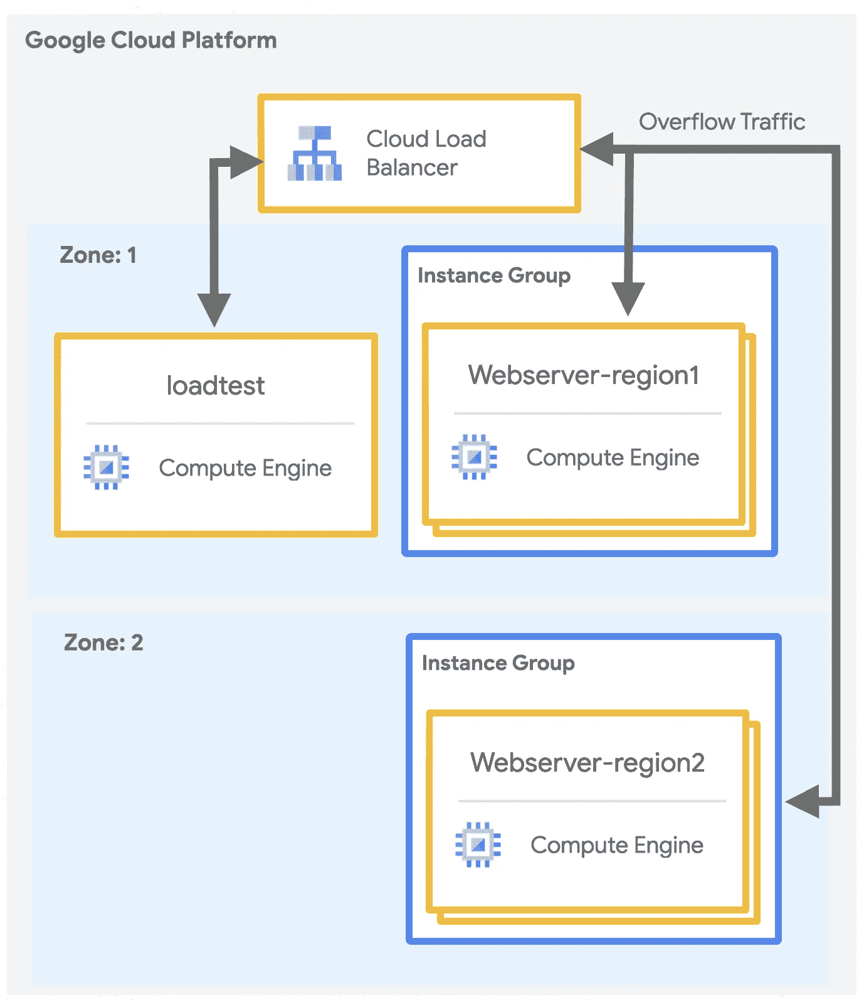
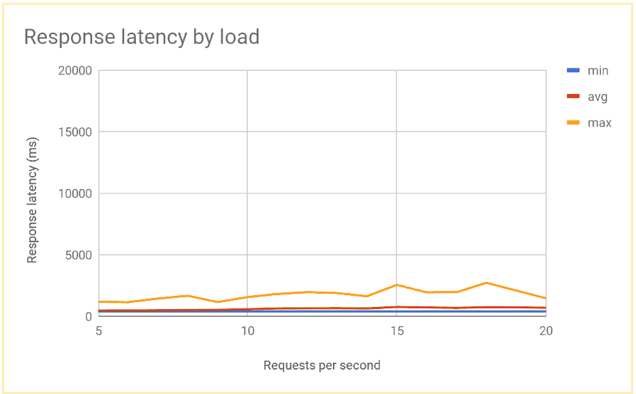

# 负载平衡的容量管理

> 原文：<https://medium.com/google-cloud/capacity-management-with-load-balancing-32bd22a716a7?source=collection_archive---------1----------------------->

## 在云中烹饪

作者:[王从希](https://twitter.com/swongful)，[普里扬卡·韦尔加迪亚](https://twitter.com/pvergadia)

# **简介**

“在云中烹饪”是一个博客和视频系列，旨在帮助企业和开发人员在 Google Cloud 上构建业务解决方案。在这个系列中，我们计划确定开发人员希望在 Google cloud 上构建的特定主题。一旦确定，我们将创建一个关于该主题的迷你系列。

在这个迷你系列中，我们将讨论 Google 云负载平衡。

1.  [选择合适的负载平衡器](/google-cloud/choosing-the-right-load-balancer-9ec909148a85)
2.  [通过全局负载平衡优化应用容量](/google-cloud/application-capacity-optimizations-with-global-load-balancing-e0aa079d2c25)
3.  负载平衡的容量管理(本文)
4.  [GKE 网络端点组的负载均衡](/google-cloud/container-load-balancing-on-google-kubernetes-engine-gke-4cbfaa80a6f6)

在本文中，我们将向您展示如何比较多区域负载平衡器和单区域负载平衡器的性能。我们将通过设置一个简单的 web 服务器来实现这一点，该服务器运行一个计算 Mandelbrot 集合的 CPU 密集型应用程序。

# **查看视频**

# **回顾**

在上一个视频中，我们展示了多区域 [HTTP(S)负载平衡](https://cloud.google.com/load-balancing/docs/https)如何使用区域瀑布算法将流量溢出到下一个最近实例所在的区域。这意味着当涉及到像 Beyond Treat 这样的全球电子商务网站时，使用全球负载平衡器而不是区域负载平衡器会特别有效。使用区域后端的应用程序名义上具有较低的延迟，但它们很容易过载。

让我们通过一个教程来进行真正的测试，该教程展示了云负载平衡如何优化您的全局应用程序容量，从而与大多数负载平衡实施相比，带来更好的用户体验和更低的成本。

在本教程中，您将设置一个简单的 web 服务器，运行一个计算 Mandelbrot 集合的 CPU 密集型应用程序。

1.  首先，使用负载测试工具(httperf)测量单个区域中多个虚拟机实例的网络容量，并测量负载下的响应时间。
2.  然后使用全局负载平衡将网络扩展到多个区域，然后测量服务器在负载下的响应时间，并将其与单区域负载平衡进行比较。执行这一系列测试可以让您看到云负载平衡的跨区域负载管理的积极效果。

# 你将学习和使用的东西

*   了解如何使用负载测试工具([ht perf](https://github.com/httperf/httperf))。
*   用单区域负载平衡测量过载的影响。
*   使用全局负载平衡测量溢出到另一个区域的影响。

您将使用:

*   计算引擎
*   负载平衡和转发规则

[**此解决方案**](https://cloud.google.com/solutions/capacity-management-with-load-balancing) 用于带负载均衡的容量管理

# 启动云外壳实例

1.  使用[PROJECT_ID]的项目 ID 设置您的默认项目:

```
gcloud config set project [PROJECT_ID]
```

2.使用以下内容设置您的默认计算引擎区域(或替换为您的首选区域)，然后将其设置为环境变量供以后使用:

```
gcloud config set compute/zone us-central1-cexport ZONE=us-central1-c
```

# 创建并配置 VPC 网络。

1.  创建用于测试的 VPC 网络:

```
gcloud compute networks create lb-testing --subnet-mode auto
```

2.定义防火墙规则以允许内部流量:

```
gcloud compute firewall-rules create lb-testing-internal \--network lb-testing --allow all --source-ranges 10.128.0.0/11
```

3.定义防火墙规则以允许 SSH 流量与 VPC 网络通信:

```
gcloud compute firewall-rules create lb-testing-ssh \--network lb-testing --allow tcp:22 --source-ranges 0.0.0.0/0
```

# 用单区域负载平衡器测量过载效应

首先，让我们检查一下过载对单区域负载平衡器的影响，比如在本地使用的典型负载平衡器，或者在区域(而不是全局)部署中使用 HTTP(S)负载平衡器。



## 创建单区域 HTTP(S)负载平衡器

首先创建一个单区域 HTTP(S)负载平衡器，具有 3 个固定大小的虚拟机实例。

1.  为安装 Python Mandelbrot 生成脚本的 web 服务器 VM 实例创建一个实例模板。在云 Shell 中运行以下命令:

```
gcloud compute instance-templates create webservers \--machine-type n1-highcpu-4 \--image-family=debian-10 --image-project=debian-cloud \--tags=http-server \--network=lb-testing \--metadata startup-script='#! /bin/bashapt-get -y updateapt-get install -y git python-numpy python-matplotlibgit clone \https://github.com/GoogleCloudPlatform/lb-app-capacity-tutorial-python.gitcd lb-app-capacity-tutorial-pythonpython webserver.py'
```

2.接下来，基于上一步中的模板创建一个包含 3 个实例的托管实例组:

```
gcloud compute instance-groups managed create webserver-region1 \--size=3 --template=webservers
```

3.创建防火墙规则以允许从您自己的计算机对 webserver 实例进行外部访问:

```
gcloud compute firewall-rules create lb-testing-http \--network lb-testing --allow tcp:80 --source-ranges 0.0.0.0/0 \--target-tags http-server
```

4.创建设置 [HTTP 负载平衡](https://cloud.google.com/compute/docs/load-balancing/http#overview)所需的健康检查、后端服务、URL 映射、目标代理和全局转发规则:

```
gcloud compute health-checks create http basic-check \--request-path="/health-check" --check-interval=60sgcloud compute backend-services create web-service \--health-checks basic-check --globalgcloud compute backend-services add-backend web-service \--global --instance-group=webserver-region1 \--instance-group-zone $ZONEgcloud compute url-maps create web-map --default-service web-servicegcloud compute target-http-proxies create web-proxy --url-map web-map`gcloud compute forwarding-rules create web-rule --global \--target-http-proxy web-proxy --ports 80
```

5.获取转发规则的 IP 地址:

```
gcloud compute forwarding-rules describe --global web-rule --format "value(IPAddress)"
```

输出是您创建的负载平衡器的公共 IP 地址。

6.在浏览器中，转到上一个命令返回的 IP 地址。等待几分钟，您应该会看到一个计算出的 Mandelbrot 集合。该映像由新创建的组中的一个虚拟机实例提供。



## 使用负载测试来测试单区域负载平衡器

1.  创建负载测试实例:

```
gcloud compute instances create loadtest --machine-type n1-standard-1 \--network=lb-testing --image-family=debian-10 \--image-project=debian-cloud
```

2.在计算引擎实例页面上 SSH 到负载测试机器:



3.在负载测试实例上，安装 [httperf](https://github.com/httperf/httperf) 作为负载测试工具:

```
sudo apt-get install -y httperf
```

4.通过每秒发送各种请求(RPS)来测试服务器响应。确保您使用的 RPS 值至少在 5 到 20 的范围内。例如，以下命令生成 10 个 RPS。将[IP 地址]替换为步骤 5 中负载平衡器的 IP 地址。

```
httperf --server [IP_address] --num-conns 500 --rate 10 2>&1| grep 'Errors\|ion time'
```

您会看到类似如下的输出:

```
httperf --server 35.190.77.137 --num-conns 500 --rate 10 2>&1|grep 'Errors\|ion time'Connection time [ms]: min 418.6 avg 607.5 max 1963.5 median 522.5 stddev 249.2Connection time [ms]: connect 0.5Errors: total 0 client-timo 0 socket-timo 0 connrefused 0 connreset 0Errors: fd-unavail 0 addrunavail 0 ftab-full 0 other 0
```

当 RPS 的数量超过 12 或 13 时，响应延迟会显著增加。以下是典型结果的可视化:



5.注销负载测试虚拟机实例:

```
exit
```

使用单区域负载平衡器时，随着负载增加超过服务能力，平均请求延迟会达到峰值。对于 10 RPS，平均请求延迟接近 500 毫秒，但对于 20 RPS，延迟为 5000 毫秒。延迟增加了 10 倍，您的用户不会对应用程序超时感到满意。

在下一节中，您将向负载平衡拓扑添加第二个区域，并比较跨区域故障转移如何影响最终用户延迟。

# 测量对另一个区域的溢出效应

如果您使用带有 HTTP(S)负载平衡的全局应用程序，并且如果您在*多个区域*中部署了后端，那么当单个区域中的容量过载时，您会自动将流量溢出到另一个区域。让我们通过在另一个区域添加第二个 VM 实例组来测试这一点。



## 在多个区域创建服务器

让我们在另一个区域添加另一组后端，并为每个区域分配 10 个 RPS 的容量。然后您可以看到当超过这个限制时负载平衡是如何反应的。

1.  在 Cloud Shell 中，选择不同于默认区域的区域，并将其设置为环境变量:

```
export ZONE2=us-east1-b
```

2.在第二个区域中创建一个包含 3 个虚拟机实例的新实例组:

```
gcloud compute instance-groups managed create webserver-region2 \--size=3 --template=webservers --zone $ZONE2
```

3.将实例组添加到最大容量为 10 RPS 的现有后端服务中:

```
gcloud compute backend-services add-backend web-service \--global --instance-group=webserver-region2 \--instance-group-zone $ZONE2 --max-rate 10
```

4.将现有后端服务的最大速率调整为 10 RPS:

```
gcloud compute backend-services update-backend web-service \--global --instance-group=webserver-region1 \--instance-group-zone $ZONE --max-rate 10
```

## 使用负载测试来测试多区域负载平衡器

1.  所有实例启动后，SSH 进入 loadtest VM 实例。
2.  以 10 RPS 运行 500 个请求。将[IP 地址]替换为负载平衡器的 IP 地址:

```
httperf --server [IP_address] --num-conns 500 --rate 10 2>&1| grep 'ion time'
```

3.您会看到如下结果:

```
Connection time [ms]: min 405.9 avg 584.7 max 1390.4 median 531.5 stddev181.3Connection time [ms]: connect 1.1
```

结果类似于区域负载平衡器产生的结果。

4.因为您的测试工具会立即运行满负载，而不会像现实世界的实现那样缓慢增加负载，所以您必须重复测试几次，以使溢出机制生效。以 20 转/秒的速度运行 500 个请求 5 次。将[IP 地址]替换为负载平衡器的 IP 地址。

```
for a in \`seq 1 5\`; do httperf --server [IP_address] \--num-conns 500 --rate 20 2>&1| grep 'ion time' ; done
```

您会看到如下结果:

```
Connection time [ms]: min 426.7 avg 6396.8 max 13615.1 median 7351.5 stddev3226.8Connection time [ms]: connect 0.9Connection time [ms]: min 417.2 avg 3782.9 max 7979.5 median 3623.5 stddev2479.8Connection time [ms]: connect 0.9Connection time [ms]: min 411.6 avg 860.0 max 3971.2 median 705.5 stddev 492.9Connection time [ms]: connect 0.7Connection time [ms]: min 407.3 avg 700.8 max 1927.8 median 667.5 stddev 232.1Connection time [ms]: connect 0.7Connection time [ms]: min 410.8 avg 701.8 max 1612.3 median 669.5 stddev 209.0Connection time [ms]: connect 0.8
```

系统稳定后，平均响应时间在 10 RPS 时为 400 ms，在 20 RPS 时仅增加到 700 ms。与区域负载平衡器提供的 5000 毫秒延迟相比，这是一个巨大的改进，并带来了更好的用户体验。

下图显示了 RPS 使用全局负载平衡测量的响应时间:



# 比较区域与全局负载平衡的结果

> 您刚刚探索了使用区域负载平衡和全局负载平衡时后端对容量的延迟影响！

当流量超过容量时，区域负载平衡解决方案就会过载，因为流量只能流向过载的后端虚拟机实例。这符合传统的本地负载平衡器、GCP 上的网络负载平衡和单个区域中的 HTTP(S)负载平衡的模式。平均延迟增加了 10 倍以上！

同时，多个区域中后端的全局 HTTP(S)负载平衡允许流量溢出到具有可用服务容量的最近区域。这导致了终端用户延迟的可测量但相对较低的增加，并提供了更好的用户体验。如果您的应用程序不能在一个区域足够快地扩展，全局 HTTP(S)负载平衡是最佳选择，因为流量可以重定向到其他区域，有助于避免全面服务中断。

恭喜你。您刚刚比较了区域和全局 HTTP 负载平衡的性能！


关于这个食谱的更多信息，以及浏览完整的教程，请查看这个[解决方案](https://cloud.google.com/solutions/capacity-management-with-load-balancing)。

# 后续步骤和参考:

*   在[谷歌云平台媒体](https://medium.com/google-cloud)上关注这个博客系列。
*   参考:[带负载平衡的容量管理](https://cloud.google.com/solutions/capacity-management-with-load-balancing)
*   跟随[获取云端烹饪](https://www.youtube.com/watch?v=pxp7uYUjH_M)视频系列，订阅谷歌云平台 YouTube 频道
*   想要更多的故事？在[媒体](/@swongra)和[推特](http://twitter.com/swongful)上关注我。
*   请和我们一起欣赏这部迷你剧，并了解更多类似的谷歌云解决方案:)