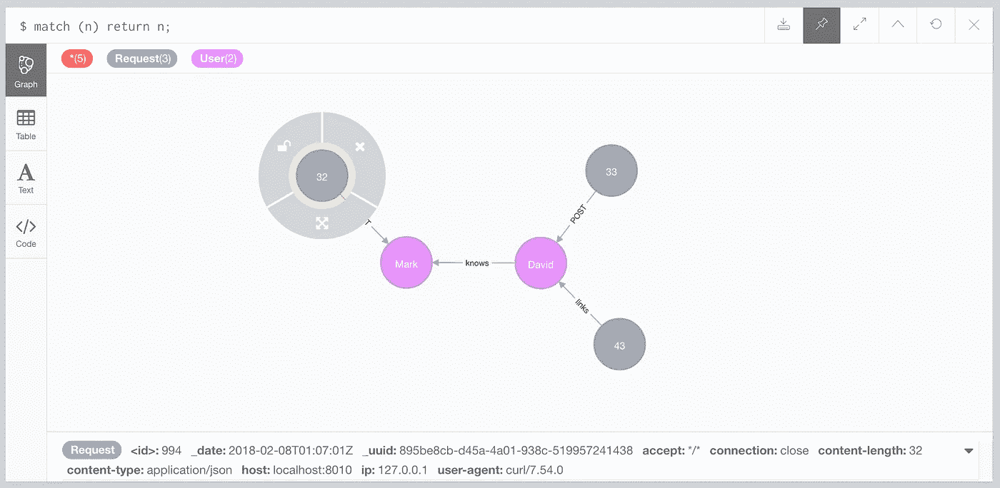

# 使用 Google 云功能和 Neo4j 捕获和集成服务数据

> 原文：<https://medium.com/google-cloud/capturing-and-integrating-service-data-with-google-cloud-functions-and-neo4j-588855f1695e?source=collection_archive---------0----------------------->

[*本文提到的所有代码都可以在 Github*](https://github.com/moxious/neo4j-serverless-functions) *上找到。*

许多服务提供了 webhooks 的机制，或者在某个动作发生时调用一些自定义 URL 的能力。有这么多不同的系统和触发需求，让一个人的专有平台上的事件服从其他地方的发布和订阅类型的行为是一种很好的简单方法。也很简单；一个 HTTP POST，带有一个 JSON 主体。

真实的例子包括:

*   **Trello** ，它将[向您选择的端点发布所有卡片变化和棋盘动作](https://developers.trello.com/page/webhooks)
*   **Slack** ，它有一个 [Outgoing Webhooks](https://api.slack.com/custom-integrations/outgoing-webhooks) 集成，可以为您指定的通道中的任何消息做同样的事情。
*   **谷歌分析**，它允许[向 webhooks 发布提醒](https://metric.live/2017/08/setup-webhook-google-analytics-alerts/)

# 数据捕捉

不仅仅是触发一个定制行为，许多用例都需要先捕获。最近在开发一些可部署到云的映像时，我想要一种简单灵活的方法来从云服务中捕获数据，这使我能够在有人部署我的包时调用 webhook。我知道我想把这个放到 neo4j 图表中，因为我最终需要把这个数据和我的另一个图表整合起来。



Webhook 在 neo4j 中捕获数据

# 谷歌云功能

GCP 的[云功能](https://cloud.google.com/functions/docs/)是一种创建运行在云基础设施之上的独立功能的方式。它们是“无服务器”的，因为 Google 管理所有的供应和运行时部分。开发人员只需编写一组功能，将它们部署到云中，然后在需要时运行它们。理想情况下，这些函数也是无状态的和幂等的，这有助于重用。


当你看到这条标语“响应云中的事件”时…嘿，听起来像网钩！

对我来说，这样做对 webhooks 的好处还在于，我期望的流量相当低(比如说，每天最多几百个)，而且我不想支付 24/7 托管虚拟机的费用，也不想费心去管理那个虚拟机。

# Neo4j 云函数如何捕获数据

与本文相关的代码可以在 github 上的[neo4j-无服务器功能报告中找到。](https://github.com/moxious/neo4j-serverless-functions)

捕捉数据变得相当容易。谷歌的云功能公开了一个 API，用 javascript 看起来像(或者可能是)T2 快车。JS API 。最简单的可能函数如下所示:

```
export.myCloudFunction = (req, res) => {
    return res.status(200).json('All OK!');
};
```

要从一个 webhook 捕获数据，我们需要做的就是查看请求中的数据，比如它的头、它的 POST 主体等等，然后将这些数据转换成一个在 neo4j 中创建数据的 Cypher 语句。[你可以在这里看到代码](https://github.com/moxious/neo4j-serverless-functions/blob/master/services/node.js)。

# 从 Webhook 数据创建节点

假设我们有一个简单的帖子，如下所示:

```
curl -XPOST -H "myheader: foo" -d '{"name":"Bob"}' http://cloud-endpoint/node?label=Person
```

这将变成密码的等价物:

```
CREATE (r:Request { myheader: "foo" })
CREATE (n:Person { name: "Bob" })
CREATE (r)-[:POST]->(n);
```

这是从外部服务、任何服务、任何 JSON 模式捕获可审计数据的简单方法。当然，neo4j 中的属性定义将远非理想，但这可以在事后用 Cypher 进行处理。

# 从 Webhook 数据创建边

对于允许对 URL 进行一些定制的 API，您可以使用相同的方法将图形编织在一起。代码包包括一个单独的“edge”函数，可以给它一个属性名和值，如果适合您的使用，它将用来绘制新的关系。假设在一个社交网络上，有人加别人为好友，你可以调用 webhook:

```
http://cloud-endpoint/edge?fromLabel=Person&fromProp=userid&fromVal=PERSON_A&toLabel=Person&toProp=userid&toVal=PEROSN_B&edgeType=KNOWS
```

这和 cypher 的作用是一样的:

```
MATCH (a:Person { userid: "PERSON_A" }),
      (b:Person { userid: "PERSON_B" })
CREATE (a)-[:KNOWS]->(b);
```

# “无状态函数”并不是真正的无状态

有趣的是，销售无服务器功能的方式之一[涉及到无状态的概念](https://cloud.google.com/functions/docs/concepts/exec#stateless_functions)。理想情况下，你的云函数是一个纯函数，它产生一个值，没有副作用。像往常一样，现实侵入完美…

当然，在幕后，google 必须将这个功能部署到一个实际的容器或服务器上。这可能会造成混乱，因为现实是“无服务器不是无服务器”。所以在现实中，你的代码至少有时是热部署在某个地方，而不是每次都从冷部署，这将是非常低效的，如果你使用重量级运行时(例如 java)，更是如此。

在 google 关于云函数的提示和技巧中，他们指出在未来调用中使用变量重用对象是最佳实践。让我们看看这在 neo4j 案例中意味着什么。

在设置 neo4j 驱动程序的代码模块中，[有一个 persistentDriver 变量](https://github.com/moxious/neo4j-serverless-functions/blob/master/neo4j/index.js)，它在函数调用之间保存一个驱动程序实例。

```
const driverSetup = () => {
    const username = process.env.NEO4J_USER || _creds.username;
    const password = process.env.NEO4J_PASS || _creds.password;
    const uri = process.env.NEO4J_URI || _creds.uri;

    const auth = neo4j.auth.basic(username, password);
    return neo4j.driver(uri, auth);
};

let persistentDriver = null;

exports.getDriver = () => {
    if (!persistentDriver) {
        persistentDriver = driverSetup();
    }

    return persistentDriver;
};
```

根据文档，Neo4j 驱动程序对象是“重量级”的，不应该随意地大量创建，否则会影响性能。通过使用持久驱动程序，数据库连接可以在函数调用之间重用。通过公开一个访问器函数，这个驱动程序在需要的时候被“延迟创建”,而不只是躺着。

如果我们换一种方式呢？如果我们这里没有一个持久的驱动程序，这个函数仍然可以工作；但是我们可能会用连接来破坏数据库。对于几十个请求来说可能是可以的，但是这个函数永远不会扩展到大量的调用。

# 云功能无处不在

本文涵盖了一些如何进行基本集成的简单示例。但是除了两个简单的功能之外，你还可以(人们肯定会这样做)增加更多的功能。

当你理解了这个模型，你将很快看到如何只用云函数来编写整个后端。什么，没有虚拟机？没有码头集装箱？这将是一个“无后端的后端”。[非常禅](http://www.catb.org/esr/writings/unix-koans/)。

不幸的是，事情并不那么简单。正如我在上面描述的那样，谷歌云功能确实有状态和服务器，这是必然的。结果，无服务器抽象有点漏洞，当你进入其中时，知道一些函数生命周期是很好的。我还发现这篇文章很好地概括了你将在这个美丽新世界中面临的一些关键架构问题。与工程中的所有事情一样，这不是什么是对或错，而是对您的用例来说什么是一个好的权衡。

# 后续步骤

在这个简单的例子中，我掩盖了在一个更加繁重的用例中你想要做的一些事情。我只是从一些网站上收集数据，没什么大的工作量。例如:

*   对于许多云功能，您会希望有一个身份存储并验证调用者。这里描述的代码实际上是开放的，所以如果有人知道你的端点，如果他们愿意，他们可以用垃圾填充你的数据库。
*   我们讨论的代码以一种“简单”的格式存储数据，以达到最小的工作量和最大的灵活性。但是随着许多 webhook 调用，它将导致在你的图中有许多断开的节点的情况。如果你想改变迭代地构建一个更好的图，你可以使用提供的代码的变体。所有需要做的就是修改运行的密码以适应你的用例。您也可以编写一个 body transformer 来过滤它接受的 JSON 有效负载，或者转换它们(例如，获取一个 Slack JSON 响应，并将其分成多个对象/节点，比如通道、用户、消息等)。