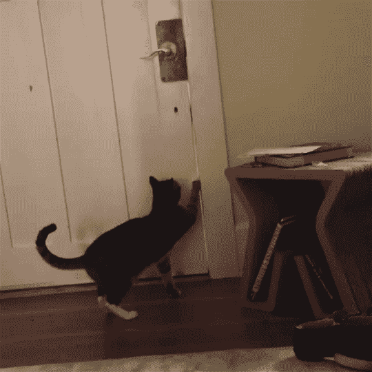

# CatOps:功能框架、云任务和我的猫

> 原文：<https://medium.com/google-cloud/catops-functions-framework-cloud-tasks-and-my-cat-7b32a0b71db6?source=collection_archive---------5----------------------->



我有一个相对简单的问题，我的猫，尼克，可以打开我们的前门，让自己出去。因为他是一只严格的室内猫，这是一个问题。在真正的计算机呆子时尚中，我过度设计了一个解决方案，在指定的延迟后自动锁门，以防止尼克逃跑。我的解决方案涉及到 [Ruby Functions Framework](https://github.com/GoogleCloudPlatform/functions-framework-ruby) ，一个容器， [Google Cloud Run](https://cloud.google.com/run) ，以及 [Google Cloud Tasks](https://cloud.google.com/tasks) 。

虽然这篇文章是关于 CatOps 的，但是这个解决方案更加通用。如果您想在聊天机器人延迟后调用 webhook，发送电子邮件，或者提醒人们他们的购物车中有他们没有购买的商品，您可以做一些类似于这个 CatOps 项目的事情。

# 体系结构

这个项目的硬件和触发器是智能家居应用和 IFTTT 的 Rube Goldberg。但是最重要的是，我的门有一个简单的 HTTP 接口。它们在解锁时会发送一个 HTTP 请求，如果收到特定的 HTTP 请求，就会锁定。

这个项目有趣的部分是写一些代码，我可以在门解锁时调用，然后在 10 分钟后锁定它。听起来很简单，但是我遇到了很多挑战。

首先，我不想设置服务器或构建 Rails 或 Sinatra 应用程序。我知道这应该只有几行代码，感觉有点多余。我还想将函数作为服务使用，这被宣传为简单脚本的理想选择。谷歌的 FaaS 解决方案不支持 Ruby，但谷歌刚刚发布了 Ruby Functions 框架。该框架允许您在任何可以运行容器的地方构建和运行函数。对于在哪里运行我的容器，我有几个选择，但我对[云运行](https://cloud.google.com/run)很好奇，它保证设置起来很简单。

我遇到的第二个问题是开门和锁门之间的 10 分钟延迟。我第一次尝试使用`sleep(600)`，但是 IFTTT 和门的 webhook 接口在等待响应时都超时了。所以我被迫做一些更优雅的事情。

[云任务](https://cloud.google.com/tasks)是解决超时问题的正确方案，原因有几个。首先，HTTP 目标任务类型在任务执行时发送一个 HTTP 请求。我将 HTTP 目标设置为 webhook URL，这使我不必自己编写代码来调用 webhook。其次，Cloud Tasks 允许您安排一个任务在特定的时间执行，所以我可以安排我的锁请求在门打开 10 分钟后运行。

# 代码

Ruby Functions 框架是一个 gem，您可以使用 Bundler 和`Gemfile`以标准方式将它包含在您的项目中。

要编写一个函数，你要将你的代码作为一个块传递给`FunctionsFramework`类的`http`类方法。

```
require "functions_framework"

FunctionsFramework.http("my_function_name") do |request|

  Do Stuff Here

end
```

云任务需要在服务器端进行一些设置，这在文档中有很好的解释[，所以我在这里不再赘述。一旦初始设置完成，创建任务就很简单了。您创建一个具有适当键的散列，并调用`create_task`方法。](https://cloud.google.com/tasks/docs/creating-queues)

```
require "google/cloud/tasks"

tasks_client = Google::Cloud::Tasks.new
PARENT = tasks_client.queue_path(PROJECT, COMPUTE_REGION, QUEUE_NAME)

task = {http_request: {http_method: "POST"}}
task[:schedule_time] = {seconds: (Time.now() + 600).to_i}
task[:http_request] = {url: URL_GOES_HERE}

response = tasks_client.create_task(PARENT, task)
```

我需要做的最后一件事是添加一些配置。我需要知道是前门还是后门触发了该功能，这样我就知道延迟后该锁哪扇门。我设置了一个 IFTTT 触发器来发送一个名为“door”的参数，它可以是“front”也可以是“back”。因为请求对象是`Rack::Request`的一个实例，所以您可以像往常一样通过`params`方法访问参数。最后，出于灵活性和隐私的原因，我将锁门的 URL 提取到一个环境变量中。

下面是函数的主体。要查看设置，您可以查看 GitHub 上的文件。

```
FunctionsFramework.http("lock_door") do |request|
  task = {http_request: {http_method: "POST"}}

  door = request.params["door"]

  if door == "back" then
    task[:schedule_time] = {seconds: (Time.now() + DELAY_BACK).to_i}
    task[:http_request] = {url: BACKDOOR}
  elsif door == "front" then
    task[:schedule_time] = {seconds: (Time.now() + DELAY_FRONT).to_i}
    task[:http_request] = {url: FRONTDOOR}
  end

  begin
    response = tasks_client.create_task(PARENT, task)
  rescue Exception => e
    FunctionsFramework.logger.error "Exception creating task"
  end

  FunctionsFramework.logger.info "Created task #{response.name}"
  "Created task #{response.name}"
end
```

# 测试

功能框架 gem 附带了我能够使用的测试支持。因为我的代码也使用云任务，所以我需要为这些调用创建一个测试 double，以防止我的测试命中我的生产任务队列。

这是我为云任务客户端创建的测试替身。

```
Response = Struct.new(:name) { }

class TasksClientStub
  attr_accessor :task_history, :project, :location, :queue

  def initialize
    @task_history = Hash.new { |h, k| h[k] = [] }
  end

  def create_task parent, task
    @task_history[parent] << task

    Response.new("/#{task_history.length}")
  end

  def queue_path project, location, queue
    @project = project
    @location = location
    @queue = queue

    "projects/#{project}/locations/#{location}/queues/#{queue}"
  end
end
```

double 包含我在函数中调用的方法，`initialize`、`create_task`和`queue_path`。在内部，它将任务队列表示为数组的散列，因此我可以看到我的函数排队的任务，并验证它们是正确的。我还创建了一个名为 response 的结构作为`Rack::Response`的双测试，因为我不需要 Rack 中的所有方法和字段。

有了创建的替身，我就可以编写测试了。我的代码有单独的前门和后门分支，所以我为每个分支编写了一个测试。这是前门的测试。后门案例的测试是类似的。

```
require "functions_framework/testing"

def test_function_creates_correct_task_for_front_door
  task_stub = TasksClientStub.new

  Google::Cloud::Tasks.stub :new, task_stub do

    load_temporary "locker.rb" do
      request = make_post_request "http://example.com:8080/", "door=front"

      response = nil

      _out, err = capture_subprocess_io do
        response = call_http "lock_door", request
      end

      assert_equal 200, response.status

      parent = task_stub.task_history.keys.first
      assert_equal "projects/thagomizer-home-automation/locations/us-central1/queues/door-locker", parent

      task = task_stub.task_history[parent].first

      assert_match /front/, task[:http_request][:url]
    end
  end
end
```

在第 6 行，我使用 Minitest 的 stub 方法让函数使用 test double。然后在第 8 行，我加载了函数文件。在这个块中，我使用函数框架助手方法`make_post_request`来构建一个 post 请求，其中包含函数需要的参数`door=front`。要调用这个函数，您可以使用函数框架测试包中的`call_http`助手和`capture_subprocess_io`。最后，断言验证函数是否成功返回，验证队列/父队列是否设置正确，并最终确保为前门请求创建的任务对象是正确的。

# 部署和结论

本系列的下一篇文章将解释如何对 Google Cloud Run 进行初始部署。它还将向您展示如何在 Cloud Build 上为任何 Ruby 应用程序设置基本的 CI / CD。但是如果你非常想继续前进，你可以按照功能框架的[自述文件](https://github.com/GoogleCloudPlatform/functions-framework-ruby)进行初始手动部署。

在结束这篇文章之前，我想说清楚这篇文章的整个前提是荒谬的。对于有问题的猫，一个更直接，也可能更便宜的解决办法是买一个他打不开的新门把手。但是，我对这种纯粹荒谬的情景感到高兴。我也在环境中学习了一些新技术。我通常发现，当我在解决一个我关心的问题时，我会比从教程中复制和粘贴代码学得更好。即使我的特定用例很荒谬，一个事件触发另一个事件倒计时的潜在场景也是我一次又一次遇到的。有很多严重的业务问题可以使用类似于我的 CatOps 项目的代码来解决。

*原载于 2020 年 4 月 22 日 https://www.thagomizer.com**[*。*](https://www.thagomizer.com/blog/2020/04/22/catops-responding-to-external-events-with-cloud-functions-cloud-tasks.html)*