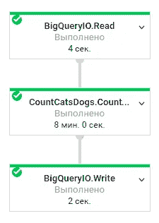
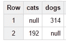

# 通过 Reddit、Google BigQuery、云视觉 API 和云数据流，猫对狗

> 原文：<https://medium.com/google-cloud/cats-vs-dogs-with-reddit-google-bigquery-cloud-vision-api-and-cloud-dataflow-cb2d83d18a9c?source=collection_archive---------4----------------------->

嘿！

如果你喜欢可爱动物的精彩图片，那么你可能已经知道有一个包含大量此类图片的子网站[https://www.reddit.com/r/aww/](https://www.reddit.com/r/aww/)

看着一只像人一样坐着的猫，我问自己是否有可能找出谁更可爱:猫还是狗。

事实证明，如果你能访问谷歌云，这没什么大不了的。

计划是:

1.  从 https://www.reddit.com/r/aww/[获取 500 张最新图片](https://www.reddit.com/r/aww/)
2.  将它们发送到云视觉 API 并取回标签
3.  数数猫和狗的标签
4.  利润！

幸运的是 [Felipe Hoffa](https://medium.com/u/279fe54c149a?source=post_page-----cb2d83d18a9c--------------------------------) 已经提供了 reddit 的数据集，所以我们不需要上传数据到 BigQuery。

查询非常简单:

```
SELECT url FROM [fh-bigquery:reddit_posts.2016_08] WHERE subreddit="aww" and url contains 'imgur' order by created_utc desc LIMIT 500
```

我们将使用 Imgur 图像，只是为了简化数据流的代码。

管道看起来像:

CountLabels 转换:

您可以在 GitHub 上找到整个项目:

[](https://github.com/EgorZhuk/reddit-cats-dogs/blob/master/src/main/java/org/egorzhuk/reddit/catsdogs/CountCatsDogs.java) [## EgorZhuk/Reddit-猫-狗

### 在 GitHub 上创建一个帐户，为 reddit-cats-dogs 的发展做出贡献。

github.com](https://github.com/EgorZhuk/reddit-cats-dogs/blob/master/src/main/java/org/egorzhuk/reddit/catsdogs/CountCatsDogs.java) 

生成虚拟机、从 BigQuery 读取数据、下载图像、用计算机视觉标记它们并发送回 BigQuery 需要 8 分钟。我相信在我的管道中还有很多需要改进的地方。



数据流管道

好了，是时候查询结果表了

```
SELECT cats, dogs FROM
(SELECT SUM(count) as dogs FROM [bq-playground-1366:reddit.cats_dogs_result] where description contains ‘dog’ or description contains ‘puppy’),
(SELECT SUM(count) as cats FROM [bq-playground-1366:reddit.cats_dogs_result] where description contains ‘cat’ or description contains ‘kitten’)
```



猫对狗

现在可以肯定地说，狗比猫可爱得多。