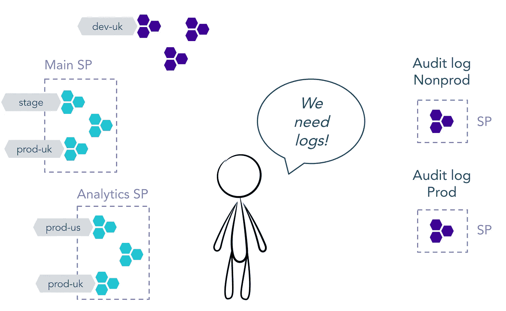
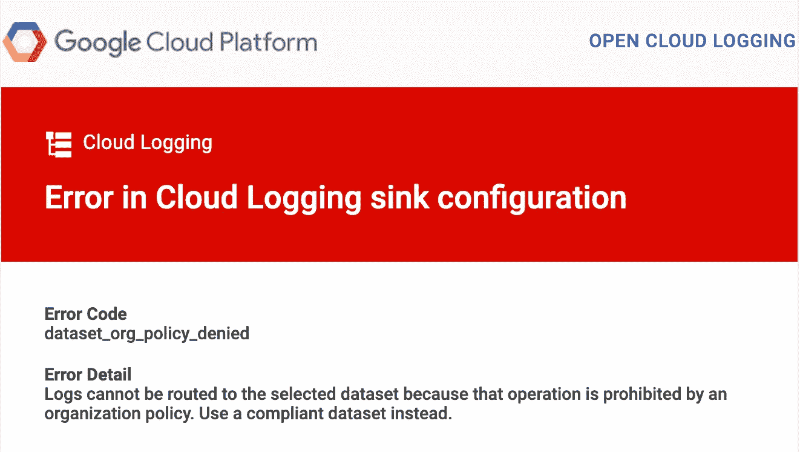
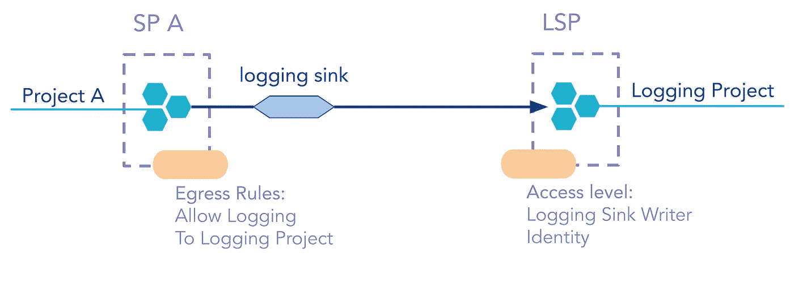
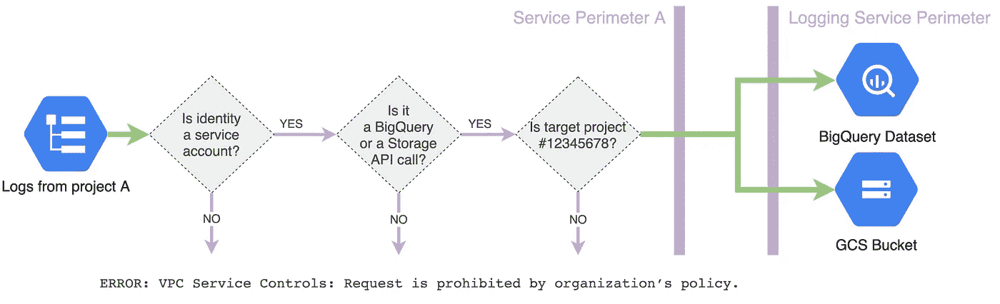
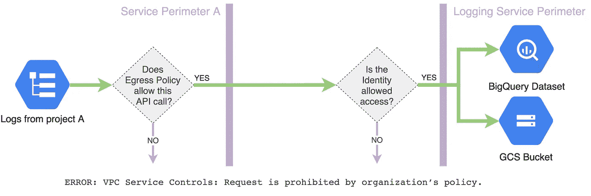
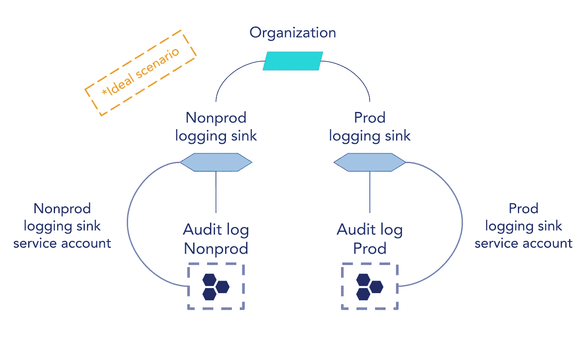
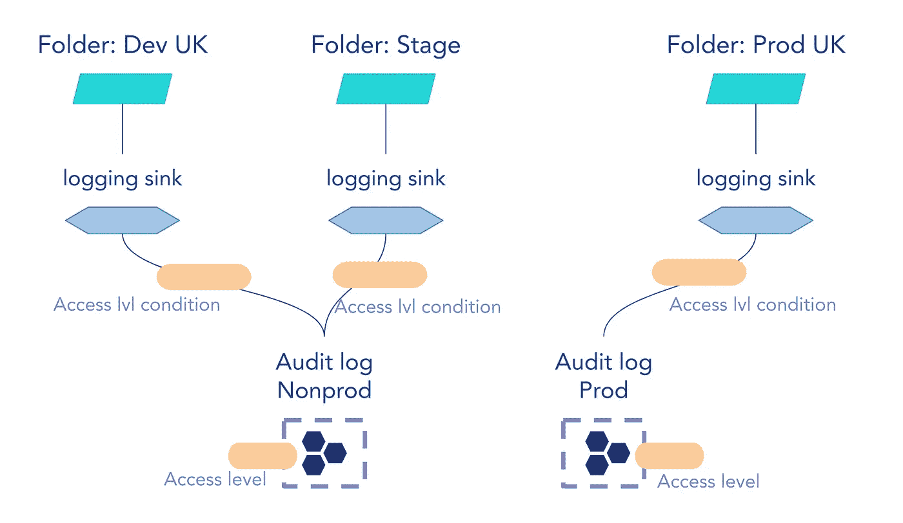
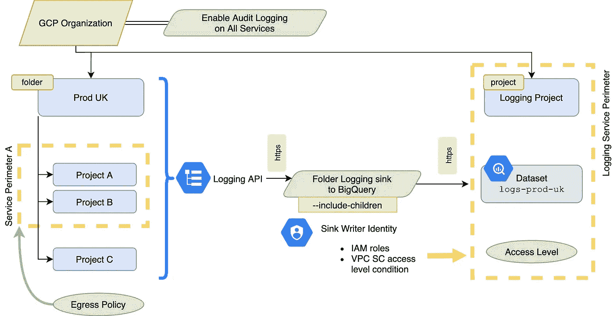
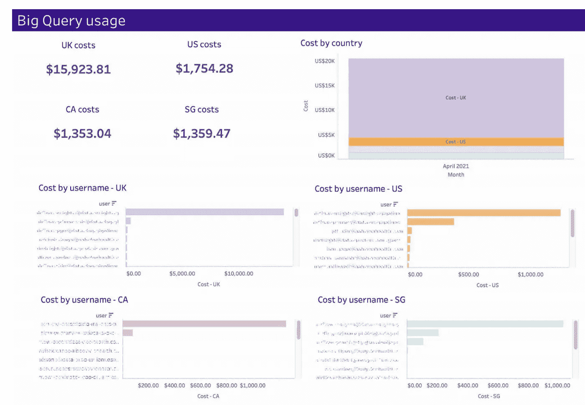

# 在 VPC 服务控制的安全环境中，在 GCP 集中审计日志

> 原文：<https://medium.com/google-cloud/centralised-audit-logs-in-gcp-in-a-secure-environment-with-vpc-service-controls-5a25cd00441?source=collection_archive---------0----------------------->

**理论上，建立 GCP 伐木汇相对容易。实际上，一旦涉及到 VPC 服务控制，您会突然发现自己被所有“如何做”的教程拒之门外——它们很可能不适合您的安全设置。**

但是有希望:)

***更新 2023:****GCP 有了一种从集中日志中获取洞察的新方法——日志分析！在* [*这篇文章*](/google-cloud/centralised-audit-logs-in-google-cloud-the-new-way-log-analytics-4b8a1fb195e) *里读到了关于它的一切。*

在本文中，您将了解如何在拥有 VPC 服务控件的组织中设置聚合日志，并找到一个 [Terraform 模块](https://github.com/ngodec/terraform-gcp-audited-folder)，它可以让您自动设置自己的 Google 云基础架构。

首先，让我们了解一下基础知识:什么是 GCP 审计日志记录、集中式日志记录和日志接收器。

[审计日志](https://cloud.google.com/logging/docs/audit)是一项服务，记录您的云资源中与管理活动事件、数据访问、系统事件和策略违规相对应的 API 调用。这是为了监控云中的活动而需要保存的数据:**谁在什么时候做了什么**。当您想要集中存储这些日志时，GCP 为您提供了一种易于配置的路由日志的方式，称为 [**日志接收器**](https://cloud.google.com/logging/docs/routing/overview) 。

为了获取日志，您需要执行以下操作:

1)在您的项目中启用审计(我们更喜欢将其设置为`ALL_SERVICES`)

2)创建日志接收器，将日志发送到[选择的存储解决方案](https://cloud.google.com/logging/docs/routing/overview#destinations)

您可以在四个级别配置日志接收器:

1.  项目
2.  文件夹
3.  组织
4.  账单账户

每个接收器类型捕获其资源(项目/文件夹/组织/计费帐户)内的所有日志，加上来自所有子项目(文件夹和项目)的日志，如果您将特殊标志`include_children`设置为 true。

# 组织要求

现在让我们讨论一下我们公司内部对审计日志及其收集的需求。这些反映了一般的架构选择，以及我们必须遵守的法规要求:

*   所有审计日志必须集中存储在**一个独立的 GCP 项目**
*   日志包含敏感数据，如电子邮件和 IP 地址，因此需要使用 [**VPC 服务边界**](https://cloud.google.com/vpc-service-controls/docs/overview) 进行保护
*   存储:用于分析的 **BigQuery** 和用于长期存储的 **GCS**
*   来自不同**环境**的日志:开发、阶段、生产和**位置**:英国、美国、加拿大—**必须分开存储**
*   **我们不需要存储 Kubernetes 和 Cloud Composer 日志，也不需要存储来自我们的安全扫描软件的日志**

****

**一个具有多个环境、GCP 项目、VPC 服务边界和在一个中心位置审计日志的要求的组织的代表性方案**

# **挑战**

**我们在 GCP 的大部分项目都位于 VPC 服务区内；但不是全部。例如，开发项目，或者用于地图和翻译 API 的项目，不包含敏感数据，并且不需要在边界内。我们限制的 API 包括:**

```
BigQuery
Storage
Logging
Containers
```

**这造成了一个挑战，因为我们的项目和审计日志项目(本身在一个单独的边界中)之间的数据流被阻塞，除非我们在它们之间建立服务边界桥。在第一次尝试中，我们选择的正是这个:项目记录汇和桥。**

**然而，**并没有起作用**:因为不在服务边界内的项目不能被添加到桥中，所以没有办法用边界日志接收器连接非边界项目。**

****

**一封错误邮件，由 Google 友好地发送给我们云管理员组的每一个人👀注意:出于说明和隐私目的，内容已被修改**

**这样的设置也带来了安全风险:比如说，你在一个边界中有项目 A 和 B，在另一个边界中有项目 C 和 D；他们不能互相交流。在使用审计日志边界创建网桥时，很容易发现这一点，并将所有 A、B、C 和 D 添加到一个网桥中，从而允许通信。**

****

# **解决方案**

**2021 年 2 月，谷歌发布了 VPC 服务控制套件的一个奇妙特性:[入口和出口规则](https://cloud.google.com/vpc-service-controls/docs/ingress-egress-rules)。这允许您指定规则，在这些规则下，允许对受限服务的 API 调用穿越外围边界。这些规则扩展了现有的访问级别功能，在 Terraform 中可用，其中一个记录在案的用例是[集中伐木](https://cloud.google.com/vpc-service-controls/docs/secure-data-exchange#allow_projects_from_multiple_perimeters_to_share_logs_in_a_separate_perimeter)！**

**它是这样工作的:**

****

**该图说明了不同 VPC SC 边界之间的日志记录接收器，使用允许日志进入日志记录 SP 的访问级别和允许日志退出原始 SP 的出口规则的组合**

**你有一个常规的项目 A，在一个服务区内有一个测井槽；和一个日志记录项目，内部服务边界 LSP。**

****为了实现两者之间的通信，您将:****

1.  **允许*日志*(以及存储/bigquery，如果你在那里写的话)API 调用*出口*VPC SC 服务边界*起点*带有**出口策略****
2.  **允许记录接收器写入者身份为*输入*具有**访问级别**的*记录*服务边界**

**下面是当您想要将日志记录接收器设置为 BigQuery 和 Storage 时出口策略的样子，日志记录项目编号为`12345678`:**

```
egressPolicies:
 — egressFrom:
   identityType: ANY_SERVICE_ACCOUNT
 egressTo:
   operations:
   — methodSelectors:
     — method: '*'
     serviceName: bigquery.googleapis.com
   — methodSelectors:
     — method: '*'
     serviceName: logging.googleapis.com
   — methodSelectors:
     — method: '*'
     serviceName: storage.googleapis.com
   resources:
   — projects/12345678
```

***注意:在撰写本文时，BigQuery 不支持特定于方法的出口规则限制。***

****

**服务边界上的出口策略的逻辑 A:仅当日志由服务帐户签名、被写入 BigQuery 或 GCS 并被发送到 GCP 项目#12345678 时，才允许它们离开边界**

**如果您没有使用 Terraform，您可以通过将上面的策略保存到`logsegress.yaml`并运行以下命令来应用它:**

```
gcloud beta access-context-manager perimeters update $SERVICE_PERIMETER_NAME --set-egress-policies=logsegress.yaml
```

**我们一会儿将通过地形设置。**

**对于允许日志接收器的写标识将数据写入日志项目的访问级别，我们只需列出相关日志接收器的标识作为访问级别的成员:**

```
echo "- members:
    - serviceAccount:f123456345-09876@gcp-sa-logging.iam.gserviceaccount.com
    - serviceAccount:f0987654345-2345@gcp-sa-logging.iam.gserviceaccount.com" > CONDITIONS.yaml gcloud access-context-manager levels create logging_al \
   --title logging_al \
   --basic-level-spec CONDITIONS.yaml \
   --combine-function=OR \
   --policy=0987654321
```

**请注意，服务帐户电子邮件是由 GCP 自动生成的，我们将真正受益于 Terraform 自动化这一步骤的能力。**

****

**当我们在上面的图表中添加一个访问级别时，我们得到了一个额外的检查，允许数据进入日志服务边界**

# **让我们从整个组织获取日志**

**以下是建议的设计:**

****

**在组织级别上创建 2 个日志记录接收器将是最干净的解决方案:2 个带有仔细校准的过滤器的接收器、2 个服务帐户、2 个要管理的访问级别**

**在组织级别创建两个日志接收器是最干净的解决方案:**

*   **2 个水槽，配有精心校准的过滤器**
*   **2 个服务帐户**
*   **2 个访问级别**
*   **其他周界各有一个出口政策。**

**如果您有一个一致的方法将项目过滤为生产和非生产，这就足够简单了。但是如果你没有呢？**

**或者您需要将日志分成更细粒度的数据集，如“环境-位置”或“部门”？**

## **输入文件夹**

****

**GCP 文件夹、文件夹登录接收器、VPC SC 访问级别和集中登录项目**

**这里的想法是创建顶级文件夹来表示您需要的环境(和日志)的粒度；为每个文件夹创建一个文件夹日志接收器；并在您的组织中强制执行一个策略，规定项目只能在这些顶层文件夹中的一个下创建！**

****

**一个 Google 云组织的集中式日志设置的架构图，带有一个示例 Prod UK 环境**

# **使用 terraform 实现 it 自动化**

**本节描述了创建文件夹和记录接收器的设置，并假设您熟悉 terraform，并且正在使用 0.13+版。**

**为了自动设置跨边界日志接收器所需的一切，我们需要一个模块来创建:**

*   **一个文件夹**
*   **伐木水槽**
*   **必要的 IAM 权限**
*   **必要的[访问级别条件](https://registry.terraform.io/providers/hashicorp/google/latest/docs/resources/access_context_manager_access_level_condition)**

**以下是完整的模块供您使用:[terra form-GCP-audited-folder](https://github.com/ngodec/terraform-gcp-audited-folder)**

**本模块假设您已经决定了哪个 GCP 项目将托管您的聚合日志(您的`logging project`)，创建了一个 BigQuery 数据集或一个 GCS 存储桶来将日志流式传输到其中，并且有一个 VPC 服务边界，其访问级别保护您的日志记录项目。**

**对于每个文件夹，您需要提供以下输入:**

*   **`folder_name`**
*   **`parent_id`格式`folder/12345`或`organization/6789`**
*   **`logging_project_id`**
*   **BigQuery 和/或云存储的目标日志配置:数据集/存储桶名称、可选的[日志过滤器](https://cloud.google.com/logging/docs/routing/overview#inclusion-filters)和可选的[排除项](https://cloud.google.com/logging/docs/routing/overview#exclusions)**
*   **格式`accessPolicies/${org_access_policy_number}/accessLevels/${access_level_name}`中的`logging_access_level_name`**

```
module "folder" {
  source = "git@github.com:ngodec/terraform-gcp-audited-folder.git"
  folder_name = "My Folder"
  parent_id = "folders/123456"
  logging_project_id = "audit-logs-prod"
  bigquery_logging_sink = {
      dataset_id = "logs"
      filter = ""
      exclusions = []
    }
  logging_access_level_name = "accessPolicies/123456/accessLevels/logs-access-level"
}
```

**您可以跳过日志变量，只提供文件夹名称和父文件夹，在这种情况下，模块将只创建文件夹，而不创建日志接收器。这样，您就可以使用同一个模块来管理所有文件夹，而不仅仅是顶级文件夹:**

```
module "folder" {
  source = "git@github.com:ngodec/terraform-gcp-audited-folder.git"
  name = "My Folder"
  parent = "folders/123456"
}
```

**现在，您在审计文件夹中创建的所有项目都将把它们的日志传送到您选择的目的地。我喜欢使用 BigQuery 作为我的日志目的地——它可以实现一些很酷的东西，比如威胁分析和 Bigquery 使用仪表板，就像这样(所有数字都是随机生成的):**

****

**基于审计日志数据构建的 BigQuery 使用情况仪表板。这里所有的数字都是随机生成的**

**唷。安全会让事情变得很复杂，对吧？工程学的美妙之处在于为最复杂的问题找到优雅的解决方案。**

**你有什么问题吗？不要犹豫，在下面发表评论或在 [Twitter](https://twitter.com/ouvessvit) 上@我。**