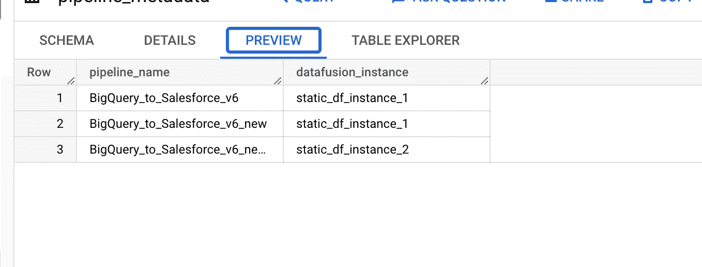

# 用于数据融合管道监控的集中式仪表板

> 原文：<https://medium.com/google-cloud/centralised-dashboard-for-data-fusion-pipeline-monitoring-90dc6a5797cf?source=collection_archive---------11----------------------->

[云数据融合](https://cloud.google.com/data-fusion)是一种基于 GUI 的数据集成服务，用于构建和管理数据管道。它基于 [CDAP](https://github.com/cdapio/cdap) ，这是一个为内部和云资源构建数据分析应用的开源框架。它为 GCP、其他公共云和内部资源提供了各种现成的连接器。

**用例**

客户有多个数据融合实例，部署了 2500 多个数据融合管道。每个实例都有多个名称空间来在功能上隔离管道。

我们可以想象运营团队管理如此庞大的部署所涉及的复杂性。为了更好地理解它，让我们看看在数据融合实例中如何管理管道，


数据融合实例中的命名空间


命名空间“默认”下的管道

我们可以看到，必须打开每个名称空间才能看到所有部署的管道及其运行状态。当名称空间的数量很大并且每个名称空间包含数百个管道时，这变得复杂。

简化流程，减少运营团队的痛苦。我们已经开发了一个解决方案，我们将在这个博客中详细讨论。

**解决方案**

在 data studio 上构建一个集中的监控仪表板。Dashboard 显示跨数据融合实例运行的所有管道，并提供各种过滤器来查看基于特定日期、基于实例名称等的管道。

现在让我们看看我们是如何构建这个控制面板的，在非常高的层面上，解决方案涉及创建一个基于日志的 Bigquery 接收器，并使所有数据融合管道日志在 BQ 表中可用。准备一个视图查询，该查询将被提供给 data studio 报表以呈现仪表板。

1.  创建 BQ 日志接收器
2.  创建 BQ 视图
3.  创建映射 BQ 表
4.  构建 data studio 仪表板

让我们深入研究上面提到的每一个步骤，

**创建 BQ 日志接收器**

1.  在云控制台中，转到日志记录>日志浏览器页面。
2.  选择现有的云项目、文件夹或组织。
3.  打开日志浏览器主页后，单击左侧窗格中的日志路由器，然后单击页面顶部可见的“创建接收器”。
4.  提供接收器名称和描述。
5.  选择“BigQuery dataset”作为接收器目标，并选择现有数据集或从提供的选项中创建新数据集。
6.  在下一个选项“选择要包含在接收器中的日志”中，为数据融合管道日志提供过滤器，即

日志名:“数据融合-管道-日志”

7.单击“创建接收器”按钮，等待接收器成功创建。

这将把所有数据融合管道日志推送到一个 BigQuery 表中。对于这篇博文，我们假设表的名称是 **DF_PIPELINE_LOGS。**下面是该表的样本 o/p


BQ 表—数据融合管道日志

**BQ 元数据表** —数据融合实例和管道映射的映射表

如果所有管道都部署并运行到单个数据融合实例，则这可能是一个可选表。然而，在我们的用例中，管道被分配给多个数据融合实例。因此，准备一个映射表来将管道与部署它们的数据融合实例进行映射。

对于我们的 blogpost，我们将此表称为**DF _ INST _ 管道 _ 注册表**，下面是示例条目。



BQ 映射表

**注意**:当管道移动到不同的实例时，该表必须手动更新。

【Data studio 报告的大查询视图

让我们构建一个 Bigquery 视图，该视图将连接 **DF_PIPELINE_LOGS** 和**DF _ INST _ PIPELINE _ REGISTRY**表，并为 data studio 报告生成一个可供使用的输出。对于这个博客，我们将视图命名为 **DF_PIPELINE_STATUS_VW** 。

**视图定义:DF_PIPELINE_STATUS_VW**

```
WITH dfPipelineLogs AS (
SELECT DISTINCT labels._applicationid as pipelineName,
         labels._runid as run_id,
         CASE WHEN resource.type = 'cloud_dataproc_cluster' THEN resource.labels.cluster_name ELSE NULL END as dataproc_cluster,
         CASE WHEN jsonPayload.message like "Pipeline % running%" THEN "RUNNING" WHEN jsonPayload.message like "Pipeline % succeeded%" THEN "SUCCEEDED" WHEN jsonPayload.message like "Pipeline % failed%"
         or jsonpayload_v1beta1_reportederrorevent.message like "Pipeline % failed%" THEN "FAILED" WHEN jsonPayload.message like "Pipeline % started%" THEN "STARTED" ELSE NULL END as Status,
         FORMAT_DATETIME(
           "%b-%d-%Y",
           datetime(timestamp)
         ) as log_date,
         FORMAT_DATETIME(
           "%H:%M:%S",
           datetime(timestamp)
         ) as log_time,
         labels._namespaceid AS namespace,
         resource.labels.project_id AS project_id,
       FROM
         `<project_id>.<dataset_id>.datafusion_pipeline_logs`
       WHERE
         DATE(timestamp) >= DATE_ADD(
           DATE(current_timestamp),
           INTERVAL -30 DAY
         )
),namespaceInstanceMapping AS(
   SELECT distinct REG.INSTANCE_ID as datafusion_instance,B.pipelineName as pipelineName from `<project_id>.<dataset_id>.DF_INST_PIPELINE_REGISTRY`
)
SELECT
 pipelineName,
 run_id,
 Status,
 datafusion_instance,
 dataproc_cluster,
 log_date,
 log_time,
 CASE WHEN r_n = 1 THEN 1 ELSE 0 END current_state,
 'use4' as region_id,
 namespace,
 project_id,
 startTime,
 endTime,
 execution_time_minutes
FROM
 (
   SELECT
         A.pipelineName as pipelineName,
         run_id,
         datafusion_instance,
         dataproc_cluster,
         A.Status,
         log_date,
         log_time ,
         ROW_NUMBER() OVER(
         PARTITION BY A.run_id
         ORDER BY
         log_date,
         log_time DESC
     ) as r_
     A.namespace,
     A.project_id,
     startTime,endTime,TIMESTAMP_DIFF(endTime, startTime, MINUTE) as execution_time_minutes
       FROM
         datafusionlogs A
         JOIN namespaceInstanceMapping B ON A.pipelineName = B.pipelineName
   WHERE
     A.Status IS NOT NULL
 ) where r_n = 1
```


BQ 视图的示例输出

**Data Studio 仪表盘**

现在，让我们通过使用 Bigquery 视图作为源数据集来构建一个仪表板，

为 BQ 来源创建新控制面板应遵循的步骤

1.  去谷歌数据工作室，[https://datastudio.google.com](https://datastudio.google.com)
2.  选择一份空白报告，报告打开后，单击顶部栏中的“添加数据”选项。
3.  选择“大查询”选项
4.  选择项目、数据集，然后选择要将报表连接到的表或视图。
5.  一旦报表连接到数据源，在右窗格中所有字段都将可见。
6.  一旦添加了数据源，我们就可以使用相同的数据添加图表、图块和控件。

这是仪表板的样子，


数据融合管道仪表板

**数据过滤器可用于过滤特定日期的报告，类似地，还有管道名称和数据融合实例等过滤器。**

仪表板中几个图表、表格和过滤器的摘要

*   **成功管道**:默认显示 30 天内成功运行的管道总数。
*   **失败的管道:**显示一段时间内失败的运行总数。
*   **正在执行的管道:**当前正在执行的管道总数。
*   **当前状态下管道运行的分布:**这是一个饼图，显示管道在成功、失败、运行和启动等状态下的百分比分布
*   **管道在 dataproc 集群上的分布:**这是一个饼图，显示管道在执行时所使用的 dataproc 集群上的百分比分布。
*   **运行在数据融合实例上的管道分布:**显示运行在不同数据融合实例上的管道的百分比分布。
*   最后一个表显示了一段时间内管道运行及其状态的详细信息。

此报告每 1 分钟刷新一次，并相应地显示最新数据。Data studio dashboard 有一个按需手动刷新数据的选项。

希望这篇文章对你有帮助！！！快乐学习！！！