# 具有跨项目后端服务的集中式 GCP 负载平衡器

> 原文：<https://medium.com/google-cloud/centralised-gcp-loadbalancer-with-cross-project-backend-services-42b768674dde?source=collection_archive---------0----------------------->

谷歌云平台最近在 GA 发布了集中式负载平衡器功能。使用这个新的服务，现在可以在同一个组织中拥有来自不同项目的多个后端。我们将在这篇博客中重点讨论这个新特性，但是让我们先了解一下负载平衡器的特性。

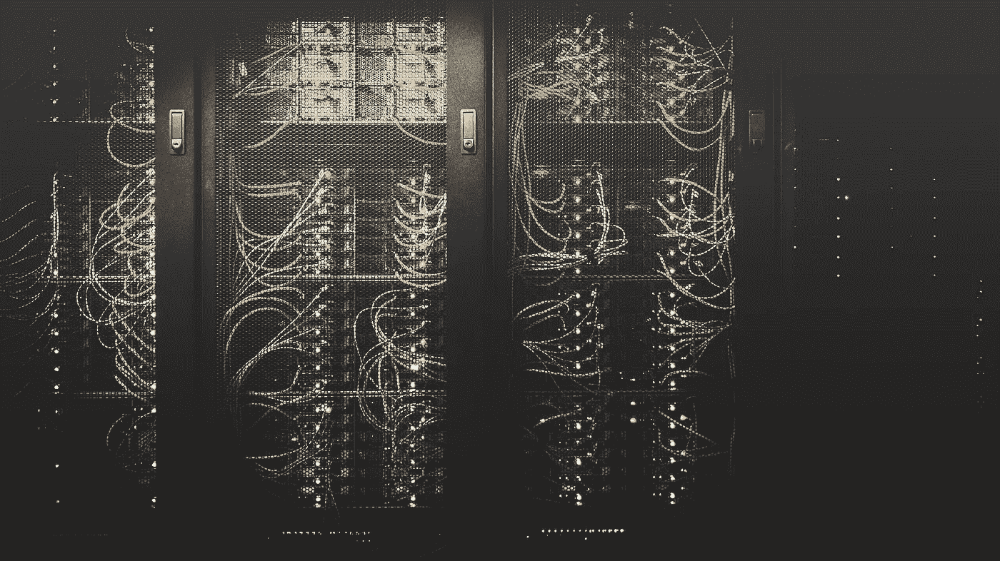

泰勒·维克在 [Unsplash](https://unsplash.com/s/photos/networking?utm_source=unsplash&utm_medium=referral&utm_content=creditCopyText) 上的照片

# 什么是负载平衡器？

在基于云的架构中，负载平衡器在管理部署在云上的服务器的流量方面扮演着非常重要的角色。负载平衡器充当用户请求的入口点，因此流量负载不会直接到达服务器，因为负载平衡器会在所有服务器上平均分配流量。
负载平衡器的一些关键优势。

*   减少停机时间
*   高度可用
*   可攀登的
*   裁员
*   灵活性
*   效率

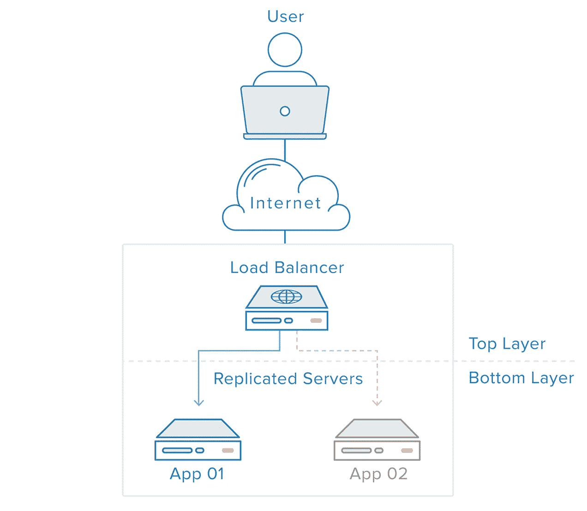

图片来自 digitalocean.com

## GCP 负载平衡器的特点

云负载平衡是一种完全分布式、软件定义的托管服务。这是一个 PaaS 产品，因此用户不需要为负载平衡器管理任何基础架构。
云负载平衡构建在支持谷歌的同一前端服务基础设施之上。它支持每秒 100 万次以上的查询，具有一贯的高性能和低延迟。流量通过 80 多个不同的全球负载平衡位置进入云负载平衡，最大限度地增加了谷歌快速专用网络主干网的传输距离。通过使用云负载平衡，您可以按照用户所在的地区提供内容，因为 GCP 支持超过 35 个地区的此服务。

1.  **单个任播 IP 地址。** 负载平衡器前端的单个 IP 地址，支持多个端口和 SSL 证书。多区域后端故障切换自动可用，以确保高可用性。
2.  **软件定义的负载平衡。** 云负载平衡是一种完全分布式、软件定义的托管服务，适用于所有处理流量。它不是基于实例或设备的解决方案，而是在全球范围内部署，以避免单点故障
3.  **无缝自动缩放。** 云负载平衡可以随着用户请求负载的增加而扩展后端实例，它还可以处理突发流量，因为它可以在几秒钟内扩展后端实例。
4.  **第 4 层和第 7 层负载均衡。** 支持基于第 7 层 HTTP & HTTPS 的全局负载平衡器，以及基于第 4 层 TCP、UDP、ESP、GRE、ICMP 和 ICMPv6 的区域负载平衡器部署。
5.  **外部和内部负载平衡。** GCP 内部有两种负载均衡器，用于处理 GCP 云内部的流量，外部用于处理 GCP 云外部的流量。
6.  **全局和区域负载平衡** 根据我们部署负载平衡器的用户位置，将您的负载平衡资源分布在单个或多个区域，以实现低延迟和高可用性。
7.  **高级功能支持** 其他功能，如 CDN 集成、cookie 管理&云盔甲支持，以保护服务免受基于 DDoS 的攻击。

# **云负载平衡的旧架构**

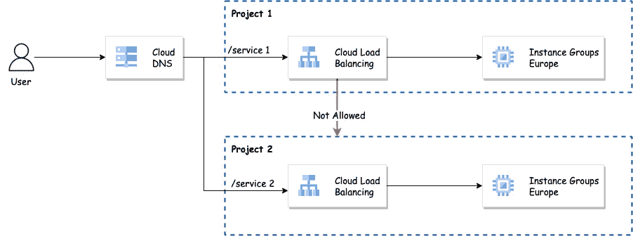

以前，如果您有一个场景，您必须在 GCP 部署一个负载平衡器，它不支持访问部署在其他项目中的服务或后端。因此，为了克服这一点，您必须在另一个项目中创建一个单独的负载均衡器，它具有不同的 IP 和域，对于一个大型团队来说，管理它确实很困难。
在企业级部署的情况下，这确实很难处理，因为仅仅为了在两个项目之间创建连接，就需要建立单独的对等网络。此外，它需要为每个负载平衡器保留一个单独的 IP 地址，后跟一个 SSL 证书。因此，我们可以从新发布的集中式负载平衡器中受益。

# **云负载平衡的新架构**

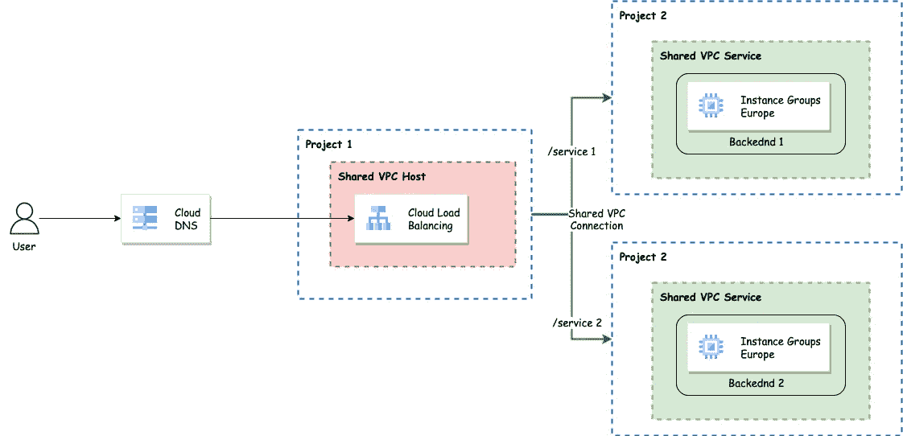

通过使用共享的 VPC 架构和带有跨项目后端服务的新区域负载平衡器，我们可以克服为每个项目创建不同负载平衡器的问题。有了共享的 VPC 网络，你不必担心试图链接多个虚拟专用计算机或管理许多虚拟专用计算机的防火墙规则。

但是有一些先决条件

*   需要基于组织的 GCP 环境设置。
    [链接](https://cloud.google.com/resource-manager/docs/creating-managing-organization)详细步骤。
*   两个不同的 GCP 项目
    [链接](https://cloud.google.com/resource-manager/docs/creating-managing-projects)详细步骤。
*   共享 VPC 需要使用 IAM 权限部署到服务项目才能访问负载平衡器。
    [链接](https://cloud.google.com/vpc/docs/provisioning-shared-vpc)详细步骤。
*   代理子网:
    实现基于区域特使的负载平衡器的代理服务器需要 IP 地址，这些地址将从您在区域“欧洲-西方 1”中为此目的(且仅为此目的)保留的子网中自动分配。当连接到实现后端服务的服务器时，每个代理将使用其分配的 IP 地址。
    [链接](https://cloud.google.com/load-balancing/docs/proxy-only-subnets)详细步骤。

让我们实现这个解决方案，我们有两个项目

## 1)欧盟测试项目 1:

在此项目中，我们已经部署了共享 VPC 和子网，因此我们可以将此项目称为主机项目。

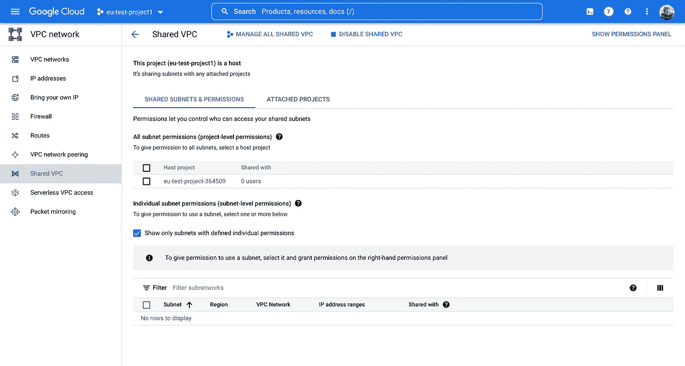

该项目还包括带有负载平衡器代理子网的 VPC

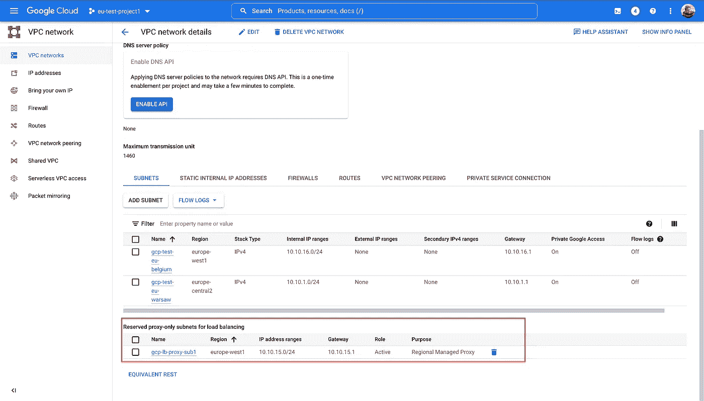

此外，该项目将作为管理负载平衡器配置的集中项目。

## 2)欧盟测试项目 2

为了使部署在“eu-test-project1”中的负载平衡器可以访问此项目“eu-test-project2 ”,我们需要将此项目附加到部署在“eu-test-project1”中的共享 VPC

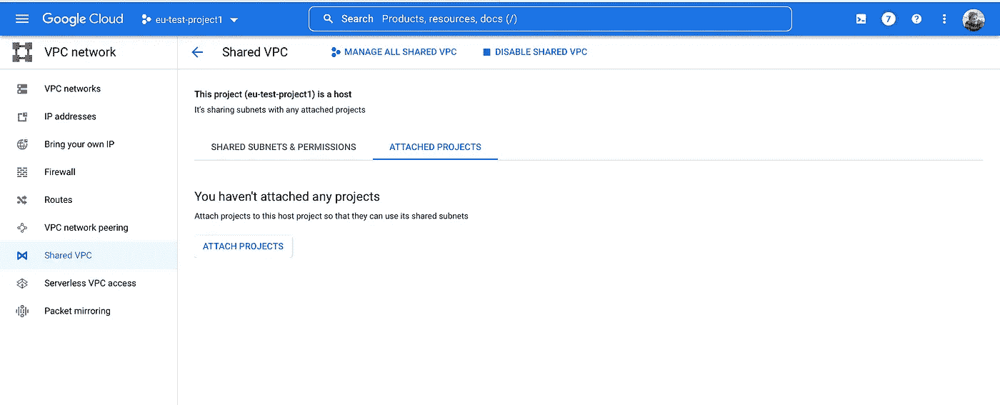

将此项目附加到共享 VPC 时，请确保选择了对服务项目的适当权限。以下是一些可用的权限

*   计算实例管理员:
    具有计算实例用户角色的主体可以在共享子网上创建计算引擎资源(如 VM 实例)
*   计算网络管理员:
    具有网络管理员角色的主体可以在共享子网上创建内部负载平衡器
*   所有者:
    拥有所有者角色的主体可以在共享子网上创建计算引擎和负载平衡资源
*   编辑者:
    具有编辑者角色的主体可以在共享子网上创建计算引擎和负载平衡资源

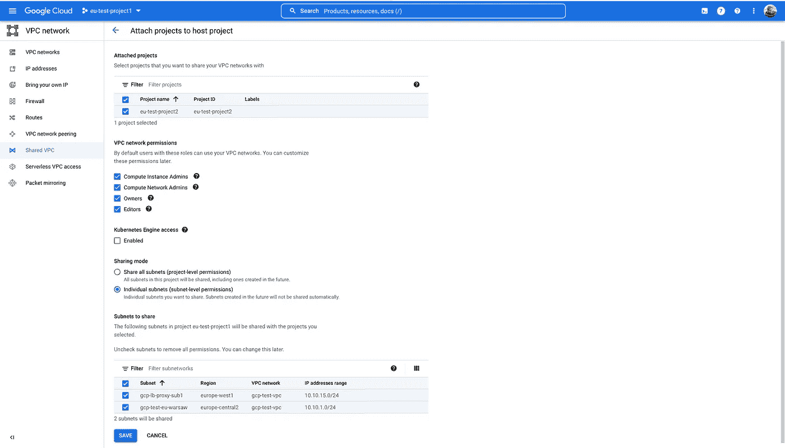

一旦一个项目被附加到共享的 VPC，我们就可以将后端组从“eu-test-project2”添加到在“eu-test-project1”中创建的负载平衡器

*   **在项目中创建后端服务后，此设置中最重要的 IAM 访问部分**
    。确保向负载平衡器管理员授予 IAM 权限，以从主机项目访问您的后端服务。
    例如:harshal 是一名管理员，他将处理 Load Balancer 配置，并且需要拥有“计算负载平衡器服务用户”角色。该角色将允许在其他项目中使用负载平衡器的服务。

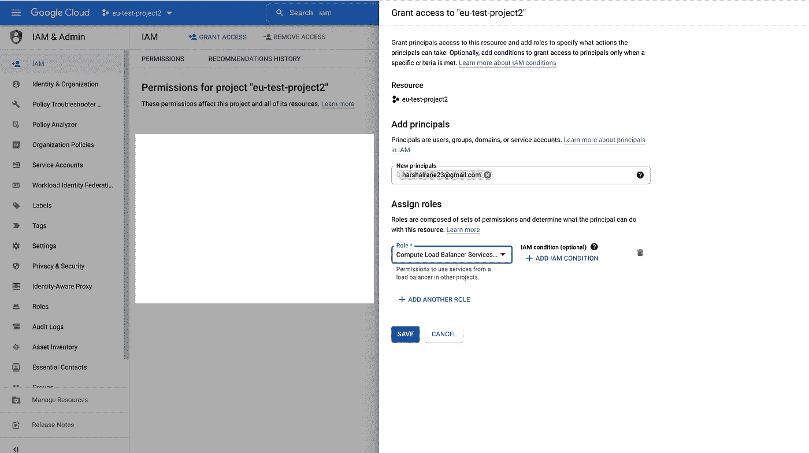

## 设置集中式负载平衡器

*   导航到“eu-test-project1”，在这里我们已经设置了共享 VPC、子网、代理子网和防火墙规则。
*   创建一个支持跨项目后端服务的区域性 HTTPS 负载平衡器。此功能仅在区域内部/外部负载平衡器中可用。

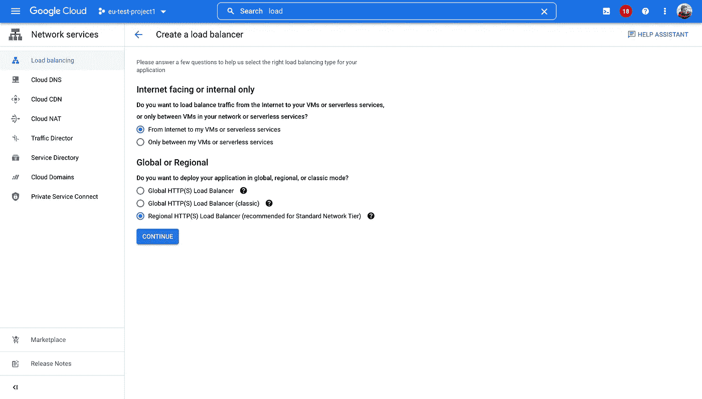

*   现在让我们为负载平衡器设置前端、后端、健康检查和路由规则。

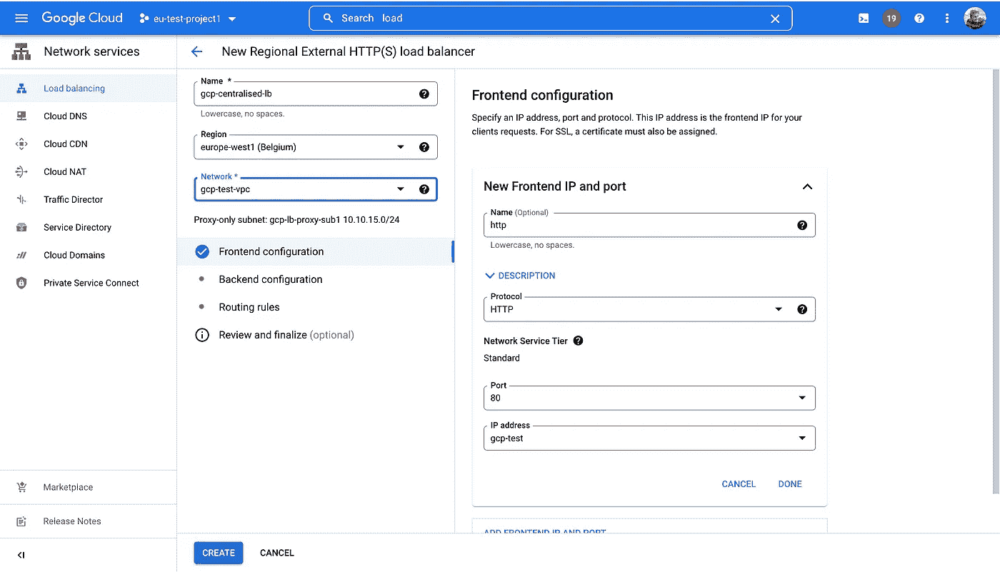

**设置前端，现在让我们设置 HTTP 前端**

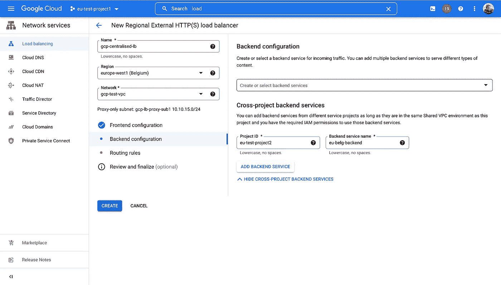

**设置后端，这里我们将选择跨项目后端选项**

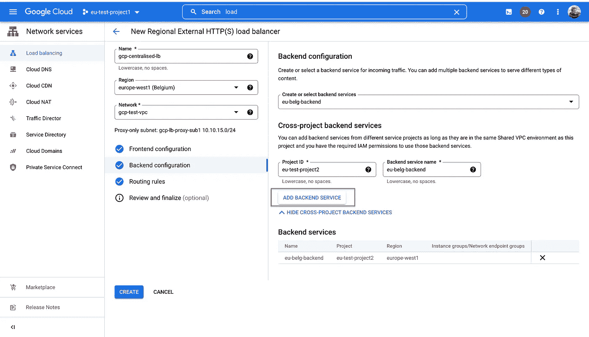

**输入项目 ID 和后端服务名称后，单击“添加后端服务”按钮添加交叉服务后端。**

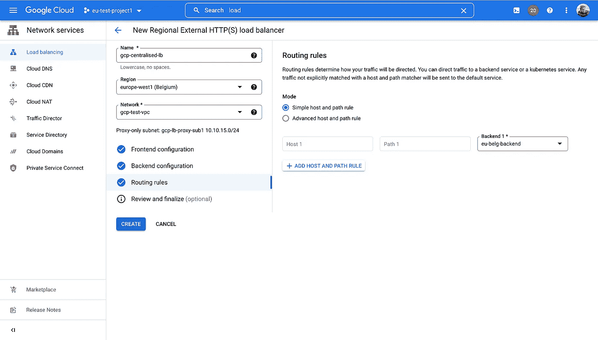

**如果我们有多个具有不同 URL 路径的后端，则使用路由规则来管理流量**

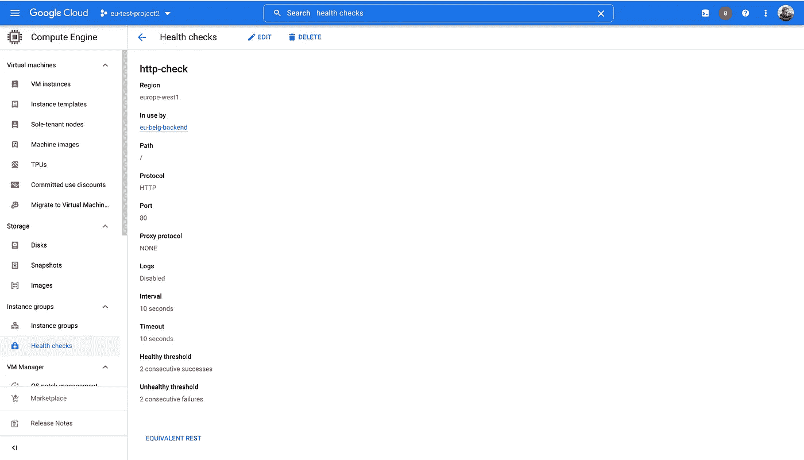

**设置健康检查以确保后端准备好接受指定端口上的流量**

*   使用下面的`gcloud`命令创建一个防火墙规则，允许来自 Google Cloud health check 系统的 TCP 连接进入您的 VPC 网络。否则，运行状况检查将会失败，后端将会不正常。

```
gcloud compute --project=project-id firewall-rules create allow-firewall --direction=INGRESS --priority=1000 --network=gcp-test-vpc --action=ALLOW --rules=tcp:80,tcp:443 --source-ranges=35.191.0.0/16,130.211.0.0/22
```

*   通过使用端口 80 访问 IP 地址来测试负载平衡器设置。我们可以从另一个项目访问后端实例。
*   我们可以将此 IP 地址添加到 DNS 区域，并使用域名进行映射，以便通过该域名访问我们的负载平衡器。

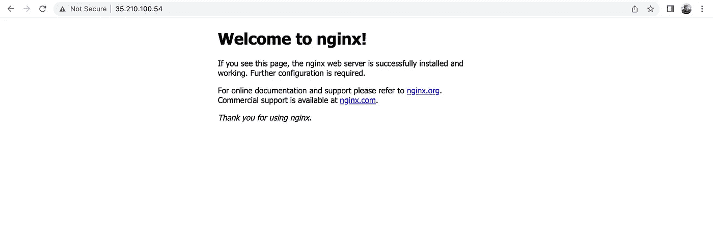

# 摘要

*   企业部署的最佳支持特性，其中每个团队都有不同的项目和后端。使用这个，我们可以映射单个 URL 后面的所有后端。
*   无需在每个项目中设置负载平衡器，也无需为每个项目设置不同的 IP 地址。因为即使没有使用，每个外部 IP 地址也要花费 0.01 美元。
*   使用共享 VPC 和防火墙规则的集中式网络管理。
*   此功能仅在区域内部/外部 GCP 负载平衡器中可用。

# 参考资料:

*   [https://cloud . Google . com/blog/products/networking/cloud-load-balancing-gets-cross-project-service-referencing](https://cloud.google.com/blog/products/networking/cloud-load-balancing-gets-cross-project-service-referencing)
*   [https://cloud . Google . com/resource-manager/docs/creating-managing-organization](https://cloud.google.com/resource-manager/docs/creating-managing-organization)
*   [https://cloud.google.com/vpc/docs/provisioning-shared-vpc](https://cloud.google.com/vpc/docs/provisioning-shared-vpc)
*   [https://cloud . Google . com/load-balancing/docs/proxy-only-subnets](https://cloud.google.com/load-balancing/docs/proxy-only-subnets)

# 开源代码库

[https://github.com/HarshalRane23](https://github.com/HarshalRane23)

# 有问题吗？

如果你有任何问题，我很乐意在评论中阅读。在[中](/@harshalrane23)或 [LinkedIn](https://www.linkedin.com/in/harshal-rane-15538027/) 上关注我。