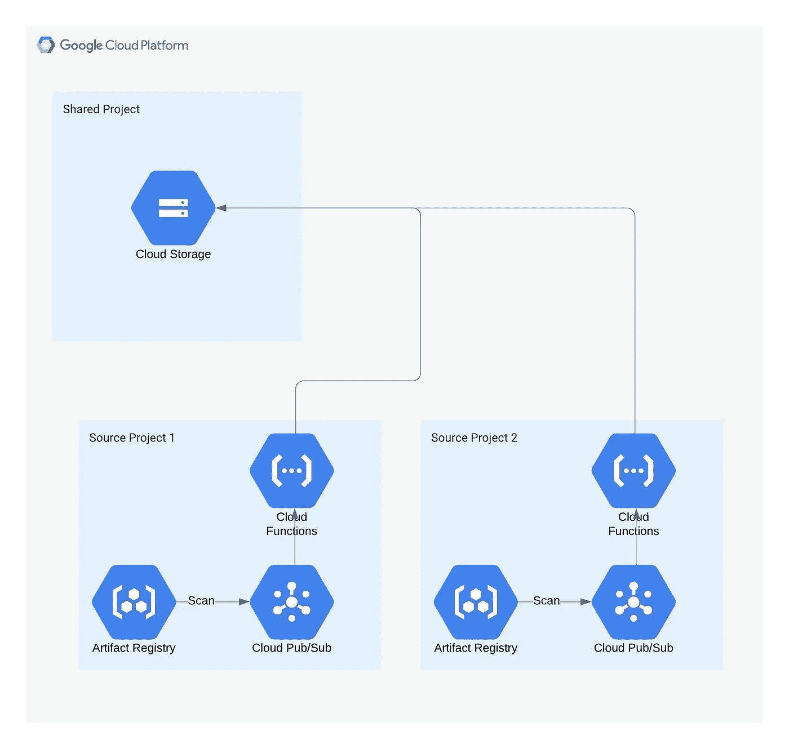
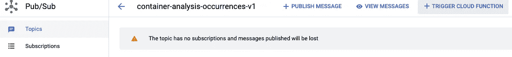
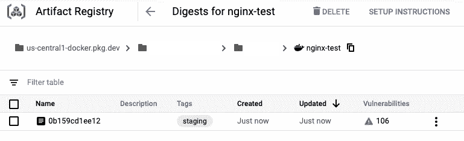

# 在 Google Cloud 上集中管理工件注册表容器映像漏洞:第一部分

> 原文：<https://medium.com/google-cloud/centrally-managing-artifact-registry-container-image-vulnerabilities-on-google-cloud-part-one-d86fb4791601?source=collection_archive---------1----------------------->

工件注册及其前身容器注册都提供了图像扫描来检测图像中的漏洞。这些扫描的结果与相关联的容器图像一起存储在项目级别。因此，任何负责管理组织中漏洞的安全工程师都需要访问每个项目。这可能与组织关于职责分离和最低特权的安全策略相冲突。

许多企业组织都有一个集中的解决方案，如安全指挥中心或他们自己的内部 SIEM，用于集中管理他们所有的威胁、漏洞和安全事件。理想情况下，我们可以将所有映像漏洞集中到一个位置进行集中管理。

在这篇两部分文章的第一部分中，我们将研究如何利用发布/订阅和云函数在一个集中的服务或位置存储项目级容器映像漏洞。出于演示目的，我们将使用一个 Google 云存储桶。在第二部分中，我们将对此进行扩展，了解如何使用自定义安全命令中心资源直接在 SCC 中创建和管理漏洞发现，并探索其他可能性，如大查询或第三方 SIEM。

# 入门指南

首先，这篇文章是为[谷歌云组织](https://cloud.google.com/resource-manager/docs/quickstart-organizations)而不是个人 GCP 账户设计的。不同之处在于，组织帐户在根处有一个组织节点，所有文件夹和项目都存在于该节点下。一个组织与一个域相关(例如 my-company.com)。对于个人云账户，项目独立存在，不在上级组织下。

您可以按照免费版 Google Cloud Identity 的[设置说明](https://cloud.google.com/identity/docs/setup)使用您拥有的任何域名创建一个免费的组织帐户。

这篇文章还假设你有基本的 Google 云平台知识，并且熟悉创建项目和使用云 Shell 和命令行工具。

# 创建项目和 GCS 存储桶

我们将创建两个项目，一个共享项目将保存用于存储所有漏洞的 GCS 存储桶，另一个源项目将包含用于扫描漏洞的图像。实际上，您会有多个源项目，它们都将写入共享项目，如下图所示。此外，您通常不会在生产中使用 GCS 作为存储机制，但是对于本演示来说，它适合我们的目的。



打开[云控制台](https://console.cloud.google.com)，创建两个项目并为其设置账单，记下您为每个项目使用的 id。我们将共享项目 id 称为 *<项目 id-共享>* ，源项目称为 *<项目 id-源>* 。接下来，我们在共享项目中创建 GCS 存储桶，我们将在其中存储漏洞。打开 Cloud Shell 并运行下面的命令，用您的项目 id 替换*<project-id-shared>*，并为 *< bucket-name >* 选择一个全局唯一的值。

```
gsutil mb -l us-central1 -p *<project-id-shared>* gs://*<bucket-name>*
```

# 设置源项目、服务帐户、工件注册和发布/订阅

源项目是存储和扫描图像的地方。我们将利用漏洞扫描器自动创建的发布/订阅主题，然后触发云函数读取漏洞并将其写入共享项目的桶中。

在 Cloud Shell 中，使用您的*<project-id-source>*值运行以下命令，以在源项目上启用所需的服务。

```
gcloud config set project *<project-id-source>*gcloud services enable cloudresourcemanager.googleapis.comgcloud services enable artifactregistry.googleapis.comgcloud services enable cloudbuild.googleapis.comgcloud services enable containerscanning.googleapis.com
```

让我们创建运行云功能的服务帐户。它需要读取源项目中容器漏洞的权限和写入共享项目中存储桶的权限。为 *<服务-账户-来源>* 提供自己的服务账户值。

```
gcloud iam service-accounts create *<service-account-source>* \
--description="Service Account to create process image scan vulnerabilities" \
--display-name="Image Vulnerability Processor"
```

我们添加了使用容器分析事件查看者角色读取漏洞的权限。请注意需要替换 *<服务-帐户-来源>* 和 *<项目-id-来源>* 值的电子邮件格式。我们还将在 bucket 上设置 GCS 对象创建者角色，这样我们就可以写入 bucket。为了遵守最小特权原则，服务帐户不需要读取或删除对象，因此我们将权限限制为仅创建。

```
gcloud projects add-iam-policy-binding *<project-id-source>* --member=serviceAccount:*<service-account-source>*@*<project-id-source>*.iam.gserviceaccount.com --role=roles/containeranalysis.occurrences.viewergsutil iam ch serviceAccount:*<service-account-source>*@*<project-id-source>*.iam.gserviceaccount.com:objectCreator gs://*<bucket-name>*
```

接下来，让我们在源项目中创建一个工件注册表，它将存储容器图像。为 *< repo-name >* 提供自己的值。

```
gcloud artifacts repositories create *<repo-name>* --location=us-central1 --repository-format=docker --project=*<project-id-source>*
```

当 Docker 图像被推送到存储库时，它们将被我们之前启用的容器扫描 API 自动扫描。除了在控制台中显示发现的漏洞，容器扫描 API 还将每个漏洞发布到自动创建的发布/订阅主题。

这些主题是在扫描第一张图像时创建的，这给我们带来了一个问题。要从一个主题触发云函数，该主题必须首先存在。在这种情况下，我们无法将云功能附加到主题上，直到我们推送第一张图片并对其进行扫描。幸运的是，解决方法很简单。我们可以自己预先创建主题，使我们能够创建和附加云功能。扫描图像时，它会检测到该主题已经存在，不会尝试重新创建它。

```
gcloud pubsub topics create container-analysis-occurrences-v1 --project=*<project-id-source>*
```

# 创建云函数

我们现在将创建由 container-analysis-occurrences-v1 主题触发的云函数，并将漏洞写入共享项目中的存储桶。虽然这可以使用命令行来完成，但是使用控制台要容易得多。

在控制台中，确保您在源项目中，并导航到发布/订阅。点击“容器-分析-出现次数-v1”，然后点击屏幕顶部的“+触发云函数”。



将函数名称更改为“image-vuln-cf-trigger ”,其他内容保持默认，然后单击 Save。

展开变量、网络和高级设置部分。对于服务帐户，选择我们之前创建的服务帐户，然后选择“环境变量”选项卡并添加一个名为“BUCKET_NAME”的运行时环境变量。该值应该是您之前创建的*<>*。

单击 next 并选择 Python 3.7 作为代码运行时。粘贴以下代码:

将入口点设置为“image_vuln_pubsub_handler”。

接下来，选择 requirements.txt 文件并粘贴如下内容:

```
google-cloud-securitycentergoogle-cloud-containeranalysis
```

单击部署。

# 将图像推送到工件注册表并触发扫描

我们现在准备测试。我们将创建一个带有一些已知漏洞的简单 Docker 映像，并将它推送到我们的源项目中的工件注册表中。这将触发漏洞扫描，任何发现的漏洞将被写入发布/订阅主题，触发我们的云功能，并将被写入我们共享项目中的存储桶。

在 Cloud Shell 中，打开代码编辑器，使用以下代码创建一个名为 DOCKERFILE 的文件:

```
FROM nginx
```

在命令行上运行:

```
gcloud auth configure-docker us-central1-docker.pkg.devdocker build --tag nginx .docker tag nginx us-central1-docker.pkg.dev/*<project-id-source>*/*<repo-name>*/nginx-test:stagingdocker push us-central1-docker.pkg.dev/*<project-id-source>*/*<repo-name>*/nginx-test:staging
```

现在我们可以转到控制台，在源项目的工件注册表中查看推送的图像。单击映像名称，注意发现的漏洞(扫描可能正在进行)。



您可以点击并检查发现的每个漏洞。

接下来，切换到共享项目，并转到 storage 来浏览您的 bucket。在里面，您将看到一个包含所有漏洞事件的项目文件夹结构。

通常，您会对每个使用容器扫描 API 的项目重复此操作，以将所有映像漏洞聚集到一个中心位置。

在本文的第二部分中，我们将了解如何使用定制的 SCC 源将映像漏洞发现发布到 Security Command Center，并讨论如何与您自己的 SIEM 集成。