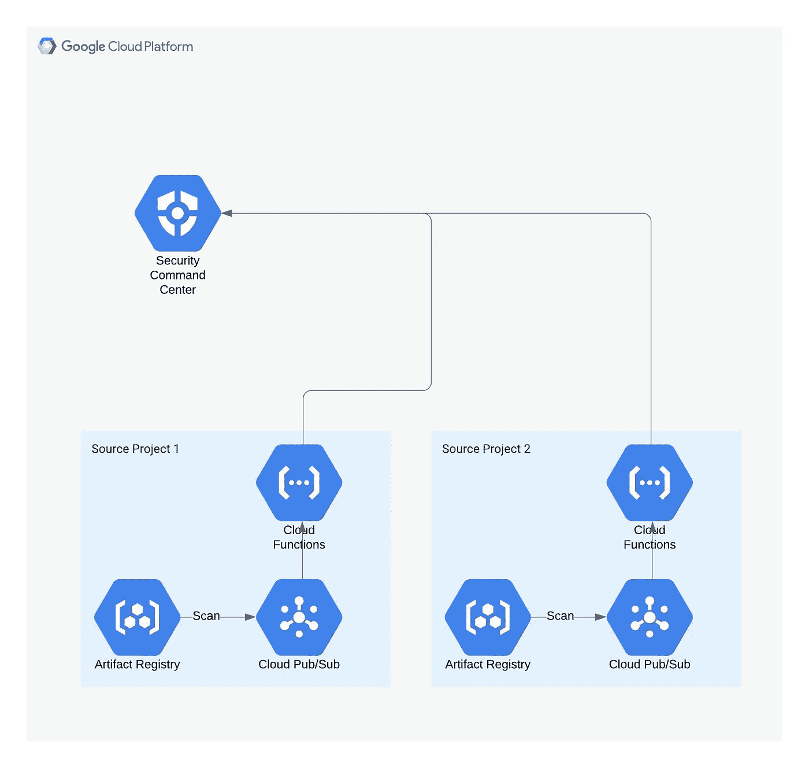
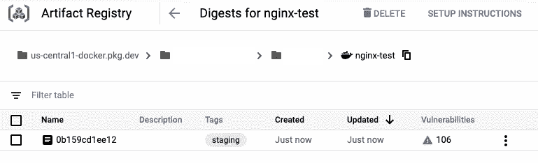

# 在 Google Cloud 上集中管理工件注册表容器映像漏洞:第二部分

> 原文：<https://medium.com/google-cloud/centrally-managing-artifact-registry-container-image-vulnerabilities-on-google-cloud-part-two-ad730e7cf649?source=collection_archive---------0----------------------->

在这篇由两部分组成的文章的第一部分中，我们看到了如何使用发布/订阅和云函数从跨多个项目的工件/容器注册表中聚集容器映像漏洞，并将它们写到一个集中的位置。这样做的目的是提供一种方法来集中管理整个组织中的所有映像漏洞，而不需要访问使用容器映像的每个项目。

在我们的演示中，我们使用 Google 云存储空间作为存储位置。在现实世界中，您可能希望使用安全指挥中心或您自己的 SIEM 等解决方案。

在第二部分中，我们将修改第一部分中创建的云函数，将漏洞直接写入安全命令中心(SCC)。我们还将讨论你将如何根据自己的 SIEM 进行写作。

该架构将如下所示:



在[安全指挥中心](https://cloud.google.com/security-command-center/docs/concepts-security-command-center-overview)的资源实质上充当了安全发现的容器。SCC 有许多内置资源，如安全健康分析、Web 安全扫描程序和事件威胁检测。此外，还提供了许多第三方来源。我们将创建一个自定义源，作为容器映像漏洞发现的容器。

**重要提示:来源和发现不能删除。创建后，它们将继续存在于您的组织帐户中，并且无法删除。建议您使用沙盒域进行任何测试。**

首先，快速设置一下。我们需要在我们的源项目上启用 SCC API。在 Cloud Shell 中运行以下内容。

```
gcloud config set project *<project-id-source>*gcloud services enable securitycenter.googleapis.com
```

现在，让我们创建自定义源。不幸的是，gcloud 客户端不支持创建源代码，所以我们需要通过客户端库使用 [SCC REST API](https://cloud.google.com/security-command-center/docs/reference/rest) 。我们将创建一个 Python 虚拟环境，安装 SCC 客户端库，并运行一个简短的 Python 脚本来创建自定义源代码。在 Cloud Shell 中运行以下命令:

```
pip install virtualenvvirtualenv envsource env/bin/activateenv/bin/pip install google-cloud-securitycenter
```

下一步我们需要组织 id。在 Cloud Shell 中运行以下 gcloud 命令，并复制您正在使用的域的 id。在我们的脚本中，我们将其称为 *< org-id >* 。

```
gcloud organizations list
```

在您的主目录中，在云外壳代码编辑器中创建一个名为 create_source.py 的文件，粘贴以下代码，并用您的组织 id 替换 *< org-id >* :

在运行之前，安全命令中心 API 不允许用户帐户，因此我们需要在服务帐户的上下文中运行。我们将使用我们在第一部分中创建的那个。首先，我们需要授予它 IAM 权限，以便能够创建 SCC 源和结果。您将需要第一部分中的 *<服务-账户-来源>* 和 *<项目-id-来源>* 的值。如果您没有它们，您可以轻松地返回到云控制台中的项目，并查看服务帐户以获得服务帐户名称。

```
gcloud organizations add-iam-policy-binding *<org-id>* \
--member=serviceAccount:*<service-account-source>*@*<project-id-source>*.iam.gserviceaccount.com \
--role=roles/securitycenter.adminEditor
```

使用以下内容创建并下载服务帐户密钥:

```
gcloud iam service-accounts keys create sa-creds.json \
--iam-account=*<service-account-source>*@*<project-id-source>*.iam.gserviceaccount.comexport GOOGLE_APPLICATION_CREDENTIALS=./sa-creds.json
```

现在我们可以执行我们的 Python 代码了:

```
python3 ./create_source.py
```

复制命令的输出，因为它包含新的源 id，格式如下:

```
organizations/<org-id>/sources/<source-id>
```

我们不再需要服务帐户密钥，所以让我们整理一下:

```
rm ./sa-creds.json
```

现在，我们准备好更新我们的云函数，将漏洞事件作为 SCC 中的发现写入，而不是写入 GCS 存储桶。在云控制台中，转到第一部分中的源项目，并导航到云函数。点击功能“image-vuln-cf-trigger ”,然后点击编辑。

展开变量、网络和高级设置部分，然后选择环境变量选项卡。添加一个名为 SOURCE_ID 的运行时环境变量，以及您刚刚创建的源的值，格式为*organizations/<org-ID>/sources/<SOURCE-ID>*。

单击下一步。

在 main.py 文件中，用以下代码替换现有代码:

并将 requirements.txt 替换为:

```
google-cloud-securitycentergoogle-cloud-containeranalysis
```

单击部署。

# 将映像推送到工件注册表，并在 SCC 中查看结果

我们现在准备测试推送映像并查看 SCC 中的漏洞。

在 Cloud Shell 中，使用以下代码创建一个名为 DOCKERFILE 的文件:

```
FROM nginx
```

在命令行上运行:

```
gcloud auth configure-docker us-central1-docker.pkg.devdocker build --tag nginx-scc .docker tag nginx-scc us-central1-docker.pkg.dev/*<project-id-source>*/*<repo-name>*/nginx-test-scc:stagingdocker push us-central1-docker.pkg.dev/*<project-id-source>*/*<repo-name>*/nginx-test-scc:staging
```

现在我们可以转到控制台，在源项目的工件注册表中查看推送的图像。单击映像名称，注意发现的漏洞(扫描可能正在进行)。



您可以点击并检查图像中发现的每个漏洞。

现在导航到云控制台的安全部分中的 SCC，并切换到组织级别。单击“Findings”选项卡，您应该会看到根据图像扫描中发现的漏洞创建的许多新发现。您可以单击查看每个调查结果，并查看源属性以查看诸如严重性、CVSS 分数和受影响图像的链接等信息。

您还可以单击“按源类型查看”来仅过滤容器映像漏洞。


# 摘要

现在，您已经将所有映像漏洞发布为 SCC 中的调查结果，您可以像管理所有其他调查结果一样管理它们，向调查结果添加安全标记，并在修补漏洞后将其设置为非活动状态。每项调查结果都提供了有关受影响图像、项目和 CVE 信息的信息。SCC 提供了一种简单的方法来列出所有仍然有效的漏洞发现，为组织提供跨所有项目的 Artifact Registry 中容器映像的所有未修补漏洞的视图。

在这篇由两部分组成的文章中，我们首先将 GCS 作为我们的存储解决方案，然后转向 SCC。然而，修改我们的云函数，将漏洞写入您的本地 SIEM 或大型查询数据集，会相对简单。你可以在这里找到漏洞发生模式[。](https://cloud.google.com/container-analysis/docs/reference/rest/v1beta1/projects.occurrences#Details)

[](https://cloud.google.com/security-command-center/docs/reference/rest) [## 安全指挥中心 API |谷歌云

### 无论您的企业是刚刚踏上数字化转型之旅，还是已经走上数字化转型之路，谷歌云的解决方案…

cloud.google.com](https://cloud.google.com/security-command-center/docs/reference/rest)