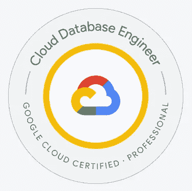
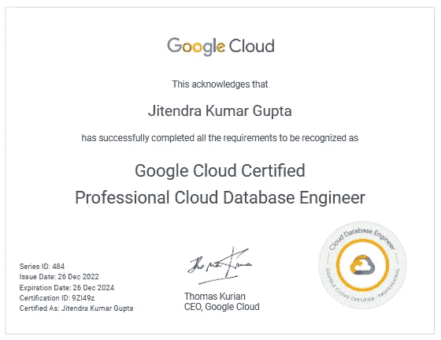

# 认证—如何准备 Google Cloud —专业云数据库工程师

> 原文：<https://medium.com/google-cloud/certification-how-to-prepare-for-google-cloud-professional-cloud-database-engineer-a663d4c03828?source=collection_archive---------5----------------------->

**关于我** —我是多云认证云架构师；目前的工作任务集中在谷歌云平台上。在过去的 18 个月里，我写了 17 个以上的云认证，最近通过了 GCP——专业云数据库工程师认证。

**本次考试的目标受众？**

**谷歌云专业数据库工程师认证**适合拥有数据库系统工作经验的数据库专业人员，他们希望展示自己在使用谷歌云平台(GCP)的云中设计、构建和维护数据库系统的技能。该认证面向拥有至少一年数据库系统工作经验并对数据库设计和实现(包括数据建模、索引设计和查询优化)有深刻理解的个人。

**一些可能对谷歌云专业数据库工程师认证感兴趣的专业人士的例子包括:**

*   **数据库管理员(DBA)**希望展示他们在设计、构建和维护云中数据库系统方面的专业知识
*   **数据工程师**希望扩展他们的技能，包括使用云中的数据库系统
*   **开发人员**从事数据库系统工作，希望展示他们在云中设计和构建数据库的技能
*   **IT 专业人士**希望专门使用 GCP 在云中设计和构建数据库系统

**Google Cloud 专业云数据库工程师的角色与职责？**

作为 Google Cloud 专业云数据库工程师，你将负责在云环境中设计、构建、维护和优化数据库系统。您的角色和职责可能包括:

*   设计和构建数据库结构以支持业务应用程序
*   实施数据库安全措施，保护数据免受未经授权的访问
*   通过优化索引、查询和其他数据库组件来优化数据库性能
*   使用 GCP 工具和技术将现有数据库迁移到云中
*   管理和监控数据库系统，确保它们高效可靠地运行
*   为数据库问题提供技术支持和故障排除
*   与跨职能团队协作，了解业务需求并设计适当的数据库解决方案
*   跟上数据库设计和优化的最新发展和最佳实践

总的来说，作为一名 Google Cloud 专业云数据库工程师，您将在设计、构建和维护支持云中业务应用的数据库系统方面发挥关键作用。您将与其他技术专业人员(如数据工程师、开发人员和 IT 管理员)密切合作，以确保您设计和构建的数据库系统健壮、安全并针对性能进行了优化。

**第一步准备**考试，你应该熟悉考试内容和目标，在这里的官方考试指南中有概述——【https://cloud.google.com/certification/guides/】T2 云数据库工程师 [/](https://cloud.google.com/certification/guides/cloud-network-engineer/)

官方样题考试可以在这里考— [专业云数据库工程师样题](https://docs.google.com/forms/d/e/1FAIpQLSe55cAg8a3NzgV_QCJ2_F75NAyE44Z-XuVB6oPJXaWnI5UBIQ/viewform)。由于样题保持不变，可以尝试多次。

如果第一次尝试有超过 **60%** 的答案正确，则**跳至步骤# 2.2** ，如果 **80%** 的答案正确，则跳至**步骤# 2.3**

**第二步——学习计划**

**2.1 视频培训—** [数据库工程师学习路径| Google Cloud Skills Boost](https://www.cloudskillsboost.google/paths/22?utm_source=cgc&utm_medium=et&utm_campaign=-&utm_content=cgc-cert-database&utm_term=-)on[qwikilabs](https://medium.com/u/fc35885def18?source=post_page-----a663d4c03828--------------------------------)

[谷歌云专业数据库工程师考试备考| Udemy](https://www.udemy.com/course/google-cloud-professional-database-engineer-exam-prep/?src=sac&kw=professional+database+engineer) 作者[丹·沙利文](https://www.linkedin.com/in/dansullivanpdx/)

**2.1.1 也浏览这些 YouTube 播放列表，以获得更深入的知识。**

[jitu 028/GCP-数据库-工程师-Youtube 播放列表](https://github.com/jitu028/gcp-database-engineer/blob/main/GCP%20-%20Professional%20Database%20Engineer%20Certification%20preparation%20-%20YouTube%20Playlist.pdf)

**2.2 动手实验** —完成[数据库工程师学习路径上的所有实验|谷歌云技能提升](https://www.cloudskillsboost.google/paths/22?utm_source=cgc&utm_medium=et&utm_campaign=-&utm_content=cgc-cert-database&utm_term=-)在 [Qwiklabs](https://medium.com/u/fc35885def18?source=post_page-----3b5aa9fae5d--------------------------------)

**2.3 Google Cloud 文档** —强烈推荐浏览这些精选链接——[jitu 028/GCP-数据库-工程师-重要-考试重点链接](https://github.com/jitu028/gcp-database-engineer/blob/main/GCP%20-%20Professional%20Database%20Engineer%20Certification%20preparation%20-%20important%20links.pdf)。

**步骤# 3 —练习模拟测试**

Udemy 中的练习题——Dan Sullivan 在 Udemy 上的数据库课程也包含一套 50 个问题的练习题，从考试的角度来看非常相关——Google Cloud 专业数据库工程师考试准备| Udemy

**第 4 步—安排考试**

我对 GCP 上可用的大多数数据库服务有很好的了解，并且在 2022 年 5 月准备专业数据工程师考试时也学到了这些知识，当时数据库也是考试的一部分。

在准备了不到 10 天后，我将考试安排在 2022 年 12 月 24 日，并在早上 6:00 参加了远程监考。

对于这个认证，我建议你在花了至少 2 个月的时间学习后，完全有信心并在实践测试中持续获得 80%以上的分数，再安排考试。

**参考文献—**

也请检查本认证的其他媒体文章—

[Google Cloud 专业云数据库工程师认证](/google-cloud/preparation-for-google-cloud-professional-cloud-database-engineer-certification-f7ce6f0f30ab)准备 [Murli Krishnan](https://www.linkedin.com/in/murli-krishnan-a1319842/)

[通过](https://hilliao.medium.com/passing-the-google-cloud-professional-database-engineer-exam-95e0b6079ad2) [Hil 廖](https://www.linkedin.com/in/hilliao/)的谷歌云专业数据库工程师考试

[我的专业云数据库工程师 beta 认证考试笔记| by Sathish VJ | Medium](https://sathishvj.medium.com/notes-from-my-professional-cloud-database-engineer-beta-certification-exam-78ade74022e7)by[Sathish VJ](https://www.linkedin.com/in/sathishvj/)

[谷歌云数据库工程师考试分步指南](/@bgiri-gcloud/google-cloud-database-engineer-exam-step-by-step-guide-58a33ad59f6e) by [Biswanath Giri](https://www.linkedin.com/in/biswanathgirigcloudcertified/)

[Samuel njo ku](/@Dominicci/acing-the-professional-cloud-database-engineer-exam-17e18e00c970)[参加专业云数据库工程师考试](https://www.linkedin.com/in/s-c-n/)

[我对谷歌云专业云数据库工程师测试版考试的评论](https://antonit.medium.com/my-review-of-the-google-cloud-professional-cloud-database-engineer-beta-exam-7e9d549d00e9)作者[安东尼·查韦拉斯](https://www.linkedin.com/in/antonit/)

[谷歌数据库工程师测试版考试心得](/cts-technologies/google-database-engineer-beta-exam-thoughts-37777a14f0be)由[Alistair grown](https://www.linkedin.com/in/alistairgrew/)

[如何准备考 Google Cloud 专业云数据库工程师认证](/google-cloud/how-i-prepared-to-take-the-google-cloud-professional-cloud-database-engineer-certification-bfe1ff8abf8f)作者 [Vikram Shinde](https://www.linkedin.com/in/vikrampshinde/)

我的证书-

祝你准备工作顺利。

如果有任何问题，可以通过[**LinkedIn**](https://www.linkedin.com/in/jitu028/)**和 Twitter[**@ jitu 028**](https://twitter.com/jitu028)和 DM 联系我，我很乐意帮忙！！**

**您还可以安排在 https://www.topmate.io/jitu028[与我进行一对一的讨论，以获得任何谷歌云认证指导。](https://www.topmate.io/jitu028)**