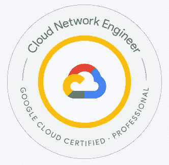
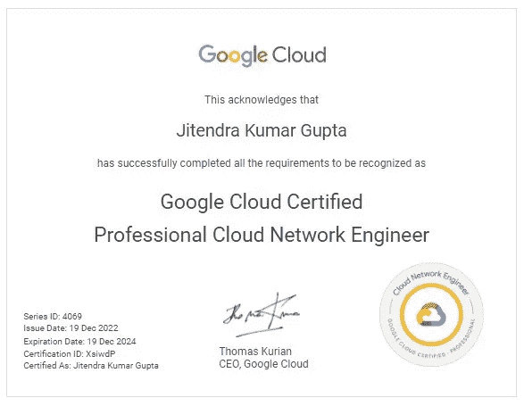

# 认证—如何准备 Google Cloud —专业云网络工程师

> 原文：<https://medium.com/google-cloud/certification-how-to-prepare-for-google-cloud-professional-cloud-network-engineer-3b5aa9fae5d?source=collection_archive---------5----------------------->

**关于我** —我是多云认证云架构师；目前的工作任务集中在谷歌云平台上。在过去的 18 个月里，我写了 17 个以上的云认证，最近通过了 GCP——专业云网络工程师认证。

**本次考试的目标受众？**

专业云网络工程师认证通常面向具有网络背景并有兴趣获得设计、实施和管理云网络基础设施专业知识的个人。这可能包括负责在企业环境中设计、部署和维护基于云的网络的 IT 专业人员，以及希望在云计算领域发展职业生涯的个人。

为了获得这一认证，一般希望候选人在网络概念方面有坚实的基础，包括路由、交换和网络安全。熟悉云计算概念和技术也很重要，拥有 GCP 基于云的网络解决方案的经验也很重要。

总的来说，专业云网络工程师认证非常适合那些有兴趣在 GCP 发展基于云的网络专业知识，并希望在云计算领域发展职业生涯的个人。

**Google Cloud 专业云网络工程师的角色和职责？**

它包括以下任务:

1.  在 GCP 上设计和实施可扩展的安全网络解决方案，包括 VPC、子网、防火墙规则和负载平衡器。
2.  将内部工作负载迁移到云中，并将其与 GCP 网络解决方案集成。
3.  配置网络路由和负载平衡以优化网络性能和可用性。
4.  实施网络安全措施，如防火墙规则和 VPN，以抵御外部威胁。
5.  监控网络问题并排除故障，以确保网络可用性和性能。
6.  与其他 IT 专业人员合作，将 GCP 网络解决方案与其他系统和技术集成。
7.  紧跟云计算和网络的最新发展，不断学习和发展技能，以跟上行业最佳实践。

除了这些具体职责之外，专业网络工程师还应该对云 DNS、云路由器、BGP 会话、DNS 策略、DNS 转发、互连高可用性有深入了解。

**步骤# 1 准备考试**，你要熟悉考试内容和目标，这些内容和目标在官方考试指南中有概述，这里——[https://cloud . Google . com/certification/guides/cloud-network-engineer/](https://cloud.google.com/certification/guides/cloud-network-engineer/)

官方样题考试可以在这里考——[专业云网工程师样题](https://docs.google.com/forms/d/e/1FAIpQLServ0tNGkr-dYAfmez_Gdk74dmVypZjzUKrkVFtFcArzhmPow/viewform)。由于样题保持不变，可以尝试多次。

如果第一次尝试有超过 **65%** 的答案正确，则**跳至步骤# 2.2** ，如果 **85%** 的答案正确，则跳至**步骤# 2.3**

**第 2 步—学习计划**

**2.1 视频培训—** [GCP — Google Cloud 专业云网络工程师| Udemy](https://www.udemy.com/course/google-cloud-networking/)by[Ankit Mistry](https://www.linkedin.com/in/ankit25587/)

[Google Cloud 专业云网络工程师— AwesomeGCP，由](https://www.youtube.com/playlist?list=PLQMsfKRZZviRZJ6epTvt1kOYGy9AYJBz7) [sathish vj](https://medium.com/u/ba857441758a?source=post_page-----3b5aa9fae5d--------------------------------) 认证的 Q & A

**2.1.1 有选择地浏览这些 YouTube 播放列表，以获得更深入的知识。**

**Cloud OnAir:谷歌云联网 101—** [https://www.youtube.com/watch?v=0hN-dyOV10c&list = PLDGXb-1k 3 xy 1 raefzp _ ndsjmpp 0 iaqetp](https://www.youtube.com/watch?v=0hN-dyOV10c&list=PLDGXb-1k3XY1RaEfzp_nDSJMPP0iAQEtP)

**网络会议—Google Cloud Next’19—** [https://www.youtube.com/playlist?list = pliivdwyy 5 sqkavnqugggiaspw 36 niatq](https://www.youtube.com/playlist?list=PLIivdWyY5sqKAvNQuGGGgiAspW36NiaTQ)

**谷歌云认证专业网络工程师概念-** [https://www.youtube.com/playlist?list = plps 8 ty 7 up m1 xhjbl qhxbal 3 sqhfssu-GW](https://www.youtube.com/playlist?list=PLPS8Ty7UpM1XhJBLqHXBAL3sqhfsSU-gw)

**什么是 DNS？| DNS 服务器(域名系统)如何工作| DNS 解释-**
[https://www.youtube.com/watch?v=g6R9gRWIIK8](https://www.youtube.com/watch?v=g6R9gRWIIK8)

**2.2 动手实验** —在 [Qwiklabs](https://medium.com/u/fc35885def18?source=post_page-----3b5aa9fae5d--------------------------------) 平台上完成[网络工程师学习路径](https://googlecoursera.qwiklabs.com/paths/14)上的所有实验

**2.3 Google Cloud 文档** —强烈推荐浏览这些精选链接—[jitu 028/GCP-network-engineer](https://github.com/jitu028/gcp-network-engineer/blob/main/GCP%20-%20Professional%20Cloud%20Network%20Engineer%20Exam%20Preparation%20important%20links.pdf)专注考试。

**步骤# 3 —练习模拟测试**

来自 Whizlabs 的模拟测试—[https://www . whiz labs . com/Google-cloud-certified-professional-cloud-network-engineer/](https://www.whizlabs.com/google-cloud-certified-professional-cloud-network-engineer/)

**第 4 步—安排考试**

2022 年 7 月第一次尝试考试，未能通过。然而，你没有让我气馁，而是决定学习，为考试做更多的准备。在我的第二次尝试中，你可以通过考试，成为谷歌云专业云网络工程师认证。

我更加坚定地致力于获得这一认证。这次失败也凸显了准备的重要性和从错误中学习的价值。通过继续学习和准备，我能够克服挑战，并成功地实现了成为谷歌云专业云网络工程师的追求。

在准备了 4 个多月的安全工程师考试后，我将考试安排在了 2022 年 12 月 14 日，并在早上 5:30 参加了远程监考。

对于这个认证，我建议你在花了至少 3 个月的时间学习，完全自信并在实践测试中持续获得 80%以上的分数后再安排考试。

**参考文献—**

也请检查此认证的媒体文章—

[准备成功通过 GCP 专业云网络工程师考试](/google-cloud/preparing-for-success-with-the-gcp-professional-cloud-network-engineer-exam-da230f9788ed)作者 [Ammett W](https://medium.com/u/9e5f2fd8a569?source=post_page-----3b5aa9fae5d--------------------------------)

[我的测试版谷歌云专业网络工程师认证考试笔记](https://sathishvj.medium.com/notes-from-my-beta-google-cloud-professional-network-engineer-certification-exam-2b08d852aae1)作者 [sathish vj](https://medium.com/u/ba857441758a?source=post_page-----3b5aa9fae5d--------------------------------)

[怎样才能成为一名“认证”的 GCP 专业网络工程师？](https://brk0018.medium.com/what-it-takes-to-be-a-certified-gcp-professional-network-engineer-4c188ccc318d)由 [BRK0018](https://medium.com/u/54dc4c95930f?source=post_page-----3b5aa9fae5d--------------------------------)

我的证书-

祝你准备工作顺利。

如果有任何问题，可以通过[**LinkedIn**](https://www.linkedin.com/in/jitu028/)**和 Twitter[**@ jitu 028**](https://twitter.com/jitu028)和 DM 联系我，我很乐意帮忙！！**

**您也可以安排在[https://www.topmate.io/jitu028](https://www.topmate.io/jitu028)与我进行一对一的讨论，以获得任何谷歌云认证指导。**