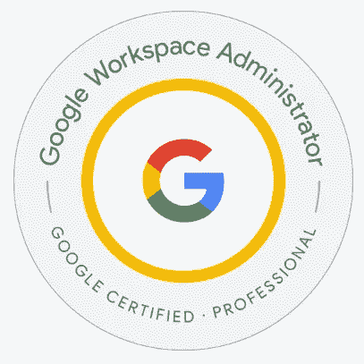
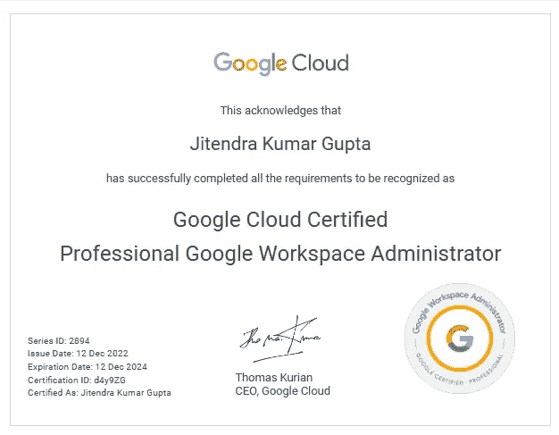

# 认证—如何准备 Google Cloud —专业的 Google Workspace 管理员

> 原文：<https://medium.com/google-cloud/certification-how-to-prepare-for-google-cloud-professional-google-workspace-administrator-561ed334fad2?source=collection_archive---------2----------------------->

**关于我** —我是多云认证云架构师；目前的工作任务集中在谷歌云平台上。过去 18 个月，我写了 17+云认证，最近通过了 GCP -专业谷歌工作区管理员认证。

**本次考试的目标受众？**

如果你有兴趣成为一名 Google Workspace 管理员，或者目前正在从事 Google Workspace 管理员的工作，并希望提高自己的技能和证书，那么参加考试可能是一个好主意。Google Cloud Professional Workspace 管理员认证是一个得到广泛认可和尊重的证书，证明了您在管理和部署 Google Workspace 方面的专业知识。

但是，如果您对成为 Google Workspace 管理员不感兴趣，或者对考试中测试的技能和知识没有需求，那么参加考试可能没有必要。

最终，参加 Google Workspace 管理员考试的决定应该基于你的个人职业目标和工作要求。如果你不确定参加考试是否适合你，你可以考虑向职业顾问或雇主寻求指导。

**工作区管理员的角色和职责？**

它可能因组织的规模和需求而异，但通常包括:

1.  **设置和管理用户:**这包括创建用户帐户、分配角色和权限，以及管理用户对各种 Google Workspace 服务的访问。
2.  **管理域:**这包括设置和配置域，以及管理域级别的设置，如电子邮件路由和群组共享。
3.  **数据迁移:**这包括从不同系统导入和导出数据，以及在 Google Workspace 中管理用户数据。
4.  **故障排除和支持:**这包括解决技术问题、回答用户问题以及提供用户培训和支持。
5.  **安全和合规:**这包括管理安全设置，确保组织遵守任何相关法律法规。
6.  **项目管理:**这可能包括管理 Google Workspace 部署项目，并确保它们在预算内按时完成。

除了这些具体的职责之外，Google Workspace 管理员还应该熟悉 Google Workspace 最佳实践，并对该产品以及如何使用它来满足组织的需求有深刻的理解。

**步骤# 1 了解考试内容-**Google Cloud Professional Workspace 管理员认证考试测试您如何管理和部署 Google Workspace 的知识，包括如何设置和管理用户、域和数据迁移。它还测试您对如何解决和支持 Google Workspace 用户的理解。

为了准备考试，你应该熟悉考试内容和目标，在这里的官方考试指南中有概述。[https://cloud . Google . com/certification/guides/workspace-administrator/](https://cloud.google.com/certification/guides/workspace-administrator/)

官方样题可以在这里考——[专业 Google Workspace 管理员样题](https://docs.google.com/forms/d/e/1FAIpQLSfdLA0hTTzsKnw5Mt23yL-jH06xNzV_f-s32nEBc9ZKAIFYLA/viewform)。由于样题保持不变，可以尝试多次。

**第二步——学习计划**

**2.1 视频培训—** [驯服 Google Workspace (G Suite) —管理员指南](https://www.taming.tech/GoogleWorkspaceAdmin)并创建 2 周免费试用的 Workspace 管理员帐户。

2.1.1 也浏览这些 YouTube 播放列表，了解关于 [Google Workspace](https://www.youtube.com/@googleworkspace) 的更多深入知识

**2.2**

**课程-**

*   [谷歌工作区管理简介|面向合作伙伴的谷歌云技能提升](https://partner.cloudskillsboost.google/course_templates/90?catalog_rank=%7B%22rank%22%3A9%2C%22num_filters%22%3A0%2C%22has_search%22%3Atrue%7D&search_id=20779009)
*   [Google Workspace Security |面向合作伙伴的 Google Cloud 技能提升](https://partner.cloudskillsboost.google/course_templates/48?catalog_rank=%7B%22rank%22%3A10%2C%22num_filters%22%3A0%2C%22has_search%22%3Atrue%7D&search_id=20779009)
*   [管理 Google Workspace |面向合作伙伴的 Google Cloud 技能提升](https://partner.cloudskillsboost.google/course_templates/92?catalog_rank=%7B%22rank%22%3A8%2C%22num_filters%22%3A0%2C%22has_search%22%3Atrue%7D&search_id=20779009)

**任务—**

*   [工作空间:数据集成|面向合作伙伴的谷歌云技能提升](https://partner.cloudskillsboost.google/quests/195?catalog_rank=%7B%22rank%22%3A6%2C%22num_filters%22%3A0%2C%22has_search%22%3Atrue%7D&search_id=20779009)
*   [配置您的工作场所:面向 IT 管理员的谷歌工作空间|面向合作伙伴的谷歌云技能提升](https://partner.cloudskillsboost.google/quests/210?catalog_rank=%7B%22rank%22%3A4%2C%22num_filters%22%3A0%2C%22has_search%22%3Atrue%7D&search_id=20779009)
*   [Workspace Essentials |面向合作伙伴的谷歌云技能提升](https://partner.cloudskillsboost.google/quests/65?catalog_rank=%7B%22rank%22%3A2%2C%22num_filters%22%3A0%2C%22has_search%22%3Atrue%7D&search_id=20779009)
*   [面向 IT 管理员的 Google Workspace 面向合作伙伴的 Google Cloud 技能提升](https://partner.cloudskillsboost.google/quests/168?catalog_rank=%7B%22rank%22%3A1%2C%22num_filters%22%3A0%2C%22has_search%22%3Atrue%7D&search_id=20779009)

**2.3 Google Workspace 文档:**Google Workspace 文档是涵盖 Google Workspace 各个方面的综合资源。它包括有关如何设置和管理用户、域和数据迁移，以及如何排除故障和支持用户的详细说明。你可以在这里找到 Google Workspace 文档:[https://gsuite.google.com/support/](https://gsuite.google.com/support/)

强烈建议**或**说**强制**通过此处的[这些](https://github.com/jitu028/gcp-workspace-administrator/blob/main/GCP%20-%20Professional%20Google%20Workspace%20Administrator%20curated%20links.pdf)([jitu 028/GCP-workspace-administrator](https://github.com/jitu028/gcp-workspace-administrator))要求通过该考试。这些链接来自我为考试准备的笔记。

**第三步——练习模拟考试**

来自 Whizlabs 的模拟测试—[https://www . whiz labs . com/learn/course/professional-workspace-administrator](https://www.whizlabs.com/learn/course/professional-workspace-administrator)

**第 4 步—安排考试**

我为这个认证准备了大约 2 个月，仍然没有完全准备好。有许多设置、配置、警报和规则集需要记住，因为它对每种类型的订购计划(Business starter、Business standard、Business plus 和 Enterprise)都有不同的作用。查看这里的计划— [Google Workspace(之前的 G Suite):定价计划](https://workspace.google.com/pricing.html)。

在准备了几次模拟考试后，我安排了考试，并在早上 5:30 参加了远程监考。对于这个考试，我建议当你有信心并且在模拟考试中持续获得 75%的分数时再安排考试。

**参考—**

也请查看由 [sathish vj](https://medium.com/u/ba857441758a?source=post_page-----561ed334fad2--------------------------------) 撰写的关于本次考试的文章，以获得更详细的评论— [我的谷歌云专业协作工程师认证考试笔记](https://sathishvj.medium.com/notes-from-my-google-cloud-professional-collaboration-engineer-certification-exam-5aaaaa2a4b19)

虽然它最后一次更新是在 2020 年，当时考试的名称是——专业协作工程师，但大部分内容仍然有效，是考试的重点。

我的证书-

祝你准备工作顺利。

如果有任何问题，可以通过[**LinkedIn**](https://www.linkedin.com/in/jitu028/)**和 Twitter[**@ jitu 028**](https://twitter.com/jitu028)和 DM 联系我，我很乐意帮忙！！**

**您也可以安排在[https://www.topmate.io/jitu028](https://www.topmate.io/jitu028)与我进行一对一的讨论，以获得任何谷歌云认证指导。**