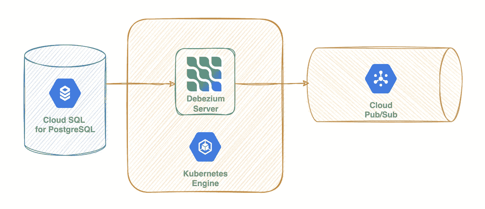

# 将 GKE 上 Debezium 服务器的数据捕获从 CloudSQL for PostgreSQL 更改为发布/订阅

> 原文：<https://medium.com/google-cloud/change-data-capture-with-debezium-server-on-gke-from-cloudsql-for-postgresql-to-pub-sub-d1c0b92baa98?source=collection_archive---------0----------------------->

变更数据捕获(CDC)是一种设计模式，它跟踪源系统上的变更数据，并将这些变更传输到其他系统。

在本文中，我们将捕获 CloudSQL for PostgreSQL 上的一个表的变化，并在一个发布/订阅主题上流式传输它们。

我假设之前已经创建了一个 PostgreSQL 实例和一个 GKE 集群。(因为这些是托管服务，所以您可以轻松地创建它们。)

有 3 个不同的部分来实现这一目标。这些是 DB、Pub/Sub 和 Debezium 服务器。

# 数据库ˌ资料库

首先我们需要通过在 上将***cloudsql . logical _ decoding***标志设置为 ***来启用逻辑解码。***

之后，我们创建一个具有复制属性的数据库用户:

最后，我们创建一个测试表来捕获:

# 发布/订阅

我们需要创建一个名为***debezium-test-db . public . debezium-test***的发布/订阅主题，它使用类似于 ***<服务器名称>的模式。<模式名>。<表格名称>*** 。我们将在下面的 Debezium 配置中设置服务器名称。

我们还需要创建一个订阅来获取相关主题的变更消息。

# Debezium 服务器

要在 Kubernetes 上部署 Debezium 服务器，我们需要定义一些 Kubernetes 对象。Debezium 服务器需要在一个文件中保存偏移量信息，所以我们将把它部署为一个 StatefulSet。我们还为 StatefulSet 创建了一个服务，并创建了一个 ConfigMap 来保存 Debezium 配置。

**注意:** Debezium 服务器在捕获时会将变更事件推送到发布/订阅主题。为此，它必须具有所需的权限。工作负载标识是实现这一点的好方法。您可以创建一个 GCP 服务帐户并授予所需的权限。之后，使用工作负载身份，您可以将其绑定到 Kubernetes 服务帐户，这样，Kubernetes 服务帐户就充当了 GCP 服务帐户。

就是这样。您可以在表上插入、更新或删除数据，事件将被发送到相关主题。

**参考文献**

*   [https://cloud . Google . com/SQL/docs/postgres/replication/configure-logical-replication](https://cloud.google.com/sql/docs/postgres/replication/configure-logical-replication)
*   [https://debezium . io/documentation/reference/operations/debezium-server . html](https://debezium.io/documentation/reference/operations/debezium-server.html)