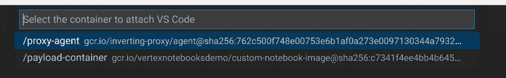

# 选择你想要的 IDE，在 Vertex AI Workbench 上开发(第一部分)

> 原文：<https://medium.com/google-cloud/choose-the-ide-you-want-and-develop-on-vertex-ai-workbench-part-i-94d19ca1d2ff?source=collection_archive---------0----------------------->

笔记本是数据科学事实上的开发标准工具，谷歌云提供 [Vertex AI Workbench](https://cloud.google.com/vertex-ai-workbench) 让数据科学家更有生产力。
还有，其他开发 ide(比如 VSCode，Pycharm 等。)提供了有趣的特性(调试、自动完成等)。)而且开发人员觉得使用这些工具更有效率，尤其是在编写库和支持代码的时候。

在这个系列中，我们将展示如何在本地机器上配置两个最常见的开发 ide，VSCode 和 Pycharm，以便与远程 Vertex AI 工作台一起工作。


数据科学家使用本地安装的 ide 与远程顶点 AI 工作台实例进行交互

在本文中，我们从 VSCode 开始，简要介绍如何创建一个 Vertex AI Workbench 实例，更准确地说是一个用户管理的笔记本。然后，我们将讨论如何使用 VSCode 连接笔记本电脑。
我们试图提供详细的分步指南。起初看起来可能很复杂，因为**显然涉及许多步骤，但实际上非常简单。**

# **创建用户管理的笔记本**

为了说明如何在 Vertex 笔记本上使用 VSCode，我们创建了两个[用户管理笔记本](https://cloud.google.com/vertex-ai/docs/workbench/user-managed/introduction)。正如我们将看到的，每个选项都有一些架构上的差异。

提供有关如何创建用户管理的笔记本的所有细节超出了我们的目标。参考[文档](https://cloud.google.com/vertex-ai/docs/workbench/user-managed/create-user-managed-notebooks-instance-console-quickstart)阅读更多关于如何创建笔记本的信息。此外，考虑在 VPC 的子网中创建用户管理的笔记本(另请参见[文档](https://cloud.google.com/compute/docs/instances/create-start-instance#create_a_vm_instance_in_a_specific_subnet)):您必须确保可以从您的笔记本电脑访问您的笔记本。

我们使用[自定义容器图像](https://cloud.google.com/vertex-ai/docs/workbench/user-managed/custom-container)创建第一个笔记本


第二台笔记本使用谷歌[提供图片](https://cloud.google.com/vertex-ai/docs/workbench/user-managed/images)比如 Python:


一旦每个实例可用，我们[将](https://cloud.google.com/vertex-ai/docs/workbench/user-managed/create-new#open_the_notebook_2)与安装在每台机器上的 JupyterLab 连接，我们**克隆**顶点 AI 演示 github [库](https://github.com/GoogleCloudPlatform/vertex-ai-samples)。

在自定义图像笔记本中，您应该获得类似于


而在 python-image 机器中，您应该得到类似


克隆样例存储库使我们能够比较使用 JypyterLab 和 ide 连接到同一个实例时所看到的情况。

我们现在可以继续配置安装了 VSCode 的机器，我们将使用它来连接这些实例。

# **安装 GCloud CLI**

为了与谷歌云服务无缝协作，我们建议在您的工作环境中安装 [GCloud CLI](https://cloud.google.com/sdk/docs/install) 。这种配置适用于您选择的任何 IDE。

# **配置 Visual Studio 代码**

要开始使用 VSCode 和 Vertex AI 笔记本，我们建议安装以下 VSCode 扩展:

*   [云代码](https://marketplace.visualstudio.com/items?itemName=GoogleCloudTools.cloudcode):它集成了谷歌云服务，比如谷歌计算引擎(GCE)。目前，要使用 GCE，您需要安装[预发布版本](https://cloud.google.com/code/docs/vscode/insiders)。
*   [远程开发:](https://marketplace.visualstudio.com/items?itemName=ms-vscode-remote.vscode-remote-extensionpack)它允许你打开容器中或远程机器上的任何文件夹，并利用 VS 代码的全部特性集

# **配置您的凭证和项目**

为了连接 Vertex AI 笔记本电脑，我们需要它的 IP(根据您的配置，您可能会使用它的私有或公共 IP)并配置密钥证书。为此，我们可以使用云代码扩展。

*   您可以直接从 Visual Studio 代码登录，选择云代码扩展并按照该扩展建议的步骤操作。


*   登录后，您可以使用云代码选择您的 GCP 项目


*   我们在上一步中创建的所有笔记本现在都显示在云代码扩展的 GCE 部分中。


*   我们使用 SSH 按钮来连接**的每个实例**


这样做:

1.  云连接将在您的设备上配置私钥
2.  您还可以从本地机器测试与远程实例的连接
3.  cou 可以收集一些稍后需要的设置。例如，当连接时，终端将显示如下内容:


在哪里

1.  admin_vigano 是我的用户
2.  python-image 是我们连接的主机。

请注意这些设置。

尝试 SSH 到远程笔记本时，您可能会遇到问题。如果不工作，请参考[文档](https://cloud.google.com/compute/docs/troubleshooting/troubleshooting-ssh)确定问题。一个很好的起点是由[故障排除工具](https://cloud.google.com/compute/docs/troubleshooting/troubleshooting-ssh#run_the_troubleshooting_tool)代表的，防火墙规则通常是一个常见的疑点。

# **连接到用户管理的笔记本电脑**

为了说明如何连接到用户管理的笔记本，我们首先从 python-image 机器(从 Google 提供的图像开始创建的机器)开始。

*   使用 Ctrl + Shift + P(或 VSCode 调色板)并选择 **Remote-SSH: Connect to Host**


从以下列表中，选择**配置 SSH 主机**


并选择您想要编辑的文件(在我们的例子中，我们编辑了第一个选项 home/vigano/。ssh/config)


并添加一个类似如下的条目:


根据您的网络设置，您可以使用实例的名称、其私有或公共 IP，其中

*   **Host**:vs code 稍后显示的名称。您可以选择您最喜欢的名称(即顶点人工智能工作台实例的名称)
*   **主机名**:您笔记本电脑的私有或公共 IP(取决于您的网络设置)
*   **IdentityFile** :是我们用实例连接云代码时创建的私钥。你应该在。用户目录的 ssh 文件夹
*   **用户**:对应您的云识别用户(带下划线，改动很少)。我们建议在之前的步骤中记录您的用户，因此您应该已经准备好了。
*   使用 Ctrl + Shift + P(或 VSCode 调色板)并选择 **Remote-SSH: Connect to Host。**您还应该看到在上一步中配置的主机，并且您可以连接


如果要求您确认机器的指纹，请选择“继续”

在左下角，VSCode 将报告您已成功连接到实例，如下所示:


*   一旦连接上，如果你打开文件夹 **/home/jupyter/** ，你会看到我们通过控制台与 JupyterLab 连接时观察到的相同的文件夹结构


*   要开始使用 Python 和 Jupyter，您需要在远程主机上安装 Python 和 Jupyter 扩展。
    注意，如果你打开一个笔记本(例如 vertex-ai-samples/notebooks/official/automl/automl _ forecasting _ bqml _ ARIMA _ plus _ comparison . ipynb)并选择内核，VSCode 会建议你安装 Python 和 Jupyter 扩展。


*   在远程笔记本上安装 Jupyter 和 Python 扩展**，与 Vertex AI 工作台进行远程交互，就像在本地机器上工作一样。例如，您可以在远程环境中交互式地执行 Python 代码，或者利用 Vertex AI Workbench 上定义的内核在 VSCode 中执行 Jupyter 笔记本。
    记住在 SSH 中选择**Install**(您希望这些扩展在远程实例上工作，而不是在您的本地机器上)。**


# **连接到定制的用户管理笔记本电脑**

要将 VSCode 与从定制容器(例如我们的定制图像机器)获得的 Vertex AI 工作台一起使用，需要几个额外的步骤:

*   按照上一节中描述的相同过程连接到实例。
*   如果您检查/home/jupyter 目录，您将会找到克隆的内容，但是您将不会找到在您的容器上配置的库、环境或代码。
    事实上，您的定制容器是在虚拟机上的 docker 实例上执行的:


*   为了能够使用 VSCode 连接到容器，您的用户必须属于远程机器的 docker 组。按如下方式添加您的用户:

```
sudo usermod -aG docker $USER
```

您需要重置(或停止/启动)Vertex AI 工作台来应用此配置。

*   使用 VSCode 再次连接实例。一旦连接，从命令面板中选择(或 Ctrl + Shift + P) **远程-容器:连接到运行的容器。
    确保从连接到远程机器的 VSCode 窗口执行该命令！**


VSCode 连接到 docker 并返回实例上可用容器的列表



*   选择**有效载荷容器**，VSCode 将更新 UI(或打开一个新窗口),在左下角显示它与所选容器连接。


*   在远程容器上安装 Jupyter 和 Python 扩展**，以远程与 Vertex AI 工作台交互，就像在本地机器上工作一样。例如，您可以在远程环境中交互式地执行 Python 代码，或者利用自定义容器中定义的内核在 VSCode 中执行 Jupyter 笔记本。
    记得选择 **Install in Container** (您希望这些扩展在远程容器上工作，而不是在您的本地机器上)。**


# **结论**

在本文中，我们讨论了如何从广泛采用的开发 IDE vs code 连接到 Vertex AI Workbench。特别是，我们已经展示了如何使用标准和定制图像，突出了一些差异。

在后续文章中，我们将探索如何用 PyCharm 连接 Vertex AI Workbench

# **致谢**

我要感谢伊万·纳迪尼和赛义德·阿加博佐吉的建议和反馈。