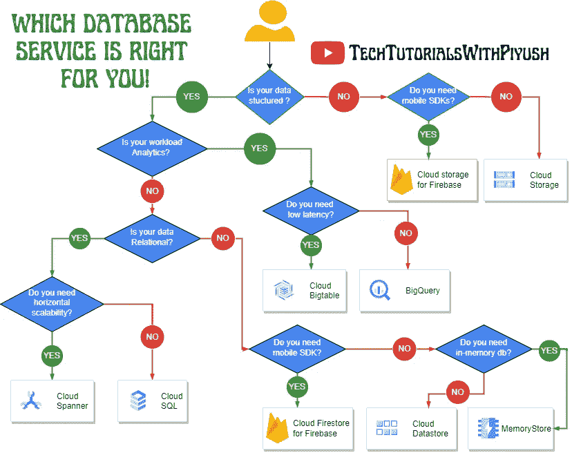

# 在 GCP 选择合适的数据库服务。

> 原文：<https://medium.com/google-cloud/choose-the-right-database-service-in-gcp-8e3803245e1d?source=collection_archive---------0----------------------->

当谈到为您的工作负载选择最佳数据库服务时，没有适合所有情况的单一数据库，这篇博客文章涵盖了 Google Cloud 中跨关系(SQL)和非关系(NoSQL)数据库的不同数据库选项，并解释了哪些用例最适合每个数据库选项。

在 Google cloud 上选择合适的数据库时，我们应该考虑几个因素。这些因素包括但不限于:

*   成本效益
*   可扩展性和弹性
*   数据类型；结构化或非结构化
*   数据库的类型；SQL 或 NoSQL
*   分析、报告或移动 SDK 功能，等等。

下面的流程图将帮助您了解如何根据您的业务需求选择最佳数据库，同时牢记所有要求。

谷歌云平台中的数据库规划

让我们来看看关于这几点的简介。

1.  **结构化与非结构化数据:**通常以行和列、JSON 文件、YAML 文件、日志文件或任何文本文件等预定义形式表示的数据称为结构化数据，而没有预定义结构且大多存储为静态文件(如音频、视频、图像)的数据称为非结构化数据。
2.  **关系数据与非关系数据:**在关系数据库中，信息存储在表、行和列中，这通常最适合结构化数据。SQL(结构化查询语言)在与大多数关系数据库交互时使用，但是，NoSQL 数据库针对特定的工作负载模式(即，键值、图形、宽列等)进行了优化。NoSQL 数据库通常比 SQL 数据库更快，因为它们不扫描大量的表来提供答案，这使得它成为存储没有固定模式的数据的完美选择。
3.  **云 SQL:** 在 Google Cloud 上提供托管的 MySQL、PostgreSQL 和 SQL Server 数据库。它降低了维护成本，自动化了数据库配置、存储容量管理、备份以及现成的高可用性和灾难恢复/故障转移。由于这些原因，它最适合通用 web 框架、CRM、ERP、SaaS 和电子商务应用程序。
4.  **Cloud Spanner:** 它提供了 Cloud SQL 的所有关系数据库功能，以及通常由 NoSQL 数据库提供的水平可伸缩性。Spanner 最适用于游戏、支付解决方案、全球财务分类账、零售银行和库存管理等需要具备无限扩展能力以及强大一致性和高可用性的应用。
5.  **Cloud BigTable:** 它是一个基于宽列的 NoSQL 数据库，适用于大规模低延迟工作负载。它非常适合需要大量读/写和高吞吐量的工作负载。
6.  **云大查询:**是针对大量关系型结构化数据的企业数据仓库解决方案。它针对基于 SQL 的大规模即席分析和报告进行了优化，这使得它最适合于获取组织洞察。
7.  **云存储:**这是一项在谷歌云中存储你的对象的服务。对象是一段不可变的数据，由任何格式的文件组成，如音频、视频、图像、Blobs 或任何非结构化数据。
8.  **Memory Store:**Cloud Memory Store 提供完全托管的内存数据存储服务，构建在由 Google 管理的可扩展、更安全且高度可用的基础设施之上。使用 Cloud Memorystore 构建应用程序缓存，提供亚毫秒级的数据访问。Memorystore 支持 Redis 和 Memcached，并且完全兼容协议。选择符合您的成本和可用性要求的合适引擎。
9.  **Cloud Firestore for Firebase:**Cloud Firestore 是一个灵活、可扩展的数据库，用于 Firebase 和 Google Cloud 的移动、web 和服务器开发。像 Firebase 实时数据库一样，它通过实时监听器使您的数据在客户端应用程序之间保持同步，并为移动和 web 提供离线支持，因此您可以构建响应迅速的应用程序，无论网络延迟或互联网连接如何。

# **结论:**

选择关系数据库还是非关系数据库很大程度上取决于用例。一般来说，如果您的数据结构不会有太大变化，请选择关系数据库。Google Cloud 将 Cloud SQL 用于任何通用 SQL 数据库，将 Cloud Spanner 用于大规模全球可扩展、高度一致的用例。一般来说，如果您的数据结构以后可能会改变，并且如果规模和可用性是更大的需求，那么非关系数据库是更好的选择。Google Cloud 提供 Firestore、Memorystore 和 Cloud Bigtable 来支持跨文档、键值和宽列数据库的各种用例。有关每个数据库的更多比较资源，请查看[概述](https://cloud.google.com/products/databases)。

## 观看此视频，了解这些数据库服务的概况，以及根据要求选择哪种服务:

**参考文献:**

 [## 你的谷歌云数据库选项，解释|谷歌云博客

### 在关系数据库中，信息存储在表、行和列中，这通常最适合于结构化…

cloud.google.com](https://cloud.google.com/blog/topics/developers-practitioners/your-google-cloud-database-options-explained)  [## Bigtable vs. BigQuery:有什么区别？|谷歌云博客

### Bigtable 是一个 NoSQL 数据库，旨在支持大型、可伸缩的应用程序。使用 Bigtable 当你正在制作…

cloud.google.com](https://cloud.google.com/blog/topics/developers-practitioners/bigtable-vs-bigquery-whats-difference)