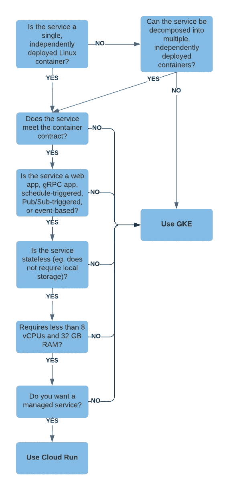

# 在 GKE 和云运行之间选择

> 原文：<https://medium.com/google-cloud/choosing-between-gke-and-cloud-run-46f57b87035c?source=collection_archive---------0----------------------->

你写了一个应用程序。而且，像 2022 年编写应用程序的许多开发者一样，你把所有代码都塞进了 Docker 容器。现在，您会问自己:我应该如何将它部署到 GCP？

有很多方法可以在 GCP 上运行容器化的工作负载:在一个[谷歌计算引擎](https://cloud.google.com/compute) (GCE)实例上，可能由托管实例组(MIG)支持； [App 引擎 Flex](https://cloud.google.com/appengine/docs/flexible)；在[云上运行](https://cloud.google.com/run)，运行容器的托管服务；或者——也许是最复杂的——在 Google Kubernetes 引擎(GKE)集群上。

为了这篇博文的目的，让我们立即从列表中选择两个选项:App Engine 和 GCE。现在，我们把注意力集中在剩下的两项服务上，在 GKE 和云运行之间进行选择。那么如何选择呢？

## 没有错误的选择

请允许我花一点时间对架构选择的现实发表意见，因为它与此相关。

没有糟糕的选择——至少没有糟糕的选择。我们已经从我们的列表中删除了几个，理由很充分:AppEngine，因为样板文件和结构级别更高，部分原因是它对编程语言和版本的支持有限(尽管支持自定义运行时环境)；和 GCE 来避免维护虚拟机操作系统的工作。

在大多数情况下，的独特优势和权衡会引导我们完成决策过程，这里的情况也是如此:GKE 和 Cloud Run 是运行容器化应用程序的出色的生产就绪型服务。我们必须简单地根据它们的优点来评价它们。

让我们从定义应用程序的需求开始。例如:

*   容器的操作系统是什么？
*   我的申请包含多少个容器？
*   应用程序的 CPU 和内存需求是什么？
*   应用程序是无状态的还是有状态的(就底层运行时环境而言)？
*   应用程序是基于事件的吗？
*   应用程序是同步还是异步响应事件？
*   应用程序将处理什么样的事件？
*   我需要托管服务吗？

如果你能回答上面的问题，选择一个运行时是相当容易的！在这种情况下，选择的过程变得更简单，因为有一个服务比另一个服务更受限制，限制了它可以支持的用例的可能数量。

## 云运行

虽然它是一个运行容器的非常简单的托管服务，但它是一个更有限的平台——也就是说，它支持最窄的用例集，因此是开始评估的好地方。一般来说，云运行对于同步的、事件驱动的应用程序和微服务非常有用。同步、事件驱动的应用程序的典型例子是 web 应用程序，但是 Cloud Run 也支持来自云任务等服务的异步事件。目前(截至 2022 年 8 月)，Cloud Run 允许应用程序被许多不同的触发器调用:HTTP、gRPC、websockets、Eventarc、Pub/Sub、云调度程序和云任务。

## GKE

GKE 本质上是托管的、云原生的 Kubernetes，一个用于容器的运行时和编排引擎，能够协调容器化的工作负载及其资源的部署。虽然 Kubernetes 非常能干，但它也很复杂。Kubernetes 集群通常由控制平面和工作负载的许多节点组成，因此，在像 Kubernetes 这样庞大而复杂的系统上运行单个容器的工作负载可能是多余的。

值得一提的是，管理 GKE 的复杂性在一定程度上得到了缓解:具有 [Autopilot](https://cloud.google.com/kubernetes-engine/docs/concepts/autopilot-overview) 的 GKE 转向了自动化的按需扩展模型，根据给定工作负载的请求资源自动添加和删除节点，使其类似于云运行。然而，即使有自动驾驶仪，你仍然必须写 Kubernetes YAML 文件部署到 GKE 与自动驾驶仪。

# 决策矩阵

对于简单的用例，这个简单的决策树可以帮助您在云运行和 GKE 之间进行选择。你可能还会发现谷歌简洁明了的 [*我的应用很适合云运行吗？*](https://cloud.google.com/run/docs/fit-for-run) 文档页面相当有用。截至 2022 年 8 月的注意事项:下图有点过时，已经更新。Cloud Run 现在最多可以支持 [8 个 vcpu](https://cloud.google.com/run/docs/configuring/cpu#setting)和 [32 GB 内存](https://cloud.google.com/run/docs/configuring/memory-limits#max)。

