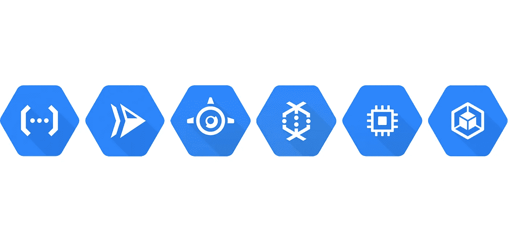
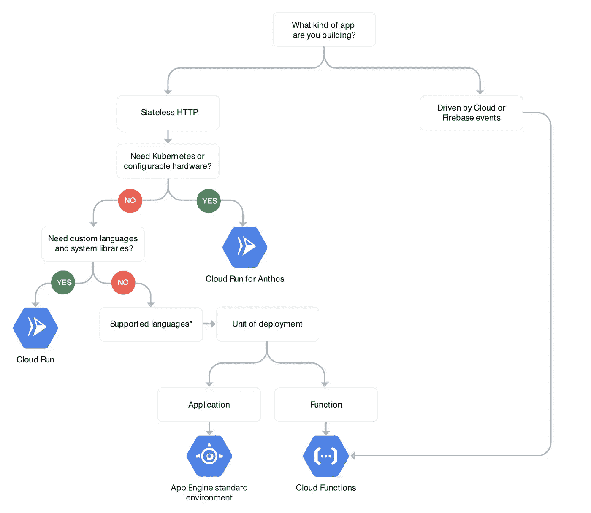

# 为您的应用选择合适的谷歌云平台托管服务

> 原文：<https://medium.com/google-cloud/choosing-the-right-hosting-service-in-google-cloud-platform-for-your-application-3362c9bede5e?source=collection_archive---------1----------------------->

## 在 Google 云平台上，哪种执行环境最适合您的应用需求

谷歌云平台提供了广泛的选项来运行你的代码。在本文中，我们将看到每一项服务的功能、使用情形和定价，您可以决定哪一项符合您的应用需求以及您想要的基础架构控制级别。

我们来对比一下 [**云函数**](https://cloud.google.com/functions)**[**云运行**](https://cloud.google.com/run)**[**App 引擎**](https://cloud.google.com/appengine)**[**云数据流**](https://cloud.google.com/dataflow)**[**计算引擎**](https://cloud.google.com/compute)[和 **Kubernetes 引擎(GKE)**](https://cloud.google.com/kubernetes-engine)********

## ****TL；速度三角形定位法(dead reckoning)****

*   ******云功能:**无服务器，全托管，事件驱动，面向轻量级应用。****
*   ******云运行:**无服务器，完全托管，事件驱动，用于无状态容器。****
*   ******App Engine:** 无服务器、完全托管、高度可扩展，适用于任何类型的应用。****
*   ******云数据流:**数据处理管道的无服务器流式传输和批处理。****
*   ******计算引擎:**定制 CPU/RAM/GPU 选项，在虚拟机上运行任何东西。****
*   ******Kubernetes 引擎:**为容器管理 Kubernetes 环境。****

# ****云函数****

****Functions 是一个**事件驱动的、完全托管的、无服务器的、高度可伸缩的**服务，它可以将轻量级服务与您的应用程序集成。它非常适合需要**一小段代码来快速处理与事件**相关的数据 **的微服务。******

****如果你的代码是一个 **webhook，物联网数据流，HTTP 端点**或者需要与人工智能服务集成，functions 就是为你准备的。对应用程序运行的时间和调用的次数进行定价。它支持**节点。JS、Go、Python、Java** 。****

# ****云运行****

****Cloud Run 是一个针对无状态 Docker 容器的**完全托管的无服务器平台，**因为我们说的是 Docker，所以你可以在里面运行任何你想运行的东西。**可通过 HTTP 请求**调用，并可与 [Anthos](https://cloud.google.com/anthos) 集成。****

****你可以拥有 Docker 提供的所有东西，并且用两个命令**,你就拥有了生产中的应用程序。**为你的应用程序运行的时间和被调用的次数定价。Cloud Run 让你**从你的容器中只暴露一个端口**，所以记住这一点。****

# ****应用引擎****

****当您需要在一个地方实现多种功能，并希望部署整个应用程序时，可以使用它。你只需要填写一份 YAML 的文件，谷歌就会为你完成这项艰巨的工作。也很容易设置与其他 GCP 服务。****

****用于高度可扩展的**无服务器**应用。支持 **Node.js，Java，Ruby，C#，Go，Python，PHP，或者 Docker。**定价随应用的使用情况而定。非常适合移动应用，与 Firebase 无缝集成。****

****如果你想知道哪个**无服务器**选项更适合你，查看谷歌制作的流程图来帮助你:****

********

****字体:[https://cloud.google.com/serverless-options/](https://cloud.google.com/serverless-options/)****

# ****云数据流****

****如果你有一个网站、移动应用程序或物联网设备，通常来自这些系统的数据往往不是一种方便或有效的格式。如果你需要**捕捉、分析和丰富这些数据**，这就是数据流的用武之地。****

****Dataflow 是一个**无服务器**服务，设计用于执行**数据处理管道**的流和批处理。管道是读取、转换和写入数据的过程。它将处理任务分配给多个虚拟机，以便它们可以并行处理不同的数据块。****

****支持 Apache Beam SDK，所以是 **Java 或者 Python** 。如果你使用另一种语言，考虑另一种服务。因为这是一种无服务器服务，你无法控制它的基础设施，而且你要按使用付费。****

# ****计算引擎****

****它是 Gmail、YouTube 和谷歌搜索引擎的基础。运行可定制的虚拟机，**让我们能够更好地控制我们的基础设施**。它支持预定义或**定制的机器类型，带有 CPU 和 RAM 选项**。有三种类型的 os 预定义机器:****

*   ******通用:**用于通用服务器、网站托管和数据库。****
*   ******计算优化:**适用于游戏或单线程应用等高性能计算。****
*   ******内存优化:**用于内存分析和大型数据库。****

****您还可以**添加图形处理单元，用于机器学习和数据处理等密集计算工作负载**。**你可以运行不同的操作系统**，它有**对 Docker 容器**的支持。计算引擎的定价基于每秒使用的机器类型、永久磁盘和您为虚拟机选择的其他资源。****

# ****库伯内特发动机(GKE)****

****GKE 为 Kubernetes 提供了一个完全托管的环境来部署、管理和扩展你的容器化应用。GKE 环境由多台机器(计算引擎实例)组成，这些机器组合在一起形成一个[集群](https://cloud.google.com/kubernetes-engine/docs/concepts/cluster-architecture)。****

****任何 Kubernetes 用例都适用于 GKE，比如 K8S 编排的**微服务。每个群集每小时收取 0.10 美元的群集管理费，在删除群集之前，工作节点会累计计算成本。******

****就是这样！我希望这个概述能帮助您决定哪种服务适合您的应用程序需求。欢迎在 [GitHub](https://github.com/leozz37) 上关注我，并在 [LinkedIn](https://www.linkedin.com/in/leonardoaugustolima/) 上与我联系！****

**** [## leozz37 -概述

### 在 GitHub 上注册你自己的个人资料，这是托管代码、管理项目和构建软件的最佳地方…

github.com](https://github.com/leozz37)****