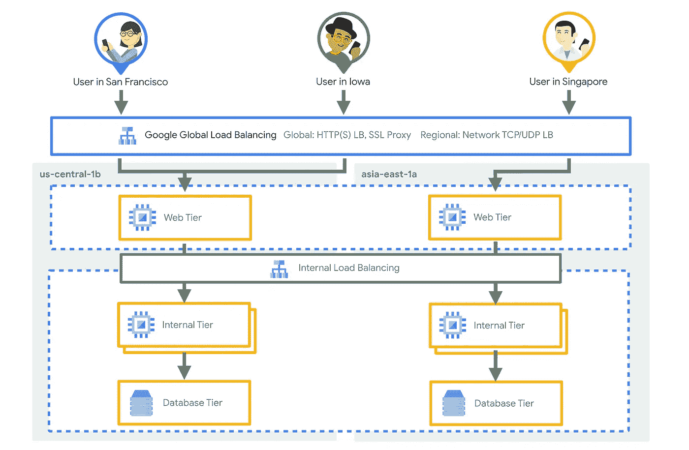

# 在 Google Cloud 中选择合适的负载平衡器

> 原文：<https://medium.com/google-cloud/choosing-the-right-load-balancer-9ec909148a85?source=collection_archive---------1----------------------->

## 在云中烹饪

作者:[普里扬卡·韦尔加迪亚](https://twitter.com/pvergadia)，[王从希](https://twitter.com/swongful)

# 介绍

“[在云中烹饪](/@pvergadia/get-cooking-in-cloud-an-introduction-5b3b90de534e)”是一个博客和[视频](https://www.youtube.com/playlist?list=PLIivdWyY5sqIOyeovvRapCjXCZykZMLAe)系列，帮助企业和开发者在谷歌云上构建商业解决方案。在这个系列中，我们计划确定开发人员希望在 Google cloud 上构建的特定主题。一旦确定，我们就以此为主题制作一个迷你系列。

在这个迷你系列中，我们将讨论 Google 云负载平衡。

1.  选择正确的负载平衡器(本文)
2.  [通过全局负载平衡优化应用容量](/google-cloud/application-capacity-optimizations-with-global-load-balancing-e0aa079d2c25)
3.  [负载平衡的容量管理](/google-cloud/capacity-management-with-load-balancing-32bd22a716a7)
4.  [GKE 网络端点组的负载均衡](/google-cloud/container-load-balancing-on-google-kubernetes-engine-gke-4cbfaa80a6f6)

在本文中，我们将介绍 Google 云平台中不同的负载平衡选项。使用一个用例示例，我们将帮助您定义选择正确的负载平衡选项的过程。

# 看看这个视频

视频—选择合适的负载平衡器

# 你会学到什么

*   什么是负载平衡？
*   为什么负载平衡很重要？
*   不同的负载平衡选项
*   如何选择正确的负载平衡选项

# 背景

beyond Treat——您的素食狗零食一站式商店！

想象你负责一个复杂的网站， **Beyond Treat** (你的素食狗零食一站式商店)。而且是网上热播！它继续面临着高流量，你不确定你的网站后端能否处理来自世界各地的流量。您知道您需要使用负载平衡器，但是选项令人困惑。很难确切地知道如何确定一个满足您需求的负载平衡体系结构，并找出您需要的先决条件，以获得最佳性能，同时又不会对您的钱包造成太大影响。

# 什么是负载平衡？

首先，您需要知道什么是负载平衡，以及为什么它对您的应用程序的持久成功如此重要。

> 负载平衡是在您的服务器网络中分配流量的过程，以确保系统不会不堪重负，并且所有请求都能轻松高效地得到处理。

现代高流量网站服务于来自用户或客户端的数十万(如果不是数百万的话)并发请求，并以快速可靠的方式返回正确的文本、图像、视频或应用程序数据。你可能都有过这样的经历:访问你最喜欢的网站，却要等待很长时间，出现连接超时错误，或者图像和视频缓冲。很多时候，这是因为网站后端无法经济高效地扩展以满足如此高的流量。

这里合乎逻辑的答案是添加更多的后端服务器来帮助服务流量。但下一个问题是，如何根据容量和健康状况将流量分配给这些后端服务器？

这就是负载平衡引起轰动的地方。负载平衡是在您的服务器网络中分配流量的过程，以确保系统不会不堪重负，并且所有请求都能轻松高效地得到处理。

# 为什么负载平衡很重要？

负载平衡之所以重要，有很多原因。负载平衡器允许您:

*   在单个或多个区域中分布负载平衡的资源
*   满足您的高可用性要求
*   通过智能自动扩展来扩展或缩减您的资源
*   并使用云内容交付网络(CDN)实现最佳内容交付

借助 Google Cloud 负载平衡，您可以在一个每秒可以响应超过 100 万次查询的系统上，尽可能靠近您的用户提供内容！

# 不同的负载平衡选项

要决定哪个负载平衡器最适合您的实现，您需要考虑您是否需要

1.  **全局**或**区域**负载均衡。全局负载平衡意味着后端端点位于多个区域。区域负载平衡意味着后端端点位于单个区域。

2.**外部**或 i **内部**负载均衡

3.您服务的是哪种**流量**？HTTP，HTTPS，SSL，TCP，UDP 等。

# 如何决定使用哪个负载均衡器？

很明显，对于 Beyond Treat，有许多负载平衡选项，这取决于他们在架构中的确切位置需要负载平衡器。

他们将使用 ***外部*** 负载平衡器将来自互联网的流量分配到他们的谷歌云网络，并使用 ***内部*** 负载平衡器在他们的 GCP 网络内分配流量。

## 外部负载平衡器

外部负载平衡包括四个选项:

1.  **HTTP(S)负载平衡**对于 HTTP 或 HTTPS 流量，
2.  **TCP 代理**,用于 80 和 8080 以外端口的 TCP 流量，无 SSL 卸载
3.  **SSL 代理**用于 80 或 8080 以外端口上的 SSL 卸载。
4.  **TCP/UDP 流量的网络负载平衡**。

## **网络负载均衡器**

当**全球** HTTP(S)负载平衡器用于第 7 层流量，并使用谷歌网络边缘的谷歌前端引擎构建时，**区域**网络负载平衡器用于第 4 层流量，并使用*磁悬浮*构建。

> 网络负载平衡器用于第 4 层流量

磁悬浮是什么？

> 谷歌在 2008 年建立了 Maglev，以平衡所有进入数据中心的流量，并将流量分配给网络边缘的前端引擎。流量被分发到一组区域性后端实例。

Maglev 打破了传统的负载平衡器，因为它是基于软件的，并在主动-主动横向扩展架构中运行。Maglev 将流量均匀地分布在数百个后端上，并将意外故障对面向连接的协议的负面影响降至最低。它非常适合基于 L4 的轻量级负载平衡，在这种情况下，您希望将客户端 IP 地址一直保留到后端实例，并在这些实例上执行 TLS 终止。

## HTTP(S)负载平衡器

> 第 7 层流量的全局 HTTP(S)负载平衡

谷歌将负载平衡推到前端服务器的边缘网络，而不是使用传统的基于 DNS 的方法。因此，**全局**负载平衡能力可以在单个任播虚拟 IPv4 或 IPv6 地址之后。这意味着您可以在多个区域部署容量，而不必修改 DNS 条目或为新区域添加新的负载平衡器 IP 地址。因此，很明显，使用[全局 HTTP(S)负载平衡](https://cloud.google.com/load-balancing/docs/https)，您将获得跨区域故障转移和溢出！

> 通过全局 HTTP(S)负载平衡，您可以实现跨区域故障转移和溢出！

在最接近终端用户的区域中的实例出现故障或缺乏容量的情况下，分发算法自动将流量定向到具有可用容量的下一个最近的实例。我们将在接下来的两篇文章中对此进行更多的讨论。

## 基于代理的负载平衡器(TCP 和 SSL)

谷歌云还为 TCP 和 SSL 流量提供基于代理的负载平衡器，它们使用相同的全球分布式基础设施。

> 当您处理 TCP 流量并且不需要 SSL 卸载时，请使用 TCP 代理负载平衡器。

一般来说，使用它们的决定取决于您是否需要 SSL 卸载。你可以在下面的链接中找到更多信息。

> 当您处理 TCP 流量并需要 SSL 卸载时，请使用 SSL 代理负载平衡器。

现在，让我们回到超越治疗。在 Beyond Treat 的例子中，我们只接收 HTTP 和 HTTPS 流量，所以他们会选择 HTTPS 负载均衡器。但是，像大多数公司一样，该网站也有私有工作负载，如应用服务器，需要保护免受公共互联网的影响。这些服务需要在只能由内部实例访问的私有虚拟 IP 背后扩展和增长。为此，他们的最佳选择是基于谷歌 Andromeda 网络虚拟化堆栈的**区域**第 7 层**内部**负载平衡。

## 内部负载平衡器

与 HTTP(S)负载均衡器和网络负载均衡器类似，[内部 L7 负载均衡器](https://cloud.google.com/load-balancing/docs/l7-internal)既不是硬件设备，也不是基于实例的解决方案，并且可以支持您所需的每秒连接数量，因为在您的客户端和后端实例之间的路径上没有负载均衡器。

> 内部第 7 层负载平衡器每秒可以支持您需要的任意数量的连接！

在接下来的几篇文章中，我们将跟踪 Beyond Treat 的发展，甚至会经历不可预测的流量高峰…比如当国际狗日和 big bone treat 订单增加时😃。这使得他们的网站成为解释你所拥有的所有负载平衡选项的理想候选。但是当然，您可以将这些文章中描述的原则应用于各种工作负载。

Beyond Treats 体系结构看起来像这样，内部负载平衡器用于内部流量，外部全局 HTTPS 负载平衡器用于传入流量

# 结论

好了，你有它，负载平衡解构！敬请关注[云烹饪系列](/@pvergadia/get-cooking-in-cloud-an-introduction-5b3b90de534e)中的更多文章，并查看下面的参考资料了解更多细节。

# 后续步骤和参考:

*   在[谷歌云平台媒体](https://medium.com/google-cloud)上关注这个博客系列。
*   参考:[选择负载均衡器](https://cloud.google.com/load-balancing/docs/choosing-load-balancer)
*   关注[获取云端烹饪](https://www.youtube.com/watch?v=pxp7uYUjH_M)视频系列，订阅谷歌云平台 YouTube 频道
*   想要更多的故事？在[媒体](/@pvergadia/)和[推特](https://twitter.com/pvergadia)上关注我。
*   请和我们一起欣赏这部迷你剧，并了解更多类似的谷歌云解决方案:)