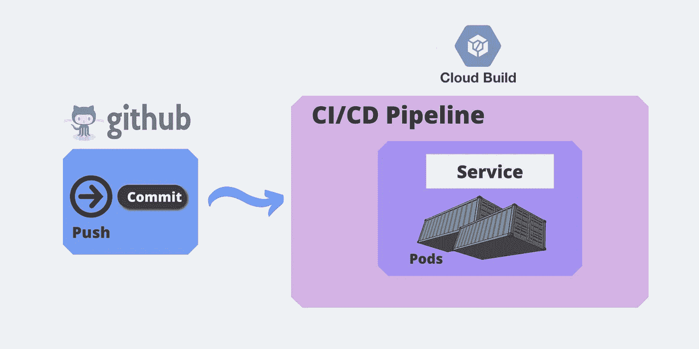

# 使用基于 GitOps 技术的云构建的 CI/CD 管道

> 原文：<https://medium.com/google-cloud/ci-cd-pipeline-using-cloud-build-with-gitops-technique-68b0e9d3b53?source=collection_archive---------0----------------------->

## [Spring Boot 与 MySQ](https://blog.usejournal.com/create-a-rest-api-in-spring-boot-with-mysql-b250ff3aaa9b) L / [Spring Boot 与 CloudSQ](https://andriperera-98.medium.com/spring-boot-restful-application-with-cloud-sql-for-mysql-7bfad7b3824b) L

## 了解如何使用 Google Cloud 中的 Git 存储库为您频繁的开发代码变更设置 CI/CD 管道。

