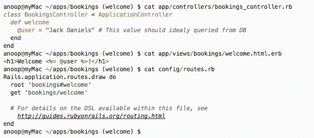

# 在您现有的(GKE)集群上使用 Jenkins-x 的 CI/CD—ruby on rails 应用程序

> 原文：<https://medium.com/google-cloud/ci-cd-with-jenkins-x-on-your-existing-gke-cluster-ruby-on-rails-application-785d8390a857?source=collection_archive---------0----------------------->

# 介绍

Jenkins X 是 Kubernetes 的 CI/CD 平台。这篇文章是让 Jenkins-X 在现有的 Google Kubernetes 引擎集群上工作的实用方法。

詹金斯-X 基于[头盔](https://github.com/kubernetes/helm)。最好确保`helm`和`jx`在您的 shell 中工作。如果你没有的话，就从各自的 github 页面发布部分安装它们。另外，在设置 Jenkins-x 之前，确保`helm` [在您的集群上工作](/@maniankara/helm-on-gke-cluster-quick-hands-on-guide-ecffad94b0)

本文假设您有一个正在运行的 GKE 集群，并不包括创建一个新的 Jenkins-X kubernetes 集群。如果您没有，只需点击几下鼠标，就可以在免费层帐户上创建一个。

# 在您的集群上安装 Jenkins-X(*JX 安装*)

如果您已经在 GKE 上安装了 Jenkins-X 集群，请确保您至少有 3 个节点(6 个 vCPUs ),并跳过本节。

***注意:您的 GKE 集群中应该至少有 3 个节点(6 个 vCPUs)。***

运行`jx install`并选择相关选项，在 kubernetes 集群上初始化 Jenkins-X。

该步骤执行以下操作:

1.  部署`tiller`，一个带有外部负载平衡器的入口控制器。
2.  将`jenkins-x-platform`安装到您的 kubernetes 集群 helm repo 中，这将带来大量资源`configMaps`、`deployments`、`services`等。
3.  在 git 中为`staging`和`production`分别创建两个存储库，并在 jenkins 中为每个存储库创建管道。

现在，我们已经准备好使用我们的`jenkins-x`集群为任何项目执行 CI/CD。

# 准备 rails 项目

获取要执行 CI/CD 的 rails 应用程序。这甚至不一定是 rails，可以是任何 web 应用程序。您既可以克隆您现有的应用程序，也可以使用`rails new <app>`从头开始生成一个新的应用程序。为了简单起见，我将创建一个新的应用程序。

# 将您的项目导入 Jenkins-X

运行`jx import <path to app>`命令导入您的项目。

该步骤执行以下操作:

1.  如果存储库中不存在所需的舵图、Jenkinsfile、Dockerfile，则从模板中复制它们。
2.  为 master branch 创建 jenkins 项目和管道，并创建触发 Jenkins 作业的 web-hook。
3.  创建一个拉式请求 PR-1，运行检查，合并并创建第一个发布`0.0.1`给 master。
4.  然后，这将升级为转移，您可以查看转移环境的外观。

该命令存在，让事情在后台运行。人们可以跟踪活动、日志等。从上面的命令。例如`jx get activity`看起来是这样的:

使用`jx get app`检查应用程序的状态。

抓取暂存环境的 url，看一看。我的看起来像这样:

看起来不错，现在是时候推广生产了，用`jx promote <app>`做吧。

重复`jx get app`并检查生产 url 是否有效。太好了！现在是做出改变的时候了，看看如何适应我们的 GitOps 工作流程。

# 更新并发布我们的欢迎页面

让我们进入应用程序，创建一个`welcome`分支，并创建一个欢迎控制器

让我们制作一个带有用户名的欢迎信息，并将其作为默认页面。修改控制器、视图和路线。

在您的 shell 上使用`rails server`命令进行本地测试。如果看起来不错，那就`git push`分支`welcome`分支。

然后从`ui`创建一个拉取请求。我的是 github，所以我会点击这个按钮。

现在，一个新的`PR`管道开始生效并验证更改，并创建一个预览环境，您可以从来自`ui`的 pull 请求中看到该环境。从拉取请求中，可以看出这一点。

单击该链接时，

好的，看起来不错，我想合并这个`PR`，它把这个带到`staging`。通过`jx get build logs`和`jx get activity`可以随时跟踪活动和日志。日志和活动成功结束后，再次检查应用程序状态。

检查暂存环境，然后像之前一样使用`jx promote`将其升级到生产环境，如果看起来没问题，刷新生产 url，瞧！

现在，我们用几个命令就完成了从桌面到生产的转变。以及保存在版本控制中的所有配置。那是给你的！

# 快速回顾

1.  使用`jx install`将 jenkins-x 安装到现有的 GKE 集群
2.  使用`jx import`将项目导入我们的 jenkins-x 集群
3.  用`jx promote`将项目推向生产
4.  做了更改，在本地测试，将更改作为分支推送，创建拉取请求，Jenkins-X 自动创建`preview`环境进行预览。
5.  接受了`PR`以自动进行测试。
6.  跑了一趟`jx promote`把我们的新版本从试播推广到生产。

# 常见错误

点击访问要点查看分辨率(嵌入限制)

# 平台版本

# 承认

来自`James Strachen`、`James Rawlings`和其他`jx`社区成员的大力支持。我在 [Slack](http://kubernetes.slack.com) `#jenkins-x-user`和`#jenkins-x-dev`渠道得到了这些专家的全天候支持。向那些家伙脱帽致敬！

# 参考

1.  在 GKE 集群上安装 helm，快速动手—[https://medium . com/@ manian Kara/helm-on-gke-cluster-quick-hands-on-guide-ecffad 94 b 0](/@maniankara/helm-on-gke-cluster-quick-hands-on-guide-ecffad94b0)
2.  詹金斯文档—[https://jenkins-x.io/documentation/](https://jenkins-x.io/documentation/)
3.  [https://jenkins-x.io/articles/](https://jenkins-x.io/articles/)