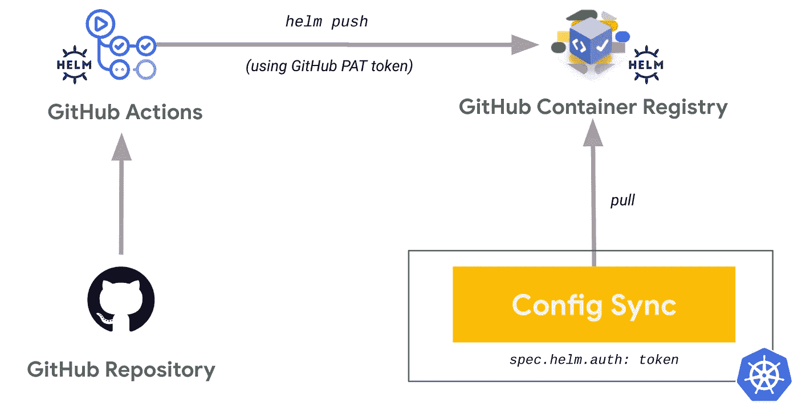
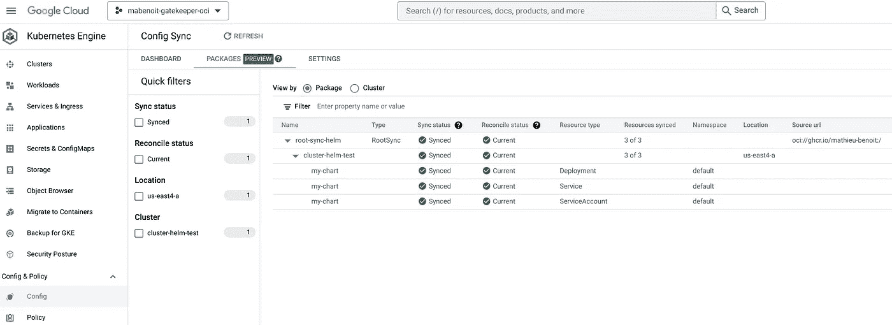

# 带有 Helm、GitHub 操作、GitHub 容器注册和配置同步的 CI/gitop

> 原文：<https://medium.com/google-cloud/ci-gitops-with-helm-github-actions-github-container-registry-and-config-sync-836913e74e79?source=collection_archive---------1----------------------->

*2023 年 1 月 16 日更新，在谷歌云控制台中使用新的配置同步用户界面，列出同步的资源及其状态。*

从 [Anthos 配置管理 1.13.0](https://cloud.google.com/anthos-config-management/docs/release-notes#September_15_2022) 开始，配置同步支持从私人 OCI 注册表同步舵图。要了解更多，请参见[从神器注册表](https://cloud.google.com/anthos-config-management/docs/how-to/sync-helm-charts-from-artifact-registry)同步头盔图表。

*你可以在这里了解更多关于这个公告:* [*部署 OCI 神器和舵图表 GitOps 方式与配置同步*](https://cloud.google.com/blog/products/containers-kubernetes/gitops-with-oci-artifacts-and-config-sync) *。*

[*在另一篇文章*](/google-cloud/ci-gitops-with-helm-github-actions-google-artifact-registry-and-config-sync-b48604191fda) *中，我们看到了如何使用 GitHub actions**将掌舵图打包并推送到****Google Artifact Registry，然后如何使用* ***Config Sync(使用工作量标识)*** *部署掌舵图。***

在本文中，我们将展示如何使用 GitHub actions(使用 PAT token) 将舵图打包并推送到 **GitHub 容器注册表，然后如何使用配置同步部署舵图。**



将舵图打包并推送到 GitHub 容器注册表的工作流，然后使用配置同步对其进行部署

# 目标

*   用 GitHub 动作在 GitHub 容器注册表中打包并推送一个 Helm 图表(使用 PAT 令牌)
*   创建 GKE 集群并启用配置同步
*   用配置同步从 GitHub 容器注册表同步舵图

# 费用

本教程使用 Google Cloud 的付费组件，包括:

*   [Kubernetes 发动机](https://cloud.google.com/kubernetes-engine/pricing)

*注:在这种情况下，配置同步是免费的，更多详情见* [*此处*](https://cloud.google.com/anthos-config-management/docs/pricing) *。*

使用[定价计算器](https://cloud.google.com/products/calculator)根据您的预计使用量生成成本估算。

# 开始之前

本指南假设您拥有 Google Cloud 项目的所有者 IAM 权限。在生产中，您不需要所有者许可。

1.  [选择或创建一个谷歌云项目](https://console.cloud.google.com/projectselector2)。
2.  [验证您的项目是否启用了计费](https://cloud.google.com/billing/docs/how-to/modify-project)。

本指南还假设您有一个 [GitHub 帐户](https://github.com/)。

# 设置您的环境

以下是您需要的工具:

*   `[gcloud](https://cloud.google.com/sdk/docs/install)`
*   `[git](https://git-scm.com/downloads)`
*   `[gh](https://cli.github.com/)`
*   `[kubectl](https://kubernetes.io/docs/tasks/tools/#kubectl)`

注意:你可以使用已经安装了所有这些工具的 Google Cloud Shell。

初始化本教程中使用的通用变量:

```
PROJECT_ID=FIXME-WITH-YOUR-PROJECT-ID
ZONE=us-east4-a
```

为了避免在整个教程中重复命令中的`--project`，让我们设置当前项目:

```
gcloud config set project ${PROJECT_ID}
```

用默认的`main`分支创建一个专用的 GitHub 存储库:

```
cd ~/
REPO_NAME=my-chart
gh auth login
git config --global init.defaultBranch main
gh repo create ${REPO_NAME} --private --clone
```

让我们捕获 GitHub 所有者的值，您将在本教程的后面部分重用它:

```
GITHUB_REPO_OWNER=$(gh repo view ${REPO_NAME} --json owner --jq .owner.login)
```

# 在 GitHub 容器注册表中打包并推送一个舵图

创建舵图:

```
helm create ~/${REPO_NAME}
```

在 GitHub 存储库中提交此舵图模板:

```
cd ~/${REPO_NAME} 
git add . && git commit -m "Create Helm chart template" && git push origin main
```

定义一个 GitHub 动作管道来打包并推送 GitHub 容器注册表中的 Helm 图表:

```
mkdir .github && mkdir .github/workflows
cat <<'EOF' > .github/workflows/ci-helm-ghcr.yaml
name: ci-helm-ghcr
permissions:
  packages: write
  contents: read
on:
  push:
    branches:
      - main
  pull_request:
env:
  CHART_NAME: my-chart
  IMAGE_TAG: 0.1.0
jobs:
  job:
    runs-on: ubuntu-latest
    steps:
      - uses: actions/checkout
      - name: helm lint
        run: |
          helm lint .
      - name: helm login
        run: |
          echo ${{ secrets.GITHUB_TOKEN }} | helm registry login ghcr.io -u $ --password-stdin
      - name: helm package
        run: |
          helm package . --version $IMAGE_TAG
      - name: helm push
        if: ${{ github.event_name == 'push' }}
        run: |
          helm push $CHART_NAME-$IMAGE_TAG.tgz oci://ghcr.io/${{ github.repository_owner }}
EOF
```

这个 GitHub Actions 管道允许执行一系列命令:`helm lint`、`helm registry login`、`helm package`，最终，如果是`main`分支中的`push`，就会执行`helm push`。此外，只要`main`分支中有一个`push`以及任何拉请求，就会触发该管道。你可以根据自己的需要调整这个流程和这些条件。

您可以看到，我们通过使用带有`helm registry login`命令的`secrets.GITHUB_TOKEN`环境变量来使用[自动令牌认证](https://docs.github.com/en/actions/security-guides/automatic-token-authentication)。除此之外，为了能够在 GitHub 容器注册表中推动舵图，我们需要有`permissions.packages: write`。

在 GitHub 存储库中提交此 GitHub 操作管道:

```
git add . && git commit -m "Create GitHub actions pipeline" && git push origin main
```

等待相关运行成功完成:

```
gh run list
```

点击以下按钮，查看您的舵图是否已成功上传:

```
echo -e "https://github.com/${GITHUB_REPO_OWNER}?tab=packages&repo_name=${REPO_NAME}"
```

# 创建 GKE 集群并启用配置同步

创建在[机群](https://cloud.google.com/anthos/fleet-management/docs/fleet-concepts)中注册的 GKE 集群以启用配置管理:

```
gcloud services enable container.googleapis.com
CLUSTER_NAME=cluster-helm-test
gcloud container clusters create ${CLUSTER_NAME} \
    --workload-pool=${PROJECT_ID}.svc.id.goog \
    --zone ${ZONE}

gcloud services enable gkehub.googleapis.com
gcloud container fleet memberships register ${CLUSTER_NAME} \
    --gke-cluster ${ZONE}/${CLUSTER_NAME} \
    --enable-workload-identity

gcloud beta container fleet config-management enable
```

在此 GKE 群集中安装配置同步:

```
cat <<EOF > acm-config.yaml
applySpecVersion: 1
spec:
  configSync:
    enabled: true
EOF
gcloud beta container fleet config-management apply \
    --membership ${CLUSTER_NAME} \
    --config acm-config.yaml
```

现在我们已经准备好了设置，让我们同步之前打包并推送到 GitHub 容器注册表的舵图。

# 从 GitHub 容器注册表同步舵图

因为我们创建了一个公共的 GitHub 库，所以我们在 GitHub 容器注册表中推送的舵图是公共的。您可以按照此处的说明[将默认可见性从公共更改为私有。](https://docs.github.com/en/packages/learn-github-packages/configuring-a-packages-access-control-and-visibility#configuring-visibility-of-container-images-for-your-personal-account)

[在 GitHub](https://github.com/settings/tokens/new) 中创建一个具有`read:packages` OAuth 范围的新的个人访问令牌(PAT ),以遵循“刚好够用且权限最小”的原则。

在`RootSync`的`Namespace`中创建与 GitHub 的 PAT 关联的`Secret`:

```
GITHUB_PAT=FIXME
kubectl create secret generic ghcr \
    --namespace=config-management-system \
    --from-literal=username=config-sync \
    --from-literal=password=${GITHUB_PAT}
```

展开`RootSync`以同步私人舵图:

```
cat << EOF | kubectl apply -f -
apiVersion: configsync.gke.io/v1beta1
kind: RootSync
metadata:
  name: root-sync-helm
  namespace: config-management-system
spec:
  sourceFormat: unstructured
  sourceType: helm
  helm:
    repo: oci://ghcr.io/${GITHUB_REPO_OWNER}
    chart: my-chart
    version: 0.1.0
    releaseName: my-chart
    namespace: default
    auth: token
    secretRef:
      name: ghcr
EOF
```

*请注意，我们设置了* `*spec.helm.auth: token*` *和* `*spec.helm.secretRef.name: ghcr*` *值，以便能够访问和同步私人舵手图表。如果有公共舵图要同步，可以用* `*spec.helm.auth: none*` *代替。*

通过运行命令`gcloud alpha anthos config sync resources list`或从云控制台导航到 ***Kubernetes 引擎>配置&策略>配置*** ，列出配置同步所同步的资源及其状态:



瞧！你刚刚部署了一个**私人头盔图**托管在 GitHub 注册表与配置同步。

# 结论

在本文中，您能够使用 GitHub 操作在 GitHub 容器注册表中打包和推送一个 Helm chart。然后，您看到了如何将私人舵图表与`RootSync`上的`spec.helm.auth: token`设置同步。这表明 Config Sync 支持任何你有舵图的私有 OCI 注册表:JFrog Artifactory 等。

# 清理

为了避免向您的 Google Cloud 帐户收取费用，您可以删除本教程中使用的资源。

从[舰队](https://cloud.google.com/anthos/fleet-management/docs/fleet-concepts)中注销 GKE 集群:

```
gcloud container fleet memberships unregister ${CLUSTER_NAME} \
    --project=${PROJECT_ID} \
    --gke-cluster=${ZONE}/${CLUSTER_NAME}
```

删除 GKE 群集:

```
gcloud container clusters delete ${CLUSTER_NAME} \
    --zone ${ZONE}
```

# 下一步是什么

*   [从工件注册表同步舵图](https://cloud.google.com/anthos-config-management/docs/how-to/sync-helm-charts-from-artifact-registry)
*   [从工件注册表同步 OCI 工件](https://cloud.google.com/anthos-config-management/docs/how-to/sync-oci-artifacts-from-artifact-registry)

*原帖*[*Mathieu-Benoit . github . io*](https://mathieu-benoit.github.io/)*。*