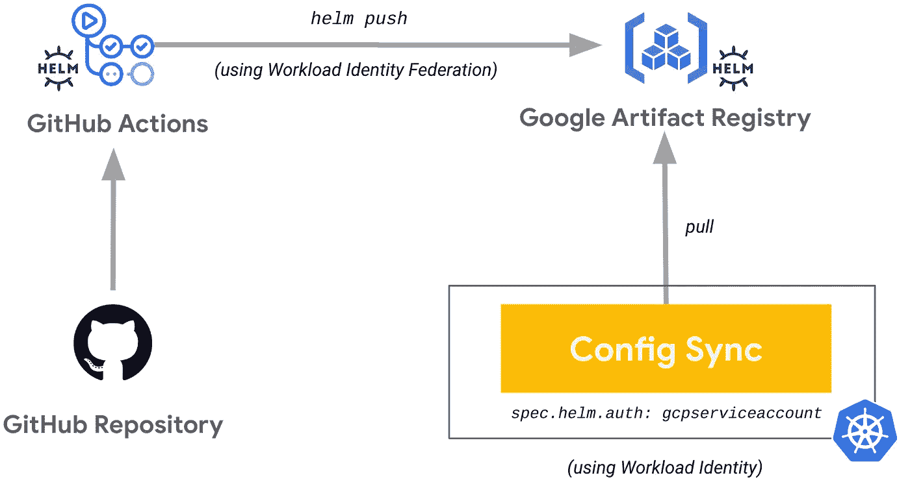
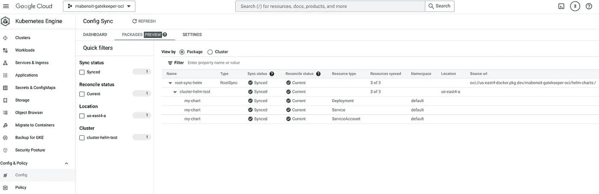

# 带有 Helm、GitHub 操作、Google 工件注册和配置同步的 CI/gitop

> 原文：<https://medium.com/google-cloud/ci-gitops-with-helm-github-actions-google-artifact-registry-and-config-sync-b48604191fda?source=collection_archive---------0----------------------->

*2023 年 1 月 16 日更新，在谷歌云控制台中使用新的配置同步用户界面，列出同步的资源及其状态。*

从 [Anthos 配置管理 1.13.0](https://cloud.google.com/anthos-config-management/docs/release-notes#September_15_2022) 开始，配置同步支持从私人 OCI 注册表同步舵图。要了解更多，请参见[从神器注册表](https://cloud.google.com/anthos-config-management/docs/how-to/sync-helm-charts-from-artifact-registry)同步头盔图表。

*你可以在这里了解更多关于这个公告:* [*部署 OCI 神器和舵图表 GitOps 方式与配置同步*](https://cloud.google.com/blog/products/containers-kubernetes/gitops-with-oci-artifacts-and-config-sync) *。*

[*在另一篇文章*](/google-cloud/ci-gitops-with-helm-github-actions-github-container-registry-and-config-sync-836913e74e79) *中，我们看到了如何使用 GitHub 动作* *将舵图打包并推送到* ***GitHub 容器注册表，然后如何使用配置同步部署舵图。***

在本文中，我们将展示如何使用 GitHub actions(使用工作负载身份联盟)打包并向 **Google Artifact Registry 推送掌舵图，然后如何使用 **Config Sync(使用工作负载身份)**部署掌舵图。**



工作流打包和推送一个舵图到 Google 工件注册表，然后用配置同步部署它

# 目标

*   用一个专用的 Google 服务帐户(工件注册表编写器)设置工作负载身份联合
*   创建一个 Google 工件注册库
*   使用 GitHub 操作在 Google 工件注册表中打包并推送一个舵图(使用工作负载身份联盟)
*   创建 GKE 集群并启用配置同步
*   使用专用的 Google 服务帐户(工件注册阅读器)设置工作负载身份
*   将 Google 工件注册表中的舵图与配置同步(使用工作负载身份)同步

# 费用

本教程使用 Google Cloud 的付费组件，包括:

*   [Kubernetes 发动机](https://cloud.google.com/kubernetes-engine/pricing)
*   [工件注册表](https://cloud.google.com/artifact-registry/pricing)

*注意:在这种情况下，配置同步是免费的，更多详情见* [*此处*](https://cloud.google.com/anthos-config-management/docs/pricing) *。*

使用[定价计算器](https://cloud.google.com/products/calculator)根据您的预计使用量生成成本估算。

# 开始之前

本指南假设您拥有 Google Cloud 项目的所有者 IAM 权限。在生产中，您不需要所有者许可。

1.  [选择或创建一个谷歌云项目](https://console.cloud.google.com/projectselector2)。
2.  [验证您的项目是否启用了计费](https://cloud.google.com/billing/docs/how-to/modify-project)。

本指南还假设你有一个 [GitHub 账户](https://github.com/)。

# 设置您的环境

以下是您需要的工具:

*   `[gcloud](https://cloud.google.com/sdk/docs/install)`
*   `[git](https://git-scm.com/downloads)`
*   `[gh](https://cli.github.com/)`
*   `[kubectl](https://kubernetes.io/docs/tasks/tools/#kubectl)`

注意:你可以使用已经安装了所有这些工具的 Google Cloud Shell。

初始化本教程中使用的通用变量:

```
PROJECT_ID=FIXME-WITH-YOUR-PROJECT-ID
REGION=us-east4
ZONE=us-east4-a
```

为了避免在整个教程中重复命令中的`--project`，让我们设置当前项目:

```
gcloud config set project ${PROJECT_ID}
```

使用`[gh](https://cli.github.com/)`工具创建这个 GitHub 库:

```
REPO_NAME=my-chart
cd ~/
gh auth login
git config --global init.defaultBranch main
gh repo create ${REPO_NAME} --private --clone
```

让我们捕获 GitHub 所有者的值，您将在本教程的后面部分重用它:

```
GITHUB_REPO_OWNER=$(gh repo view ${REPO_NAME} --json owner --jq .owner.login)
```

# 设置工作量身份联盟

[Workload Identity Federation](https://cloud.google.com/iam/docs/workload-identity-federation)允许您使用短期访问令牌直接访问资源，并消除与服务帐户密钥相关的维护和安全负担。

创建一个专门的谷歌服务帐户，这将推动人工制品注册表中的掌舵图稍后:

```
PACKAGER_GSA_NAME=helm-charts-packager
gcloud iam service-accounts create ${PACKAGER_GSA_NAME}
```

创建工作负荷身份池:

```
WI_POOL_NAME=helm-charts-packager-wi-pool
gcloud iam workload-identity-pools create ${WI_POOL_NAME} \
    --location global \
    --display-name ${WI_POOL_NAME}
WI_POOL_ID=$(gcloud iam workload-identity-pools describe ${WI_POOL_NAME} \
    --location global \
    --format='get(name)')
```

使用该池中的 GitHub 操作创建一个工作负载身份提供者:

```
gcloud iam workload-identity-pools providers create-oidc ${WI_POOL_NAME} \
    --location global \
    --workload-identity-pool ${WI_POOL_NAME} \
    --display-name ${WI_POOL_NAME} \
    --attribute-mapping "google.subject=assertion.repository,attribute.actor=assertion.actor,attribute.aud=assertion.aud,attribute.repository=assertion.repository" \
    --issuer-uri "https://token.actions.githubusercontent.com"
WI_POOL_PROVIDER_ID=$(gcloud iam workload-identity-pools providers describe ${WI_POOL_NAME} \
    --location global \
    --workload-identity-pool ${WI_POOL_NAME} \
    --format='get(name)')
```

允许来自工作负载身份提供者的身份验证模拟上面创建的服务帐户:

```
gcloud iam service-accounts add-iam-policy-binding ${PACKAGER_GSA_NAME}@${PROJECT_ID}.iam.gserviceaccount.com \
    --role "roles/iam.workloadIdentityUser" \
    --member "principalSet://iam.googleapis.com/${WI_POOL_ID}/attribute.repository/${GITHUB_REPO_OWNER}/${REPO_NAME}"
```

# 设置工件注册库

创建 Google 工件注册库:

```
gcloud services enable artifactregistry.googleapis.com
ARTIFACT_REGISTRY_REPOSITORY=helm-charts
gcloud artifacts repositories create ${ARTIFACT_REGISTRY_REPOSITORY} \
    --location ${REGION} \
    --repository-format docker
```

允许 Google 服务帐户推入工件注册表:

```
gcloud artifacts repositories add-iam-policy-binding ${ARTIFACT_REGISTRY_REPOSITORY} \
    --location ${REGION} \
    --member "serviceAccount:${PACKAGER_GSA_NAME}@${PROJECT_ID}.iam.gserviceaccount.com" \
    --role roles/artifactregistry.writer
```

# 在 Google 工件注册表中打包并推送一个舵图

创建舵图:

```
helm create ~/${REPO_NAME}
```

在 GitHub 存储库中提交此舵图模板:

```
cd ~/${REPO_NAME}
git add . && git commit -m "Create Helm chart template" && git push origin main
```

将环境变量设置为 GitHub 操作管道的机密:

```
gh secret set PROJECT_ID -b"${PROJECT_ID}"
gh secret set ARTIFACT_REGISTRY_REPOSITORY -b"${ARTIFACT_REGISTRY_REPOSITORY}"
gh secret set ARTIFACT_REGISTRY_HOST_NAME -b"${REGION}-docker.pkg.dev"
gh secret set PACKAGER_GSA_ID -b"${PACKAGER_GSA_NAME}@${PROJECT_ID}.iam.gserviceaccount.com"
gh secret set WI_POOL_PROVIDER_ID -b"${WI_POOL_PROVIDER_ID}"
```

定义一个 GitHub 操作管道来打包并在 Google 工件注册表中推送 Helm 图表:

```
mkdir .github && mkdir .github/workflows
cat <<'EOF' > .github/workflows/ci-helm-gar.yaml
name: ci-helm-gar
permissions:
  contents: read
  id-token: write
on:
  push:
    branches:
      - main
  pull_request:
env:
  CHART_NAME: my-chart
  IMAGE_TAG: 0.1.0
jobs:
  job:
    runs-on: ubuntu-latest
    steps:
      - uses: actions/checkout@v3
      - name: helm lint
        run: |
          helm lint .
      - uses: google-github-actions/auth@v0
        with:
          workload_identity_provider: '${{ secrets.WI_POOL_PROVIDER_ID }}'
          service_account: '${{ secrets.PACKAGER_GSA_ID }}'
          token_format: 'access_token'
      - uses: google-github-actions/setup-gcloud@v0
        with:
          version: latest
      - name: login to artifact registry
        run: |
          gcloud auth configure-docker ${{ secrets.ARTIFACT_REGISTRY_HOST_NAME }} --quiet
      - name: helm package
        run: |
          helm package . --version $IMAGE_TAG
      - name: helm push
        if: ${{ github.event_name == 'push' }}
        run: |
          helm push $CHART_NAME-$IMAGE_TAG.tgz oci://${{ secrets.ARTIFACT_REGISTRY_HOST_NAME }}/${{ secrets.PROJECT_ID }}/${{ secrets.ARTIFACT_REGISTRY_REPOSITORY }}
EOF
```

这个 GitHub 动作管道允许执行一系列命令:`helm lint`、`gcloud auth configure-docker`、`helm package`，最终，如果是`main`分支的`push`，就会执行`helm push`。此外，只要在`main`分支中有一个`push`以及任何 pull 请求，这个管道就会被触发。你可以根据自己的需要调整这个流程和这些条件。

您可以看到，我们使用`[google-github-actions/auth](https://github.com/google-github-actions/auth)`动作通过工作负载身份联合建立对 Google Cloud 的身份验证。为了让这个动作生效，我们需要有`permissions.id-token: write`。然后`gcloud auth configure-docker`允许对工件注册中心进行认证，在这种情况下`helm registry login`是不必要的，下一个`helm`命令将重用这个认证机制。

在 GitHub 存储库中提交此 GitHub 操作管道:

```
git add . && git commit -m "Create GitHub actions pipeline" && git push origin main
```

等待相关运行成功完成:

```
gh run list
```

看到你的头盔图表已经上传到谷歌工件注册库:

```
gcloud artifacts docker images list ${REGION}-docker.pkg.dev/${PROJECT_ID}/$ARTIFACT_REGISTRY_REPOSITORY/${REPO_NAME}
```

现在，我们已经构建并存储了掌舵图，让我们为 GKE 集群提供配置同步，以便最终部署这个掌舵图。

# 创建您的 GKE 集群并启用配置同步

创建在[机群](https://cloud.google.com/anthos/fleet-management/docs/fleet-concepts)中注册的 GKE 集群以启用配置管理:

```
gcloud services enable container.googleapis.com
CLUSTER_NAME=cluster-helm-test
gcloud container clusters create ${CLUSTER_NAME} \
    --workload-pool=${PROJECT_ID}.svc.id.goog \
    --zone ${ZONE}

gcloud services enable gkehub.googleapis.com
gcloud container fleet memberships register ${CLUSTER_NAME} \
    --gke-cluster ${ZONE}/${CLUSTER_NAME} \
    --enable-workload-identity

gcloud beta container fleet config-management enable
```

在此 GKE 群集中安装配置同步:

```
cat <<EOF > acm-config.yaml
applySpecVersion: 1
spec:
  configSync:
    enabled: true
EOF
gcloud beta container fleet config-management apply \
    --membership ${CLUSTER_NAME} \
    --config acm-config.yaml
```

# 从谷歌人工制品注册表同步舵图表

创建一个专用的 Google 云服务帐户，使用`roles/artifactregistry.reader`角色对工件注册库进行细粒度访问:

```
HELM_CHARTS_READER_GSA_NAME=helm-charts-reader
gcloud iam service-accounts create ${HELM_CHARTS_READER_GSA_NAME} \
    --display-name ${HELM_CHARTS_READER_GSA_NAME}
gcloud artifacts repositories add-iam-policy-binding ${ARTIFACT_REGISTRY_REPOSITORY} \
    --location ${REGION} \
    --member "serviceAccount:${HELM_CHARTS_READER_GSA_NAME}@${PROJECT_ID}.iam.gserviceaccount.com" \
    --role roles/artifactregistry.reader
```

允许配置同步通过工作负载标识同步特定`RootSync`的资源:

```
ROOT_SYNC_NAME=root-sync-helm
gcloud iam service-accounts add-iam-policy-binding \
    --role roles/iam.workloadIdentityUser \
    --member "serviceAccount:${PROJECT_ID}.svc.id.goog[config-management-system/root-reconciler-${ROOT_SYNC_NAME}]" \
    ${HELM_CHARTS_READER_GSA_NAME}@${PROJECT_ID}.iam.gserviceaccount.com
```

展开`RootSync`以同步私人舵图表:

```
cat << EOF | kubectl apply -f -
apiVersion: configsync.gke.io/v1beta1
kind: RootSync
metadata:
  name: ${ROOT_SYNC_NAME}
  namespace: config-management-system
spec:
  sourceFormat: unstructured
  sourceType: helm
  helm:
    repo: oci://${REGION}-docker.pkg.dev/${PROJECT_ID}/${ARTIFACT_REGISTRY_REPOSITORY}
    chart: my-chart
    version: 0.1.0
    releaseName: my-chart
    namespace: default
    auth: gcpserviceaccount
    gcpServiceAccountEmail: ${HELM_CHARTS_READER_GSA_NAME}@${PROJECT_ID}.iam.gserviceaccount.com
EOF
```

*请注意，我们设置了* `*spec.helm.auth: gcpserviceaccount*` *和* `*spec.helm.gcpServiceAccountEmail: ${HELM_CHARTS_READER_GSA_NAME}@${PROJECT_ID}.iam.gserviceaccount.com*` *值，以便能够访问和同步私人舵图表。*

通过运行命令`gcloud alpha anthos config sync resources list`或从云控制台导航到 ***Kubernetes 引擎>配置&策略>配置*** ，列出配置同步所同步的资源及其状态:



瞧！你刚刚部署了一个**私有头盔图**托管在 Google Artifact Registry 中，配置同步。

# 结论

在本文中，您能够使用 Workload Identity Federation 通过 GitHub 操作在 Google Artifact Registry 中打包和推送一个 Helm 图表。最后，您看到了如何使用工作负载身份将私有掌舵图与`RootSync`上的`spec.helm.auth: gcpserviceaccount`设置同步。这表明 GitHub Actions 和 Config Sync 都支持一种高度安全的(无密钥)方法来连接到 Google Artifact Registry。

# 清理

为了避免向您的 Google Cloud 帐户收取费用，您可以删除本教程中使用的资源。

从[舰队中注销 GKE 集群](https://cloud.google.com/anthos/fleet-management/docs/fleet-concepts):

```
gcloud container fleet memberships unregister ${CLUSTER_NAME} \
    --project=${PROJECT_ID} \
    --gke-cluster=${ZONE}/${CLUSTER_NAME}
```

删除 GKE 群集:

```
gcloud container clusters delete ${CLUSTER_NAME} \
    --zone ${ZONE}
```

删除工件注册库:

```
gcloud artifacts repositories delete ${ARTIFACT_REGISTRY_REPOSITORY} \
    --location ${REGION}
```

# 下一步是什么

*   [使用配置同步以 GitOps 方式部署 OCI 工件和舵图](https://cloud.google.com/blog/products/containers-kubernetes/gitops-with-oci-artifacts-and-config-sync)
*   [从神器注册表同步舵图](https://cloud.google.com/anthos-config-management/docs/how-to/sync-helm-charts-from-artifact-registry)
*   [从工件注册表同步 OCI 工件](https://cloud.google.com/anthos-config-management/docs/how-to/sync-oci-artifacts-from-artifact-registry)
*   [带有 Helm 的 CI/GitOps、GitHub 操作、GitHub 容器注册和配置同步](/google-cloud/ci-gitops-with-helm-github-actions-github-container-registry-and-config-sync-836913e74e79)

*原帖*[*Mathieu-Benoit . github . io*](https://mathieu-benoit.github.io/)*。*