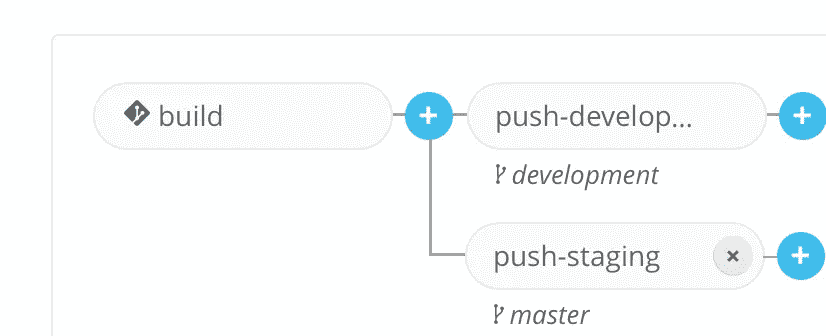

# 用 Wercker、Google Container Registry 和 Kubernetes 进行 CI:第 2 部分

> 原文：<https://medium.com/google-cloud/ci-with-wercker-google-container-registry-and-kubernetes-part-2-26155551227c?source=collection_archive---------0----------------------->

# 推到集装箱登记处

Google 容器注册表是 docker 图片的私有注册表。我们希望在 wercker 中构建完图像后将它们推送到那里，这样当我们想要使用它们时(例如，当我们在 Kubernetes 中运行它们时)就可以轻松地提取它们。

我们使用 wercker 的内部步骤之一 *internal/docker-push 创建一个推送管道。*

注意:您需要在您的 google cloud 项目上创建一个服务帐户，以便 wercker 可以使用它将您的图像上传到注册表。下载创建服务帐户后得到的密钥，*删除所有换行符*(如果密钥中有换行符，docker 推送步骤将失败，并出现一个奇怪的错误)，然后将其放入一个环境变量中(本例中为 GCR_JSON_KEY_FILE)

```
push:
  steps:
    - internal/docker-push:
      registry: [https://gcr.io](https://gcr.io)
      username: _json_key
      password: $GCR_JSON_KEY_FILE
      repository: gcr.io/$GCR_PROJECT_NAME/$WERCKER_GIT_REPOSITORY
```

然而，这本身对我们的目的不起作用，原因如下:

*   正在推送的图像没有标记，每次推送时都会自动标记为“最新”,因此获取特定版本将会很困难。您可以使用提交散列从 [gcr](http://gcr.io) 中提取图像，但是我更喜欢用我的 package.json 的版本号来标记主构建
*   没有指定运行容器的命令，所以它不会启动

我们可以通过将管道改为以下形式来解决这两个问题:

```
push:
  steps:
    - script:
      name: export version to tag the image with
      code: |
        [ "$WERCKER_GIT_BRANCH" = "master" ] \
        && export PACKAGE_VERSION=$(node -p -e "require('./package.json').version") \
        || export PACKAGE_VERSION=development
    - internal/docker-push:
      registry: [https://gcr.io](https://gcr.io)
      username: _json_key
      password: $GCR_JSON_KEY_FILE
      repository: gcr.io/$GCR_PROJECT_NAME/$WERCKER_GIT_REPOSITORY
      tag: $PACKAGE_VERSION
      working-dir: $WERCKER_SOURCE_DIR
      cmd: npm start
```

脚本步骤检查分支是否是主分支，并将 package.json 的' version '属性作为环境变量导出。

对接推进步骤现在有一个*标签*、*工作方向*和*命令*。默认情况下, *cmd* 属性在根文件夹 */* 中执行，因此我必须将 working-dir 属性添加到步骤中以使其工作(该属性尚未记录在 worker 的文档中，但它可以工作)。

现在，您可以打开 wercker 的 UI，在构建管道之后添加管道:



相同的步骤，不同的环境变量:D

接下来，我们将添加一个管道，以便在构建和推送成功时将我们的应用程序部署到 Kubernetes，这将是本系列的第 3 部分。