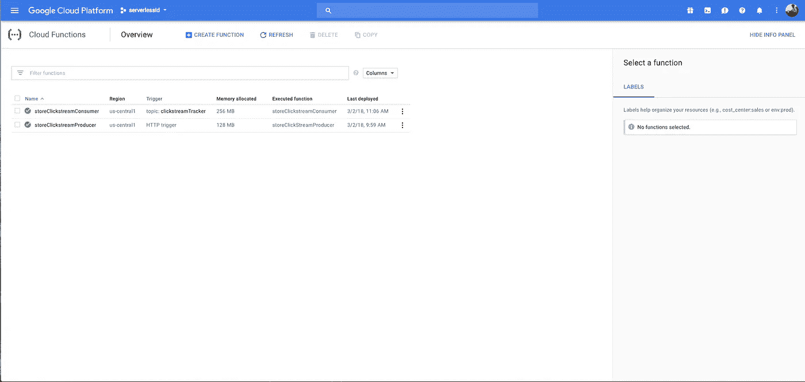

# 使用 Google 云平台的简单点击流追踪系统

> 原文：<https://medium.com/google-cloud/clickstream-tracker-system-using-google-cloud-platform-28933149ae4c?source=collection_archive---------0----------------------->


印度尼西亚西爪哇省苏梅当县西贺兰河

# 概观

我的灵感来自名为热图的云服务，它提供点击流服务，从存储你的点击流数据开始，直到使用他们的仪表板进行分析服务。在这种情况下，我想在后端建立一个类似的系统，我将使用谷歌云平台(GCP)服务来实现这种技术。

我将在这些服务的基础上构建点击流技术的基础设施:

*   云功能，对生产者和消费者都适用。生产者将由 HTTP 触发器触发，另一方面消费者将由云发布/订阅主题触发器触发
*   云发布订阅，用于生产者和消费者之间的消息传递
*   云数据存储，用于有效负载旅程的终端，有效负载存储在该服务中
*   StackDriver，帮你监控云功能执行的日志

下图描述了 GCP 点击流跟踪器组件之间的关系:


谷歌云平台上的点击流跟踪器架构

您可以按照下面的说明来部署此存储库中存在的 clickstreamTrackerGCP:[https://bitbucket.org/ridwanbejo/clickstreamtrackergcp](https://bitbucket.org/ridwanbejo/clickstreamtrackergcp)

# 说明

## 1.生产者的云功能

-创建新的云函数，名称为**` storeclicstreamproducer`**，内存大小为 **`128 MB`**
-在触发器部分选择 HTTP 触发器，以接收来自客户端的 HTTP 请求，例如来自 web 浏览器、邮递员或其他服务。
-在 **`index.js`** 部分，请将 index.js 中的代码复制到这个存储库中

```
// Imports the Google Cloud client library
const PubSub = require(`@google-cloud/pubsub`);

// Your Google Cloud Platform project ID
const projectId = 'serverlessid';

// Instantiates a client
const pubsubClient = new PubSub({
  projectId: projectId,
});

exports.storeClickStreamProducer = (req, res) => {
  if (req.body.mouse_position_x === undefined && req.body.mouse_position_y === undefined) {

    res.status(400).send('Bad message!');

  } else {
    const dataBuffer = Buffer.from(JSON.stringify(req.body));
    const topicName = "clickstreamTracker";

  pubsubClient
    .topic(topicName)
    .publisher()
    .publish(dataBuffer)
    .then(results => {
      const messageId = results[0];
      console.log(`Message ${messageId} published.`);
    })
    .catch(err => {
      console.error('ERROR:', err);
    });

    res.status(200).send(req.body);

  }
};
```

-移动到 **`package.json`** 选项卡，然后将此 json 结构复制到文本区域:

```
{
 “name”: “storeClickStreamProducer”,
 “version”: “0.0.1”,
 “dependencies”: {
 “[@google](http://twitter.com/google)-cloud/pubsub”: “0.16.4”
 }
}
```

-云函数将自动安装云函数所需的 NPM 包
-在 **`Function to execute`** 输入栏中键入**` storeclicstreamproducer `**,将代码中的函数指向云函数运行时。终于按下了保存键！
-创建功能后，您可以做任何事情。您可以编辑、删除、复制、测试和查看函数
的日志——现在您的云函数自动连接到 Stackdriver，并且该函数可以将有效负载发送到 PubSub。但是您需要首先创建 PubSub 主题。


生产者代码和配置


生产者监控仪表板


生产者执行日志

## 2.PubSub 上的主题和订阅

-打开左侧菜单
中的 PubSub 菜单-创建名为 **`clickstreamTracker`**
的新主题-添加指向您的帐户的 **`PubSub Admin`** 的权限，以使您的云功能删除该 PubSub 上的有效负载
-新主题已准备好接收来自另一个 GCP 服务的订阅
-我们将在下一节中连接云功能与 PubSub。


主题在发布订阅仪表板中创建的点击流跟踪器

## 3.面向消费者的云功能

-创建名为**` storeclicstreamconsumer`**且内存大小为 **`128 MB`**
的新云函数-在触发器部分选择云发布/订阅主题
-选择在前面部分创建的发布/订阅，主题为**` clickstreamtracker `**
-在 **`index.js`** 部分，请复制此存储库中 consumer.js 内的代码

```
// Imports the Google Cloud client library
const PubSub = require(`@google-cloud/pubsub`);
const Datastore = require('@google-cloud/datastore');

// Your Google Cloud Platform project ID
const projectId = 'serverlessid';

// Instantiates a client
const pubsubClient = new PubSub({
  projectId: projectId,
});

// Creates a client
const datastore = new Datastore({
  projectId: projectId,
});

const subscriptionName = 'myclickstreamTrackerSubscription';
const timeout = 60;

// References an existing subscription
const subscription = pubsubClient.subscription(subscriptionName);
const uuidv4 = require('uuid/v4');

exports.storeClickstreamConsumer = (event, callback) => {
    // The Cloud Pub/Sub Message object.
    const pubsubMessage = event.data;

    // Do something with the message
    console.log(JSON.parse(Buffer.from(pubsubMessage.data, 'base64').toString()));

    // The kind for the new entity
    const kind = 'clickstream';

    // The name/ID for the new entity
    const name = uuidv4();
    console.log(name);

  // The Cloud Datastore key for the new entity
  const clickstreamDataKey = datastore.key([kind, name]);

  // Prepares the new entity
  const clickstreamData = {
    key: clickstreamDataKey,
    data: JSON.parse(Buffer.from(pubsubMessage.data, 'base64').toString()),
  };

  // Saves the entity
  datastore
    .save(clickstreamData)
    .then(() => {
      console.log(`Saved ${clickstreamData.key.name}`);
    })
    .catch(err => {
      console.error('ERROR:', err);
    });

    // Don't forget to call the callback.
    callback();
};
```

-移动到 **`package.json`** 选项卡，然后将此 json 结构复制到文本区域:

```
 {
 “name”: “storeClickStreamConsumer”,
 “version”: “0.0.1”,
 “dependencies”: {
 “[@google](http://twitter.com/google)-cloud/datastore”: “1.3.4”,
 “[@google](http://twitter.com/google)-cloud/pubsub”: “0.16.4”
 }
}
```

-云函数将自动安装云函数所需的 NPM 包
-在 **`Function to execute`** 输入栏中键入**` storeclicstreamconsumer`**,将代码中的函数指向云函数运行时。终于按下了保存键！
-创建功能后，您可以做任何事情。您可以编辑、删除、复制、测试和查看函数
的日志-现在您的云函数自动连接到 Stackdriver，该函数可以从 PubSub 接收有效负载，然后将该有效负载存储到云数据存储
-现在您可以选择 **`View Logs`** 选项卡来查看来自您所选择的 Pub/Sub 的传入消息。


消费者代码和配置


消费者功能监控


消费者功能日志

## 4.云数据存储

-在云数据存储的控制面板中没有太多配置，您只需选择想要查看的实体
-您可以在控制面板中的 **`clickstream`** 实体上浏览数据集，只要有效负载成功存储在云数据存储上

# 它是如何工作的？



点击流跟踪的生产者和消费者准备就绪

首先，我们发送具有如下示例所示结构的有效负载:

```
{
 “mouse_position_x”: 1241,
 “mouse_position_y”: 6678,
 “sourceUrl”: “[https://www.example-online-shop.com/p](http://localhost:8000/register)roduct/12345",
 “createdAt”: “2018–03–11 23:00:00”
}
```

基本上，生产者从浏览器接收包含鼠标位置、鼠标访问的 URL 页面以及事件创建时间的有效载荷。然后，通过 HTTP 触发，成为生产者云功能接收该有效载荷并将该消息排队到云发布/订阅。


在谷歌云功能上将有效载荷发送给点击流生产者

排队的消息将由成为消费者的云功能消费，然后解析来自发布/订阅的有效载荷，最后有效载荷将存储在云数据存储中的**`点击流`**实体中。稍后，您可以使用 GQL 或云数据存储库，基于保留在云数据存储中的数据集构建任何东西。


浏览已经存储在云数据存储浏览器上的点击流数据


在云数据存储浏览器上浏览点击流数据详细信息

感谢您关注我的帖子。我也在[无服务器上用印度尼西亚语写这篇文章。ID 介质](https://medium.com/serverless-indonesia)。

> 非常感谢 [Tajhul Faijin Aliyudin](https://medium.com/u/ae0b7472e817?source=post_page-----28933149ae4c--------------------------------) 允许我使用他的 GCP 自由级账户，也感谢 [fajri abdillah](https://medium.com/u/2f6060739de2?source=post_page-----28933149ae4c--------------------------------) 建立无服务器的指导。ID 社区。