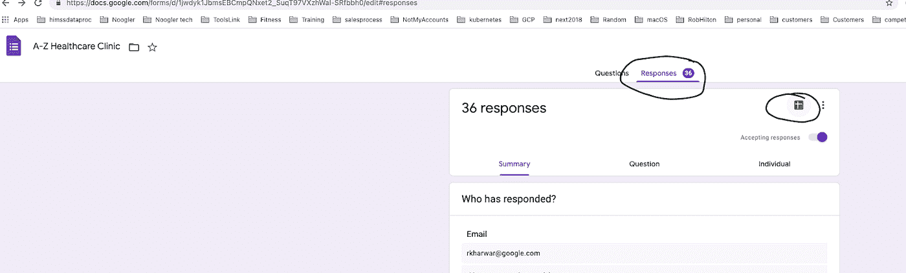

# 使用 Google Workspace 和医疗保健 API 实现临床自动化

> 原文：<https://medium.com/google-cloud/clinical-automation-with-google-workspace-and-the-healthcare-api-f97555ef00cf?source=collection_archive---------1----------------------->

# 介绍

随着医疗保健的不断自动化，谷歌云正在寻求各种方法来减轻临床系统的技术债务，同时进一步提高它们使用易于使用的工具为患者服务的能力。 [Google Workspace](https://workspace.google.com/industries/healthcare/) 已经在整个行业得到应用，以帮助简化患者护理，并为临床医生和患者提供协作工具。

这篇文章分享了医疗系统如何使用谷歌表单将他们的工作流程与谷歌的[云医疗 API](https://cloud.google.com/healthcare) 集成。本文中提到的特定用例是当一个新的或现有的患者联系提供者进行预约时。通常，提供者会要求患者在预约时间前 15-30 分钟到达并填写表格。这涉及到文书工作。患者可以填写手写表格，然后交给临床管理人员。然后工作人员将其输入电子记录系统。

在本文中，描述了一个工作流，其中提供者向患者发送一个指向 Google 表单的链接。患者使用选择的电子设备(如电话或笔记本电脑)安全地填写表格。患者在线提交表格。在提交时，在提供者的记录系统中验证患者数据和创建患者资源的过程是完全自动化的。这种工作流自动化的用例可能包括

*   新患者入职
*   返回患者—所述解决方案的修改可用于向患者发送定制的表格，患者无需重新填写过去可能已经提交的信息，只需更新可能已经改变的信息。
*   患者调查
*   远程监控不严重的患者状况，如不严重的烧伤、痤疮、毛发生长等。—包括由患者拍摄图像并将其附加到表单上，以便与提供者进行安全的通信。

所描述的解决方案使用 Google Forms 和 Google Apps 脚本将患者提供的信息自动发送到快速医疗互操作性资源(FHIR)中的患者资源。


Google Forms 是一个易于使用、用户友好的信息收集工具，是 Google Workspace 工具套件的一部分。集成是使用开源[谷歌医疗数据协调](https://github.com/GoogleCloudPlatform/healthcare-data-harmonization)工具 Whistle 完成的。云数据流用于将输入数据转换为 FHIR 格式，并写入云医疗 API FHIR 存储。

通过利用 Google Cloud 上的 FHIR 商店，患者数据以安全的行业标准格式存储。这允许与下游应用程序、分析和机器学习应用程序进一步集成。

# 解决方案指南

## 开始之前

对于这个参考指南，你需要一个谷歌云[项目](https://cloud.google.com/resource-manager/docs/cloud-platform-resource-hierarchy#projects)。您可以创建一个新项目，或者选择您已经创建的项目:

1.  选择或创建 Google 云项目。
2.  为您的项目启用计费。
3.  启用 PubSub、Dataflow、医疗保健 API 和云存储 API。
4.  确保你有一个 Google Workspace 账户(也就是 Gmail for Enterprise)。当使用表单和应用程序脚本等工作区工具来处理任何类型的 PHI 数据(【https://support.google.com/a/answer/3407054?hl=en】T2)时，工作区管理员应接受 HIPAA BAA
5.  确保您在本地安装了 GCP SDK 或使用云外壳

完成本教程后，您可以通过删除您创建的资源来避免继续计费。

## 第一部分:搭建谷歌云平台

***使用医疗保健 API 创建一个 FHIR R4 商店***

```
#Create Healthcare DATASETgcloud healthcare datasets create <DATASET>#Create Healthcare FHIR STORE named “workspace”gcloud healthcare fhir-stores create workspace \
 — dataset=<DATASET> \
 — location=us-central1 \
 — version=R4 \
 — disable-referential-integrity \
 — enable-update-create
```

***创建一个发布订阅主题和一个订阅***

```
#Create a pubsub topic named “workspace”gcloud pubsub topics create workspace#Create a subscription to the topic named “dfjob” to topic “workspace”gcloud pubsub subscriptions create dfjob --topic workspace
```

***创建数据流管道***

对于这一步，我将从谷歌开源的[这个](https://github.com/GoogleCloudPlatform/healthcare-data-harmonization-dataflow)仓库中分离出来。[https://github . com/Google cloud platform/health care-data-harmonization-data flow](https://github.com/GoogleCloudPlatform/healthcare-data-harmonization-dataflow)

按照步骤设置软件依赖关系，并构建用于运行数据流作业的 jar 文件。

这个储存库在这里分叉[为](https://github.com/rasalt/healthcare-data-harmonization-dataflow)。值得注意的变化包括

*   适应从发布订阅主题获取非 HL7v2 消息
*   示例哨子[地图](https://github.com/rasalt/healthcare-data-harmonization-dataflow/tree/master/workspace_mapping)用于接受 Google workspace 表单数据并协调它

将地图文件上传到下面引用的{MAPPING_BUCKET}。

启动此流管道。

```
PROJECT=<PROJECT>
SUBSCRIPTION=workspace #Setup in Step 1,2ERROR_BUCKET=workspace/error
MAPPING_BUCKET=workspace/mapping
LOCATION=<LOCATION>
DATASET=<DATASET>
FHIRSTORE=workspacejava -jar build/libs/converter-0.1.0-all.jar — pubSubSubscription=”<>” \
 — readErrorPath=”gs://${ERROR_BUCKET}/read/read_error.txt” \
 — writeErrorPath=”gs://${ERROR_BUCKET}/write/write_error.txt” \
 — mappingErrorPath=”gs://${ERROR_BUCKET}/mapping/mapping_error.txt” \
 — mappingPath=”gs://${MAPPING_BUCKET}/dhconfig.textproto” \
 — fhirStore=”projects/${PROJECT}/locations/${LOCATION}/datasets/${DATASET}/fhirStores/${FHIRSTORE}” \
 — runner=DataflowRunner \
 — project=${PROJECT}
```

## 第二部分:设置 Google Workspace

***创建 Google Workspace 表单***


创建表单时，为了创建 Apps 脚本项目，请单击“响应”选项卡，然后单击 trix 图像。



***创建一个 Google Apps 脚本应用***


脚本编辑器


应用程序脚本

在脚本编辑器中，您将看到一个开发平台，您可以在其中编写与医疗保健 API 交互的应用程序。

编写您的 javascript 代码并设置一个触发器


上面的例子设置了一个触发器，在提交表单时调用名为“onFormSubmit”的函数。

[Apps 脚本应用的示例](https://github.com/rasalt/healthcare-data-harmonization-dataflow/tree/master/appscript)代码

一个表单的链接是[这里是](https://docs.google.com/forms/d/e/1FAIpQLSfdULsdlFUY_YlI4YZhuUcfEZrCcPhvHlh0UtDZrNw34pj_gA/viewform)

## 准备好表演了吗(测试一下)

既然已经设置了 Google Workspace 和数据接收管道，我们将通过提交您在上一步中创建的已填充的 Google 表单来测试本教程。本文包括一个示例表单和相关的哨声地图。但是，您需要进行调整以满足您的要求。

提交表单后，您应该会看到您的患者信息位于您在第一步中创建的 FHIR R4 商店中。您可以通过查看数据流管道统计数据来确认数据管道的工作情况。下面粘贴了一个相同的示例。


数据流管道

可以通过访问以下网站进行最终确认

GCP 控制台->医疗->FHIR 查看器->过滤患者<fhir store="">。</fhir>

您应该看到您的患者是从您刚才提交的表单中创建的。

# 摘要

虽然表单收集了一些信息，但是使用所描述的解决方案创建了一个基本的患者资源。将 Google Workspace 表单与医疗保健 API 一起用于临床用例的机会是无限的。

使用企业级、可扩展产品的可扩展解决方案可被设想用于任何规模的提供商，无论是大型还是小型，无论是成熟的还是初创的，都可以安全、合规地处理所有数据，以满足医疗保健工作流的需求。

感谢 Alexander Sicular，Vivian Neilly，Roman Polyanovsky，Yatish Gupta，Mary Wholey。

## 清注意

这篇文章代表我和我个人的观点和意见。

## *参考链接*

[1] [用于协调的口哨库](https://github.com/GoogleCloudPlatform/healthcare-data-harmonization)

[2] [建立与 HIPAA 一致的项目](https://cloud.google.com/solutions/setting-up-a-hipaa-aligned-project)

[3] [谷歌云平台上的 HIPAA 合规性](https://cloud.google.com/security/compliance/hipaa/)

[4] [谷歌云医疗保健知识库](https://github.com/GoogleCloudPlatform/healthcare)

[5] [Apps 脚本命令行界面](https://developers.google.com/apps-script/guides/clasp)