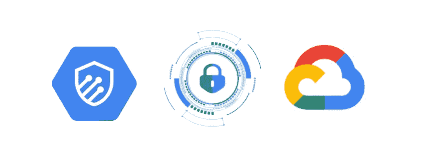
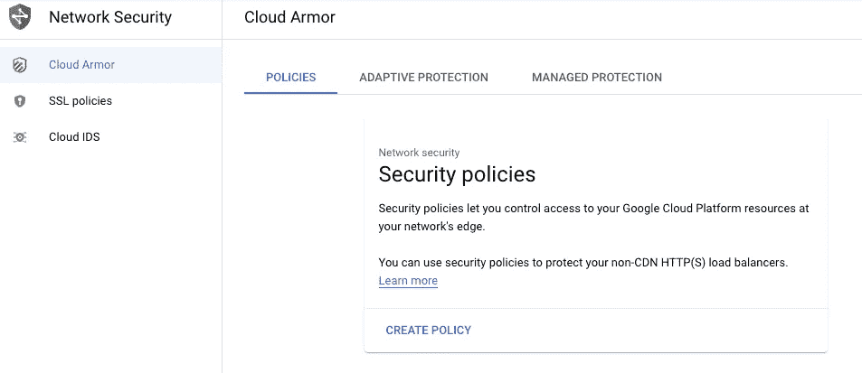
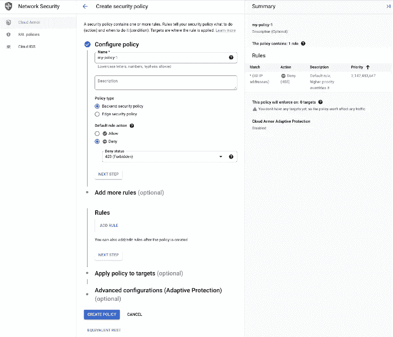
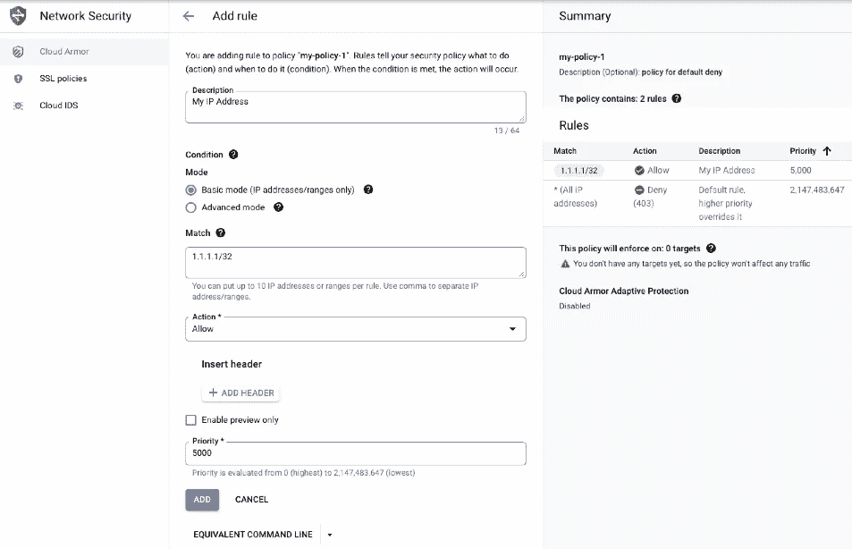
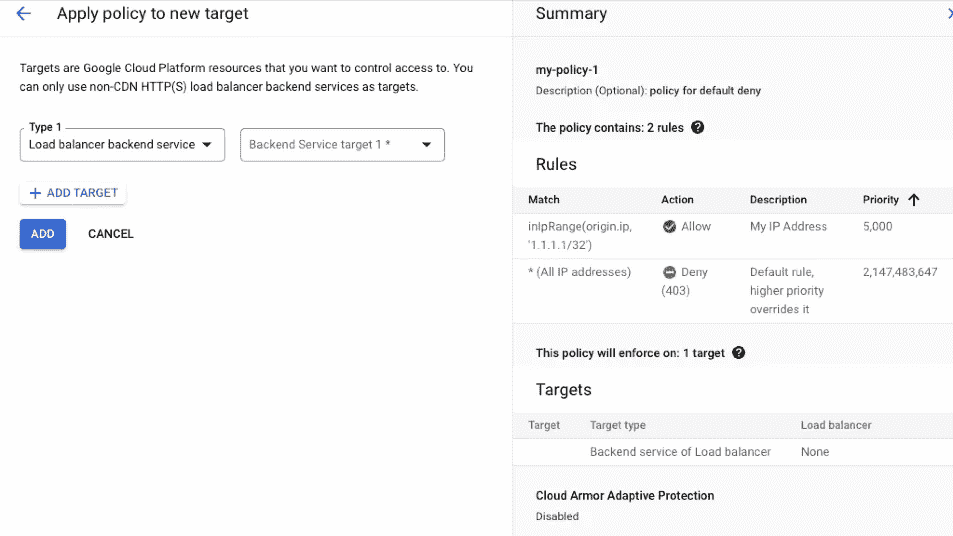

# GKE 托管应用上的云装甲设置和配置

> 原文：<https://medium.com/google-cloud/cloud-armor-setup-and-configuration-on-gke-hosted-application-9fe8847a0c0f?source=collection_archive---------0----------------------->

*WAF &来自谷歌云平台的 DDoS 防护*



使用云装甲的安全性

> C loud Armor 最近检测并缓解了 4600 万 HTTPs QPS 攻击，证明了其作为企业级解决方案的可靠性。更多细节可以在这里找到[。](https://www.youtube.com/redirect?event=video_description&redir_token=QUFFLUhqbUU5dUNxdWt0QXpwQzhFc3g3V0lyOUwySkxrUXxBQ3Jtc0tsQWxwWm9HSnY0NWdiRmNKNFF6UEZILWFlUEU1MTh5cWNSd3NNdnBxbVB2NFBQUnBUb1d4bm5nbUZ6RTQzbmluSjhWV1hJZDNvOF9fT0xORUJVR2ZhNUlsbk1KRWRMS2c2d0lOUC1Qdm9Fb0V3VW5ZTQ&q=https%3A%2F%2Fgoo.gle%2F3RJCDc2&v=_b_I-mJ3Sjk)

这篇文章将谈论什么是云装甲以及如何在 GCP 控制台设置它的一些基础知识。然后，我将展示在 GKE 托管的应用程序上应用云防护策略所需的配置。查看来自 GCP 的[官方文档](https://cloud.google.com/armor#section-5)来了解云甲的细节。

**什么是云甲？**

Cloud Armor 是一种网络安全解决方案，可以保护您的应用免受第 3 层/第 4 层网络或基于协议的体积 DDoS 攻击。它还能够支持第 7 层保护。Cloud Armor 还是一个 Web 应用防火墙，可以检测和缓解安全规则中预定义的常见 [OWASP TOP 10](https://owasp.org/www-project-top-ten/) 等漏洞。您可以保护您的应用程序免受 SQL 注入攻击、跨站点脚本攻击和不同的 DDoS 攻击，如协议攻击、应用程序攻击和容量攻击。Google Cloud Armor 与外部负载平衡器协同工作，并包含内置安全策略。

**主要特性**

Google Cloud Armor 的一些关键特性包括:

1.  限速
2.  Bot 管理
3.  适应性保护
4.  基于 IP 和基于地理的访问控制
5.  命名 IP 列表

参考[文档](https://cloud.google.com/armor#section-1)了解所有支持功能的详细信息。

**如何设置云甲？**

我们将使用 GUI 方法来设置云甲。也可以使用 gcloud SDK 和 API 进行设置。IaC 也可用于供应。

进入 GCP 仪表板>搜索云装甲>启用 API(确保您在正确的项目中)



云装甲仪表板

1.  创建安全策略

点击*创建策略，*打开下一页。命名策略。

选择策略类型作为后端安全策略，因为它也可以应用于边缘位置。默认规则可以应用于所有允许或阻止的请求。选项选择*拒绝* *状态*如 403、404 或 502。这些是带有更多选项的必填字段，可以进一步配置，如规则和目标。可以配置规则并将其附加到目标。自适应保护选项是可用的，它基本上使用后端机器学习模型来检查潜在攻击的流量异常。检测到异常时，它可以即时创建规则来阻止特定流量。点击*创建策略*。



等效 gcloud 命令:

```
gcloud compute security-policies create my-policy-1 \
--description "Policy for deny"
```

2.创建规则

除了默认的策略基本规则之外，每个规则都有自己的允许和拒绝操作。通常当基本规则是允许时，策略规则将是拒绝。

下面的规则示例指定允许 IP 地址违反基本策略拒绝规则，该规则拒绝所有其他请求。这是一个基本规则，同样你可以创建更高级的规则。下一步是定义评估规则的优先级。首先评估优先级较高的规则。



配置该规则的等效命令行如下所示:

```
gcloud compute security-policies rules create 5000 \
    --project=project-a-3410500 \
    --action=allow --security-policy=my-policy-1 \
    --expression=inIpRange\(origin.ip,\ \'1.1.1.1/32\'\) 
    --description=My\ IP\ Address
```

例如:你想拒绝来自中国地区的所有请求，下面是要使用的规则。更多细节可以在这里找到[。](https://cloud.google.com/armor/docs/rules-language-reference#preconfigured-rules)

```
origin.region_code == 'CN'
```

3.将策略与目标相关联

创建策略后，您可以将策略与目标相关联。目标可以是任何基于非 CDN HTTP(s)的后端负载平衡器服务。只需选择“Add Policy to NEW Target ”,它就会列出项目中的负载平衡器。您可以向 sam 策略添加多个后端目标。



到目前为止，我们已经讨论了创建一个具有不同规则的云装甲策略，并与一个后端服务(负载平衡器)相关联。

考虑一个场景，我们的应用程序运行在 GKE 集群上，并通过负载平衡器类型的服务公开，最终在 GCP 创建了一个负载平衡器。我们可以通过定义一个定制的资源定义，通过一个名为后端配置的 Kubernetes 对象来更新这个特性。更多细节可以在[这里](https://cloud.google.com/kubernetes-engine/docs/how-to/ingress-features#configuring_ingress_features)找到。

**后端配置**

下面是一个后端配置示例，它可以与 GKE 服务一起使用，将云装甲策略应用到运行在 GKE 上的应用程序。后端配置与服务关联。您还可以在后端配置中配置多个其他参数，您可以在这里找到[。](https://cloud.google.com/kubernetes-engine/docs/how-to/ingress-features#configuring_ingress_features)

```
apiVersion: cloud.google.com/v1
kind: BackendConfig
metadata:
  namespace: cloud-armor-how-to
  name: my-backendconfig
spec:
  securityPolicy:
    name: "my-policy-1"
  healthCheck:
    checkIntervalSec: 30
    timeoutSec: 30
    healthyThreshold: 1
    unhealthyThreshold: 5
    port: 80
    type: HTTP
    requestPath: /health
```

配置完成后，可以使用如下注释将 backendconfig 与服务相关联

```
apiVersion: v1
kind: Service
metadata:
  annotations:
    cloud.google.com/backend-config: '{"default": "my-backendconfig"}'
...
```

这篇博客到此为止，我将演示云装甲如何监控和阻止 GKE 托管的应用程序的流量。快乐学习！！