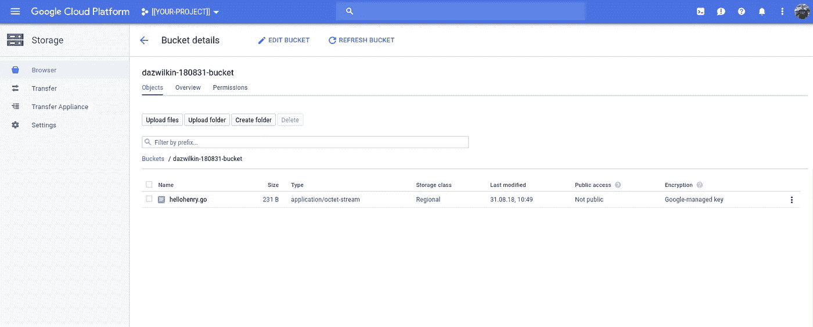

# 云构建、Golang 和应用引擎

> 原文：<https://medium.com/google-cloud/cloud-build-golang-app-engine-36e27ba976cd?source=collection_archive---------1----------------------->

Stackoverflow 上的一名开发人员寻求一种使用云构建部署 App Engine 应用的方法。这是个有趣的问题。需要注意的是，App Engine 标准部署包括一个构建步骤。让我们探索一下…

## 设置

```
PROJECT=[[YOUR-PROJECT]]
BILLING=[[YOUR-BILLING]]
REGION=[[YOUR-REGION]]
BUCKET=[[YOUR-BUCKET]]gcloud projects create ${PROJECT}gcloud beta billing projects link ${PROJECT} \
--billing-account=${BILLING}# Enable App Engine (Admin) and Cloud Build services
for SERVICE in appengine cloudbuild
do
  gcloud services enable ${SERVICE}.googleapis.com \
  --project=${PROJECT}
done# Create App Engine (Standard) 
gcloud app create \
--region=${REGION} \
--project=${PROJECT}# Create a GCS Bucket for Artifacts
gsutil mb \
-c regional \
-l ${REGION} \
-p ${PROJECT} \
gs://${BUCKET}
```

## 戈朗

我发现 Golang builder 的工作空间选项令人困惑。因此，假设我的本地目录结构看起来总是这样:

```
echo ${GOPATH}**/..**├── cloudbuild.yaml
└── go
    ├── bin
    ├── pkg
    └── src
        └── github.com
            └── DazWilkin
                └── hellohenry
                    ├── app.yaml
                    └── hellohenry.go
```

> **NB** 将`cloudbuild.yaml`文件包含在这个工作目录的根目录下。

我要让建筑商模仿这个结构。

我使用了类似于 Google 的示例`helloworld`应用程序的东西。在我的例子中，Golang 源代码和`app.yaml`都在`go/src`的子目录`${APP}`中。(== `github.com/DazWilkin/hellohenry`)。当我们回顾`cloudbuild.yaml`时，这一点会变得更加清楚:

```
tree ${GOPATH}/src/${APP}├── app.yaml
└── hellohenry.go
```

## 云构建

最终，云构建将需要部署应用引擎应用的许可。让我们获取云构建服务帐户并授予它`appengine.deployer`和`appengine.serviceAdmin`:

```
NUM=$(gcloud projects describe $PROJECT \
--format="value(projectNumber)") && echo ${NUM}FOR role in appengine.deployer appengine.serviceAdmin
do
  gcloud projects add-iam-policy-binding ${PROJECT} \
  --member=serviceAccount:${NUM}[@cloudbuild](http://twitter.com/cloudbuild).gserviceaccount.com \
  --role=roles/${ROLE}
done
```

最后，我们可以定义`cloudbuild.yaml`:

> **NB** 为了清楚起见，我特意在这个 cloudbuild.yaml 中包含了`SUBSTITUTIONS`以及我的配置的值。您需要删除它们，然后将它们包含在`gcloud build`命令中，并用您自己的值替换它们。

这就是为什么我发现在云构建容器上复制文件结构更容易。从工作目录运行，`go`目录被复制到容器的`/workspace`目录。然后，我们可以通过配置构建器使用`GOPATH=go` (== `/workspace/go`)来镜像我们的本地配置，这避免了包导入等问题。

运行完`go get`步骤后，我们运行`gcloud app deploy`。你可能想知道为什么我们错过了`go build`。这是不需要的，因为`gcloud app deploy`在部署之前为我们获取工件并构建解决方案。您可以添加一个`go build`步骤，但这是多余的，并且部署到 App Engine 的二进制文件不会相同。

要运行构建，从您的工作目录:

```
gcloud builds submit . \
--config=cloudbuild.yaml \
--project=${PROJECT} \
--substitutions=_APP=${APP},_BUCKET=${BUCKET}
```

> 如果你在 cloudbuild.yaml 中定义了替换，你不需要在这里重复它们。非此即彼。


云构建:构建历史

然后:


应用引擎控制台

并且:

```
curl https://${PROJECT}.appspot.com/Hello Henry!
```

并检查工件:



谷歌云存储:[桶]浏览器

## 结论

帮助描述如何使用云构建到 Google App Engine 来构建和部署 Golang 应用程序的快速链接。

仅此而已！